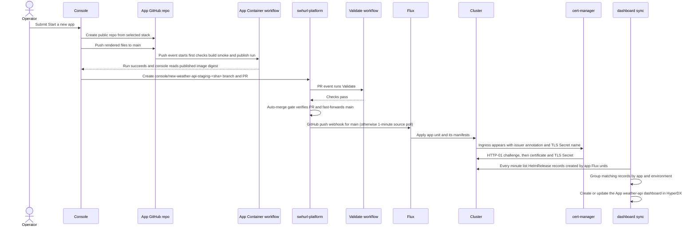
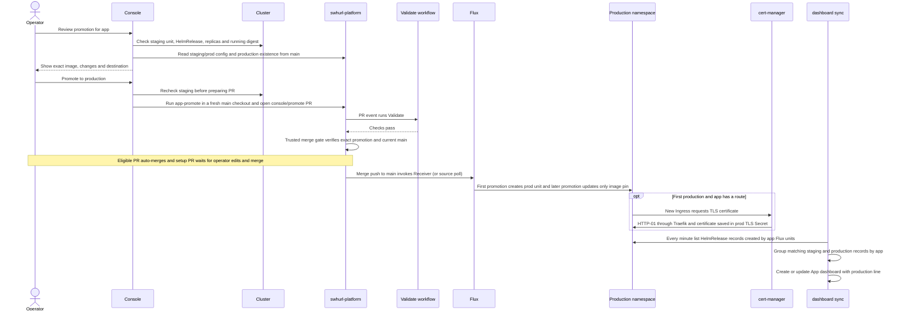

# Apps

An **app instance** is one app in one environment: namespace `<app>-<env>`, a HelmRelease of the pinned [bjw-s app-template](https://bjw-s-labs.github.io/helm-charts/docs/app-template/) chart (5.2.1), an optional encrypted Secret, and its own Flux unit `app-<app>-<env>`. Instances wait only for `infra-base` and, when signed-in, `platform-oauth2-proxy`; a broken instance never blocks another, and an observability outage never blocks an app.

An app's life, and where each step is described. Every app comes from a stack template, and every change is a Git edit (by hand, a `make` command or a console pull request) that Flux applies ([how changes reach the cluster](architecture.md#how-changes-reach-the-cluster)):

| Stage | Console | Command | Section |
| --- | --- | --- | --- |
| Start a new app: code, repository and staging | **New app** | `make app-repo`, then `make app-new` | [Start a new app](#start-a-new-app) |
| Ship a new version | — | push to the app's repository | [Deploy a new image](#deploy-a-new-image) |
| Promote to production | **Promote to production** | `make app-promote` | [Promote to production](#promote-to-production) |
| Choose who can reach it | **Who can reach it** | `make app-expose` | [Who can reach it](#who-can-reach-it) |
| Give it secrets | — | `sops apps/<app>/<env>/secret.sops.yaml` | [Secrets](#secrets) |
| Keep dependencies current | — | Renovate pull requests in the app's repository | [Dependency updates](#dependency-updates-in-app-repositories) |
| Watch, resize, fix | the app page, **Scale**, **Reconcile** | `make app-status`, `app-logs`, `app-scale`, `app-reconcile` | [Operate an instance](#operate-an-instance) |
| Remove | **Uninstall** | `make app-remove` | [Remove an app](#remove-an-app) |

## Current instances

| Instance | Host | Image |
| --- | --- | --- |
| `hello-ts/staging` | `staging-hello-ts.homelab.swhurl.com` | [`samclement/hello-ts`](https://github.com/samclement/hello-ts); deployed automatically on each push |
| `hello-ts/prod` | `hello-ts.homelab.swhurl.com` | changes only through a promote |

All require sign-in. `hello-ts` is a TypeScript app made before the templates used Copier, sending traces and metrics to ClickStack as `ServiceName` `hello-ts`. Staging is a separate rollout and failure boundary, not a separate trust boundary.

## Start a new app

From nothing to a running staging app in a few minutes (about two for TypeScript; a little longer for Kotlin, whose build also compiles and tests): the platform creates the app's GitHub repository from a template, waits for its first image and adds it to staging. Every push to the app's `main` then deploys to staging on its own.

**In the console:** **New app** → **Start a new app** (the default). Give a name, pick a stack and its features, choose who can reach it, and press **Create repository and open pull request**. The job page shows each step; when it finishes it links to a pull request here that adds `<name>/staging`. Merge it, and Flux deploys it within a minute ([what the job does, and when it stops](console.md#use-it)).

### What happens, and when

For example, starting `weather-api` from the TypeScript template creates `samclement/weather-api`, waits for its first published image, and proposes `weather-api/staging` in this platform repository. The timeline is:



The console job creates a **public** app repository because the cluster pulls its image without registry credentials. Its first commit starts the app repository's normal push workflow; this is a GitHub Actions push trigger, not a platform webhook. The console waits up to ten minutes for that workflow to finish, then reads the image digest and uses it in the platform change. If this first build fails or times out, the app repository remains and no platform PR is opened; fix and push the app, and once its workflow has published an image add it yourself with the `make app-new … --from-repo` line shown [below](#start-a-new-app).

The platform PR is opened only after that image exists. It runs the platform `Validate` pull-request workflow. A regular generated app PR is labeled for auto-merge and merges itself after validation and the trusted merge gate checks the current merge result. If the generated change includes an encrypted Secret stub, auto-merge is disabled because its values still need setting; set them on the PR branch and merge it yourself. Until merge, neither the namespace nor any app resources are created on the cluster. Platform PR branch pushes are filtered out by the Flux Receiver; the merge push to `main` is what invokes it. Without a successful webhook delivery, Flux's `GitRepository` still polls `main` every minute.

After the merge, Flux creates the app's dedicated `app-<name>-staging` unit from the newly registered unit file. It waits for `infra-base`, and also `platform-oauth2-proxy` for authenticated web exposure. The unit applies the namespace, HelmRelease and optional encrypted Secret. The chart creates the Deployment and Service for a web app; authenticated or public web exposure also creates an Ingress. Worker apps have no Service or Ingress. SQLite/database answers add a retained PVC and mount; secret answers add the SOPS Secret and register the namespace with Reloader. With automatic deploy enabled, the staging unit also creates this app's Flux `ImageRepository`, `ImagePolicy` and `ImageUpdateAutomation` in `flux-system`, so later published images can update the staging image pin in platform Git. These resources are app-scoped; the shared cluster services already exist.

**Certificates are requested only for a web app with a route** (`authenticated-web` or `public`). The generated Ingress names a TLS Secret and carries the selected ClusterIssuer annotation. The default is `letsencrypt-prod`, even for the staging environment; `letsencrypt-staging` and `selfsigned` can be selected. Once Flux/Helm has created the Ingress, cert-manager notices it and asynchronously performs the issuer's flow. For Let's Encrypt that is HTTP-01 through Traefik; on success cert-manager stores the certificate in the named Secret, which Traefik uses for HTTPS. The app Helm readiness does not wait for certificate issuance, so the app can become Ready while TLS is still pending. Private web apps and workers have no route and therefore request no certificate.

**The dashboard is also asynchronous.** The `console-dashboards` CronJob runs once a minute. It lists Kubernetes HelmRelease records, keeps the ones registered by an `app-<name>-<env>` Flux unit whose app name and namespace match the release, then groups staging and production records by app. As soon as Flux has created the staging HelmRelease, the job creates or updates `App: <name>` in HyperDX. It does not wait for the release or pods to become Ready. It uses ClickStack's API; no dashboard manifest or app-specific dashboard provisioning enters Git. A dashboard failure retries on the next scheduled run and does not block the app. Details and dashboard contents are in [Dashboards](#dashboards).

Once staging is deployed, later pushes to the app repository's `main` publish images. The app repository's [image webhook](services.md#image-webhook) tells Flux the moment the image is published; Flux image automation finds the new tag and commits its digest to this platform repository's `main`; the same webhook-to-reconcile path rolls out that image to staging. Production is not created by this flow.

**From a terminal**, the same in two steps (the first needs your `gh` login and SSH access to GitHub):

```bash
make app-repo NAME=weather-api STACK=kotlin ANSWERS="kind=web database=sqlite"   # DRY_RUN=true shows the plan
# [OK] Created https://github.com/samclement/weather-api from samclement/swhurl-app-template-kotlin
# [OK] First image: ghcr.io/samclement/weather-api:1-a1b2c3d@sha256:…
#   make app-new NAME=weather-api ARGS="--from-repo samclement/weather-api --env staging --image ghcr.io/…"
make app-new NAME=weather-api ARGS="--from-repo samclement/weather-api --env staging --image ghcr.io/…"   # the printed line
git add apps/weather-api clusters/home && git commit -m "apps: add weather-api/staging" && git push
make app-status APP=weather-api ENV=staging    # expect "running: matches desired"
```

`make app-repo` refuses a name that already exists on GitHub, creates the repository **public** (the cluster pulls images without credentials), adds the [image webhook](services.md#image-webhook), waits for its first build (checks, image, smoke test, publish) and reads the image digest from GHCR as the cluster will. If that build fails it stops with the run's link: the repository stays; fix the app, push, and run the same `make app-new` line with the image that run publishes (the console's job prints the line too).

**Only apps made this way are supported.** In this repository `make app-new` refuses anything else: `--from-repo` must be `samclement/<name>`, the image must be `ghcr.io/samclement/<name>` (what that repository's workflow publishes) and its `swhurl.yaml` must set `autoDeploy: true`, as the stack templates do. There is no route for an image built elsewhere or a public image such as nginx: `make check-apps` (and so CI and the console's merge gate) fails an instance committed by hand that is not such an app ([the app policy](#the-app-policy)). Tests are the one exception: the throwaway live tests (`make live-test-*`) deploy nginx and BusyBox images from fixture manifests into labelled test namespaces and remove them afterwards.

### Stacks and features

A **stack** is a [Copier](https://copier.readthedocs.io/) template repository for one language and framework:

| Stack | Template | Runs as |
| --- | --- | --- |
| `typescript` (default) | [`swhurl-app-template-typescript`](https://github.com/samclement/swhurl-app-template-typescript) | Node 24; starts in about a second, about 60 MB of memory; the platform's default resources |
| `kotlin` | [`swhurl-app-template-kotlin`](https://github.com/samclement/swhurl-app-template-kotlin) | Kotlin on Micronaut, Java 25, about 150 MB image; about 10 s to start, about 200 MB of memory. Its `swhurl.yaml` asks for 100m CPU, 192Mi (limit 384Mi) and two minutes to start |

**Features** are the template's own questions (its `copier.yml`, read at the catalogue's pinned GitHub revision, so a stack's features need no platform code); both stacks ask:

| Feature | Choices | The app gets | The platform adds |
| --- | --- | --- | --- |
| `kind` | `web` (default), `worker` | An HTTP service answering `/healthz`, or a background process that works every `WORK_INTERVAL_MS` | A worker is private: no Service or route (the console hides **Who can reach it**) |
| `database` | `none` (default), `sqlite` | SQLite at `DATABASE_PATH` with migrations in `migrations/` applied at startup | A retained volume, one copy running at a time, nightly backups and `make restore-sqlite` ([operations](operations.md#backups-and-recovery)). Staging and production each have their own database; a promote copies the image, not the data |

Either way the app listens on 8080 (web), runs as UID 65532 writing only to `/tmp` (and `/data` with a database), sends traces and metrics over OpenTelemetry, logs JSON linked to its traces, and publishes `ghcr.io/<owner>/<app>:<run>-<sha>` from `main`. Nothing in the app's repository names the cluster: its [`swhurl.yaml`](#swhurlyaml) says what it needs, and this repo writes the manifests. Each template's README is the guide on the app's side. The catalogue pins reviewed template commits in `STACK_REVISIONS` in [`contract.py`](../tools/swhurl/apps/contract.py). Questions, rendering and contract checks all use that commit. Template releases have immutable version tags; Copier records the tag when it describes the pinned commit. Deliberate catalogue updates change the pin and run `make check-templates` before release. App workflow versions are pinned to release tags and bumped by Renovate. The shared Renovate preset keeps dependency rules consistent; [template updates](#template-updates) apply generated-file changes through reviewed PRs.

**How templates are tested.** Two halves, so neither grows with the other:

- **The template's own CI** (its Template workflow) renders combinations of its questions and, for each, type-checks, tests, builds the image and smoke-tests it. Today it builds every combination (four per stack). From a third question on, list the defaults, each non-default choice on its own and all non-defaults together, instead of every combination: that grows with the number of choices rather than doubling with each question. Each combination keeps its own image build cache. SQLite runtime checks apply migrations and write through the actual image, restart with the same data directory, then verify migration history and previous rows are preserved and new writes work. Database inspection uses a disposable copy including WAL files. Both stacks use the same conformance assertions; each retains its own compiler, tests and build.
- **This repo's `make check-templates`** (in `make check` and CI; needs network) clones each template, renders every combination with Copier and turns each `swhurl.yaml` into staging with `app-new --manifest` (a local file instead of `--from-repo`, writing to a scratch `--root`), then production through the promotion conversion; each must pass the [app policy](#the-app-policy) and the two must not drift. It builds nothing (eight combinations today), and catches a template declaring something the platform refuses before anyone creates an app from it.

### Template updates

Renovate's [Copier manager](https://docs.renovatebot.com/modules/manager/copier/) reads `.copier-answers.yml`, finds newer template version tags and runs Copier to update generated files with the saved answers. Template repositories publish immutable `v…` tags only after their combination checks pass. Copier updates always require manual review, even for minor releases: inspect app edits and resolve conflicts before merging. The installed Renovate GitHub App needs workflow-write permission when an update changes a workflow pin (it already writes workflow updates in the template repos). A CLI token without that scope cannot push such a branch; the ordinary reviewed SSH Git route can bootstrap it without credential changes. The app's Container workflow checks the PR and publishes an image only after merging to `main`, which deploys to staging. Promotion remains explicit.

Existing Copier apps whose answers record an untagged commit need one bootstrap update on a clean branch: `uvx copier@9.18.2 update --skip-answered --defaults --vcs-ref v0.1.0`. Review and commit the generated diff, then open a PR and wait for Container checks. Do not edit `_commit` manually. Apps without Copier answers, including `hello-ts`, keep their current workflow; migration is optional.

Platform rendering remains exhaustive while cheap. On 3 October 2026 the eight combinations took 21.7 s with a cold uv dependency cache and 26.1 s warm on the operator host; each run still clones templates and fetches charts, so network variance dominates this pair. Representative warm GitHub template jobs took 42–75 s for TypeScript and 28–62 s for Kotlin, including SQLite restarts. An earlier cold Kotlin app build took 6 min 31 s from console form to PR ([evidence](current-state.md)). PRs and main run all four combinations per stack today; there is no separate scheduled matrix. Once a third question lands, sampled language builds must name their coverage; platform rendering stays exhaustive. A third stack adds its catalogue repository and pin, template/build checks and runtime conformance evidence; it adds no language build dependencies here.

### Add production

Production is created by the first [promotion](#promote-to-production) from reviewed staging settings. The console and `make app-new` create staging only; `app-new --env prod` is refused.

### What the generator writes

`make app-new` ([`new.py`](../tools/swhurl/apps/new.py); `make app-new NAME=x ARGS=--help` lists every option) writes `apps/<app>/staging/` and `clusters/home/app-<app>-staging.yaml`, registers the unit in `clusters/home/kustomization.yaml` (files under `apps` deploy nothing until then), and checks the result against [the app policy](#the-app-policy) before exiting (a missing tool or failed render makes the command fail; `--no-policy-check` explicitly skips validation). The output is plain YAML; edit it like any manifest afterwards. The console's New app pull requests run this same command in a copy of `main`.

| Option | Rules |
| --- | --- |
| `--from-repo samclement/<name>[@REF]` | Required: reads `swhurl.yaml` from the app repository's default branch (or `REF`) through GitHub's API, with `GITHUB_TOKEN` if set; its fields become the defaults and a flag you give wins (for example `--exposure public --host weather.example.com`) |
| `--env` | `staging` (default); production is created by promotion |
| `--kind` | `web` (Service and probes on `--health-path`, required) or `worker` (no Service, no route) |
| `--image` | `ghcr.io/samclement/<name>:<run>-<sha>@sha256:…`, as `make app-repo` and the app's workflow print it |
| `--exposure`, `--host` | Who can reach it ([below](#who-can-reach-it)); default `private` |
| `--team` | The owning team, a name in `apps/teams.yaml` ([teams and isolation](#teams-and-isolation)); default `platform` |
| `--secret-keys A,B` | An encrypted Secret stub ([secrets](#secrets)): set the values before pushing and also `git add platform/reloader` |
| `--otlp` / `--no-otlp` | The app has an OpenTelemetry SDK: points it at the cluster collector ([telemetry](#telemetry)) |
| `--database sqlite` | A retained volume (`--database-size`, default 1Gi) at `/data`, with the database file `/data/app.db` passed to the app as `DATABASE_PATH`; backed up daily |
| `--persistence SIZE` | A claim on `local-path-retain`, kept on Helm uninstall; the namespace is never pruned ([remove an app](#remove-an-app)). Any instance with a volume runs one replica and stops the old pod before starting the new one (policy rule `single-writer`) |
| `--uid`, `--port`, `--cpu`, `--memory`, `--memory-limit`, `--issuer` | Defaults: 65532, 8080, `10m`, `32Mi`, `128Mi`, `letsencrypt-prod` |

Every instance runs non-root with no service-account token, all capabilities dropped and a read-only root filesystem with a writable `/tmp`. Every web app gets the same start-up allowance: a startup probe gives it up to 120 s to first answer its health path before liveness checks begin. A fast app is Ready as soon as it answers; a JVM on a busy node needs most of it. The allowance is fixed rather than per app so that it stays a minute inside Helm's 3-minute wait (time to pull the image), and the templates' smoke tests wait just as long. The generator refuses to overwrite an instance, expose a worker, put a public app in the sign-in cookie domain, or ship production without a digest.

## swhurl.yaml

What an app needs from the platform, kept in the app's own repository (the templates write it from your feature answers) and read by `app-new --from-repo`. Each field becomes an `app-new` default; flags on the command line still win. The name, environment, image and host belong to each instance and are never in the file. The schema is `manifest_defaults` in [`contract.py`](../tools/swhurl/apps/contract.py); unknown fields and other versions are refused.

```yaml
version: 1              # required; this platform reads version 1
stack: kotlin           # which template the app came from (informational)
kind: web               # required: web or worker            --kind
port: 8080              # web only (default 8080)            --port
healthPath: /healthz    # web only, required                 --health-path
uid: 65532              # default 65532                      --uid
telemetry: otlp         # otlp or none (default)             --otlp
autoDeploy: true        # staging follows new images (required: app-new refuses false)
database: sqlite        # optional; databaseSize: 1Gi        --database, --database-size
secrets: [API_TOKEN]    # optional: variable names           --secret-keys
resources: {cpu: 100m, memory: 192Mi, memoryLimit: 384Mi}   # optional: --cpu, --memory, --memory-limit
exposure: authenticated-web   # optional; default: web apps authenticated-web, workers private
team: payments          # optional: a name in apps/teams.yaml (default platform)   --team
```

## Who can reach it

| Exposure | Route | Host |
| --- | --- | --- |
| `private` (the default) | None, and no other pod can connect to it either ([isolation](#teams-and-isolation)) | — |
| `authenticated-web` | Behind Google sign-in (the shared oauth2-proxy middleware) | Under `homelab.swhurl.com`; derived as `staging-<name>.homelab.swhurl.com` (`<name>.homelab.swhurl.com` in prod) unless given |
| `public` | No sign-in | `--host` **outside** `homelab.swhurl.com`, so the shared sign-in cookie never reaches it |

Set it with `--exposure` at creation, and change it later with `make app-expose APP=hello-ts ENV=staging ARGS="--exposure public --host hello-ts.example.com"` or the app page's **Who can reach it** form. `app-expose` rewrites the route, the Namespace's exposure label and the unit's dependencies together, keeps a signed-in host (or derives one), and refuses a route on a worker. Staging and production may differ, for example a signed-in staging preview of a public app. `make app-status` and the app page show the exposure read from the live routes.

## Teams and isolation

Every app belongs to one **team**: a name registered in [`apps/teams.yaml`](../apps/teams.yaml), written as the `platform.swhurl.com/team` label on each of the app's namespaces. Set it at creation (`team:` in `swhurl.yaml`, `--team`, or the console's team select; default `platform`) and change it for every environment at once with `make app-team APP=hello-ts ARGS="--team payments"`. To add a team, add its name and a description to the file. A team is a name, not a set of people: it says who owns an app and lets you filter by owner; it grants nobody access.

Each instance carries two generated files beside its HelmRelease:

| File | What it does |
| --- | --- |
| `resourcequota.yaml` | Caps the namespace at 14 pods, 2 CPU and 2Gi of memory requested, and 4Gi of memory limits: the same for every instance. `make app-scale` refuses replicas or sizes that would not fit beside a backup pod and a certificate solver (rule `quota`) |
| `networkpolicy.yaml` | Decides who may connect to the app's pods: the Traefik pods on the app's port when the instance has a route, nobody otherwise. A pod in another namespace, or another pod in the same one, is refused. `make app-expose` rewrites it with the route |

The policy selects the app's own pods (`app.kubernetes.io/instance: <app>`), never every pod in the namespace: cert-manager's HTTP-01 solver runs there on port 8089 and must stay reachable, as must the SQLite backup pod. Outbound connections are not restricted. Health probes come from the node and are not affected.

## Secrets

`--secret-keys API_TOKEN,DB_URL` (the console's **Secret environment variables**) writes `apps/<app>/<env>/secret.sops.yaml`: a Secret with those keys set to `REPLACE_ME`, SOPS-encrypted before the command returns (if it cannot be encrypted, it is removed, so plaintext never reaches Git). The app receives each key as an environment variable (`envFrom`), the unit decrypts it with `flux-system/sops-age`, and the namespace is added to Reloader so a changed value restarts the app.

**Reserved names.** The platform sets some variables itself (`HOST_IP` and `OTEL_*` for telemetry, `DATABASE_PATH` for SQLite), and a container's own `env` silently wins over `envFrom`, so a secret with one of those names would never reach the app. `app-new`, `swhurl.yaml` and the console therefore refuse `HOST_IP`, `DATABASE_PATH` and any name starting `OTEL_`, `SWHURL_` (kept for future platform variables) or `KUBERNETES_` (the API server address in-cluster clients read). Each app's Secret lives in its own namespace, so two apps may use the same key names. The console's app page lists **Provided by the platform** (names and values) apart from **Your secrets** (the Secret's name; values are never read).

Set or change values in your own terminal with `sops apps/<app>/<env>/secret.sops.yaml` (for a console pull request, on its branch before merging), then `make check-secrets` (it fails on a `REPLACE_ME` left behind), commit and push. Rules and rotation: [operations](operations.md#secrets).

## Telemetry

What reaches ClickStack depends on whether the app has an OpenTelemetry SDK:

| Your app | Do | What reaches ClickStack |
| --- | --- | --- |
| No OpenTelemetry SDK | Nothing | stdout and stderr as logs, with pod, namespace and deployment attributes |
| An SDK that should report here | `--otlp` (the console's **Sends OpenTelemetry** box) | The logs above, plus traces, metrics and structured logs under `ServiceName` = the app name |
| An SDK that should not report here, or reports to its own backend | Leave `--otlp` off; set `OTEL_SDK_DISABLED=true` or its own endpoint | Logs only. An unconfigured SDK sends to `localhost:4318`, where nothing listens in the pod, and logs export errors |

`--otlp` writes the cluster default into the container, the same in every environment (the values come from [`contract.py`](../tools/swhurl/apps/contract.py)):

```yaml
            env:
              HOST_IP:
                valueFrom:
                  fieldRef:
                    fieldPath: status.hostIP                # the node IP
              OTEL_EXPORTER_OTLP_ENDPOINT: http://$(HOST_IP):4318
              OTEL_EXPORTER_OTLP_PROTOCOL: http/protobuf
              OTEL_SERVICE_NAME: weather-api                # the app name
```

The collector DaemonSet runs on every node with host networking, so it listens on the node IP: 4318 for OTLP over HTTP, 4317 for gRPC. It adds the ingestion key and the pod, namespace and deployment, and forwards to ClickStack ([services](services.md#clickstack-and-otel)).

**What must be true of the app** for `--otlp` to work:

- It has an OpenTelemetry SDK or auto-instrumentation. A Node app that is an ES module must register OpenTelemetry's loader hook before anything is imported, or HTTP is not traced; the template does this in `src/instrumentation.ts`.
- The SDK reads the standard `OTEL_*` environment variables; an endpoint hard-coded in the app overrides them.
- It exports OTLP over HTTP/protobuf. For gRPC, change the endpoint port to 4317 and the protocol to `grpc` by hand.
- It sends no key or auth headers; the collector adds them.

To add this to an existing instance, paste the block into each environment's HelmRelease. `make check-apps` fails (rule `otlp-host-ip`) if `$(HOST_IP)` is used without `HOST_IP` defined from `status.hostIP` before it; Kubernetes would otherwise pass the literal text to the SDK.

**Logs linked to traces:** a JSON log line that carries `trace_id` and `span_id` (32 and 16 hex characters, at the top level as pino writes them, or under `mdc` as logback writes them with the Java agent) is attached to that trace, so a trace in HyperDX shows its logs. Both templates do this already.

**Health checks are not traced:** the collector drops the spans of requests whose user agent is `kube-probe/…`, so a health path that does more (a database query) leaves child spans without a parent; keep it cheap.

In HyperDX, filter on `ServiceName` or `k8s.namespace.name` (which tells staging from production). Telemetry sent in a pod's first second can lack the pod attributes while the collector's pod lookup catches up. Nothing scrapes Prometheus `/metrics` endpoints.

## Deploy a new image

An instance runs the image named by `repository`, `tag` and `digest` in its HelmRelease values. Staging changes first; production gets the same digest only when you [promote](#promote-to-production) it.

**Staging is automatic.** Every staging instance is watched by Flux image automation. Push to the app repository's `main` and it reaches staging on its own, in about two minutes:

```text
app push → its workflow checks, builds and publishes ghcr.io/<owner>/<app>:<run>-<sha>
  → image webhook → image-reflector-controller scans the registry at once (hourly without the webhook)
  → ImagePolicy <app>-staging picks the highest <run> and its digest
  → the app-named image-automation-controller commits the new tag and digest to apps/<app>/staging as fluxcdbot
  → push webhook → Flux applies → helm-controller rolls the Deployment
```

The staging HelmRelease's `tag:` and `digest:` lines carry `# {"$imagepolicy": "flux-system:<app>-staging:tag"}` (and `:digest`) markers; they tell Flux which lines to rewrite. Keep them when editing by hand (`make app-scale` and `app-expose` keep them). `make verify-platform` shows each app's newest image under Image Automation and its webhook under Image Webhooks (`make app-hooks` adds a missing webhook; until then Flux finds new images within the hour).

**Check it:** `make app-status APP=<app> ENV=staging` compares the main controller/container's running image with Git by digest (sidecars and other controllers keep their own images): each pod's spec names the digest it was given, and a pull by digest guarantees that content (the node's own image ID can name another digest for the same image, when two builds published identical content). It reports `running: matches desired` once the new pod is Ready, or `different image` during a rollout or when it fails ([operate an instance](#operate-an-instance)).

**Roll back** staging by reverting the commit that changed the pin; the app's next published image replaces it again, so fix forward in the app. Chart versions are different: Renovate opens pull requests for app-template in this repository, and one merged pull request updates every instance, staging and production together ([chart updates](operations.md#chart-updates)).

## Dependency updates in app repositories

Apps from a template update their own dependencies. The Renovate GitHub App is installed for all repositories (a config file required), so a new app's repository is registered on Renovate's next run; its `renovate.json` extends its template's shared `renovate-preset.json` (TypeScript: npm packages, OpenTelemetry grouped; Kotlin: Gradle plugins and libraries, Kotlin and Micronaut grouped). Every pull request runs the app's checks from the template's shared `app.yml`: compile or type-check, tests, an image build, and a smoke test that starts the image as the cluster does, from the app's `swhurl.yaml` (details in each template's README).

| Situation | What validates an update | What deploys |
| --- | --- | --- |
| A template's own update pull request | The template's CI, which renders every combination of features and runs the app checks on each | Nothing: new apps start from the updated template |
| App with tests (both templates ship some) | All checks; minor, patch and digest updates merge themselves, majors wait | Each merge publishes an image that deploys to staging; promote to production |
| App without tests | Build and smoke test only; set `"automerge": false`, so you merge | Staging after your merge; check it before promoting |

Renovate merges only when it runs, so a passing update can wait hours; tick "run again" on the repository's Dependency Dashboard issue to hurry it. The repositories keep GitHub's **Allow auto-merge** off: with no branch protection, GitHub would merge without waiting for checks, while Renovate's own automerge waits for them. A version written inside a template's `*.jinja` file is invisible to Renovate; keep versions in plain files.

## Promote to production

Try staging, then run **in your own terminal**:

```bash
make app-promote APP=<app>
make check
git add apps/<app> clusters/home platform/reloader
git commit -m "apps: promote <app> to prod"
git push
make flux-reconcile
make app-status APP=<app> ENV=prod
```

`app-promote` always means staging → production. The CLI checks live staging readiness and that it runs the digest in this checkout. First promotion derives production from supported staging settings, generates and policy-checks it in scratch space, then writes the complete Git edit. Later promotions change only production's image tag/digest, preserving its settings and comments. Equal digests are the same image regardless of tag: no files change. Different repositories require a reviewed Git edit. An older known build is labelled a rollback; database migrations are not reversed.

First production supports the current app-template chart, one Deployment controller/container, a standard web or private worker, probes, resources, security settings, command/arguments, telemetry, the main HTTP service/route, platform-managed retained storage and the app Secret. Compatible handwritten settings are preserved. Extra controllers, containers, resources, chart value sources, external volume bindings, ambiguous anchors and staging-specific references are refused with an explanation. Later image edits need an unambiguous main image mapping and passing policy; they do not convert custom configuration.

Production gets independent, initially empty storage. Startup applies database migrations normally. Staging data, PV bindings and credential values are never copied. App Secret keys create new encrypted `REPLACE_ME` stubs; set production values with `sops apps/<app>/prod/secret.sops.yaml` and review the Reloader registration before merging. A public app needs a distinct production host (`ARGS="--host=app.example.com"`); signed-in apps use the generated production address. Custom deployments remain explicit Git edits. Later runtime configuration changes also use Git; the [environment drift policy](#the-app-policy) still applies.

To guard the exact image reviewed, use:

```bash
make app-promote APP=<app> ARGS="--expect-image=ghcr.io/<owner>/<app>:<tag>@sha256:<digest>"
```

A mismatch or unhealthy staging refuses before production edits. In the console, **Review promotion** on Apps or staging shows the exact image, destination and first-production changes, then **Promote to production** creates the PR. Eligible promotions merge automatically unless **Hold for manual review** is selected. Existing promotion PRs are recovered from GitHub after a restart and reused; a replacement image requires explicitly closing the old PR. See [merge controls and pending changes](console.md#auto-merge).

### Console promotion: what happens, and when

For example, promoting `weather-api/staging` selects its current healthy, digest-pinned image and proposes that image for `weather-api/prod`. The console's **Review promotion** page reads live staging health and compares the staging and production configuration in GitHub `main`. Submitting **Promote to production** rechecks that review, prepares the Git change with `main`'s own `app-promote` command, and opens a PR. The job finishing means the PR exists; it does not mean production has deployed.



The review captures the staging image, applied revision, staging configuration hash and production configuration hash. The console checks again at submission, when the job starts, and after preparing the change; it refuses if staging stopped being healthy/current or either reviewed configuration changed. It also refuses the same digest (tags may differ while the digest is the same) and refuses a changed image repository. A known older `<run>-<sha>` image is called out as a rollback; database migrations are not rolled back.

On **first promotion**, `app-promote` derives a production environment from the supported staging settings and adds `apps/<app>/prod/`, `clusters/home/app-<app>-prod.yaml` and the production unit registration. If the app has Secret keys, it creates a separate encrypted production Secret with `REPLACE_ME` values; SQLite/persistent storage gets a separate retained claim that starts empty. Staging data and credential values are never copied. A secret-bearing PR also adds the production namespace to Reloader's watch list. A public app must have a distinct production hostname; signed-in apps get the generated production host. The staging environment and production environment are separate namespaces, so the same Secret/PVC names resolve to independent resources.

First promotion with a Secret stub or a public production host is not auto-merged. For a Secret, set the production values on the PR branch with `sops apps/<app>/prod/secret.sops.yaml`; review that file and the Reloader registration, then merge the PR yourself. For a public app, review the chosen distinct host and merge the PR yourself. A first promotion with no such setup can auto-merge after validation unless **Hold for manual review** was selected. For an eligible auto-merge, the trusted merge gate independently regenerates first production from the reviewed staging configuration and refuses extra or changed files.

After merge, the platform push webhook starts Flux's fetch/reconcile chain (the `GitRepository` polls every minute if the webhook is missed). For first production, Flux creates the new `app-<app>-prod` unit, which waits for `infra-base` and `platform-oauth2-proxy` when the app is signed in. It applies the production Namespace and HelmRelease, then Helm creates the production Deployment and, for web apps, Service; routed apps also get an Ingress. The storage claim is provisioned independently when configured. A routed first production Ingress causes cert-manager to request a certificate asynchronously: the issuer is copied from staging (default `letsencrypt-prod`), HTTP-01 uses Traefik for Let's Encrypt, and the resulting TLS Secret is used by Traefik. Certificate issuance does not hold the app Helm readiness check open. Private apps/workers have no Ingress and request no certificate.

The dashboard CronJob runs each minute. It sees the production HelmRelease once the production Flux unit has created it, then creates or updates the same `App: <app>` dashboard to include production as another environment line; it does not create a second dashboard or add dashboard files to the PR. It does not wait for production pods to become Ready and is independent of the app rollout. Details are in [Dashboards](#dashboards).

On **later promotions**, production already exists, so the reviewed PR changes only the image tag/digest in `apps/<app>/prod/helmrelease.yaml`. Production's runtime settings, host, Secret, storage, unit and Reloader registration remain as they were. No new certificate or other infrastructure is requested. The image-only PR auto-merges after `Validate` and the trusted merge gate unless held for review; Flux then rolls out the pinned image. Promotion does not run the app repository's build workflow and does not invoke the app's image automation. The image has already been built and deployed to staging before it is selected.

## Operate an instance

```bash
make app-status APP=hello-ts ENV=prod     # Git revision applied?, running image matches?, replicas, who can reach it, route, TLS, failures
make app-logs APP=hello-ts ENV=prod       # FOLLOW=true, TAIL=N, PREVIOUS=true (last crashed container)
make app-reconcile APP=hello-ts ENV=prod  # fetch Git and reconcile this instance's unit now
make app-check APP=hello-ts ENV=prod      # the app policy, offline
make app-scale APP=hello-ts ENV=prod ARGS="--replicas 2 --memory-limit 256Mi"   # Git edit: commit and push
```

The console's app page shows what `make app-status` shows and offers **Reconcile** and **Scale** (as a pull request). `app-scale`, `app-expose` and `app-promote` accept handwritten YAML using the app-template structure. They retain comments (including Flux image automation markers), quotation styles, key order, flow collections and consistent indentation. For example, scaling `memory: "128Mi" # measured limit` to 256Mi keeps the quotes and comment. Later promotion changes only the target image tag/digest; first promotion has the [supported conversion boundary](#promote-to-production). Exposure edits the main host, TLS host, sign-in middleware, Namespace label and required Flux dependencies; it keeps other annotations, middleware, paths, TLS secret names and extra dependencies.

The editor uses a pinned [ruamel.yaml](https://yaml.dev/doc/ruamel.yaml/detail/) dependency rather than a text-replacement parser. **Trade-off:** it preserves YAML presentation, not every byte; inconsistent indentation and unusual spacing can be normalized. Each file must contain one mapping document, without duplicate keys. A changed mapping that uses an anchor or merge is refused rather than changing shared settings unexpectedly. Exposure requires one main host and matching TLS entry; making an instance private refuses additional routes that would still expose it. Such custom structures need a manual edit and `make check-apps`. `app-remove` deletes and unregisters the instance; it does not rewrite its YAML.

Generation and scale/expose/promotion validate the resulting files against the app policy. A policy violation, missing tool or failed render returns nonzero. Files already written remain locally for review; fix the failure and run `make check-apps` before committing. The console uses the same commands and opens no PR when they fail. Only generation offers the explicit `--no-policy-check` opt-out.

The [notification expectations](services.md#notification-expectations) define deployment, rollback, uninstall and prolonged-health messages for each app/environment; the [current filters](services.md#current-notification-behavior) describe what is live today. When a pod fails, `make app-status` and the app page name the usual cause and the fix: out of memory (raise `--memory-limit`), an image the node cannot pull (missing tag, or a private GHCR package), a missing Secret value, a crash loop (`make app-logs APP= ENV= PREVIOUS=true` shows the crashed container's output; usually the wrong port or a write outside `/tmp`), or a failing readiness check (the app must answer its health path on its port).

An instance fails fast: if its pods are not Ready within 3 minutes of a change (`FAIL_AFTER` in [`contract.py`](../tools/swhurl/apps/contract.py): the unit's `timeout` and the HelmRelease's `timeout`), its unit turns red and `make flux-reconcile` reports it; Helm then retries once and stops. `make app-status` lists failing containers. After fixing the cause, push, or run `make app-reconcile`. An app that genuinely needs longer to start (a large image, a slow first migration) can raise both timeouts in its own files.


### Dashboards

The scheduled `console-dashboards` job gives every Flux-managed app a HyperDX dashboard named `App: <app>` (tag `swhurl-app`), with staging and production as separate lines:

| Row | Web app | Worker |
| --- | --- | --- |
| Traces (needs `--otlp`) | Requests per minute, errors, p95 latency of server spans | Runs per minute, errors, p95 duration of root spans |
| Logs (every app) | Error logs and log lines per minute | the same |
| Logs | The latest log lines, with their environment | the same |

The in-cluster `console-dashboards` CronJob runs every minute. It asks Kubernetes for HelmRelease records in all namespaces, then keeps only records whose Flux labels identify an `app-<name>-<env>` unit in `flux-system` and whose release name and namespace match that app and environment. This excludes shared services and manually installed releases. It does not check readiness, so discovery starts as soon as the app Flux unit creates the HelmRelease, even while Helm is still installing it. The job groups discovered environments by app and creates or updates one HyperDX dashboard named `App: <app>`; first promotion adds a production line to the dashboard created for staging. The API call is to HyperDX; dashboards are not Kubernetes resources or Git files. This works for console PRs and CLI changes, including auto-merges.

Every tile selects the app's namespaces, so an app without an SDK still gets its log rows, and trace tiles stay empty until the app has traffic (health checks are not traced). Each run overwrites dashboards that differ from [`dashboards.py`](../tools/swhurl/dashboards.py) (an edit made in the HyperDX UI is lost on the next run; save a copy without the `swhurl-app` tag to keep it). When an app's last HelmRelease is gone, the next run deletes its dashboard. Removing one environment only drops its line. The job deletes narrowly: only a tagged dashboard named exactly `App: <app name>`, so a tagged copy such as `App: hello-ts (copy)` stays and is reported; and nothing when it finds no app release at all (a cluster still being restored, or the last app removed). `make clickstack-dashboards` synchronizes against this checkout instead and deletes every tagged dashboard whose app is not in Git, which covers those two cases; `DRY_RUN=true` previews it. A deleted dashboard that comes back (an app re-added, a HelmRelease recreated) gets a new id, so old links to it break. Both paths read the admin account's access key from MongoDB and never print it. Failures exit nonzero and retry on the next minute; `make verify-platform` fails if the job has not succeeded within five minutes. No app deployment waits on ClickStack.

## Remove an app

`make app-remove APP=<app> ENV=<env>` (or **Uninstall** in the console, as a pull request) deletes the instance's files, its unit file and registration and its Reloader entry; once pushed, Flux uninstalls it, and within about a minute of the last environment's HelmRelease going the dashboard job deletes `App: <app>` ([dashboards](#dashboards); after removing the only app on the cluster, run `make clickstack-dashboards`). The app's telemetry stays in ClickStack until retention, searchable by namespace. An instance with `--persistence` keeps its namespace and claim on the cluster: deleting that data is a separate, explicit `make destroy-data` ([lifecycle](operations.md#lifecycle)). Removing staging also removes its automatic deploys; the app repository and its images are untouched.

## The app policy

`make check-apps` renders every instance with Helm and checks the Kubernetes objects: pinned images (digest in production), non-root, no privilege escalation, CPU/memory requests and a memory limit, no service-account token, no host access, exposure (private has no Ingress; hosts under `homelab.swhurl.com` need sign-in; public hosts stay outside it), TLS on every host, a named storage class, a single writer per volume (an instance that mounts a ReadWriteOnce claim runs one replica and stops the old pod before starting the new one), `HOST_IP` defined before an OTLP endpoint uses it, a registered team, the platform quota with room for the app's replicas, and the platform NetworkPolicy on the app's pods only ([teams and isolation](#teams-and-isolation)). Every instance under `apps/` must also be an app made from a stack template (rule `platform-image`, no exceptions): its image is `ghcr.io/samclement/<app>` and its staging has `image-automation.yaml` and the setter markers. It also compares the source manifests of an app's environments: they may differ only in namespace, hosts, image tag and digest, replicas, resources, issuer and exposure (when the environments' exposure differs, their routes are not compared; each is still checked on its own); encrypted Secrets and staging's `image-automation.yaml` are skipped. CI runs it on every push; the rules are listed in [`policy.py`](../tools/swhurl/apps/policy.py).

A reviewed exception goes on the HelmRelease, with a reason:

```yaml
metadata:
  annotations:
    platform.swhurl.com/policy-exceptions: "no-escalation=needs raw sockets for ICMP"
```

## Moving a host between instances

Deploy the new instance on a temporary host and check it. Then, in one commit, remove the old route and put the host on the new instance. Expect a few seconds of Traefik's default certificate while cert-manager issues the new one.

## Limits

- Isolation is inbound only: an app's pods accept Traefik or nobody, but may connect out to anything. There is no per-team access control: a team is a label.
- Everything under `homelab.swhurl.com` shares the sign-in cookie.
- Only apps made from a stack template are supported, and only staging updates automatically; production changes through a promote ([deploy a new image](#deploy-a-new-image)).
- App images must be public: the cluster has no registry pull credentials.
