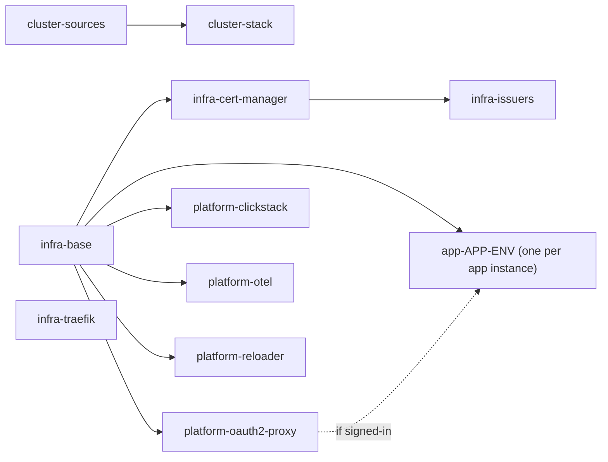
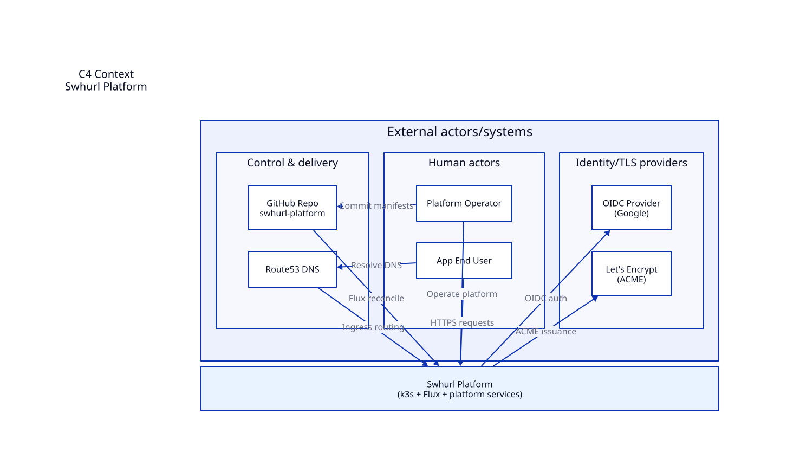
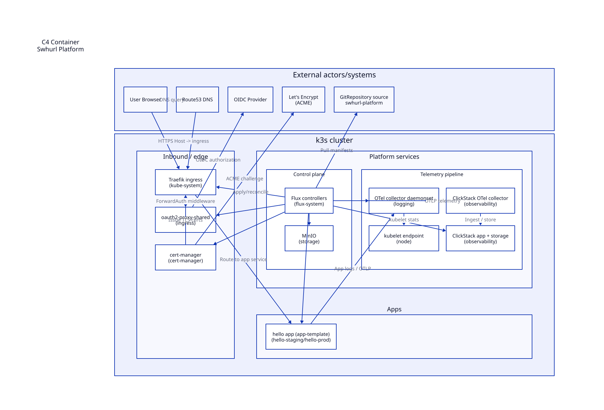
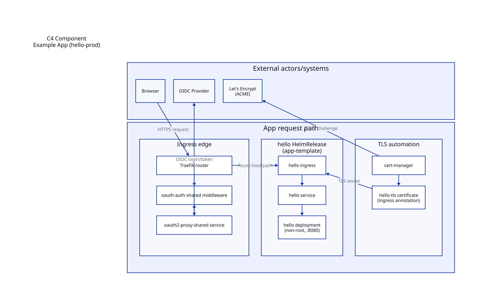

# Architecture

One k3s node, one Git repository, one Flux. Flux reconciles `clusters/home` and everything it references; nothing reaches the cluster any other way except the documented operator commands.

## Principles

- **Git is the deployment path.** Commit, push, reconcile. Scripts check and operate; manifests define state.
- **One owner per resource.** Flux owns each manifest and HelmRelease; helm-controller owns what a release renders; k3s owns packaged Traefik (this repo owns only its override).
- **Failures stay local.** A Flux unit is a reconciliation and deletion boundary, so each capability and each app instance gets its own and depends only on what it uses.
- **Secrets live beside their consumer**, SOPS-encrypted; non-secret cluster settings live in `platform-settings`.
- **Destruction is explicit.** Nothing deletes data implicitly; [lifecycle](operations.md#lifecycle) explains the guards.

## Concepts

| Concept | Means here | Lives in |
| --- | --- | --- |
| Host | The machine: disks, manual k3s install, dynamic DNS, router forwards | `host/` (including `host/dns.env`), [bootstrap](bootstrap.md) |
| Cluster composition | Which units run, their dependencies, sources and settings | `clusters/home/` |
| Foundation | Cluster primitives with no user-facing endpoint: namespaces, storage classes, cert-manager, issuers, Traefik settings | `infra/` |
| Shared service | A service with its own lifecycle that apps use or people visit: sign-in, observability, Reloader | `platform/` |
| App instance | One app in one environment, with its namespace, release, route, Secret and data | `apps/<app>/<env>/` |
| Environment | Deployment settings and promotion policy (`staging`, `prod`); not a namespace or trust boundary by itself | Instance values |

There is no tenancy model: app instances are separated only by namespace.

**Names.** A Flux unit is named `<area>-<component>` after its directory (`platform/oauth2-proxy` is `platform-oauth2-proxy`; an app instance `apps/<app>/<env>` is `app-<app>-<env>`), with one directory per unit. Namespaces are named by function (`ingress`, `observability`, `logging`, `platform-system`, `<app>-<env>`) and HelmReleases by product. `swhurl` names the project: the repository, its `GitRepository` source (`swhurl-platform`), the `tools/swhurl` package and the `platform.swhurl.com/*` label domain. `home` is the cluster (`clusters/home`), and `homelab.swhurl.com` is the parent DNS domain.

## Flux units

Arrows mean **must be Ready before**. The stack unit creates all the others; that ownership is separate from their dependencies.

| Unit | Owns (path) | Waits for | Inputs |
| --- | --- | --- | --- |
| `cluster-sources` | Git and Helm sources, `platform-settings` (`clusters/home/flux-system/sources`) | — | Applied by `make flux-bootstrap` |
| `cluster-stack` | All unit definitions (`clusters/home`) | sources | Applied by `make flux-bootstrap` |
| `infra-base` | Shared namespaces, `local-path-retain` | — | |
| `infra-cert-manager` | cert-manager release and CRDs | infra-base | |
| `infra-issuers` | ClusterIssuers | cert-manager | |
| `infra-traefik` | k3s Traefik `HelmChartConfig` | — | |
| `platform-oauth2-proxy` | oauth2-proxy, its Secret, the sign-in middleware | infra-base | settings, SOPS |
| `platform-clickstack` | ClickStack, its Secret, ClickHouse log TTL | infra-base | settings, SOPS |
| `platform-otel` | Both collectors, the ingestion Secret | infra-base | settings, SOPS |
| `platform-reloader` | Reloader (`platform/reloader`) | infra-base | |
| `app-<app>-<env>` | One app instance (`apps/<app>/<env>`) | infra-base; oauth2-proxy if signed-in | SOPS if it has a Secret |

Unit definitions: [`clusters/home/flux-system/kustomizations.yaml`](../clusters/home/flux-system/kustomizations.yaml) (roots), [`infra.yaml`](../clusters/home/infra.yaml), [`platform.yaml`](../clusters/home/platform.yaml), `clusters/home/app-*.yaml`. `make test` enforces the rules below: issuers wait for cert-manager, apps never wait for ClickStack or OTel, and decryption is set exactly where a path holds encrypted Secrets.

**Deletion.** Every unit prunes what is removed from Git. Deleting a unit *object* differs: shared units use `deletionPolicy: Orphan` and leave their resources running unmanaged; app units keep the default and uninstall. Data is also protected by never-prune annotations (`observability`, persistent app namespaces), Helm `keepPVC`/`retain`, `Retain` volumes and backups.

**Suspension** stops a unit applying Git changes. The HelmReleases it created keep reconciling unless they are suspended too.

**Moving a resource between units** without recreating it: make sure the old unit cannot prune (it is `Orphan`, or suspend it), add the resource unchanged to the new unit, reconcile, confirm the new unit's inventory lists it, then remove it from the old unit in a later commit. The capability split moved 22 resources this way with no recreation ([evidence](current-state.md#pr03-capability-split)).

## C4 views

Sources are `docs/charts/c4/*.d2`; `make charts-generate` renders them ([conventions](contributing.md#diagrams)).

### Context

### Containers

### Request path to an app

