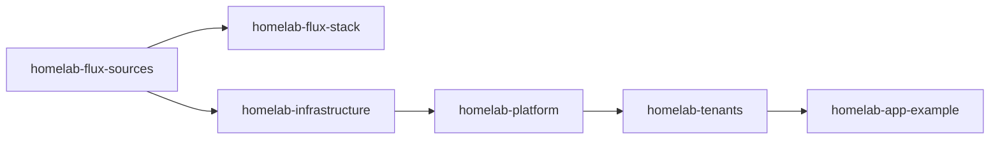

# Architecture (C4)

This document captures C4-style architecture views for the active platform layout.

Chart sources:
- `docs/charts/c4/context.d2`
- `docs/charts/c4/container.d2`
- `docs/charts/c4/component-app-example.d2`

Generate rendered charts:

```bash
make charts-generate
```

Rendered output path:
- `docs/charts/c4/rendered/*.svg`

## Concepts and boundaries

A layer groups responsibilities. A Flux Kustomization is a reconciliation and deletion boundary. Sharing a layer does not mean every resource should wait for every other resource in that layer. The current chain below is broader than the intended capability boundaries; the PR03 proposal is not deployed yet.

| Concept | Owns | Configuration source |
| --- | --- | --- |
| Host | OS, disks, manual k3s installation, dynamic DNS and router assumptions | `host/`, local host inputs in `config.env`, bootstrap documentation |
| Cluster composition | Selected capabilities, Flux dependencies, sources and cluster non-secret settings | `clusters/home/` |
| Foundation | Cluster primitives: Traefik configuration, certificate controller/issuers and storage classes | `infrastructure/`; packaged k3s components remain k3s-owned |
| Shared capability | A shared service with an independent health/lifecycle boundary: identity, telemetry or object storage | `platform-services/`; MinIO is currently physically under `infrastructure/storage/minio` |
| Application | A reusable service definition, such as the example app | `tenants/apps/<app>/base` today |
| Application instance | One app deployed in an environment; owns workload, route, configuration and app data references | Current example overlays; dedicated namespace and Flux unit per instance are planned for PR05 |
| Environment | Deployment settings and promotion policy such as staging/production | Current instance overlays; it does not inherently require a shared namespace or global readiness gate |

A tenant is an administrative or trust boundary, not a synonym for staging or production. The existing `tenants/` directory provides environment namespaces; it does not yet enforce isolation between independent tenants. Directory names are preserved during functional changes.

Each resource has one declarative owner. Flux owns a HelmRelease; helm-controller owns the resources rendered by that release. k3s owns packaged Traefik; this repo owns only its HelmChartConfig override. Host scripts do not own cluster credentials. Cluster non-secrets belong in `platform-settings`; service and app secrets stay SOPS-encrypted beside their consumers. A domain setting must actually drive manifests or be removed; current app hosts are still hardcoded.

## Current reconciliation ownership

Arrows in this diagram mean **must reconcile successfully before**. The root stack creates child Flux definitions; its inventory ownership is separate from the children's `dependsOn` edges.



| Current Flux owner | Owns / source path | Requires | Provides | Suspension / removal |
| --- | --- | --- | --- | --- |
| `homelab-flux-sources` | Git/Helm sources and settings in `clusters/home/flux-system/sources` | Installed Flux and initial GitRepository | Source artifacts and `platform-settings` | Suspension stops source-definition updates; root deletion can prune the GitRepository and settings |
| `homelab-flux-stack` | Child Flux definitions under `clusters/home` | Sources | Active cluster composition | Suspending the parent alone does not suspend existing children; deletion can prune them |
| `homelab-infrastructure` | Shared namespaces, cert-manager, issuers, Traefik override and MinIO via `infrastructure/overlays/home` | Sources/settings, packaged k3s | Namespaces, ingress, issuers, object storage | Suspension does not stop existing Helm controllers; deletion can remove namespaces/releases and Delete-policy PV data |
| `homelab-platform` | oauth2-proxy, ClickStack, OTel and final SOPS Secrets via `platform-services/overlays/home` | Infrastructure, settings, `sops-age` | Sign-in middleware and telemetry services | Suspension stops manifest updates, not child Helm reconciliation; pruning can uninstall releases and remove Secrets/data |
| `homelab-tenants` | `apps-staging` and `apps-prod` via `tenants/app-envs` | Entire platform today | Environment landing zones | Namespace removal also removes contents, including resources owned by other units |
| `homelab-app-example` | Both example overlays via `tenants/apps/example` | Tenant namespaces | Staging and production routes/workloads | Both instances share one reconciliation boundary; deletion prunes both |

All six units currently prune. `make teardown` and `make reinstall` are disabled because the old root deletions could cascade into data loss. Prune exclusions, Helm uninstall policy, namespace deletion and PV reclaim policy must be considered together. The first-time cert-manager/issuer race and optional-service health coupling remain until PR03.

## PR03 ownership proposal — not yet deployed

Use capability units for shared namespaces, cert-manager controller, issuers, Traefik configuration, identity, ClickStack, OTel and MinIO. Each declares its own settings and decryption. An app instance waits only for its namespace and the capabilities it actually needs. A worker does not require web identity; an app that does not consume MinIO does not wait for it. App reconciliation never waits for observability health.

| Proposed unit | Required interface | Provided interface |
| --- | --- | --- |
| Namespaces | Sources | Explicit shared namespaces; retention policy documented before migration |
| Certificate controller | Its namespace | Ready cert-manager controller and CRDs |
| Issuers | Certificate controller | Named ClusterIssuers |
| Traefik configuration | Packaged k3s Traefik | Ingress class and preserved NodePorts 31514/30313 |
| Identity | Namespace, ingress and issuer as needed, SOPS key/settings | Approved-user sign-in and `ingress-oauth-auth-shared@kubernetescrd` |
| ClickStack | Namespace, storage, SOPS key/settings | Telemetry ingestion and UI |
| OTel | Namespace, ingestion credentials and destination | Node/cluster telemetry export; never an app readiness prerequisite |
| MinIO | Namespace, storage, credentials | Object-storage endpoint for explicit consumers |
| App instance (PR05) | Own namespace; selected ingress/identity/storage interfaces | One instance's workload, route and data contract |

For each live handover: record inventory and Helm ownership; prove independent stateful recovery; test the transition on a disposable resource; suspend affected owners and prevent old-owner pruning; reconcile and verify the new owner; retire old ownership; restore intended reconciliation/pruning. Preserve names, releases, routes and claims. Do not move directories or alter storage at the same time. A blind Git revert cannot recover deleted data.

PR03 is complete when a fresh bootstrap orders controller before issuers, unrelated apps deploy during an observability/MinIO outage, and ownership changes cause no namespace deletion, Helm uninstall or PV recreation. Existing C4 views below describe the active deployment, not this proposed split.

## Level 1: System Context


## Level 2: Container


## Level 3: Component (Example App Request Path)


