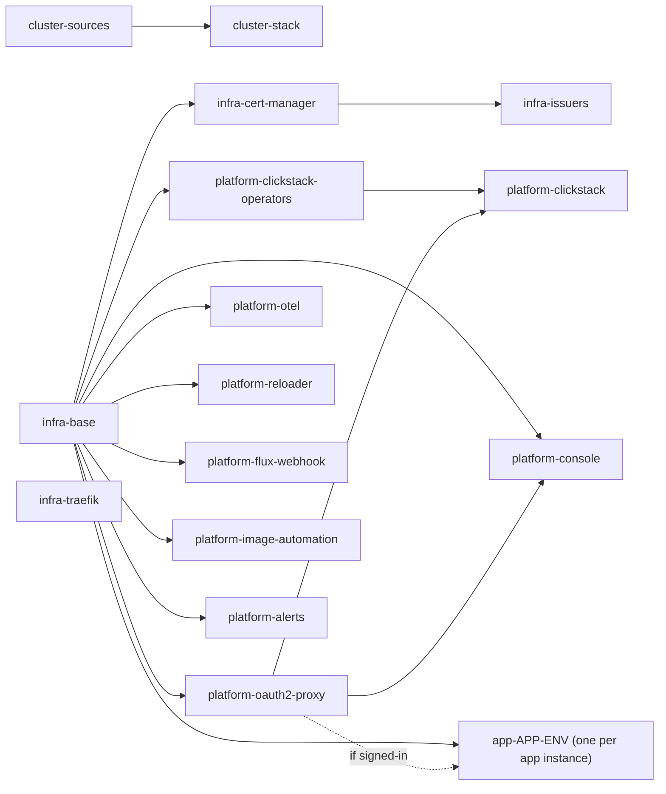
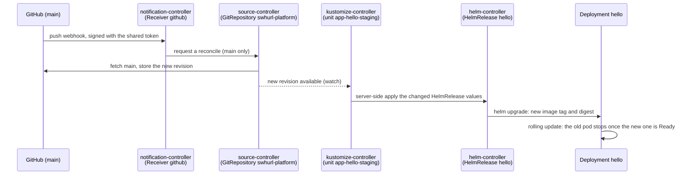
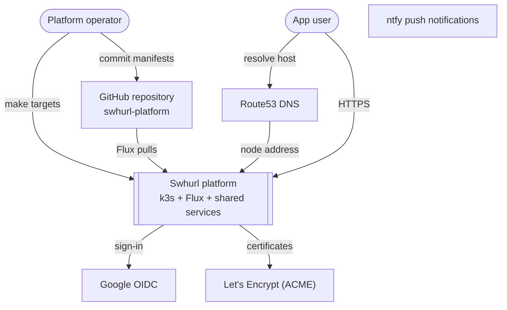
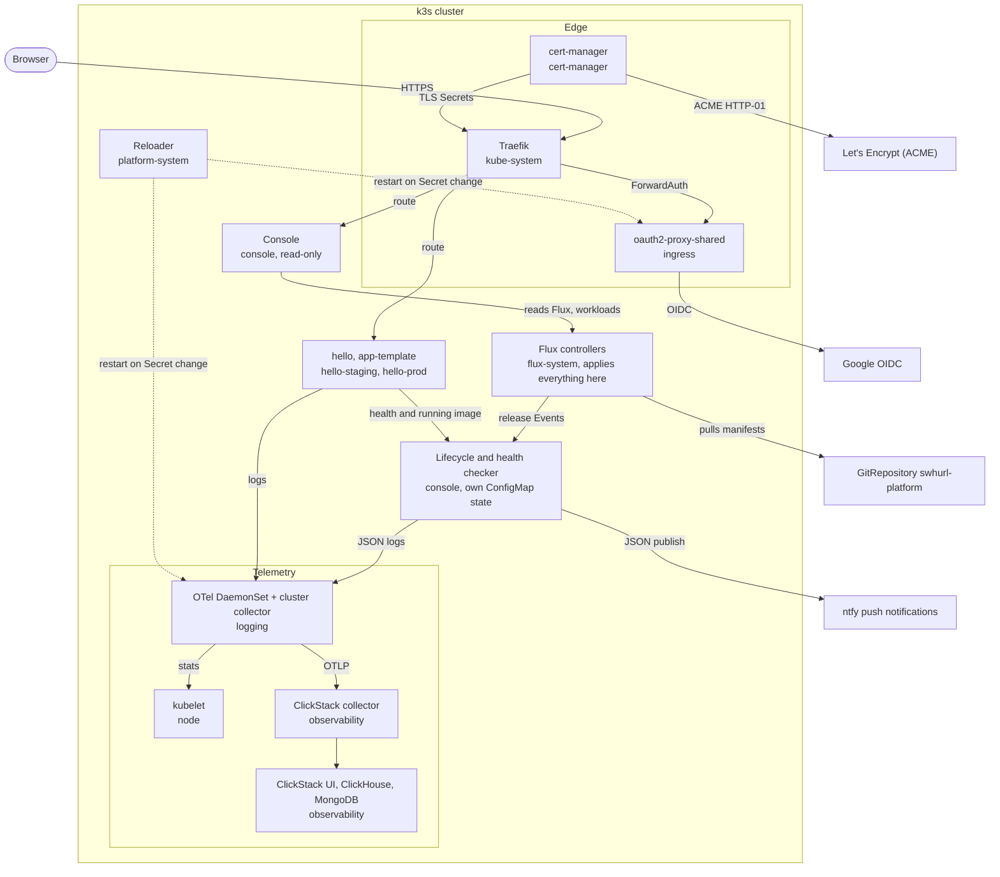
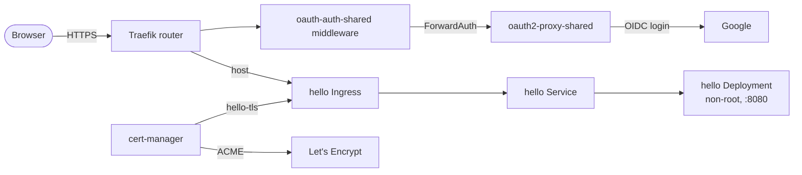

# Architecture

One k3s node, one Git repository, one Flux. Flux reconciles `clusters/home` and everything it references; nothing reaches the cluster any other way except the operator commands listed in [how changes reach the cluster](#how-changes-reach-the-cluster).

## Principles

- **Git is the deployment path.** Commit, push, reconcile. Scripts check and operate; manifests define state.
- **One owner per resource.** Flux owns each manifest and HelmRelease; helm-controller owns what a release renders; k3s owns packaged Traefik (this repo owns only its override).
- **Failures stay local.** A Flux unit is a reconciliation and deletion boundary, so each capability and each app instance gets its own and depends only on what it uses.
- **Secrets live beside their consumer**, SOPS-encrypted; non-secret cluster settings live in `platform-settings`.
- **Destruction is explicit.** Nothing deletes data implicitly; [lifecycle](operations.md#lifecycle) explains the guards.

## Concepts

| Concept | Means here | Lives in |
| --- | --- | --- |
| Host | The machine: disks, manual k3s install, dynamic DNS, router forwards | `host/` (including `host/dns.env`), [bootstrap](bootstrap.md) |
| Cluster composition | Which units run, their dependencies, sources and settings | `clusters/home/` |
| Foundation | Cluster primitives with no user-facing endpoint: namespaces, storage classes, cert-manager, issuers, Traefik settings | `infra/` |
| Shared service | A service with its own lifecycle that apps use or people visit: sign-in, observability, Reloader | `platform/` |
| App instance | One app in one environment, with its namespace, release, route, Secret and data | `apps/<app>/<env>/` |
| Environment | Deployment settings and promotion policy (`staging`, `prod`); not a namespace or trust boundary by itself | Instance values |

There is no tenancy model: app instances are separated only by namespace.

**Names.** A Flux unit is named `<area>-<component>` after its directory (`platform/oauth2-proxy` is `platform-oauth2-proxy`; an app instance `apps/<app>/<env>` is `app-<app>-<env>`), with one directory per unit. Namespaces are named by function (`ingress`, `observability`, `logging`, `platform-system`, `<app>-<env>`) and HelmReleases by product. `swhurl` names the project: the repository, its `GitRepository` source (`swhurl-platform`), the `tools/swhurl` package and the `platform.swhurl.com/*` label domain. `home` is the cluster (`clusters/home`), and `homelab.swhurl.com` is the parent DNS domain.

## Flux units

Arrows mean **must be Ready before**. The stack unit creates all the others; that ownership is separate from their dependencies.

| Unit | Owns (path) | Waits for | Inputs |
| --- | --- | --- | --- |
| `cluster-sources` | Git and Helm sources, `platform-settings` (`clusters/home/flux-system/sources`) | — | Applied by `make flux-bootstrap` |
| `cluster-stack` | All unit definitions (`clusters/home`) | sources | Applied by `make flux-bootstrap` |
| `infra-base` | Shared namespaces, `local-path-retain` | — | |
| `infra-cert-manager` | cert-manager release and CRDs | infra-base | |
| `infra-issuers` | ClusterIssuers | cert-manager | |
| `infra-traefik` | k3s Traefik `HelmChartConfig` | — | |
| `platform-oauth2-proxy` | oauth2-proxy, its Secret, the sign-in middleware | infra-base | settings, SOPS |
| `platform-clickstack-operators` | MongoDB and ClickHouse operators and their CRDs (`platform/clickstack-operators`) | infra-base | |
| `platform-clickstack` | ClickStack release and its Secret | infra-base, clickstack-operators, oauth2-proxy (sign-in middleware) | settings, SOPS |
| `platform-otel` | Both collectors, the ingestion Secret | infra-base | settings, SOPS |
| `platform-reloader` | Reloader (`platform/reloader`) | infra-base | |
| `platform-alerts` | ntfy Providers and the infrastructure/source failure Alert, with their SOPS Secrets (`platform/alerts`) | infra-base | SOPS |
| `platform-image-automation` | The write `GitRepository` (SSH, deploy key) and its SOPS Secret (`platform/image-automation`); each app's `ImageRepository`, `ImagePolicy` and app-named `ImageUpdateAutomation` belong to its staging unit | infra-base | SOPS |
| `platform-flux-webhook` | GitHub push `Receiver` and the app image `Receiver`, their token Secrets, the Ingress and HTTP-01 NetworkPolicy, all in `flux-system` (`platform/flux-webhook`) | infra-base | settings, SOPS |
| `platform-console` | The web console, dashboard sync and [notification checker](services.md#alerts), dedicated RBAC, state and Secrets, and the console NetworkPolicy (`platform/console`) | infra-base, oauth2-proxy (sign-in middleware) | settings, SOPS |
| `app-<app>-<env>` | One app instance (`apps/<app>/<env>`) | infra-base; oauth2-proxy if signed-in | SOPS if it has a Secret |

Unit definitions: [`clusters/home/flux-system/kustomizations.yaml`](../clusters/home/flux-system/kustomizations.yaml) (roots), [`infra.yaml`](../clusters/home/infra.yaml), [`platform.yaml`](../clusters/home/platform.yaml), `clusters/home/app-*.yaml`. `make test` enforces the rules below: issuers wait for cert-manager, apps never wait for ClickStack or OTel, and decryption is set exactly where a path holds encrypted Secrets.

**Waiting.** Every unit waits for its own resources to be healthy (`wait: true`) except `cluster-stack`, which applies the unit definitions and returns, so a slow or failing unit never holds back a new or changed definition. `make flux-reconcile` does the waiting: `swhurl flux-wait` polls until every unit is Ready at the fetched revision. A unit whose dependency is not Ready yet is retried after 5s (kustomize-controller `--requeue-dependency=5s`, set by `make flux-install`; the Flux default is 30s per `dependsOn` level).

**Deletion.** Every unit prunes what is removed from Git. Deleting a unit *object* differs: shared units use `deletionPolicy: Orphan` and leave their resources running unmanaged; app units keep the default and uninstall. Data is also protected by never-prune annotations (`observability`, persistent app namespaces), operator-created claims that Helm uninstall leaves behind, `Retain` volumes and backups.

**Suspension** stops a unit applying Git changes. The HelmReleases it created keep reconciling unless they are suspended too.

**Moving a resource between units** without recreating it: make sure the old unit cannot prune (make it `Orphan` in its own commit first; app units are not `Orphan` by default), add the resource unchanged to the new unit, reconcile, confirm the new unit's inventory lists it, then remove it from the old unit in a later commit. The capability split moved 22 resources this way with no recreation ([evidence](current-state.md#pr03-capability-split)). To rename a unit, replace it in one commit once the old one is `Orphan` and the new path renders byte-identically ([evidence](current-state.md#names-and-layout-cleanup-step-4)). Don't suspend a unit through Git for this: the suspend lands as a new revision, and a unit suspended before it is Ready stays not Ready.

## How changes reach the cluster

Almost every change is a commit on `main` that Flux applies. They differ in who writes the commit and whether anyone reviews it first:

| Change | Who writes it | Path to `main` | Reviewed before it deploys | Details |
| --- | --- | --- | --- | --- |
| Anything in the repo: manifests, app values, Secrets (SOPS), settings | You, by hand or with a Git-only `make` target (`app-new`, `app-promote`, `app-scale`, `app-remove`, `platform-certs-*`, `console-image`) | Direct push | `make check` locally; CI runs after the push, it does not gate Flux | [README](../README.md#make-a-change), [commands](commands.md) |
| New app, promote, scale, uninstall from the browser | The console (its GitHub token) | Pull request from a `console/*` branch | Validate; review follows the [console policy](console.md#auto-merge) | [console](console.md#use-it) |
| Chart version bumps (platform charts and every app's app-template) | Renovate | Pull request | Yes: you merge | [chart updates](operations.md#chart-updates) |
| The console's own image pin | The "Publish console image" run (`github-actions[bot]`) | Direct push, after Validate passed on the commit that changed the image's inputs | No | [deploy a new console](console.md#deploy-a-new-console) |
| A staging app's image pin (apps generated with `autoDeploy: true` in their `swhurl.yaml`, `--auto-deploy` or the template presets) | Flux image automation (`fluxcdbot`, with a deploy key that can write only this repository) | Direct push when the app publishes a newer `<run>-<sha>` image | No; production still changes only through a promote | [deploy a new image](apps.md#deploy-a-new-image) |

`main` has no branch protection: the console's code alone limits it to `console/*` branches. Because two bots also push to `main`, run `git pull --rebase` before pushing. Other apps' image pins are edited by you ([deploy a new image](apps.md#deploy-a-new-image)).

**From commit to running pods.** The same chain runs for every change on `main`; this is an app's image update:

About 2 seconds from push to fetch ([push webhook](services.md#push-webhook)); without the webhook, the `GitRepository` polls every minute. Every unit then reconciles against the new revision; a unit with `dependsOn` is retried every 5 seconds until its dependencies have applied it (kustomize-controller `--requeue-dependency=5s`, [Waiting](#flux-units)). Units whose files did not change find nothing to apply. The rollout itself takes as long as the new pod needs to become Ready.

**Making Flux act now.** All of these fetch Git first; they differ in what they wait for:

| Trigger | Waits for |
| --- | --- |
| Push webhook (automatic) | Nothing: it only starts the chain above |
| `make flux-reconcile` | Every unit Ready at the new revision; stops at the first unit that fails there |
| `make reconcile UNIT=<name>`, `make app-reconcile APP= ENV=`, the console's **Reconcile** | That one unit |

**Outside Git.** A few changes cannot be a commit Flux applies, so they are operator commands that write to the cluster directly:

| Command | Why it is not a commit |
| --- | --- |
| `make flux-bootstrap` | Applies the root units and sources that tell Flux what to reconcile; Flux does not reconcile itself |
| `make flux-install` | Installs Flux's controllers, including the two image automation controllers (the version, components and patches are in Git; the upstream manifests are rendered at install time) |
| `make suspend`, `make resume`, the console's **Suspend**/**Resume** | Stop or restart Flux applying Git for one unit or release ([lifecycle](operations.md#lifecycle)) |
| `make destroy-data` | Deletes a volume and its data, which Flux never does ([lifecycle](operations.md#lifecycle)) |
| `make clickstack-bootstrap` | Writes the admin account and team key into ClickStack's database, which has no setting for them ([services](services.md#clickstack-and-otel)) |
| `make clickstack-dashboards` | Writes app dashboards through HyperDX's API; HyperDX keeps dashboards in its database, not in files Flux could apply ([apps](apps.md#dashboards)) |
| `make host-dns`, `make host-backup` | systemd units on the host, not in the cluster ([commands](commands.md#host)) |

## C4 views

Mermaid diagrams, rendered by GitHub; edit them here ([conventions](contributing.md#diagrams)).

### Context

### Containers

### Request path to a signed-in app

App creation through the commands and console deploys staging. Production is created through [promotion](apps.md#promote-to-production); later promotions update only its image. Console promotions go through the [review and merge gate](console.md#auto-merge), which validates the latest merge result before pushing it to `main`. Each environment retains its own Flux unit, settings, storage and credentials. Custom deployments remain reviewed Git edits.
