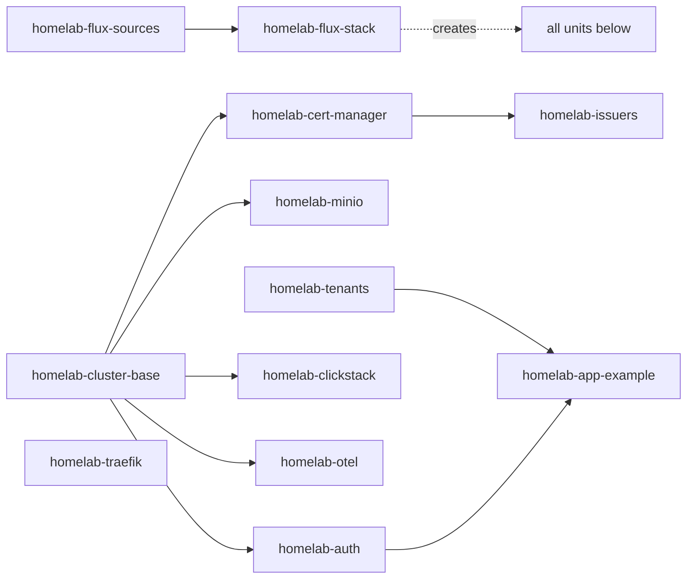

# Architecture (C4)

This document captures C4-style architecture views for the active platform layout.

Chart sources:
- `docs/charts/c4/context.d2`
- `docs/charts/c4/container.d2`
- `docs/charts/c4/component-app-example.d2`

Generate rendered charts:

```bash
make charts-generate
```

Rendered output path:
- `docs/charts/c4/rendered/*.svg`

## Concepts and boundaries

A layer groups responsibilities. A Flux Kustomization is a reconciliation and deletion boundary. Sharing a layer does not mean every resource should wait for every other resource in that layer. Since PR03, each shared capability is its own unit, so a failure blocks only what actually depends on it.

| Concept | Owns | Configuration source |
| --- | --- | --- |
| Host | OS, disks, manual k3s installation, dynamic DNS and router assumptions | `host/`, local host inputs in `config.env`, bootstrap documentation |
| Cluster composition | Selected capabilities, Flux dependencies, sources and cluster non-secret settings | `clusters/home/` |
| Foundation | Cluster primitives: Traefik configuration, certificate controller/issuers and storage classes | `infrastructure/`; packaged k3s components remain k3s-owned |
| Shared capability | A shared service with an independent health/lifecycle boundary: identity, telemetry or object storage | `platform-services/`; MinIO is currently physically under `infrastructure/storage/minio` |
| Application | A reusable service definition, such as the example app | `tenants/apps/<app>/base` today |
| Application instance | One app deployed in an environment; owns workload, route, configuration and app data references | Current example overlays; dedicated namespace and Flux unit per instance are planned for PR05 |
| Environment | Deployment settings and promotion policy such as staging/production | Current instance overlays; it does not inherently require a shared namespace or global readiness gate |

A tenant is an administrative or trust boundary, not a synonym for staging or production. The existing `tenants/` directory provides environment namespaces; it does not yet enforce isolation between independent tenants. Directory names are preserved during functional changes.

Each resource has one declarative owner. Flux owns a HelmRelease; helm-controller owns the resources rendered by that release. k3s owns packaged Traefik; this repo owns only its HelmChartConfig override. Host scripts do not own cluster credentials. Cluster non-secrets belong in `platform-settings`; service and app secrets stay SOPS-encrypted beside their consumers. A domain setting must actually drive manifests or be removed; current app hosts are still hardcoded.

## Current reconciliation ownership

Arrows in this diagram mean **must reconcile successfully before**. The root stack creates child Flux definitions; its inventory ownership is separate from the children's `dependsOn` edges.



| Flux unit | Owns (path) | Requires | Provides |
| --- | --- | --- | --- |
| `homelab-flux-sources` | Git/Helm sources and `platform-settings` (`clusters/home/flux-system/sources`) | Installed Flux; applied by `make flux-bootstrap` | Source artifacts and settings |
| `homelab-flux-stack` | The unit definitions below (`clusters/home`) | Sources; applied by `make flux-bootstrap` | Active cluster composition |
| `homelab-cluster-base` | Shared namespaces and `local-path-retain` (`infrastructure/cluster-base`) | — | Namespaces, storage classes |
| `homelab-cert-manager` | cert-manager HelmRelease (`infrastructure/cert-manager/base`) | cluster-base | Ready controller and CRDs |
| `homelab-issuers` | ClusterIssuers (`infrastructure/cert-manager/issuers`) | cert-manager | `selfsigned`, `letsencrypt-staging`, `letsencrypt-prod` |
| `homelab-traefik` | k3s Traefik `HelmChartConfig` (`infrastructure/ingress-traefik/base`) | Packaged k3s Traefik | NodePorts 31514/30313 |
| `homelab-minio` | MinIO (`infrastructure/storage/minio/base`); substitutes settings | cluster-base | Object storage for explicit consumers |
| `homelab-auth` | oauth2-proxy, its SOPS Secret and middleware (`platform-services/oauth2-proxy/base`); substitutes, decrypts | cluster-base | `ingress-oauth-auth-shared@kubernetescrd` |
| `homelab-clickstack` | ClickStack and its SOPS Secret (`platform-services/clickstack/base`); substitutes, decrypts | cluster-base | Telemetry ingestion and UI |
| `homelab-otel` | OTel collectors and ingestion Secret (`platform-services/otel/base`); substitutes, decrypts | cluster-base | Node/cluster telemetry export |
| `homelab-tenants` | `apps-staging`, `apps-prod` (`tenants/app-envs`) | — | Environment namespaces |
| `homelab-app-example` | Both example overlays (`tenants/apps/example`) | tenants, auth | Staging and production routes/workloads |

Rules that follow from this:

- **Failures stay local.** An app waits only for its namespace and the capabilities it uses. `homelab-app-example` does not wait for ClickStack, OTel or MinIO, so an observability outage cannot block app deploys. OTel does not wait for ClickStack either; collectors retry exports.
- **Issuers never race cert-manager.** `homelab-issuers` waits for the cert-manager release to be Ready, so a fresh bootstrap no longer fails on missing `ClusterIssuer` CRDs.
- **Each unit declares its own inputs.** Units whose manifests use `${...}` substitute from `platform-settings`; `homelab-otel` also needs substitution to turn `$${env:...}` into the collector's `${env:...}`. Units whose path contains `*.sops.yaml` decrypt with `sops-age`. `make test-safety` checks decryption, the issuer ordering and that apps never depend on observability or MinIO.
- **Deletion.** Every unit prunes resources removed from Git. Deleting a unit object differs: all shared units use `deletionPolicy: Orphan`, so a deleted unit leaves its resources running, unmanaged, until re-applied (`make flux-bootstrap` for the two roots). App units keep `MirrorPrune`, so deleting one uninstalls it; prune-protected namespaces and claims survive. Data protection is layered: `kustomize.toolkit.fluxcd.io/prune: disabled` on `observability`, Helm `keepPVC`, a `Retain` MongoDB PV, and backups. See [lifecycle operations](runbook.md#lifecycle-operations).
- **Suspension** stops a unit applying Git changes; HelmReleases it created keep reconciling unless suspended too.

Moving a resource between units: record both inventories, make sure the old unit is `Orphan` (or suspended) so it cannot prune, add the resource to the new unit with the same name and namespace, reconcile, confirm the new inventory holds it, then remove it from the old unit. PR03 moved 22 resources this way with no namespace, release or volume recreated (see [current state](operations/current-state.md#pr03-capability-split)). Both example instances still share one unit until PR05.

## Level 1: System Context


## Level 2: Container


## Level 3: Component (Example App Request Path)


