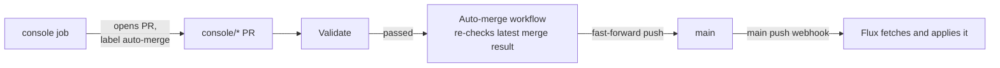

# Console

A web page at `https://console.<BASE_DOMAIN>` (`console.homelab.swhurl.com`) for looking at the platform and changing it without a terminal. Sign in with the same Google account as every other signed-in host. It changes the cluster in only three ways (reconcile, suspend and resume a Flux unit); every other change is a **pull request** it opens against this repo, which follows the [review and auto-merge policy](#auto-merge). The one thing it creates directly is a new app's own repository (**New app**).

App change jobs use the same [YAML editor and validation rules](apps.md#operate-an-instance) as the CLI. Handwritten comments and settings survive targeted edits. If validation cannot run or fails, the job fails without opening a pull request; its temporary checkout is discarded.

## Use it

| Page | Shows | Buttons and what they do |
| --- | --- | --- |
| **Overview** (`/`) | One verdict (everything healthy, updating, or how many things need attention), what needs attention with links (failing checks, failing units, suspended units), what is updating now, jobs running now, pull requests the console opened that are still open, and recent jobs | — |
| **Apps** | One row per app, with Staging and Prod columns: state, image tag (full image on hover), address and database setting (**SQLite**, **No SQLite**, or **unknown** while the HelmRelease is absent); whether both run the same image, staging is ahead (the template's `<run>-<sha>` tags) or they differ | **Review promotion** when staging is ahead or differs (opens the staging page) |
| An app (`/apps/<app>/<env>`) | A verdict (Healthy, Updating, Failing, Suspended, Unknown or Stopped) with the running tag, address, who can reach it and whether SQLite is configured; failing pods; a switch between `<app>/staging` and `<app>/prod`; **Details** (collapsed): what `make app-status` shows, including the SQLite file path when configured, the variables the platform sets and the Secret whose keys become variables (by name only); the jobs run on it. Before a new app's pull request is merged and applied, the page says **Not created yet** with its pull request and New app job, and refreshes until the app exists | **Open ↗**, **Reconcile**, **Review promotion** (staging-only apps or a different digest), then **Promote to production** on the confirmation page. **Scale** and **Who can reach it** open their forms (the same layout as New app) and each open a PR. **Uninstall** (a PR) sits apart at the bottom |
| **Platform** | A verdict, then what needs attention; the `make verify-platform` checks that need only cluster reads, in groups that open when something fails; and every Flux unit, grouped by layer (cluster, infrastructure, platform services, apps) behind one summary line that opens when a unit is not Ready or is suspended. The checks it cannot run are named, with `make verify-platform` for them | — |
| A Flux unit (`/units/<unit>`) | State, the path it applies, its Git interval, what it waits for and what needs it (links), its app if it is one, and the jobs run on it | **Reconcile now**, **Suspend** / **Resume**, each explained. None on `cluster-sources` and `cluster-stack`, which `make flux-bootstrap` applies |
| **New app** (`/new`) | **Start a new app**, the only way the console adds one: a form for a new app from a stack: name, stack (`typescript` or `kotlin`, each with a line on what it costs to run), a one-line description, the stack's **Features** (read from its template, for example Kind: web or worker, Database: none or sqlite), who can reach it and the host (hidden for a worker, which is private). A panel beside it says what will happen | **Create repository and open pull request**: one job that renders the stack's template, creates the public repository `samclement/<name>`, pushes its first commit, waits for its first build (about a minute for TypeScript, about a minute and a half for Kotlin, from the shared dependency cache the templates publish) and opens the PR adding `<name>/staging` with `make app-new --from-repo` ([start a new app](apps.md#start-a-new-app) explains validation, merge, Flux deployment, certificates and dashboard timing). If the name exists on GitHub it stops before creating anything; if the first build fails or takes over 10 minutes, it stops with the run's link and the terminal command that finishes the job (the repository stays: fix the app and push; after it publishes an image, run `make app-new NAME=<name> ARGS="--from-repo samclement/<name> --env staging --image <image the run prints>"`, then commit and push, as in [start a new app](apps.md#start-a-new-app)). A refusal from GitHub (403) names the token permission to check ([tokens](#github-tokens)) |
| **Activity** | Open console pull requests (`console/*` branches, through the GitHub API), then every job since the console started, who ran it and its result. While a job runs, the header shows **N running** | — |

**States.** Every page uses the same four, each with its own mark so the meaning does not rest on colour: **Healthy** (✓), **Updating** (↻: waiting for a dependency, applying a change or rolling out a new image, with what it waits for), **Failing** (✕, with Flux's or Helm's message) and **Suspended** (‖). After every push Flux re-checks every unit and dependents wait a few seconds (`DependencyNotReady`); the console shows that as Updating, lists it under **Updating now**, and does not count it as something needing attention. Health checks are passing or not passing.

Long commit SHAs and image digests are shortened to 12 characters; hover for the full value.

Every page names an app instance `<app>/<env>` (for example `hello-ts/staging`), linking to its app page; the Flux unit's own name (`app-hello-ts-staging`) appears only on Platform and the unit's page. Pull requests that are easy to undo merge themselves once checks pass ([auto-merge](#auto-merge)). Each button starts a **job**: its page streams output live and updates the final state, finish time and pull request link in place; without JavaScript it refreshes every 2 seconds. One job per unit or app instance can run at a time. Jobs and their event streams live in console memory, so a console restart ends them.

- **Cluster actions** make the changes `flux reconcile kustomization <unit> --with-source`, `flux suspend` and `flux resume` would, with `kubectl` (the image has no `flux` CLI): suspend and resume set the unit's `spec.suspend`; reconcile sets the `reconcile.fluxcd.io/requestedAt` annotation on the unit's Git source and then on the unit, and resume on the unit. Each waits (up to 10 minutes) until Flux reports the request handled, then shows the revision or the unit's error. A suspended unit is not reconciled: resume it. Suspending stops Git changes reaching the unit, as `make suspend` does ([lifecycle](operations.md#lifecycle)).
- **PR actions** download `main` through GitHub's API (Git writes use the API; `git` is present for Copier), run that tree's own `make app-new`, `app-promote`, `app-scale` or `app-remove` ([apps](apps.md)), so the change follows the rules CI will check, then commit the files it added, changed or deleted to a new `console/<change>-<app>-<env>-<commit>` branch (blobs, tree, commit and ref through the API; the job lists each file as `A`, `M` or `D`) and open a PR titled `[console] …` with a `Requested-by: <email>` line. If the command refuses (for example direct production creation), nothing is written to GitHub and the job shows why. After merging, the push webhook has Flux apply it within seconds ([how changes reach the cluster](architecture.md#how-changes-reach-the-cluster)); `make flux-reconcile` if you want to wait for it. Set any `REPLACE_ME` Secret values with `sops` on the PR branch before merging.
- **Audit:** every job logs `[AUDIT] <email> <action> <target>: started|succeeded (job N)` (with the PR's URL), or `[ERROR] … failed`; search `[AUDIT]` in ClickStack. The Activity page's job list is lost on restart. Old addresses `/units` and `/jobs` redirect to Platform and Activity.

App pages return an error when a cluster read fails (for example access denied or Kubernetes unavailable); only a successfully read absent unit means no such app. **Unknown** means required release, revision, workload or running-image evidence is missing. **Stopped** means the app is deliberately scaled to zero; it is not eligible for promotion. A suspended HelmRelease is shown as suspended even when its Flux unit is active.

**Review promotion** opens a confirmation for the exact healthy staging image and configuration, reading production existence from GitHub's `main`. First promotion shows its destination, supported staging settings, independent empty storage and production Secret setup; public apps must enter a distinct production host. Later promotion shows both image pins and preserves production settings. Known older builds are identified as image rollbacks; database migrations are not reversed. Equal digests need no promotion, even if tags differ. [The full promotion timeline](apps.md#console-promotion-what-happens-and-when) explains PR validation and merge, first-production provisioning, certificate issuance and dashboard update.

**Promote to production** submits the image, applied revision and source/destination configuration hashes displayed in the review. Staging must be healthy, current with Git, and running the pinned digest. Checks run when submitting, starting the background job and after file preparation; changed configuration refuses before opening a PR. The completed job means the PR was opened, not that production is Ready. Its production link shows deployment pending until Flux applies it.

An open promotion is shown on the review page and Activity, including its checks and hold controls. Repeated submissions reuse it; a different image requires explicitly closing the old PR before reviewing a replacement. These records come from GitHub and survive a console restart. This proves deployment readiness; try the staging app before promoting it.

## Auto-merge

Some console pull requests merge themselves once **Validate** passes; the rest wait for you.

| Change | Merges itself |
| --- | --- |
| New app, staging, no Secret | yes |
| Scale (staging or production) | never; review and merge it yourself |
| Promote to production | by default, unless **Hold for manual review** is selected; first production with Secrets or a public production host remains manual |
| Who can reach it, Uninstall, anything adding or changing a `*.sops.yaml` | never; New app creates staging only |



The console adds `auto-merge` to eligible PRs. Before submission, **Hold for manual review** omits it; afterwards **Hold PR** removes it. **Request auto-merge** adds it again and requests fresh eligibility and validation checks. Setup PRs and promotions marked `promotion-review-required` cannot be resumed automatically: complete setup and merge manually, or close the stale PR and review a fresh promotion. Removing the label cannot stop a merge already accepted.

[The workflow](../.github/workflows/auto-merge.yml) uses trusted `main` tooling, verifies the current PR head passed Validate, and restricts the actual diff to one staging creation or production promotion and its unit registration. Encrypted files, infrastructure, unrelated apps and resource deletion are refused. First production must reproduce the reviewed staging conversion; later promotion must change only the image pin. Changed production settings or relevant tooling, policy, chart and platform inputs require new review; first-production staging configuration changes beyond the image require regeneration. New staging builds leave the reviewed image frozen. Unrelated `main` changes continue through checks.

Before pushing, the workflow runs `make check` on the combined PR and latest `main`, rechecks the PR head and hold label, then fast-forwards the validated merge commit. A concurrent `main` update prevents the push and is retried on the next successful Validate run; no force push is used. Relevant configuration failures remove `auto-merge`, mark `promotion-review-required` and leave the workflow's reason visible. Activity distinguishes pending/running checks, failed validation, merge conflicts, waiting for merge verification and manual review; if GitHub check reads fail, it links to GitHub instead.

A merge made by the workflow's token starts no workflow on `main`; Flux's webhook still applies it. `main` has no branch protection, and direct operator pushes remain supported.

## Deploy a new console

The image is built from this repo ([`images/console/Dockerfile`](../images/console/Dockerfile)) and published to `ghcr.io/samclement/swhurl-console` (public) after CI passes on `main`, tagged `src-<hash of its inputs>`. The same "Publish console image" run then deploys it: on the latest `main` it runs `swhurl console-image --expect src-<hash> --commit`, which pins the tag and digest in `platform/console/helmrelease.yaml` and pushes a `deploy: console image src-<hash> (publish workflow)` commit as `github-actions[bot]`; the [push webhook](services.md#push-webhook) has Flux apply it at once ([the full chain](architecture.md#how-changes-reach-the-cluster)). So a push that changes `tools/`, `images/console/`, `pyproject.toml` or `uv.lock` is running in the console about 3 minutes later, with nothing to do:

```text
push → Validate (≈25s) → build and push the image (≈1 min) → bot commits the pin → webhook → console rolls out
```

- **Pull before your next push** (`git pull --rebase`): the bot's commit is on `main`.
- **Skipped on purpose** when `main` has moved on to other image inputs by the time the run pins (that commit's own run pins its image), and when the pin is already current (docs-only commits). Each run's summary says which.
- **The console restarts** when its pin changes; a job running at that moment stops, and the Activity job list is emptied as on any restart.
- **Pushes made with the workflow's token start no workflows**, so the pin commit runs neither Validate nor another publish.
- **By hand** (the run failed, or to pin an older image): `make console-image`, commit, push. `make verify-platform` warns while the running image is older than your checkout's tooling.

**Check that it deployed:** `make verify-platform` checks the console's desired image against this checkout and its running workload; Platform shows `platform-console` health. A green Publish run proves the image was published/pinned, not that the new pod is Ready. The current [notification coverage and gaps](services.md#alerts) explain which console failures produce a push; the console uses the same deployment, rollback and prolonged-health notifications as apps.

A commit that changes none of the image's inputs has the same hash: nothing to deploy. How the image and workflow are built: [contributing](contributing.md#operator-tooling).

## GitHub tokens

Two fine-grained tokens in [`platform/console/secret.sops.yaml`](../platform/console/secret.sops.yaml), both owned by you, so everything they do appears as you, and one value that is not a GitHub credential:

| Key | Covers | Permissions | Used for |
| --- | --- | --- | --- |
| `GITHUB_TOKEN` | `samclement/swhurl-platform` only | Contents, Pull requests: read and write | Every PR the console opens here |
| `APP_REPOS_TOKEN` | All repositories (GitHub lets a token create repositories only then) | Administration, Contents, Workflows, Webhooks: read and write; Actions: read | **Start a new app** only; without it that form is off |
| `IMAGE_WEBHOOK_TOKEN` | Flux's `app-images` receiver | None on GitHub: it signs [image webhook](services.md#image-webhook) calls | The webhook **Start a new app** adds to the new repository. Without it, or without the Webhooks permission above, the job warns and carries on; `make app-hooks` adds the webhook later |

`make verify-platform` checks GitHub accepts each and warns 14 days before one expires (a missing `APP_REPOS_TOKEN` is a warning). Replace one: [operations](operations.md#secrets); Reloader restarts the console.

## How it is protected

Application, Uvicorn access and action audit logs are one-line JSON. Audits retain the signed-in identity, action, unit, state, job ID and result link; access logs expose method, path and status as fields. Their collection and ClickStack searches are described in [structured logs](services.md#structured-logs).

- **Who:** oauth2-proxy returns the signed-in email as `X-Auth-Request-Email` (it needs `set-xauthrequest`) and Traefik copies it to the request; without it the console answers 401 (except `/healthz`). A NetworkPolicy admits only Traefik's pods, so no other pod can send a forged header. A POST must carry an `Origin` naming the console's own host (403 otherwise), so another website cannot use your sign-in cookie to start an action.
- **What it may do in the cluster:** its ServiceAccount `console/console` may read Flux units, HelmReleases, the Git source, pods, workloads, Ingresses and Certificates, and in `flux-system` only patch Kustomizations and GitRepositories ([`rbac.yaml`](../platform/console/rbac.yaml)). No Secrets, no `pods/exec`, nothing else writable. RBAC cannot limit which fields a patch changes; the console's code does, and refuses the root units.
- **The repository token** could change or delete any of your repositories, so only one class uses it ([`repos.py`](../tools/swhurl/console/repos.py)), and it can only check whether a repository exists, create a new public one, write the first commit and add the image webhook to a repository it created in the same job, and read that repository's workflow runs. It has no delete call and refuses any other write (tested). Rendering uses Copier and `git` in the image, which only read the public template.
- **The tokens:** used only in the `Authorization` header of the console's GitHub API requests (download `main`, create a `console/*` branch and its commit, open the PR; create a new app repository and its first commit); never in a command line and redacted from all output. `main` is not protected, so the limit to `console/*` branches is the console's code (tested).
- **State:** none. It stores nothing; `/tmp` is a 1 GiB `emptyDir` for downloaded trees.

## Run it locally

`make console-dev` serves the same pages from your checkout on `http://127.0.0.1:8080` as a fixed identity (`operator@localhost (dev)`), refusing any address but loopback. It reads the cluster **with your kubeconfig**, so its buttons act with your admin rights, and it opens real PRs if `GITHUB_TOKEN` is set in your environment. Code layout: [contributing](contributing.md#operator-tooling).


### Automatic app dashboards

The console HelmRelease also runs the minute-by-minute dashboard reconciler described in [app dashboards](apps.md#dashboards), which creates, updates and deletes app dashboards. It shares the published operator image through a YAML anchor, but uses a separate `dashboard-sync` ServiceAccount and receives no GitHub tokens. It may list HelmReleases, read only the two existing ClickStack input/connection Secrets, and execute API/MongoDB scripts in observability pods. The web console's account still cannot read Secrets or exec into pods. The reconciler stores no data; dashboards remain in the backed-up ClickStack MongoDB. Jobs retain one success and one failure, stop after 50 seconds, and their stdout is collected by the node log agent. Credentials are reread each run, so rotation needs no restart. Image updates follow the existing console publication workflow.
