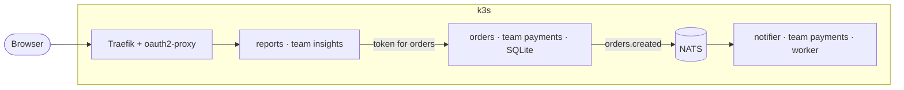

# Team platform — design brief

Draft, 10 October 2026. Not started; nothing here runs yet. This brief is the input to an incremental implementation plan; when work begins, the plan goes in [plan section 0](plan.md#0-where-this-paused-and-what-is-left) and delivered behaviour moves to the canonical pages.

## Goal

A small proof of concept of a platform where several teams deploy apps that find and call each other securely, publish and subscribe to events, keep their own data, and can be observed end to end. It proves the contract a team works with, not capacity: everything still runs on the one k3s node.

## Principles

- **One contract.** An app says what it needs in [`swhurl.yaml`](apps.md#swhurlyaml); the platform generates the rest. Each capability is one field, one platform piece and one template feature.
- **Use what is already here.** Kubernetes DNS, service-account tokens and NetworkPolicies; Traefik, oauth2-proxy, OTel and ClickStack, SOPS, Flux, the console and both stack templates.
- **One declaration, many effects.** `calls:` yields the address, the network rule, the permission and the catalogue entry, so they cannot drift apart.
- **Both stacks behave alike.** Anything a template helper does exists in TypeScript and Kotlin.

## What a team writes

```yaml
# swhurl.yaml: new optional fields (version stays 1)
team: payments
calls: [inventory]                 # apps this one may call
provides: {api: /openapi.json}     # optional: shown in the catalogue
events:
  publish: [created]               # becomes subject orders.created
  subscribe: [inventory.reserved]
```

```ts
const stock = await service("inventory").get("/api/stock/42");
await events.publish("created", order);
events.subscribe("inventory.reserved", handler);
```

No hostnames, ports, environment names, tokens or broker addresses appear in app code.

## Design by capability

| Capability | The platform generates | Built on |
| --- | --- | --- |
| Teams and isolation | A `platform.swhurl.com/team` namespace label from a registry of team names in this repository; a ResourceQuota per namespace; a NetworkPolicy on the app's pods admitting only Traefik and declared callers | Kubernetes; k3s enforces NetworkPolicies itself |
| Service discovery | `SWHURL_SERVICE_<NAME>_URL` pointing at the same environment's instance; a **Services** page in the console | Kubernetes DNS, the console |
| App-to-app identity | A short-lived service-account token for each callee, mounted as a file and usable only for that callee (not for the Kubernetes API); the caller's name on the callee's `SWHURL_ALLOWED_CALLERS` | Kubernetes projected tokens and the cluster's public signing keys |
| Events | A NATS user per app, limited to publishing its own subjects and reading the ones it declared; a durable stream per publishing app; credentials in the app's SOPS Secret | NATS JetStream (the one new component) |
| Persistence | Unchanged: `database: sqlite`, retained volume, nightly backup | Existing |
| Human sign-in | Unchanged: Google through oauth2-proxy | Existing |
| Observability | `caller.type` and `caller.id` on every request's log line and span; the team as a telemetry attribute; trace context carried in event headers; dashboards selectable by team | OTel collector, ClickStack |
| Secrets | Unchanged: SOPS; the operator sets values | Existing |

### How a call works

1. `reports` declares `calls: [orders]`. A pull request to this repository (console form or `make` command) changes both instances: `reports` gets the address and a token file for audience `orders`; `orders` gets `reports` on its allowed list and in its NetworkPolicy.
2. At run time the helper reads the address and the token, and sends `Authorization: Bearer <token>` with trace headers and a timeout.
3. `orders` checks the signature against the cluster's keys, that the audience is `orders`, and that the caller's namespace is an allowed app in its own environment. It refuses with 401 otherwise, and logs `caller.type=app caller.id=reports`.
4. A browser request arrives through oauth2-proxy as today and is logged `caller.type=user caller.id=<email>`.

### How an event works

Subjects are `<publishing app>.<event>`; only the owner may publish. Staging and production are separate NATS accounts, so they cannot see each other's events. Messages are CloudEvents JSON with the trace context in headers, so a trace continues from publisher to subscriber. Streams keep seven days and are not backed up: an event stream is not a system of record.

### The Services page

One row per app: team, environments, health, the API description if declared, the events it publishes, and who calls or subscribes to it (derived from other apps' declarations). A **Call this from my app** button shows the line to add.

### Guard rails

- `make check-apps` fails when `calls:` or `subscribe:` names something that does not exist in that environment, or `team:` is not in the registry.
- A promotion stops when a dependency has no production instance, and names it.
- Removing an app that others call or subscribe to is refused, listing them.
- Locally, the helpers read the same variables from a `.env` file.

## The scenario that proves it



Done means: one trace in HyperDX crosses all three apps with the caller on each hop; an undeclared call is blocked at the network and, if the network rule is removed, refused with 401; filtering on a team shows only its apps.

## Increments

Each ends in something checkable and leaves the platform working.

| # | Increment | Checkable result |
| --- | --- | --- |
| 0 | **Proofs** in a throwaway labelled namespace: an app with no API token verifies a caller's audience-bound token against the cluster keys; a NetworkPolicy on app pods still admits Traefik, probes and certificate issuance | Two `live-test-*` targets pass; existing apps untouched |
| 1 | **Teams and isolation:** team registry, `team:` field, label, quota, default NetworkPolicy, team attribute in telemetry | Existing apps still reachable through Traefik; a pod in another namespace cannot connect |
| 2 | **Calls and discovery:** `calls:` field, the command and console form that change both instances, the address variable, token file, allowed list; template helper and verifier in both stacks; caller fields in logs | `reports` calls `orders`; an undeclared caller is refused |
| 3 | **Services page and guard rails** | The page shows the edge from increment 2; the three checks above fail as described |
| 4 | **Events:** NATS (through the `new-component-checklist`), `events:` field, generated users and streams, template helpers with trace headers, streams on the Services page | `notifier` receives `orders.created`; an app cannot publish another app's subject |
| 5 | **Scenario and documentation:** the three apps end to end, a repeatable live test, behaviour moved into the canonical pages | The "done means" list above, with dated evidence in [current state](current-state.md) |

Increments 2 and 4 each need a new revision of both stack templates.

## Decisions

| Decision | Choice | Status |
| --- | --- | --- |
| App-to-app identity | Kubernetes service-account tokens | Recommended, liked by the operator; depends on increment 0 |
| Events | NATS JetStream | Recommended, liked by the operator |
| Persistence | SQLite only | Decided: no Postgres |
| Isolation | Namespace per app with team label, quota and NetworkPolicy | Recommended, liked by the operator |
| Discovery | Generated variables plus a console page | Recommended, liked by the operator |
| Callers outside the cluster | Not in the proof of concept; Dex is the later option | **To confirm** |
| Human sign-in and team membership | Stay on Google; a team is a name in Git, not a set of people | **To confirm** |
| Who the teams are | Simulated: the operator acts as each team, in this one repository | **To confirm** |

## Out of scope, and known limits

- **Postgres** (excluded by the operator) and scaling an app with a database beyond one replica.
- **Outside callers with tokens** (Dex) unless confirmed above.
- **Forged user headers from a declared caller.** An app admitted by `calls:` could send `x-auth-request-email` itself. Closing it means apps verifying a signed sign-in token; a later increment.
- **Egress rules.** Only inbound traffic is restricted; apps can still reach anything outbound.
- **Admission-time policy.** Rules stay in `make check-apps` on pull requests.
- **Per-team repositories and self-service merges.** Teams are labels, and the pull request is the callee's consent to a new caller.
- **Teams setting their own secrets.** One age key; the operator sets values.

## Risks

- **Token verification without an API credential** is the assumption everything in increment 2 rests on: the app must read the cluster's public keys while still having no API token. Increment 0 proves or replaces it (fallback: Dex client credentials).
- **NetworkPolicy and HTTP-01:** a policy selecting every pod in a namespace blocks certificate issuance ([lesson in `AGENTS.md`](../AGENTS.md)); policies select the workload's pods only.
- **NATS credentials are stored secrets,** unlike the call tokens. Rotation goes through SOPS and Reloader like any app Secret.
- **The scenario creates real public GitHub repositories** that only the operator can delete; they are named `swhurl-try-<n>`.
