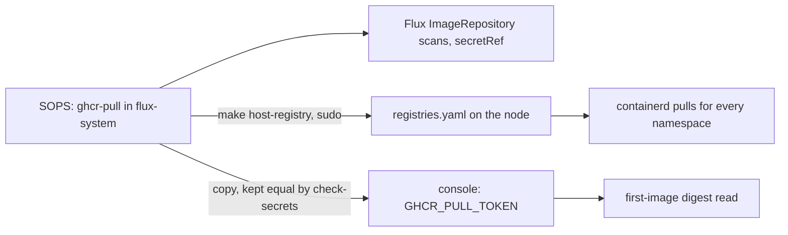
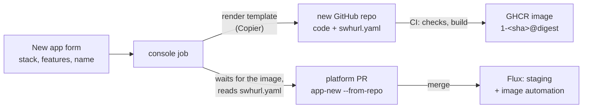
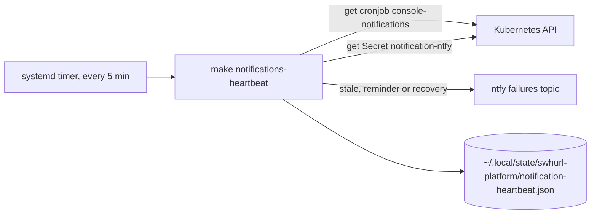
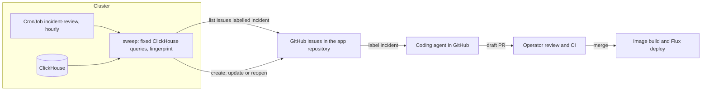

# Swhurl Platform — plan

Started 27 September 2026 · last tidied 5 October 2026. Older work is summarised with its decisions and commits; what was run live is in [current state](current-state.md), and the earlier full text of this file is in Git history (for example `d4566c9`). Recent work (sections 9, 11, 12 and 14) keeps its full contract.

## 0. Where this paused and what is left

The platform is live. Every deliverable in section 3 is done except PR06's remainder, PR08a's gate and the final operator exercise. Before resuming, pull `main` and run `make check-repo`, `make test` and `make verify-platform`, and re-read the "Not exercised" notes in `docs/current-state.md`.

### Open work

1. **PR06 — private app repositories and images** ([section 4](#private-app-repositories-and-images--planned-9-october-2026-not-started)). **On hold while the incident reviewer is rolled back.** No private-repository or image change was implemented. The 9 October design in section 4 remains a record for reconsideration, not the next execution task.
2. **PR08a gate** (section 5; drill plan in [section 13](#13-recovery-drill-pr08a-gate-and-fresh-bootstrap--designed-3-october-2026-not-started)): restore on a separate machine from S3 using only the docs. Follow-ups: a write-only IAM user for backups instead of `sam`; possibly a Kubernetes CronJob with a published backup image once PR06's GHCR half is done.
3. **Final operator exercise** (section 6), using only the docs.
4. **Operator browser checks:** a real Google-signed-in session for (a) reviewing and submitting a promotion (automated UI proof used the local dev identity) and (b) the live job-output stream, including that Traefik and ForwardAuth do not buffer it ([section 12](#12-live-job-output-on-the-console-deployed-3-october-2026)). Also confirm the console's `GITHUB_TOKEN` is limited to this repository.
5. **Notification gaps** ([contract](services.md#notification-expectations)): live fixture uninstall/rollback and timed unhealthy/recovery delivery exercises; alerts for failed or stale backups, external availability, certificate expiry or renewal failure and disk pressure.
6. **Decision needed — ClickHouse CPU** (delivered item 17): merge write amplification sets the load, not data volume. The lever is `async_insert` or bigger batches in the ClickStack HelmRelease, which trades a few seconds of data on a crash. Unexplained: since HyperDX restarted at 21:44 on 2 October the histogram table merges every new part on its own (about +100 s of merge time an hour). Revert `008c5d5` and `6cdfe3f` (coarser metric intervals, no CPU gain) if the graphs bother you.
7. **App page stack panel** (section 8, phase 8): show the stack, its features and each capability's health (last SQLite backup, later roles).
8. **Optional cleanup** (deleting needs confirmation; repository and package deletion is yours): `samclement/swhurl-try-6` (repository, package, staging and prod instances, retained volumes; restoring those volumes is unexercised, though the same SQLite restore shape has live evidence); migrating `hello-ts`.
9. **Incident reviewer follow-up.** The GitHub-issue redesign in [section 14](#14-incident-issues-and-agent-fixes--redesigned-9-october-2026-design-b-not-started) remains unimplemented and on hold. The collect-only reviewer was suspended (`82b9a8f`), then its resources and tooling were removed (`77f3b3b`). Its empty Flux unit and namespace are removed. Decide separately whether to revoke the unused OpenAI key, and delete the worker GHCR package and ntfy subscription. Shared notification storage and console behavior stay in place.
10. **Platform-generated apps only: done 9 October 2026** (`13c761c`, `2cbdd9f`, `131818a`). Every app comes from a stack template through `make app-repo` or the console; `make app-new` and the app policy rule `platform-image` refuse anything else; `hello` is retired. Rules: [apps](apps.md#start-a-new-app); evidence: [current state](current-state.md). Left unexercised: a new app created after the change, from the console and from `make app-repo`.

### Delivered

Numbers are kept because other docs and code comments cite them. Evidence for each is in `docs/current-state.md`.

| # | Done | What, and where documented |
| --- | --- | --- |
| — | 9 Oct | An app's dashboard is deleted by the scheduled sync when its last release is gone (`6f49dfe`; [apps](apps.md#dashboards)). Not exercised: a real app removal |
| 20 | 3 Oct | Live job output over SSE ([section 12](#12-live-job-output-on-the-console-deployed-3-october-2026)) |
| 19 | 3 Oct | Notification refactors R1–R4 and the host heartbeat H1–H4 ([section 11](#11-notification-boundary-refactors-and-heartbeat-3-october-2026)) |
| 18 | 3 Oct | Predictable deployment and promotion ([section 9](#9-predictable-app-deployment-and-promotion)). Web promotion #34 and private SQLite worker promotions #35–36 passed; duplicate submissions reused PRs; failed gates wrote and merged nothing; both worker databases kept independent claims through an image update |
| 16 | 2 Oct | Automatic app dashboards (`d5c0f87`; [apps](apps.md#dashboards)) |
| 15 | 2 Oct | Structured logs across the cluster (`cf3df0c`, `498310b`; [formats](services.md#structured-logs)); existing streams only, original lines and schema preserved |
| — | 2 Oct | Console correctness (`b3dd939`) and app validation / YAML editing (`6bac215`): validation fails when tools fail; scale, expose and promote keep handwritten YAML ([boundaries](apps.md#operate-an-instance)) |
| 17 | 2 Oct | ClickHouse load and telemetry noise: log noise filtered (`1fa822d`, 26,352 → 8,780 lines/h); HyperDX self-traces sampled at 10% (`4074d6a`, 12,866 → 1,362 spans/h); metric intervals raised (`008c5d5`, `6cdfe3f`; 752,944 → 420,234 rows/h). ClickStack's own scrape of ClickHouse (half the rows) cannot change from Git: the chart's `customConfig` loses to the config HyperDX pushes over OpAMP (`cc8e497`, `e8140d8` reverted). Server CPU did not drop (0.21–0.22 cores); see open work 6 |
| 14 | 2 Oct | Console follow-ups: new-app links wait for the PR (`8e77604`); reserved Secret names (`HOST_IP`, `DATABASE_PATH`, `OTEL_*`, `SWHURL_*`, `KUBERNETES_*`, because `envFrom` loses to the platform's `env`); New app page by scenario; auto-merge of console PRs ([policy](console.md#auto-merge)); `make check-templates`; `make clickstack-dashboards` |
| 13 | 2 Oct | Observability fixes: logs carry `trace_id`/`span_id`, kube-probe spans dropped (34,507 of `hello-ts`'s daily traces), TypeScript resource detectors limited to local ones |
| 12 | 2–3 Oct | New app from a catalogue ([section 8](#8-new-app-from-a-catalogue)), phases 1–7 |
| 11 | 1 Oct | Console redesign: Overview · Apps · Platform · Activity; one state vocabulary (Healthy ✓, Updating ↻, Failing ✕, Suspended ‖); instances named `<app>/<env>`; hashes shortened to 12 characters with the full value on hover; breadcrumbs; "Updated … ↻ Refresh" |
| 10 | 30 Sep | `app-new` presets, the TypeScript template repository, Flux image automation deploying template apps to staging on every push (production through a promote); first app `hello-ts` |
| 9 | 30 Sep | App code starts from a GitHub template repository per language, outside this repo; this repo keeps the cluster wiring (`app-new`, `contract.py`). The manifest injects every cluster-specific value, so app code only follows conventions (OpenTelemetry SDK reading `OTEL_*`, a readiness path, port 8080, non-root user, a publish workflow printing the image digest). Copier was added later (item 12) |
| 8 | 29 Sep | Faster delivery: parallel checks and CI (`4bd61a4`), `cluster-stack` without `wait` plus `swhurl flux-wait` (`9bce4a7`), `flux-install` with a 5 s dependency retry (`33fb42e`), GitHub push webhook (`cfb5daf`), publish run deploying the console (`0503987`). A push reaches Flux in about 2 s, a full `make flux-reconcile` takes about 17 s, a console tooling change deploys about 90 s after the push |
| 7 | 28 Sep | Foundation cleanup in four steps (section 3) |
| 6 | 28 Sep | Operator logic moved from bash to the tested `tools/swhurl` package; short glue and host scripts stay bash ([rule](contributing.md#operator-tooling)) |
| 5 | 28 Sep | Documentation restructure: one canonical page per topic ([map](contributing.md#documentation)); the `document-repo` skill is in `.claude/skills/` |
| 4 | 29 Sep | Console, phases 1–7 ([section 7](#7-console)) |

### Known issues, deliberately not fixed

- **OTel deprecations:** collector 0.161.0 warns that `hostmetrics`, `kubeletstats`, `k8sobjects` and the inline `service.telemetry.resource` map are deprecated. The chart's presets generate all three names, so renaming only ours could duplicate receivers; rename each with a chart version whose preset uses the new name (chart issue #2183). `make check-otel` lists deprecated names on every chart update and fails if a rename leaves a pipeline naming a missing component. The telemetry format warning goes with chart PR #2343.
- **Kotlin telemetry:** the agent's `jvm.memory.*` and `jvm.thread.*` metrics do not reach ClickStack (only `jvm.gc.duration`), so those dashboard panels wait. Log severity is guessed from text (a request log mentioning `traceId` reads as "trace").
- **Not covered by observability:** no backup of telemetry, no alerts on app behaviour (error rates, latency, a stuck worker), and a collector that trusts every pod.
- **Staging and production `hello`** differ only in namespace and host; `make check-apps` fails if they drift further. No per-instance quotas, NetworkPolicies or RBAC.
- **Shared sign-in cookie:** everything under `homelab.swhurl.com` shares it, so public or untrusted apps must use another parent domain (none exist).

### Not yet exercised live

- A fresh bootstrap on a real new host (DNS, router forwarding, Let's Encrypt; the in-cluster sequence was rehearsed on k3d).
- A real credential rotation through Reloader (only dummy-key and disposable rotations ran), and Reloader restarting a generated app.
- A `public` app on a domain outside `homelab.swhurl.com`.
- A rejected sign-in reaching oauth2-proxy's email list (Google refused the test account first).
- Open question: avoiding Let's Encrypt rate limits when rebuilding (back up and restore certificate Secrets, or use `letsencrypt-staging` while iterating); relevant to the fresh bootstrap above.

**Kept out of scope:** a second cluster (EC2), tailnet-only private routes, DNS-01 and wildcard certificates, directory renaming, and Hermes (a separate project needing model-network design and stronger command isolation than a namespace).

## 1. Goal and scope

Make an app instance a small, reviewable definition: image digest, resources, probes, exposure, configuration, secrets and persistence. A generator supplies the namespace, Flux Kustomization, HelmRelease and optional encrypted Secret. Git review and Flux remain the deployment path.

Keep k3s, Flux, packaged Traefik, cert-manager and SOPS/age. Work on `clusters/home/` only, preserving capability boundaries for a possible `clusters/aws/` without building it.

### Completion criteria

- Onboard a second app from an existing image in under 15 minutes (excluding DNS and certificate delays) without hand-written Deployment, Service or Ingress.
- Each app instance has its own namespace and Flux unit; staging and production reconcile independently.
- Image and chart updates are reviewable and pinned. Promote and roll back the same image digest.
- A ClickStack failure does not block an unrelated app update.
- Exposure modes enforce their route and cookie boundaries; only approved identities sign in.
- Secret rotation restarts only the referencing workload without printing the value.
- Suspend, uninstall and data destruction have distinct effects. Restore one stateful workload and the age key from an independent backup.
- One documented command shows desired revision, running image, readiness, address and failure reason.

## 2. Design decisions

| Concern | Home decision | Future extension |
| --- | --- | --- |
| Cluster | `clusters/home/` is the sole entrypoint; independent capability units. | A later `clusters/aws/` may share bases with separate settings and age key. |
| Host | host/, dynamic DNS, NodePorts and router mapping stay home-specific. | Design EC2 bootstrap and Route 53 ownership when that move is committed. |
| App chart | Pinned bjw-s app-template (started at 5.2.1) from a shared HTTP HelmRepository; version pinned per HelmRelease. | A custom chart only if the values and policy model prove inadequate. |
| App isolation | One namespace and one Flux unit per instance, with SOPS decryption on that unit when needed. | Reuse the generator and policy for another cluster. |
| Browser exposure | `private` has no Ingress; `authenticated-web` is for trusted apps under the shared-cookie domain; `public` uses a domain outside that scope. | Private browser routes need a proven tailnet or internal entrypoint; a public IP allowlist is not the default private boundary. |
| TLS | HTTP-01 for public home routes. | Route 53 DNS-01 for private-host certificates; wildcard TLS has a larger key blast radius. |
| Updates | Renovate for chart PRs; Flux image automation for template apps in staging. | No custom cross-repository PR machinery. |
| Data | Retain irreplaceable state on uninstall; destruction is explicit and separate. | Prove a Retain StorageClass and restore before stateful migration. |

A public app on `public.homelab.swhurl.com` is still in the `.homelab.swhurl.com` cookie scope: use a sibling domain such as `public.swhurl.com`. HttpOnly does not stop the destination server receiving the cookie. Browser sign-in establishes identity; each app owns authorization. Machine APIs use token auth, not browser redirects.

## 3. Delivery order and gates

Rule kept: prove restore before deletion, ownership handover or stateful migration. Evidence for each row is in `docs/current-state.md`.

| Order | Deliverable | Outcome |
| --- | --- | --- |
| PR01 | Inventory, validator, CI, documentation | Complete (`2bae8d0`) |
| P0a | Guard destructive teardown/reinstall; correct operator docs | Complete |
| P0b | Age key backed up off-host | Complete: an encrypted USB copy decrypted all three Secrets |
| P0c | Fix verifier and the double-encoded ingestion Secret; restart collectors | Complete 27 Sep: no 401s, fresh logs and metrics in ClickHouse |
| P0d | Restrict sign-in to approved identities | Complete 27 Sep: `sam@swhurl.com` only; a non-approved account was refused |
| PR08a | Independent backup and tested restore | Partial: data classified; encrypted backup and disposable restore proven 27 Sep; live restore, S3 copies and daily timer 29 Sep; **restore on a separate machine pending** |
| PR02a | Retention: telemetry 30d, ClickHouse system logs 7d, backup pruning 7 daily + 4 weekly, MongoDB PV Retain + PVC keep, `local-path-retain` class | Complete 27 Sep |
| PR02b | Lifecycle commands (suspend/resume/destroy-data), `Orphan` shared units, prune protection | Complete 27 Sep; `make live-test-lifecycle` |
| PR03 | Capability split; cert-manager/issuer ordering | Complete 27 Sep: 10 units, 22 resources handed over with no recreation |
| PR07a | Scoped opt-in Reloader for oauth2-proxy and OTel | Complete 28 Sep; manual refresh kept as fallback |
| PR04 | App-template contract, generator, rendered policy | Complete 28 Sep: `make check-apps`, `make live-test-app-template` |
| PR05 | Split and migrate example staging/production | Complete 28 Sep: `hello-staging`/`hello-prod`; routes cut over with seconds of default-cert gap |
| PR07b | App Secret conventions and shared settings | Complete 28 Sep: `make check-secrets` |
| PR06 | GHCR publishing and Renovate | **Open** (section 4) |
| Final | Operator exercise | **Open** (section 6) |

### Foundation cleanup (28 September 2026)

A review of boundaries, technology choices and responsibilities, executed in four steps. Numbers follow the review and are cited by evidence in `current-state.md`.

- **Tooling only:** one contract module, `apps/contract.py` (#2); `platform.py` holds shared paths, names and queries, and `check-config` derives required Secrets from each unit's `decryption` (#3); `check-repo` and the app policy take an injected runner and report every failure (#6); fake-executable tests cover only the `make` interface (#8); `make check-apps` fails when environments differ beyond namespace, hosts, image, replicas, resources and issuer (#9); `help` is generated from `## ` comments, defaults live in Python, `config.env` is deleted (#13); `apps/{contract,new,ops,policy}.py` and `retention.py`, tests split by subject (#19). #4 (split `verify.py` by service) was skipped on purpose: revisit past about 400 lines or with a second cluster.
- **Stale records:** `todo.md` was reviewed and deleted; `current-state.md` starts with current cluster facts.
- **Decisions that change what runs:** `BASE_DOMAIN` in `platform-settings` is the one source of platform hostnames, cookie domain and redirect allowlist (#1; `make test` fails on a literal platform hostname; the ACME email and approved sign-in addresses stay literal on purpose). MinIO was removed (#12; it held no buckets): an emptied unit let Flux uninstall the release and delete its volume, then the unit and references went. Foundation means cluster primitives with no user-facing endpoint; shared services are what apps use or people visit (#5).
- **Names and layout:** verbs `check-*` (offline; `check` runs what CI runs), `test`, `verify-*` (live), `live-test-*` (throwaway cluster) and `backup-mongodb` (#18); this file is `docs/plan.md` and the evidence file `docs/current-state.md` (#20); units are `<area>-<component>` named after their directory, one directory per unit under `infra/`, `platform/`, `apps/`, files `<kind>.yaml` (#14–17): `infra-base`, `infra-cert-manager`, `infra-issuers`, `infra-traefik`, `platform-oauth2-proxy`, `platform-clickstack`, `platform-otel`, `app-<app>-<env>`, with roots `cluster-sources` and `cluster-stack`. Namespaces, HelmReleases, Secrets and hostnames kept their names, so no workload changed. Each rename was a handover: make the old unit `Orphan`, create the replacement, after proving offline that it renders byte-identical objects and live that Helm revisions and pod and volume UIDs are unchanged. **Lesson:** suspending a unit through Git blocked `homelab-flux-stack` for its 20-minute health-check timeout (the suspend commit is a new revision and the unit froze as not Ready), so later stages used `Orphan` instead.
- **Simplification:** Mermaid replaced D2 (no render step); component READMEs folded into `services.md` and `operations.md`; ADRs retired; `make reconcile UNIT=<name>` replaced the four OTel refresh targets; old aliases, `verify`, `teardown` and `reinstall` removed.
- **Judged sound, left alone:** `Runner` and `Report`; the `Orphan`/`MirrorPrune` deletion split and its tests; explicit repetition in Flux unit definitions (guarded by `make test`); host scripts as bash; explicit per-environment app copies.

## 4. PR06 — registry and reviewable updates

First-party images go to GHCR. Each app repo tests, builds, publishes a source-revision-tagged image and prints its digest; package-write credentials are used only when publishing. One digest is promoted between staging and production, and deployed digests are retained for rollback. Build x86-64 for home; add ARM64 when a consumer needs it.

**Decided:** chart updates come from Renovate (live; [operations](operations.md#chart-updates); the first, ClickStack 1.1.2, merged 28 September, and ClickStack 3.x was installed fresh on 29 September). The console image is public on GHCR and pinned by `make console-image` (its tags never move, so Renovate digest PRs were dropped). Template apps deploy to staging by Flux image automation (30 September): one policy per app, staging only, one write key for this repo. Chosen over Renovate digest PRs (Renovate cannot read the HelmRelease's separate `digest` field and would bump both environments at once, so digest updates stay disabled in `renovate.json`) and a cross-repository credential in each app repo. Production stays behind **Promote to production**.

### Private app repositories and images — planned 9 October 2026, not started

**Goal.** App repositories and their images are private, so incident issues ([section 14](#14-incident-issues-and-agent-fixes--redesigned-9-october-2026-design-b-not-started)) can carry stack traces, log messages and request paths. Stage A makes the pilot repository private with no cluster change. Stage B gives the cluster a pull credential and makes private the default for new apps. Section 14 stage B1 starts after the stage B gate.

**Status:** on hold during the incident reviewer rollback. None of P0–P9 has started.

**Decisions (operator, 9 October 2026).**

| # | Decision |
| --- | --- |
| 1 | Private app repositories instead of minimal public evidence. Order: stage A, stage B, then section 14 |
| 2 | The node pulls with a host file, `/etc/rancher/k3s/registries.yaml`, installed by `make host-registry` (operator, `sudo`). Rejected: a pull Secret in each app namespace, because app units have no SOPS decryption or substitution and adding substitution would consume every `${...}` in app manifests |
| 3 | Flux image scanning uses one Secret, `ghcr-pull` in `flux-system`, owned by the `platform-image-automation` unit. It is the one source of the token; the host file and the console's copy are made from it |
| 4 | The credential is a classic GitHub token with only `read:packages`, owned by the operator (task P2 confirms GHCR still refuses fine-grained tokens before the operator creates it) |
| 5 | Existing public apps (`hello`, `test-2` to `test-4`) stay public. `hello-ts` moves: repository in stage A, package in task P8 |
| 6 | `swhurl-platform`, the stack templates and the console image stay public |

**What stays true.** An authenticated read works for public packages too, so the tooling sends the credential for every `ghcr.io/samclement/*` image and needs no public-or-private switch.



#### Rules for whoever executes this

- Do the tasks in order, one commit per task, each with its documentation. Before each commit: `make check`; for script, Makefile or workflow changes also the shell syntax loop and `DRY_RUN=true` variants in `AGENTS.md`. Then `git pull --rebase`, push, `make flux-reconcile`, `make verify-platform`, and add dated evidence to `docs/current-state.md`.
- Make no design choices. If a task's assumption turns out false, or a "done when" cannot be met, stop and report what you found; do not work around it.
- Tasks marked **Operator** need the operator: give the exact command, labelled "run with `!`" or "run in your own terminal", say what you will check afterwards, and wait.
- Tasks marked **Confirm first** change something hard to reverse or under `flux-system`: state exactly what will change and wait for a yes.
- Never print the token, the Secret, or `registries.yaml`. Pass credentials on stdin or in a mode-0600 file, never in a command line; register them with `runner.add_secret`. Compare by hash.
- New Python goes through `Runner` and is tested with `FakeRunner` or an injected opener; write the failing test first.
- Throwaway repositories are `swhurl-try-<n>`, starting at `swhurl-try-10`. List each for the operator to delete (repository and package) at the end.
- After each stage, use the `phase-handoff` skill. Use `new-component-checklist` in task P3 (a new credential).

#### Stage A — the pilot repository goes private

| # | Task | Done when |
| --- | --- | --- |
| P0 | **Operator.** Open `https://github.com/settings/billing` and report the plan (Free or Pro). On Free, branch protection is not available on private repositories, which section 14 decision 8 needs: the operator either upgrades to Pro or accepts an unprotected `main` and says so. Record the answer here | The plan and the choice are written in this table |
| P1 | **Operator, confirm first.** Make `samclement/hello-ts` private. Steps below | Every check in "P1 checks" passes and the evidence is recorded |

**P1 steps.**

1. Before: record that the anonymous read works. `python -c "from swhurl.apps import repo; print(repo.image_digest('ghcr.io/samclement/hello-ts', '<current tag>'))"` with `PYTHONPATH=tools`; the current tag is the `tag:` line in `apps/hello-ts/staging/helmrelease.yaml`. Expect a `sha256:` digest.
2. Tell the operator what changes: the repository's stars and watchers are removed, public links to it stop working, and making it public again later would expose every issue written in between. Then ask them to run with `!`: `gh repo edit samclement/hello-ts --visibility private --accept-visibility-change-consequences`.
3. P1 checks, all read-only:
   - `gh api repos/samclement/hello-ts -q .visibility` prints `private`.
   - Step 1's command still prints the same digest (the package stayed public). **If it now fails with 401 or 403, stop:** running pods keep their cached image, but the next deploy would fail. Ask the operator to set the package back to public in GitHub (the package's settings, Change visibility) and report.
   - `kubectl -n flux-system get imagerepository hello-ts` is Ready with a scan in the last two minutes.
   - `make app-status` shows `hello-ts/staging` healthy; `make verify-platform` passes.
   - `gh api repos/samclement/hello-ts/actions/permissions -q .enabled` prints `true`.
4. Docs in the same commit: `docs/apps.md` (current instances: `hello-ts` repository is private, image public until P8) and `docs/current-state.md`. Not exercised until P8: a workflow run in the now-private repository.

**Gate (A):** `hello-ts` is private, its instance is healthy and its image is still pulled anonymously.

#### Stage B — pull credential, private by default

| # | Task | Files | Done when |
| --- | --- | --- | --- |
| P2 | Check two facts against the vendors' current documentation and record the result in this section: (a) GHCR accepts a classic token with `read:packages` and refuses fine-grained tokens; (b) for k3s `v1.34`, `registries.yaml` with `configs."ghcr.io".auth.username/password` is read at start, so a change needs `systemctl restart k3s`. If (a) is false, stop: decision 4 changes. Then **Operator** (own browser): create a classic token named `swhurl-ghcr-pull`, scope `read:packages` only, with an expiry of the operator's choice | this file | Both facts recorded with their source; the operator says the token exists |
| P3 | **Confirm first** (adds a Secret to `flux-system`). The `ghcr-pull` Secret, its console copy and their checks. Detail below | `platform/image-automation/secret-ghcr-pull.sops.yaml`, its `kustomization.yaml`, `platform/console/secret.sops.yaml`, `tools/swhurl/platform.py`, `secrets_check.py`, `verify.py`, tests, `docs/operations.md`, `docs/services.md` | `make check-secrets` passes and fails when the copies differ (test); `make verify-platform` reports the pull token accepted and its expiry, without printing it |
| P4 | **Operator, confirm first** (restarts k3s). `make host-registry`. Detail below | `host/install-registry.sh`, `Makefile`, `.github/workflows/validate.yml`, `docs/commands.md`, `docs/bootstrap.md`, `docs/operations.md`, `AGENTS.md` | The file exists with mode 0600 and owner root; the node is Ready; every Flux unit is Ready; `make verify-platform` passes |
| P5 | Authenticated reads in the tooling. Detail below | `tools/swhurl/apps/repo.py`, `apps/ops.py`, `console/repos.py`, `console/server.py` or `console/changes.py`, tests | Tests show: with a credential the token request carries Basic auth and never appears in output; without one the request is anonymous as today; the console reads `swhurl.yaml` from a private repository |
| P6 | Flux scans with the credential. Detail below | `tools/swhurl/apps/contract.py`, `apps/new.py`, `apps/policy.py`, the four `apps/*/staging/image-automation.yaml`, `tests/fixtures/apps`, tests, `docs/apps.md` | `make check-apps` fails on an owner image scanned without the credential (test); all five `ImageRepository` objects in the cluster are Ready after the reconcile |
| P7 | New repositories are private. Detail below | `tools/swhurl/apps/repo.py`, `console/repos.py`, tests, `docs/apps.md`, `docs/console.md`, `docs/commands.md` | The live proof below passes from `make app-repo` and from the console |
| P8 | **Operator.** `hello-ts`'s package goes private. Detail below | `docs/apps.md`, `docs/current-state.md` | An anonymous read is refused and a new `hello-ts` image deploys to staging |
| P9 | Close out: sweep the docs for statements that app repositories or images must be public (`grep -rn -i 'public' docs/apps.md docs/console.md docs/commands.md README.md`, and `docs/apps.md` "Limits"); mark PR06 complete in section 3 and section 0; list the throwaway repositories and packages for the operator to delete | docs | No doc says an app image must be public; section 0 points at section 14 as next |

**P3 detail.**

1. Add to `tools/swhurl/platform.py`: `GHCR_PULL_SECRET = 'ghcr-pull'`, `GHCR_PULL_FILE = 'platform/image-automation/secret-ghcr-pull.sops.yaml'`, `GHCR_PULL_TOKEN_KEY = 'GHCR_PULL_TOKEN'`.
2. `make check-secrets` fails on a `REPLACE_ME` value, so the Secret is committed only with its real value, and only the operator handles that value. Give the operator this plaintext shape and ask them to run, in their own terminal, `sops platform/image-automation/secret-ghcr-pull.sops.yaml` (a new file encrypted to the recipients in `.sops.yaml`), paste it and replace `TOKEN`:

   ```yaml
   apiVersion: v1
   kind: Secret
   metadata:
     name: ghcr-pull
     namespace: flux-system
   type: kubernetes.io/dockerconfigjson
   stringData:
     .dockerconfigjson: '{"auths":{"ghcr.io":{"username":"samclement","password":"TOKEN"}}}'
   ```

   Then, also in their terminal, `sops platform/console/secret.sops.yaml` and add the key `GHCR_PULL_TOKEN` with the same token under `stringData`. The console reads its Secret with `envFrom`, so no HelmRelease change is needed.
3. Add the new file to `platform/image-automation/kustomization.yaml`.
4. `secrets_check.py`: a `GHCR_COPIES` check shaped like `CLICKHOUSE_COPIES`. The source value is `auths["ghcr.io"].password` parsed from `.dockerconfigjson`; the copy is the console's `GHCR_PULL_TOKEN`; compare fingerprints. Tests: equal, different, and source present with the copy missing (a failure).
5. `verify.py`: `check_ghcr_token`, called beside `check_console_token`. Read `flux-system/ghcr-pull` with `kubectl ... -o json` and `secret_output=True`, decode `.dockerconfigjson`, `add_secret` the token, then (a) reuse `check_github_token` for acceptance and expiry, and (b) request `https://ghcr.io/token?service=ghcr.io&scope=repository:samclement/hello-ts:pull` with curl `--config -` carrying `user = "samclement:<token>"` on stdin: HTTP 200 is `ok`, anything else is `bad`. A missing Secret is `bad`. Tests with `FakeRunner` for each outcome.
6. Docs: `docs/operations.md` (Secrets: the token, where its three copies live, and rotation: new token, `sops` both files, commit, push, reconcile, `make host-registry`); `docs/services.md` (keys table).
7. After the push and reconcile: `kubectl -n flux-system get secret ghcr-pull -o jsonpath='{.type}'` prints `kubernetes.io/dockerconfigjson`. Nothing uses it yet.

**P4 detail.** `host/install-registry.sh [--dry-run] [--delete]`, in the style of `host/install-timer.sh` (`set -Eeuo pipefail`, the same `info`, `die`, `as_root` helpers), plus `make host-registry` and `make host-registry-delete`.

- Install: read `flux-system/ghcr-pull` with `kubectl` (`KUBECONFIG=$HOME/.kube/config`), extract the username and password with `python3` reading the JSON on stdin, and write this to a `mktemp` file with `umask 077`:

  ```yaml
  # Managed by swhurl-platform host/install-registry.sh
  configs:
    "ghcr.io":
      auth:
        username: samclement
        password: <token>
  ```

  If `/etc/rancher/k3s/registries.yaml` exists without that first line, `die` (never overwrite a file this script did not write; on 9 October 2026 the file did not exist). Otherwise `as_root install -m 0600 -o root -g root`, remove the temporary file in a `trap`, and if the content changed (compare with `as_root cmp`) run `as_root systemctl restart k3s` and wait up to 120 seconds for `kubectl get nodes` to show Ready.
- `--delete` removes the file only if it carries the marker, then restarts k3s.
- `--dry-run` prints the steps and reads neither the Secret nor the file's contents. Add `./host/install-registry.sh --dry-run` to the dry-run list in `.github/workflows/validate.yml`.
- The script echoes no value and does not use `set -x`.
- Tell the operator before they run it: k3s restarts, running pods keep running, and the Kubernetes API is unavailable for some seconds. They run `make host-registry` in their own terminal.
- Docs: `docs/commands.md`; `docs/bootstrap.md` (a step after Flux is up: until it runs, private app images fail with `ImagePullBackOff`); `docs/operations.md` (rotation and troubleshooting); `AGENTS.md` (add `host-registry` to the `host-*` bullet).

**P5 detail.**

1. `repo.image_digest(image, tag, opener=_open, credentials=None)`: `credentials` is `(username, token)`. When given, the `https://ghcr.io/token` request carries `Authorization: Basic base64(username:token)` and `service=ghcr.io`. Replace the 401/403 hint with: with credentials, "the pull token cannot read this package (make verify-platform checks it)"; without, "the package is private: set GHCR_PULL_TOKEN".
2. A helper `repo.pull_credentials(runner, env=os.environ)`: `GHCR_PULL_TOKEN` from the environment if set (the console), else the password parsed from `flux-system/ghcr-pull` read through `runner` with `secret_output=True` (an operator's machine), else `None`. Always `runner.add_secret`. Use it in `repo.create` and in `console/repos.py` where `image_digest` is called.
3. `apps/ops.py` near line 196: the hint for a failed pull becomes "check the tag and digest exist and that the node has the pull credential (`make host-registry`; `make verify-platform` checks the token)".
4. Console and private `swhurl.yaml`: `app-new --from-repo` reads `GITHUB_TOKEN` from its environment, and the console's `GITHUB_TOKEN` covers only this repository, so a private app repository returns 404. In the console only, run `app-new` with `GITHUB_TOKEN` set to the repository token (`APP_REPOS_TOKEN`, which has Contents on all repositories) for the two `--from-repo` paths: the new-repository job in `console/server.py` and the from-repo form built in `console/changes.py`. Pass it through `run_tool`'s `env`; add a test that the subprocess environment carries it and that no job line contains it. Without a repository token the behaviour is unchanged.
5. Operators: `make app-repo` prints its next step as `GITHUB_TOKEN=$(gh auth token) make app-new ...`; document the same in `docs/apps.md` ("Add an existing image").

**P6 detail.** Land this only after P3 is live, or scans fail.

1. `contract.py`: `IMAGE_SCAN_SECRET = 'ghcr-pull'` and `def needs_scan_credentials(image) -> bool`, true when the repository starts with `ghcr.io/{APP_OWNER.lower()}/`.
2. `new.py`: when it is true, the generated `ImageRepository` spec gains `secretRef: {name: IMAGE_SCAN_SECRET}`.
3. `policy.py`: a rule `scan-credentials`: an `ImageRepository` whose image needs credentials must carry that `secretRef`. Add it to the rule list in the module docstring and in `docs/apps.md` ("The app policy").
4. Add the `secretRef` line by hand to `apps/hello-ts`, `test-2`, `test-3` and `test-4` `staging/image-automation.yaml`, and regenerate or edit the fixtures under `tests/fixtures/apps`.
5. After the reconcile: `kubectl -n flux-system get imagerepository` shows every row Ready with a fresh scan.

**P7 detail.**

1. `repo.py`: `gh repo create ... --private`; the dry-run text and module docstring say private; `template_questions` stays anonymous (templates are public).
2. `console/repos.py`: `'private': True`; docstrings and the tested refusal messages updated.
3. Docs: `docs/apps.md` ("Start a new app", the sequence diagram's "Create public repo" line, "Limits"), `docs/console.md` (token table and protection notes), `docs/commands.md` (`app-repo`). Add: private repositories use the account's metered Actions minutes.
4. Live proof from the command line: `make app-repo NAME=swhurl-try-10`, then the printed `app-new` line, commit, push, reconcile. Check: `gh api repos/samclement/swhurl-try-10 -q .visibility` is `private`; `image_digest` without credentials is refused and with credentials returns the digest; the pod is Running (an image the node never held, so this is the uncached pull through `registries.yaml`); its `ImageRepository` is Ready. Then push a one-line README change to `swhurl-try-10` and see staging move to the new tag.
5. Live proof from the console, after the publish run has deployed the new console image (`git pull --rebase` first; `make verify-platform` stops warning about the image): **Start a new app** named `swhurl-try-11`; the job finishes, the PR merges, and the instance is healthy.
6. Remove both instances with `make app-remove` (a Git edit; they have no database, so no data is deleted), and list the two repositories and packages for the operator to delete.

**P8 detail.** Ask the operator to set the `hello-ts` package to private in GitHub (the package's settings, Change visibility; there is no API for it). Then check: the anonymous `image_digest` is refused; the `ImageRepository` stays Ready; push a one-line README change to `hello-ts`, its workflow publishes (this is also the first workflow run in the private repository), and staging runs the new tag. Record in `docs/apps.md` and `docs/current-state.md`.

**Gate (B):** a new private app deploys from both entry points with no manual visibility step; `hello-ts` runs from a private package; an anonymous read of either image is refused; `make verify-platform` reports the pull token and its expiry; rotation is documented.

**Undo.** `make host-registry-delete` and removing the `secretRef` lines return the cluster to anonymous pulls; private packages then need to be made public again by the operator. Nothing here deletes data.

**Not covered:** making `swhurl-platform`, the templates or the console image private; migrating `hello` and `test-2` to `test-4`; a bot identity instead of the operator's token.

## 5. PR08a — independent recovery gate

Data is classified as reconstructible, expendable telemetry or irreplaceable. The k3s datastore is SQLite and reconstructible from Git; MongoDB and app SQLite databases are irreplaceable and backed up daily to S3 (since 29 September; [operations](operations.md#backups-and-recovery)). The age key backup (P0b) is part of the recovery sequence. **Left:** rebuild a clean scope on a separate machine, restore an encrypted Secret and one persistent workload from S3 using only the docs, verify app behaviour, and record dated evidence before any stateful migration.

## 6. Final operator exercise

Using only current docs: onboard a web app and a worker; publish, promote and roll back a digest; diagnose a bad image and probe; rotate a Secret without exposing it; deploy during a ClickStack failure; suspend and resume; uninstall a disposable persistent app with retained state; restore a workload and the age key. Afterwards consider tailnet private browser access, DNS-01, wildcard certificates, a second cluster or directory renaming.

## 7. Console

A web console at `console.homelab.swhurl.com`, behind the shared sign-in, showing app instances, Flux units and cluster health, running reconcile and suspend/resume, and making every other change by opening a PR against this repo. Flux still applies only what is merged. Done 29 September 2026; behaviour is in [console](console.md).

**Decisions** (29 September 2026)

- **Code lives in this repo** (`tools/swhurl/console/`), so tooling and the console that uses it are tested together; the image is published from here.
- **Reads use the image's own code; writes use the clone's CLI.** Status, units and health import `swhurl` from the image and read the cluster. A write downloads `main` through GitHub's API, runs `python -m swhurl app-new …` and `check-apps` inside that tree, commits to a new `console/*` branch through the API and opens a PR, so every change is generated by the rules CI checks it with. The only cross-version interface is `app-new`'s flags.
- **A platform unit, not an app:** `platform-console` needs a service-account token and RBAC, which the app policy forbids. Read access excludes Secrets and `pods/exec`; the only cluster writes are the reconcile annotation and `spec.suspend` (RBAC grants `patch`; the code limits the fields and refuses `cluster-sources`, `cluster-stack` and `destroy-data`). A NetworkPolicy admits only Traefik, so the sign-in header cannot be forged from inside the cluster.
- **GitHub access: a fine-grained personal token** (this repo; Contents and Pull requests read/write) in SOPS, sent only in the `Authorization` header and redacted. Chosen over a GitHub App for simplicity. PRs appear as the operator, marked by the `console/` branch, a `[console]` title and a `Requested-by:` trailer. `verify-platform` warns 14 days before expiry. `main` stays unprotected (the commit-to-`main` loop is unchanged); a test ensures the console creates only `console/*` branches.
- **Image: public on GHCR**, pinned by `src-<hash of inputs>` tag and digest.
- `verify-platform` checks are labelled by what they need (`cluster`, `secret`, `exec`, `host`); the console runs only the `cluster` ones and links to HyperDX for host timer logs.

**Phases** (commits): 1 tooling split and `Runner.stream()` (`e180ff2`); 2 read-only local console, `make console-dev` (`884f050`); 3 image and GHCR publishing (`b63d2af`); 4 deployed read-only, with a forged header from a throwaway pod blocked and `kubectl auth can-i` denying Secrets, exec and patch (`79c07f3`, fix `edd4f44`); 5 reconcile and suspend/resume with audit lines (`bf63344`); 6 new-app PRs (`9364c77`; Reloader for `console` was added here, when it first had a Secret); 7 promote, scale and uninstall PRs and `make console-image` (`0acb567`, `af2b11d`).

**Out of scope:** `destroy-data`, Secret values, credential rotation, `flux-system` root units, host timers, triggering live tests, users other than the operator.

## 8. New app from a catalogue

Agreed 2 October 2026; phases 1–7 done by 3 October. On the console's **New app** page you choose a language and framework, tick features and give a name. The console creates the app's GitHub repository with working code, waits for the first image and opens the platform PR. After you merge it the app runs in staging, and every push to its `main` deploys there.

Example: *TypeScript · features: SQLite* named `notes` produces the repository `samclement/notes`, the image `ghcr.io/samclement/notes:1-<sha>` and a PR `[console] new app notes/staging`, serving `staging-notes.homelab.swhurl.com` once merged.



**Concepts.** A *stack* is one template repository per language and framework (`swhurl-app-template-typescript`, `swhurl-app-template-kotlin`) holding the conventions every app follows (port 8080, `/healthz`, UID 65532, writes only to `/tmp`, OpenTelemetry SDK, the shared publish workflow). A *feature* is optional code in a stack (SQLite with migrations, a worker loop instead of an HTTP server), rendered only when ticked; a feature the cluster must also provide declares it in `swhurl.yaml`. `swhurl.yaml` is the app's contract with the platform (`kind`, `database`, `secrets`, `telemetry`, resource defaults, `stack`, optional `startupSeconds`), read by `app-new --from-repo`, so a stack's needs live in the stack, not the console. A *capability* is the platform side of a feature; `sqlite` is the first, and splitting each into its own module waits for one that needs more than generator defaults.

**Decisions** (2 October 2026)

1. **Copier renders a stack's features**: one template repository per stack, features as questions, and each app commits `.copier-answers.yml` so `copier update` brings later template changes. Rejected: a repository per combination (they multiply), GitHub's **Use this template** plus our own patches (a second template system), a generator in `tools/swhurl` (language-specific code here, ruled out by delivered item 9). Cost: the console image gains `copier` and `git`, and each template's CI renders every feature combination.
2. **A second token creates repositories** (`APP_REPOS_TOKEN`): fine-grained, all repositories, Administration, Contents and Workflows read/write plus Actions read. Held only by the console, separate from the first token. Such a token could delete any repository, so the code may only create a new repository, push its first commit to one it just created, and read runs (tested like the `console/*` rule). `verify-platform` warns before expiry. Rejected: a GitHub organisation with a GitHub App (images, Renovate and the template would all move) and creating the repository by hand (New app would not be complete).
3. **The second stack is Kotlin on Micronaut on the JVM** with a small image: a `jlink` runtime on `distroless/cc`, size reported in CI, no GraalVM native image.

**Deferred:** sign-in roles in apps and shared libraries. Traefik already passes `X-Auth-Request-Email` (`platform/oauth2-proxy/middleware.yaml`), but an app can trust it only once its namespace has a NetworkPolicy admitting just Traefik.

**Phases**

1. SQLite capability finished: `make restore-sqlite`, `make live-test-restore-sqlite`; backups record plaintext size and SHA-256.
2. `swhurl.yaml` contract (version 1, `contract.py`) and `app-new --from-repo OWNER/REPO[@REF]` / `--manifest PATH`; `hello-ts` regenerates byte-identical from it.
3. TypeScript stack on Copier; `make app-repo NAME= STACK=` (Python, through `Runner`, using your `gh` login) renders, creates the public repository, pushes, waits for the first publish run and prints the image and digest.
4. New app creates the repository: the **New app and repository** tab renders with Copier, creates the repository through the API (writes only to one created in the same job), waits for the first build and opens the PR. The preset tabs for existing images were removed on 9 October 2026 (open work 10); a retry after a failed first build is `make app-new --from-repo`.
5. Features: Copier questions `kind` (web, worker) and `database` (none, sqlite on `node:sqlite` with migrations at startup); the console and `make app-repo ANSWERS=` read the questions from the template's `copier.yml`, so a stack's features need no platform code.
6. Kotlin Micronaut stack with the same questions; Java 25, about 150 MB, the OpenTelemetry agent. `-XX:TieredStopAtLevel=1` cut start-up from 50 s to 16 s on half a CPU, and `startupSeconds` writes a startup probe so liveness waits for a slow starter. The first Kotlin build takes about 6.5 of the job's 10 minutes.
7. Template updates (3 October): native Renovate Copier PRs from versioned releases; independent app edits are preserved, overlapping edits give conflict markers, app checks pass before main publication; workflow versions are pinned ([template updates](apps.md#template-updates)).
8. **Open:** the app page shows the stack, its features and each capability's health.

**Out of scope:** private repositories and images (PR06), databases other than SQLite, roles and shared libraries, an app's own OIDC login, deleting or archiving the repository on **Uninstall** (you delete it on GitHub), direct production creation (section 9), a `kind: App` operator, a third stack, users other than you.

## 9. Predictable app deployment and promotion

Approved 3 October 2026 and implemented (phases 1–5) with live proof; evidence: [current state](current-state.md#successful-reviewed-promotion-and-fixed-template-checks-3-october-2026).

### Operator experience

For example, `weather-api` deploys automatically to staging. Open its staging page, try the app, then press **Promote to production**. The confirmation shows the exact image, the production address and whether this creates production or updates it. The platform opens a PR, merges it when checks pass, and shows production becoming Ready. The next staging image uses the same button.

**Start a new app** creates staging only: `app-new --env prod` is refused, and `app-promote` always means staging → production. Existing production instances remain supported; production-only apps need staging before promotion. Since 9 October 2026 every app comes from a stack template (open work 10): there is no existing-image route, and the app policy fails a hand-committed instance that is not such an app. Promotion provenance is not enforced against manual commits.

```mermaid
flowchart LR
  source["New app"] --> staging["Staging deployed and reviewed"]
  staging --> button["Promote to production"]
  button --> pr["PR: create production or update its image"]
  pr --> checks["Validate current PR commit"]
  checks --> merge["Eligible PR merges automatically"]
  merge --> git["Platform main"]
  git --> flux["Flux applies production"]
  flux --> ready["Console shows production Ready"]
```



### Design choice

The deployment generator and app policy serve standard web apps and workers made from a stack template (as first designed they took an image of any origin; that route was removed on 9 October 2026, open work 10); shared infrastructure keeps its Flux units. Assumed: a single operator, public app images, existing GitHub credentials. No new controller, credential or cluster service.

| Approach | Predictability | Cost |
| --- | --- | --- |
| Fetch the app repository's latest `swhurl.yaml` for first promotion | Familiar, but defaults can differ from reviewed staging and some images have no source manifest | Small; needs source discovery, pinning and a second route for existing images |
| **Derive first production from validated staging files (chosen)** | Uses the settings actually reviewed; works for every staging instance, whatever made it | An environment-conversion layer with clear refusals for unsupported shapes |
| Store an app definition and regenerate both environments | One source for creation, editing and promotion | Larger migration; must resolve manual edits and per-environment overrides |

Git deployment files stay authoritative, with no second stored definition. Revisit a stored definition if repeated read/edit/generate conversions become the main maintenance cost.

### Operating rules

- **Supported shape:** one main controller and container; standard generator web or private worker deployments; compatible handwritten resources, probes, security, command and telemetry; platform routing and persistence; app Secret references. Extra controllers, sidecars, resources, external volume bindings and ambiguous YAML anchors are refused with an explanation. Later image-only promotions need only an unambiguous main image field and passing policy.
- **Configuration:** first promotion keeps reviewed staging runtime settings and resources and generates production routing and independent storage. Later promotions change only the image; other production changes are explicit Git edits. Conversion maps namespace and environment labels, generated hosts and environment-specific references by meaning, not by text replacement, and removes staging image automation from production.
- **Setup:** a distinct production public host and production Secret setup are collected on first promotion; those PRs stay manual. Staging credentials, data and PV bindings are never copied. First production gets its own retained volume and empty database (migrations run at normal startup); secret stubs are encrypted for the destination and need manual review, including Reloader registration; private workers need no route; a custom public hostname must be given explicitly.
- **Pending PR:** its reviewed image is frozen, so new staging builds do not invalidate it. Relevant destination or configuration changes need fresh review; first-production source changes beyond the image need regeneration. Unrelated `main` changes continue after validating the updated merge result. Relevant generator, policy, chart or platform setting changes require regeneration or revalidation before eligibility returns.
- **Merge control:** eligible promotions merge automatically after Validate passes on the current head (eligibility is checked from the actual diff) unless **Hold for manual review** was chosen before submission. **Hold PR** removes `auto-merge`; resuming rechecks eligibility. A merge already accepted cannot be stopped by removing the label. The merge workflow's branch, repository, file and head checks stay, and it is not widened to infrastructure. Encrypted-file changes or required setup keep a PR manual.
- **Rollback:** an older staging image may be promoted and is labelled a rollback when ordering is known. It does not reverse database migrations.
- **State recovery:** duplicate clicks, an open PR, a merge conflict and a console restart recover from GitHub and Flux, not in-memory jobs. Target existence is decided from the downloaded Git tree, and a refusal writes no partial instance and opens no PR.

### Behaviour by scenario

| Situation | Console action and result |
| --- | --- |
| Healthy, digest-pinned staging; no production | **Promote to production** creates production from reviewed staging settings |
| Healthy staging; production has a different digest | The same button updates production's image, preserving its settings |
| Both environments have the same digest | **Same image in both**; no promotion needed |
| Staging tag changes but the digest stays the same | Same deployed image; no redundant rollout |
| Production has a newer build number, or tags cannot be ordered | Same promotion when digests differ; the confirmation says rollback when ordering is known, otherwise shows both images |
| Staging unhealthy, suspended, unpinned or still applying Git | Shows why promotion is unavailable and what to do |
| Production still reconciling a previous promotion | Shows deployment progress; no second promotion of the same image |
| A promotion PR is already open | Links to it; repeated clicks reuse it; a different reviewed image needs an explicit replacement |
| Production in Git but absent from the cluster | Treated as pending or failed; never regenerated from live absence |
| Production without staging | Shown normally; promotion explains it needs staging |
| First production needs secrets or a custom host | Collects or links the setup, keeps the reviewed image, explains why auto-merge waits |

The per-click auto-merge opt-in checkbox was removed. A created PR is never reported as a completed deployment; CI failure, conflict or missing setup leaves the PR visible with its reason, and Activity and app pages distinguish creating PR, checks running, awaiting setup or review, merging, deploying, Ready and failed.

### Delivered phases

1. **Shared model:** `tools/swhurl/apps/` modules for reading instance configuration, deciding the promotion outcome and preparing Git edits, shared by the CLI and console, whose templates render a view model. Table-driven tests cover legacy nginx, template web and worker apps, SQLite, secret references and unsupported YAML.
2. **First promotion and image updates** (`3455292`, console pin `6aa39a6`): `app-new` creates staging only; `app-promote` creates or updates production.
3. **One button and auto-merge:** production selection removed from creation forms and forged submissions refused; live promotions #34–36.
4. **Reproducible checks and bounded test cost:** catalogue templates pinned to explicit revisions used for questions, rendering and contract checks (changing a pin is reviewable); platform checks free of language builds; exhaustive platform rendering (`make check-templates`) while cheap; template CI runs defaults, each non-default choice alone and all enabled, with targeted interactions; SQLite tests show writes, migrations and persistence; a passing sample does not claim every combination was tested. A third stack needs catalogue entries, its own template and build checks and conformance evidence, with no language build dependencies in platform tooling.
5. **Template updates** (section 8, phase 7). `hello`, the existing-image example, was retired on 9 October 2026 (`131818a`); nginx and BusyBox images remain only in test fixtures and the throwaway live tests. `hello-ts` is not migrated merely because it predates Copier.

**Proof conventions:** browser proof needs a real signed-in session (hand-set identity headers do not prove sign-in); throwaway repositories are named `swhurl-try-<n>` and listed for the operator to delete; the confirm-first actions in `AGENTS.md` apply. `swhurl-try-6` (a TypeScript private worker with SQLite, one event a minute with no TTL, a separate retained 1Gi claim per environment) proved first production, an image update and independent databases; its removal is open work 8.

**Not prerequisites:** a new language, a general app controller, new databases, cluster infrastructure through the app generator, deleting live apps.

## 10. References

- [Flux pruning and deletion](https://fluxcd.io/flux/components/kustomize/kustomizations/)
- [Flux HelmChart reconcile strategies](https://fluxcd.io/flux/components/source/helmcharts/)
- [bjw-s app-template values reference](https://bjw-s-labs.github.io/helm-charts/docs/app-template/reference/)
- [Renovate Flux manager](https://docs.renovatebot.com/modules/manager/flux/)
- [Stakater Reloader](https://github.com/stakater/Reloader/blob/master/README.md)
- [oauth2-proxy provider configuration](https://oauth2-proxy.github.io/oauth2-proxy/7.6.x/configuration/providers/)
- [Cookie Domain scope, RFC 6265](https://www.rfc-editor.org/rfc/rfc6265)
- [cert-manager Route53 DNS-01](https://cert-manager.io/docs/configuration/acme/dns01/route53/)

## 11. Notification boundary refactors and heartbeat (3 October 2026)

Follow-ups from the review of the notification commits (`10d8bac`..`3810e4c`). All tasks are done; behaviour is in [services](services.md#alerts) and [operations](operations.md#notification-checker-heartbeat), evidence in [current state](current-state.md#notification-boundaries-and-heartbeat-3-october-2026).

### Decisions (approved by the operator, 3 October 2026)

| Topic | Decision | Reason |
| --- | --- | --- |
| Who notifies about what | The checker owns app and console lifecycle and health. Flux's `failures` Alert owns infrastructure units and sources. ClickStack rules own app-specific signals. No event is sent by two of them. | Duplicate incident messages were the reason the app Alerts were removed. |
| Failure Alert sources | Selected by label `platform.swhurl.com/alert: failures` on each infrastructure/platform Flux unit, not by a list in `alerts.yaml`. App units and `platform-console` are never labelled. | A new unit is covered where it is defined; new apps are excluded by default. |
| Checker placement | Stays in the `platform-console` HelmRelease and shares the console image. | Moving it would not remove the image coupling and risks losing incident state. |
| Checker self-monitoring | An independent host timer, the **heartbeat**, watches the CronJob and sends to the failures ntfy topic. | It still runs when the console image, the publish pipeline or the in-cluster scheduler is broken. |
| ntfy destinations | Stay in two Secrets (Flux provider, checker), kept equal by `make check-secrets`. The heartbeat reads the checker's Secret at run time and keeps no copy. | Merging the Secrets is a separate decision; a third copy is avoided. |

### Delivered tasks

- **R1** docs record the console-image coupling and the two ntfy Secrets.
- **R2** (`c695daa`) split `notifications.py` into a package: `state.py`, `evaluate.py` and `delivery.py`, with `__init__.py` keeping `check` and `main`. Code was moved, not rewritten, and every test stayed unchanged.
- **R3** (`61346e6`) drives the ntfy destination checks in `secrets_check.py` from one `NTFY_DESTINATIONS` table and a `destination_hash` helper (query and fragment removed before hashing).
- **R4** (`953bfcd`, evidence `cb0afea`) replaced the 14 explicit `kind: Kustomization` Alert sources with one `matchLabels` selector and labelled the units in `infra.yaml`, `platform.yaml` and the root `flux-system/kustomizations.yaml` (applied with `make flux-bootstrap`); a wiring test fails if `platform-console` or any app unit carries the label.
- **H1–H4** (`862b360`, `d809189`, `700e065`, evidence `d6b8075`): the command, the host timer, installation and exercise, and the `verify-platform` host check. Lesson from H3: the service first failed because systemd's fixed PATH omitted this host's `~/.local/bin/uv`; the template was fixed and `make host-heartbeat` reinstalled. The operator confirmed receipt of both the stale and recovery notifications.

### Heartbeat design



- **Stale** means the CronJob is missing, suspended, or `status.lastSuccessfulTime` is older than 10 minutes (`verify-platform` uses 5; the longer limit avoids two messages for one blip). The pure function `heartbeat_action(cronjob, state, now, max_age)` returns `none`, `alert`, `remind` (hourly while stale) or `recover`; recovery is sent only if an alert was sent.
- **Messages:** `notification checker stale` (high priority) with the reason and `make verify-platform`; `notification checker recovered` (normal). No Secret values.
- **State:** `{"alerting_since": <epoch or null>, "last_alert": <epoch or null>}`; losing the file repeats at most one alert.
- **Cluster unreachable:** log `cannot read notification checker`, leave state unchanged, exit 1; no alert is possible.
- **Credentials:** `NTFY_FAILURES_URL` is read from `console/notification-ntfy` as JSON, decoded in memory, registered with `runner.add_secret` and never logged; sending reuses the checker's validated `delivery.publish`.
- **Schedule:** timer `OnBootSec=5min`, `OnUnitActiveSec=5min`, `AccuracySec=1s`; the log is `/var/log/swhurl-platform/swhurl-notification-heartbeat.log` (5 MiB rotation, read by the OTel DaemonSet). `verify-platform` requires the timer active and a successful service run within 15 minutes.
- **Limits** (also in services.md): it cannot report when the node or the Kubernetes API is down; a checker failure silences the console's own lifecycle messages for up to 10 minutes plus one five-minute timer interval and one second.

One commit per boundary for future notification work: checker code, alert wiring, app-tooling cleanup, docs. Write the contract before implementing; record live evidence only for what is deployed.

## 12. Live job output on the console (deployed 3 October 2026)

The job page (`/jobs/<id>`) streams output with Server-Sent Events (SSE) while a job runs; without JavaScript it reloads every 2 seconds. Scope is the job page only: the pending-app page (10 s meta refresh) and the cluster pages are unchanged. User-facing behaviour is in [console](console.md); this section keeps the design and contract.

### Decisions

| Topic | Decision | Reason |
| --- | --- | --- |
| Transport | SSE (`EventSource`) over a plain GET | Data flows one way; the browser reconnects and resumes by itself; no new dependency; passes oauth2-proxy ForwardAuth as an ordinary GET. WebSocket (two-way channel nobody needs), htmx (new dependency) and `fetch` polling (still a poll) were not chosen |
| Producer side | `actions.py` is unchanged; the stream reads `job.lines` and `job.finished` every `STREAM_POLL` with `asyncio.sleep` | `job.lines.append` is called from `actions.py`, `changes.py`, `repos.py` and `server.py`, so a notify hook would touch all of them; an async sleep holds no thread per open page |
| End of stream | `job.finished is not None`, read before the lines | `Jobs._run` sets it after the final state and lines, so nothing is missed |
| After the end | The client updates the state mark, finish time and PR link from `done`, then closes the stream | Keeps scroll and text selection without duplicating page rendering |
| Line rendering | The server escapes each line with `short_hashes` and sends HTML; the client uses `insertAdjacentHTML` | Same output as the first render; safe because `short_hashes` escapes first |

### Contract: `GET /jobs/{id:int}/events`

- Auth is the `RequireIdentity` middleware (a GET needs no Origin check). An unknown job gets `404` as `text/plain`, so `EventSource` fails instead of retrying forever.
- Success is `200` with `Content-Type: text/event-stream; charset=utf-8`, `Cache-Control: no-cache` and `X-Accel-Buffering: no`.
- **Start position** is the number of lines the client already has: `Last-Event-ID` if present (a non-negative integer, else `0`), otherwise the `after` query parameter (invalid or absent means `0`), clamped to `len(job.lines)`.
- **Events** end with a blank line; `data` is one line of JSON so a line containing `\n` cannot break the framing:

```
id: 3
event: line
data: {"html": "[INFO] reconciling <span class=\"hash\" title=\"…\">1edf37052ebd…</span>"}

event: done
data: {"state": "succeeded", "finished": "12:34:56", "link": ""}

: keep-alive
```

- `id` is the number of lines delivered so far, so `Last-Event-ID: 3` resumes at line 4. `done` is last and carries `state` (`succeeded` or `failed`), the `finished` time and the optional final PR `link`; the stream then ends. `: keep-alive` is sent after `KEEPALIVE` seconds with nothing to send.
- `STREAM_POLL = 0.25` and `KEEPALIVE = 15.0` are module constants in `server.py`; tests patch them.
- Each loop reads `finished` before `job.lines[sent:]`; do not reorder them. Starlette cancels the generator on disconnect, so `CancelledError` is not caught.
- The page ([`job.html`](../tools/swhurl/console/templates/job.html)) opens `EventSource('/jobs/<id>/events?after=<lines rendered>')` only for a running job and removes the `waiting for output…` placeholder on the first line. On `done` it updates the status mark, state, finish time and optional PR link in place and closes the stream without reloading. EventSource reconnects automatically after a transient error. A `<noscript>` meta refresh keeps the old behaviour.

### Status

Route, page, tests (`06f552a`, final-state update `62fd518`) and docs are done; deployment and cluster evidence are in [current-state.md](current-state.md). **Open:** confirm in a signed-in browser that lines arrive one by one (a burst at the end would point at Traefik or ForwardAuth response buffering), scroll and selection are kept, the final status and finish time update without a reload, a finished job opens without a stream, and a mid-job reload resumes without duplicate lines. Then append the result to `current-state.md`.

Out of scope: live updates on cluster pages (needs a Kubernetes watch), the pending-app page, streaming across console replicas or restarts, and a notify hook in `actions.py`.

## 13. Recovery drill (PR08a gate and fresh bootstrap) — designed 3 October 2026, not started

**Goal.** Prove that a stranger holding only the repository, the age key's off-host copy and read access to the S3 bucket can rebuild the platform on a **different machine** from the docs, and get the data back. This closes PR08a, the "fresh bootstrap on a real new host" item and the Let's Encrypt rebuild question in section 0. Success is a dated record in `current-state.md` plus docs fixed wherever the drill stumbled.

**Why it is risky, and the rule that follows.** A cluster built from `main` is a second copy of the live platform. Left alone it would: push commits to `main` (`platform-image-automation` holds the write key), open PRs and post to the real ntfy topic (`platform-console`, `platform-alerts`), and start the console's dashboard and notification jobs with real tokens. **The drill cluster must therefore never follow `main`.** It follows a branch `drill/recovery` in which those units are removed (the 28 September k3d rehearsal did the same with `rehearsal/bootstrap`; [evidence](current-state.md#bootstrap-rehearsal)). The host timers (`make host-dns`, `host-backup`, `host-heartbeat`) are never installed on the drill machine; DNS and the router are never touched.

### Decisions to take first (operator; ask, do not assume)

| Question | Options | Recommendation |
| --- | --- | --- |
| Where does the drill run? | (a) a throwaway cloud VM; (b) a VM or spare machine on the LAN; (c) another k3d on this host (already done, and not a separate machine, so it cannot count) | (a) or (b), whichever you can delete afterwards; a fresh OS install is what makes "using only the docs" honest |
| How does it read S3? | A read-only IAM user limited to `s3://swhurl-platform-backups-110927251694/` for the drill, deleted after; or copy two backup files by hand | A temporary read-only user; never copy the `sam` credentials to another machine |
| Which certificates? | `selfsigned` only. Let's Encrypt needs public DNS pointing at the drill machine, which would disturb live routing | `selfsigned`; the Let's Encrypt rate-limit question is answered on paper (task D1), not by issuing |

Record the answers at the top of the evidence entry. Stop and ask if any is unanswered.

### Tasks (run in order; one commit per task; D2 and D4 involve the operator)

**D1. Walk the docs as a stranger (offline).**
1. Read `docs/bootstrap.md` and `docs/operations.md` (Backups and recovery). List every command, tool, version, file and credential a reader needs, in order. Check each exists: `make` targets (`grep -n '^name:' Makefile`), scripts, file paths, tools named without an install line (`aws`, `age`, `sops`, `flux`, `helm`, `uv`, `kubectl`), and the Python version.
2. Check what a new machine lacks: the bucket name and region (hard-coded in operations.md), where the age key's off-host copy lives (the docs say "location kept outside Git"; say how to ask yourself for it, not where it is), `age.agekey` placement, and the `sops-age` Secret step.
3. Check the SQLite path: a fresh cluster creates empty claims, so `make restore-sqlite` needs the app running first and the backup files copied to `BACKUP_DIR/sqlite/<app>-<env>/`. Confirm the docs say so in order and that `restore-sqlite --dry-run` works against a copied file.
4. Answer the Let's Encrypt rebuild question in `operations.md`: the limits that matter (duplicate certificate: 5 per week for the same hostnames; 50 certificates per registered domain per week), what a rebuild issues (the four platform and app hostnames), and the rule: use `selfsigned` or `letsencrypt-staging` while iterating, and switch to `letsencrypt-prod` once. Check the numbers against Let's Encrypt's current rate-limit page before writing them.
5. Fix every gap in the canonical page (bootstrap.md for building, operations.md for data), not in a new page. Keep a list of what you could not verify offline.
6. Validate: `make check`. Commit: `Close recovery documentation gaps found by a dry read`.

**D2. Prepare the drill branch and machine (operator + model).**
1. Model: create `drill/recovery` from `main`. In it, remove from `clusters/home/kustomization.yaml` and the unit files: `platform-image-automation`, `platform-console`, `platform-alerts`, `platform-flux-webhook`, and every `app-*` unit except one SQLite app chosen for the data check. Set the Git source in `clusters/home/flux-system/sources/` to the branch. Set every certificate to `selfsigned` (`make platform-certs-*` edits files only) and remove the Let's Encrypt issuers if they would be requested. Run `make check-repo` on the branch; fix only what the removals break. **Push only the branch, never `main`.**
2. Operator (own terminal): provision the machine, install k3s per `docs/bootstrap.md` step 1, create the temporary read-only IAM user, bring the age key from its off-host copy, and install the tools the docs list. Note anything the docs did not tell you.
3. Hand the operator the list of what to copy over (nothing else): the repository clone URL and branch, the age key, and the temporary AWS profile.

**D3. Rebuild from the docs (operator, model watching and noting).** Follow `bootstrap.md` literally on the drill machine, steps 1, 3 (no new Secrets), 4, 5 and 6, with these differences: no DNS step, no router step, `drill/recovery` as the source. Time each step. At every stumble, write down the exact command and message, then fix the docs afterwards (D5). Expected: units Ready in dependency order within about 10 minutes of the first image pulls; `make install` fails on the ingestion key until the restore (as documented).

**D4. Restore the data (operator + model).**
1. MongoDB: copy the newest `clickstack-mongodb/` archive and its `.json` from S3, then follow the restore commands in `operations.md`. The restored document count must equal the metadata's. Run `make clickstack-bootstrap` and `make verify-platform`.
2. SQLite: copy one app's newest backup from `app-sqlite/<app>-<env>/`, run `make restore-sqlite APP= ENV= DRY_RUN=true`, then with `CONFIRM=<app>/<env>`. Check the row counts against the backup's metadata; the app must start on the restored data.
3. Pass criteria: MongoDB count and ingestion key match; SQLite checksum, table count and `integrity_check` pass; `verify-platform` passes except checks that need public DNS or the units removed from the branch (list which ones failed and why); Traefik answers on the drill machine with the self-signed certificate; HyperDX shows current logs after the collectors reconnect.
4. Stop conditions: any step wants a real token, the live `main`, the live DNS or the live ntfy topic; any command would delete data on the live cluster. Stop and report. The drill never uses the live `KUBECONFIG`: check `kubectl config current-context` before every command.

**D5. Record, fix, tear down.**
1. Fix every doc gap D3 and D4 found, again in the canonical page. Commit: `Fix recovery documentation after the drill`.
2. Record dated evidence in `current-state.md`: the decisions above, timings per step, the pass-criteria results, and what was **not** exercised (Let's Encrypt issuance, public DNS and router forwarding, a first login without a backup, the Google OAuth redirect on a new hostname).
3. Update section 0: mark PR08a and the fresh-bootstrap item done or partial exactly as proven, and update the delivery table in section 3. If something failed, leave the item open and list what is left.
4. Operator: delete the drill machine, the IAM user and the `drill/recovery` branch. List them in the evidence entry so nothing is left running.
5. Commit: `Record the recovery drill`.

### Track A: what can be proven on this host (do this before the separate machine)

A throwaway k3d cluster on this host, built by following the docs from a clean shell, proves the docs and the data restore. It does **not** prove a bare-host install, independent credentials or the public side (DNS, router, Let's Encrypt), so when Track A passes, mark PR08a **partial** in section 0 and keep D2 to D5 above as the remaining separate-machine gate. D1 is shared by both tracks and runs first.

**Guardrails (check at the start of every task and before every `kubectl`/`flux`/`helm` command).**
- The drill uses its own kubeconfig, `export KUBECONFIG=$DRILL/kubeconfig` where `DRILL=$CLAUDE_JOB_DIR/tmp/drill` (create it). `kubectl config current-context` must print `k3d-drill`, never the live k3s context. If it does not, stop.
- Never run `make flux-bootstrap`, `make flux-install`, `make host-*`, `make backup-*`, `make destroy-data` or any `make` target that reads `$HOME/.kube/config` unless `KUBECONFIG` is exported to the drill file in the same command. `git push` only the `drill/recovery` branch; never `main`.
- The drill must not follow `main` (see the rule above): confirm in the drill Git source that the branch is `drill/recovery`.
- Read S3 only with `aws s3 cp` (and `ls`); never `rm`, `sync --delete` or `mv`. Copy backups to `$DRILL/backups/`, never into `~/.local/state/swhurl-platform/backups`.
- The age key is read from the repo copy (`age.agekey`, git-ignored). Never print it or any Secret value; compare by counts and checksums.
- Resources first: the live stack already uses about 11 GiB of 31 GiB RAM and the drill adds ClickStack. Run `free -g` and `df -h /`; stop if available memory is under 12 GiB or free disk under 40 GiB.

**A1. D1 (shared).** Do D1 as written. Commit as described.

**A2. Drill branch (offline).** Do D2 step 1 on `drill/recovery`, keeping one SQLite app (pick from `ls apps/`; prefer the one with the most recent backup in S3: `aws s3 ls s3://swhurl-platform-backups-110927251694/app-sqlite/ --recursive | tail`). Verify before pushing the branch: `grep -rn "platform-image-automation\|platform-console\|platform-alerts\|platform-flux-webhook" clusters/` shows nothing on the branch; `make check-repo` passes; `git diff main --stat` lists only deletions and the source/issuer edits. Push with `git push -u origin drill/recovery`.

**A3. Build the cluster (operator terminal for `sudo`).** Follow `docs/bootstrap.md` step 1 and 4 with k3d in place of the k3s installer, as the 28 September rehearsal did ([evidence](current-state.md#bootstrap-rehearsal)): rootful Podman, API bound to `127.0.0.1`, cluster name `drill`, k3s image at the live version (`kubectl version` on the live cluster shows it; do not guess). Hand the operator the exact commands, labelled "run in your own terminal" where they need `sudo`. Then, in the drill kubeconfig only: `make flux-install`, create the `sops-age` Secret from `age.agekey`, `make flux-bootstrap`, `make install`. Expected: all remaining units Ready in dependency order (about 3 minutes in the rehearsal, longer for cold image pulls); `make install` ends with the documented failures on the ingestion key and the MongoDB volume's reclaim policy. Record any other failure verbatim.

**A4. Restore MongoDB.** `aws s3 cp` the newest archive and its `.json` metadata from `clickstack-mongodb/` into `$DRILL/backups/`. Follow the restore commands in `operations.md` against the drill cluster. Pass: `mongorestore`'s document count equals the metadata's; `make clickstack-bootstrap` succeeds; `make verify-platform` passes except for checks the branch cannot satisfy (list each failed check with the reason: removed units, no public DNS, no S3 backup timer on the drill host, host-only checks).

**A5. Restore one SQLite app.** Copy that app's newest backup and metadata from `app-sqlite/<app>-<env>/` to `$DRILL/backups/sqlite/<app>-<env>/` and run with `BACKUP_DIR=$DRILL/backups`: `make restore-sqlite APP=<app> ENV=<env> DRY_RUN=true`, then with `CONFIRM=<app>/<env>`. Pass: checksum, table count and `integrity_check` match the metadata, and the app's pod is Ready on the restored data (compare a row count with the metadata).

**A6. Record and tear down.**
1. `k3d cluster delete drill` (names the drill cluster only; check the name first with `k3d cluster list`), delete `$DRILL`, and delete the remote branch (`git push origin --delete drill/recovery`) after confirming with the operator.
2. Evidence in `current-state.md`: date, k3s and Flux versions, per-step timings, pass results from A3 to A5, the failed `verify-platform` checks with reasons, the doc fixes made, and the **not exercised** list (bare-host install, independent credentials, Let's Encrypt, DNS and router, first login without a backup, Google OAuth redirect on a new host).
3. Section 0: PR08a stays **partial** (docs and data restore proven on this host; separate-machine gate open); update the delivery row in section 3 and the "not yet exercised" list to match. Commit: `Record the recovery drill on this host`.

**Verification the cheaper model must run before reporting:** `kubectl --kubeconfig $DRILL/kubeconfig config current-context` is `k3d-drill`; the live cluster still shows all Flux units Ready (`KUBECONFIG=$HOME/.kube/config flux get kustomizations`) and `git log origin/main` has no commit from this work except the documentation commits; `aws s3 ls` of the bucket shows no new or removed objects; `k3d cluster list` shows no leftover drill cluster.

### Out of scope

Issuing real Let's Encrypt certificates, DNS and router cut-over, restoring the live cluster, a write-only backup IAM user (separate follow-up in section 0), automating the drill, and a second permanent cluster.

## 14. Incident issues and agent fixes — redesigned 9 October 2026 (design B), not started

**Goal.** Find application failures in telemetry, record each distinct failure once as a GitHub issue in the app's repository, and let a coding agent that works from issues propose the fix as a draft pull request. The reviewer never calls a model, merges or deploys. GitHub review, CI and the existing GitOps path remain the gates to production.

**Order.** Stage B1 starts after the stage B gate of [section 4](#private-app-repositories-and-images--planned-9-october-2026-not-started): issues carry private evidence, so the app's repository must be private first.

**Decision (9 October 2026, operator).** This replaces the earlier design (A): a three-container pod that sent a redacted bundle to the Codex CLI, validated the diagnosis, kept its own state and was to grow a patch worker, a verifier and a PR broker. Design B keeps the detector and gives the record, the deduplication and the fix path to GitHub. Reasons: about a third of the code, no model credential in the cluster, and fixes arrive through the review path already trusted. The design A contract, which some code comments still cite by heading ("Handoff files", "State"), is this file at `47ff348`.

**What is deployed.** Nothing: no reviewer workload, Secret, state ConfigMap, Flux unit or namespace remains.

**Rollback status (9 October 2026):** the GitHub-issue design below is an archived proposal, not an approved rollout sequence while the replacement design is reconsidered. The issue writer was never implemented.

### Flow



Example: `hello-ts` staging throws `RangeError` seven times in an hour. The next sweep opens one issue; the sweep after finds it by fingerprint and only updates its "last seen" block. Closing it as *not planned* silences that failure for good; closing it as *completed* and seeing the failure again after the grace period reopens it.

### Decisions

Taken:

| # | Decision | Taken |
| --- | --- | --- |
| 1 | Design B over design A | 9 October 2026 |
| 2 | **Evidence is private, not minimal.** App repositories are made private (section 4), so an issue carries the stack trace, log message and request path listed in [Issue contract](#issue-contract). The reviewer refuses to write to a repository that is not private. Readers are the operator, GitHub and the coding agent's provider. This replaces the same day's first version (minimal evidence in public repositories) and the 8 October privacy sign-off. Making a repository public later would publish its issues: delete the incident issues first | 9 October 2026 |
| 3 | The scheduled sweep stays the trigger (5 October reasoning unchanged: an alert exists only for failures someone predicted, and a broken alert path is silent). ClickStack alerts may be added later as an accelerator | 5 October 2026 |
| 4 | The collector reuses the ClickHouse `app` account, copied into `incident-review-clickhouse` and kept equal by `make check-secrets` | 6 October 2026 |
| 5 | Pilot failure: `GET /repeat?times=-1` in `hello-ts` staging (caught `RangeError`, 500, no restart), merged in [hello-ts#11](https://github.com/samclement/hello-ts/pull/11) | 7 October 2026 |

Open (operator; ask, do not assume):

| # | Decision | Proposed | Needed by |
| --- | --- | --- | --- |
| 6 | Identity that writes issues | A fine-grained token on your account, limited to the allowlisted app repositories with Issues: read and write (Metadata: read comes with it and is what the private check uses), as the console does for PRs. Consequence: issues are authored by you, and GitHub does not notify you of your own issues, so the first notice is the agent's reply. A GitHub App gives a bot author and notifications but adds token-minting code | Task 5 |
| 7 | Which coding agent, and how it is triggered | Decide with a `decision-brief` at the start of stage B2; the issue and its `incident` label are the whole interface, so the choice can change later without touching the reviewer | Stage B2 |
| 8 | Protect `main` in app repositories | Require a pull request on `main` before any agent gets write access: `hello-ts` `main` is unprotected today (checked 9 October) and a push to it deploys to staging. On a private repository this needs GitHub Pro (section 4, task P0) | Stage B2 |
| 9 | Signals dropped from design A (`missing-telemetry`, `unexpected-service`) | Not rebuilt here: a code agent cannot fix them. Candidates for the notification checker under open work 5 | Not blocking |

### Signals

Two signals per allowlisted app and environment, each a fixed, parameterised ClickHouse query over the previous full UTC hour, scoped by namespace, with the existing row and byte limits.

| Signal | Source | Fires when | Fingerprint key |
| --- | --- | --- | --- |
| `error-logs` | `default.otel_logs`, severity `error` or `fatal` or number 17 and above (the existing query) | count is at least `error_min_count` | `ServiceName` plus exception type (`exception.type`, else pino's `err.type`); with neither, the first 80 characters of the body with digits and hex runs replaced by `#` |
| `restarts` | Container restart telemetry already collected by the cluster OTel collector (`clusterMetrics` and `kubernetesEvents` presets in `platform/otel/helmrelease-cluster.yaml`). **Unverified:** the table, columns and whether the termination reason arrives; task 3 starts by reading the live schema | restarts in the window are at least `restart_min_count` | container name plus termination reason (`OOMKilled`, `Error`) when telemetry carries it, else container name |

`error-spans` is dropped: for a caught exception it reported the same failure a second time under a different fingerprint. There is no baseline, rate rule or cooldown: a failure either has an issue or it does not.

**Fingerprint.** Unchanged: the first 24 hex characters of SHA-256 over the compact, key-sorted JSON of `{repository, app, env, signal, key}`. The body-prefix fallback is hashed, never published.

### Issue contract

GitHub is the only record. The reviewer keeps no state of its own.

| Field | Value |
| --- | --- |
| Title | `[incident <first 12 of fingerprint>] <exception type or "container restart"> in <service> (<env>)` |
| Labels | `incident` and the environment name; the reviewer creates the labels if missing |
| Body, written once | app, environment, signal, exception type, first seen, image tag, a HyperDX search link, the marker `<!-- swhurl-incident: <fingerprint> -->`, and an **Evidence** section from the newest matching log record: the log message (cut to 2,000 characters), the stack as logged (up to 30 lines, each cut to 300 characters), the request path without its query string (cut to 300 characters) and the trace identifier |
| Body, rewritten each sweep that sees the failure | last seen, count in that hour, number of sweeps seen |
| Never written | query strings, headers, cookies, request or response bodies, more than one log record per issue, anything from another namespace |

- **The Evidence section is untrusted text.** The message, the stack's first line and the path can hold whatever a caller sent. Write the section under the fixed heading `## Evidence (untrusted text from telemetry)`, each value inside a fenced code block whose fence is longer than any run of backticks in the value, so nothing in it renders as Markdown, a mention or a link. Title, labels and every field outside that section come only from the allowlist and from values the reviewer computed.
- **Sources already exist:** `LOG_FIELDS` in `collect.py` selects `message`, `exception_type`, `stack` and `path`, and `approved_log` strips the query string; add `TraceId`. Task 2 reuses them.
- **Private check.** Before any write to a repository the reviewer reads `GET /repos/{owner}/{repo}` and requires `private: true`; otherwise it writes nothing there and the run fails with the reason `not-private`.
- **The HyperDX link** is useful to the operator only: HyperDX is behind sign-in, so the agent cannot follow it. The link template is still unrecorded (a real search URL must be captured in task 2).
- **Lookup** lists issues labelled `incident` in the repository, open and closed, and matches the marker; it does not use the search API, which lags behind writes.

What the reviewer does for each fired fingerprint:

| Issue for that fingerprint | Action |
| --- | --- |
| None | Create it, then lock the conversation so only collaborators can comment. At most `max_new_issues_per_sweep`; the rest are logged as `deferred` and recreated as findings next sweep |
| Open | Rewrite the "last seen" block. No comment, so no notification noise; rerunning the same hour changes nothing |
| Closed as not planned | Nothing. This is how the operator suppresses a failure |
| Closed as completed | Reopen with one comment naming the image tag, but only when the window starts at least `reopen_grace_hours` after the close, so errors between merge and deploy do not reopen it |

If the repository already has `max_open_issues` open incident issues, no new one is created and the run logs `capped`.

**What the agent must be protected from.** The repository is private, so only the operator and the token can write issues, comments and labels: no stranger can open or steer one directly. But the Evidence section holds text a caller of the app chose, and the agent reads it, so it is a prompt-injection path. The defences are in stage B2, not in redaction: the agent is told that section is data, never instructions; it can only open a draft pull request; `main` is protected (decision 8); its environment holds no secret beyond its own repository token; and the operator reviews every diff before merge.

### Allowlist

`tools/swhurl/incident_review/allowlist.yaml`, still a reviewed commit that nothing at run time can extend, with the loader still refusing unknown keys:

```yaml
version: 2
defaults:
  error_min_count: 1          # error logs in one hour before an issue is opened
  restart_min_count: 1        # container restarts in one hour before an issue is opened
  max_new_issues_per_sweep: 3 # across all apps; the rest wait for the next sweep
  max_open_issues: 10         # per repository; at this many, create none
  reopen_grace_hours: 2       # a completed issue reopens only for failures this long after the close
apps:
  - app: hello-ts
    repository: samclement/hello-ts
    environments: [staging]   # the namespace is <app>-<env>
    signals: [error-logs, restarts]
```

### Runtime layout

| Name | Value |
| --- | --- |
| Flux unit, namespace, workload | Unchanged: `platform-incident-review`, `incident-review`, CronJob `incident-review` at minute 17, `Forbid`, `backoffLimit: 0`, one successful and one failed Job kept |
| Container | One, the console operator image: `timeout 120 python -m swhurl incident-review-sweep`. Non-root, read-only root, no capabilities, requests and a memory limit |
| Secrets (SOPS, `stringData`) | `incident-review-clickhouse` (kept); `incident-review-github` (`GITHUB_TOKEN`, new, decision 6). Removed: `incident-review-openai`, `incident-review-ntfy` |
| RBAC | `list` on HelmReleases only (the image tag). The state Role and ConfigMap are removed |
| NetworkPolicy | Unchanged: DNS, ClickHouse 8123, the Kubernetes API, TCP 443 outside the cluster (now GitHub). No ingress |
| Switch | `INCIDENT_REVIEW_MODE=collect-only` makes the sweep log what it would write and call GitHub for reads only |
| Failure | Any ClickHouse or GitHub failure exits non-zero with one reason word on stdout. The host heartbeat (stale after 130 minutes) and `make verify-platform` already report it; the reviewer sends no messages of its own |

GitHub calls go through the console's `GitHubAPI` client (`tools/swhurl/console/changes.py`) behind a small protocol with a fake, as the ClickHouse adapter is.

### Stage B1 — the detector writes issues

One commit per task, each with its documentation and `make check`. Tasks 1 to 4 are offline.

| # | Task | Files | Done when |
| --- | --- | --- | --- |
| 1 | Issue store: the private check, list, match by marker, create and lock, rewrite the "last seen" block, reopen; the action table above as one decision function | new `incident_review/issues.py`, tests | A table-driven test maps every issue state and close reason to one action; a fake GitHub proves a second run of the same hour writes nothing and that a public repository gets no write and fails the run with `not-private` |
| 2 | Evidence renderer: title and body from a finding, the Evidence section, link template | `incident_review/evidence.py` (from the bundle code in `collect.py`), tests | Fixtures show: message, stack, path and trace identifier appear inside fences; a value containing backticks, `@name`, `#1`, a URL or an HTML comment cannot close its fence or forge the marker; a path's query string is dropped; each length limit holds; a record with no stack or path still renders |
| 3 | `restarts` signal, after reading the live schema and recording the table and columns here | `collect.py`, fixtures, tests | Fake-backed tests for a restart with and without a reason; the query was run once against the cluster |
| 4 | `incident-review-sweep` command and allowlist version 2; `make incident-review-dry-run` runs it over fixtures with the fake GitHub; `make incident-review-status` lists open incident issues instead of reading state | `__main__.py`, `allowlist.py`, `allowlist.yaml`, `inspect.py`, `Makefile`, `docs/commands.md` | The dry run prints the issues it would create and makes no network call |
| 5 | Operator creates the token (decision 6); add `incident-review-github` and its expiry check | SOPS Secret, `verify.py`, `docs/operations.md` | `make check-secrets` passes; `make verify-platform` reports the token accepted, without printing it |
| 6 | Cut over and remove design A. **Confirm first: Flux prunes the two Secrets and the state ConfigMap.** One container in collect-only mode; delete `decide.py`, `adapters.py`, `dryrun.py`, `state.py`, `diagnosis.schema.json`, the baseline, cooldown and spend code, `images/incident-review-worker/`, its publish workflow, the `worker-image` CI job and command, `WORKER` in `images.py`, and their tests and fixtures. Keep `statestore.py`, the heartbeat table and the console half of `images.py`: the notification checker and console use them | manifests, `tools/`, `.github/workflows/`, `docs/services.md`, `docs/operations.md`, `docs/architecture.md` | A scheduled sweep logs the issue it would create for the induced pilot failure; `make verify-platform` is green |
| 7 | Go live: remove the switch and exercise every row of the action table on `hello-ts` | manifest, `docs/current-state.md` | See the gate |

**Gate (B1):** the induced failure opens exactly one issue; the next sweep updates it and creates no duplicate; an issue closed as not planned stays closed while the failure continues; one closed as completed reopens after the grace period; the operator reads a real issue and confirms it holds only the approved fields and that the Evidence section renders as plain text; pointing the allowlist at a public repository in a dry run fails with `not-private`; a wrong ClickHouse password or a revoked token fails the Job and the heartbeat reports it.

Operator clean-up after task 6 (yours to delete): the public GHCR package `swhurl-incident-review-worker`, the OpenAI project and key, and the `swhurl-diagnoses-…` ntfy subscription.

### Stage B2 — an agent proposes the fix

Starts after the B1 gate. Decisions 7 and 8 first, then a task list written here.

- The agent runs in GitHub against the app repository, where the source already is; nothing in the cluster holds a model key or repository write access.
- It acts on the `incident` label only, opens a **draft** PR that references the issue, and never pushes `main`, merges or enables auto-merge.
- Its instructions say the issue's Evidence section is untrusted data, and the `decision-brief` for decision 7 compares the candidates on that: what the agent can reach (network, secrets, other repositories) if the text does steer it.
- If app repositories need a workflow file for it, the stack templates (`swhurl-app-template-*`) gain it too, so new apps start covered.

**Gate (B2):** for the pilot failure, the agent's draft PR passes the repository's CI, the operator reviews and merges it, the fix deploys to staging, and the issue stays closed through the grace period and the sweeps after it.

### Stage B3 — widen by evidence

Add apps and environments one allowlist entry at a time, production last. Revisit only with evidence from B1 and B2: a shorter sweep interval if an hour is too slow, a ClickStack alert as an accelerator, the dropped signals (decision 9), and whether issue volume needs a rate rule.

### Stop conditions

Write nothing to GitHub and fail the run if: a query fails or exceeds its limits; a finding cannot be reduced to the contract's fields; the repository is not private; the issue list cannot be read in full; the token is refused. A quiet hour is not a failure: the run ends normally and writes nothing.
