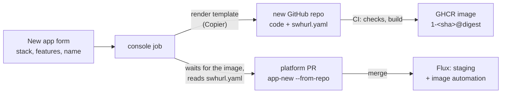
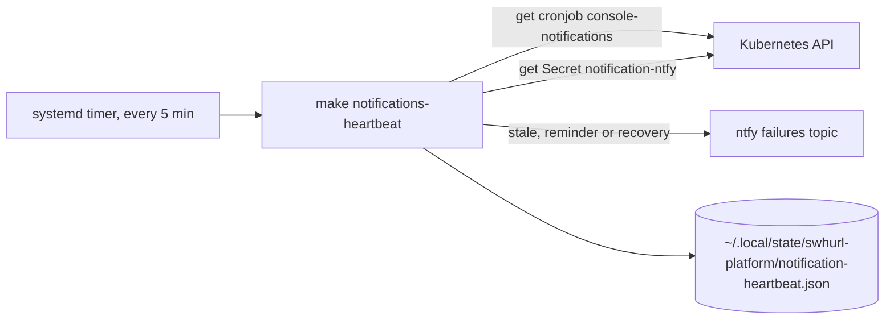

```mermaid
flowchart LR
  source["New app or existing image"] --> staging["Staging deployed and reviewed"]
  staging --> button["Promote to production"]
  button --> pr["PR: create production or update its image"]
  pr --> checks["Validate current PR commit"]
  checks --> merge["Eligible PR merges automatically"]
  merge --> git["Platform main"]
  git --> flux["Flux applies production"]
  flux --> ready["Console shows production Ready"]
```

# Swhurl Platform — plan

Started 27 September 2026 · last tidied 3 October 2026. Older work is summarised with its decisions and commits; what was run live is in [current state](current-state.md), and the earlier full text of this file is in Git history (for example `d4566c9`). Recent work (sections 9, 11 and 12) keeps its full contract.

## 0. Where this paused and what is left

The platform is live. Every deliverable in section 3 is done except PR06's remainder, PR08a's gate and the final operator exercise. Before resuming, pull `main` and run `make check-repo`, `make test` and `make verify-platform`, and re-read the "Not exercised" notes in `docs/current-state.md`.

### Open work

1. **PR06 — GHCR publishing and Renovate** (section 4). Chart update PRs and the console image are done. Left: public or private images for apps (everything is public meanwhile) and which app repository goes first.
2. **PR08a gate** (section 5): restore on a separate machine from S3 using only the docs. Follow-ups: a write-only IAM user for backups instead of `sam`; possibly a Kubernetes CronJob with a published backup image once PR06's GHCR half is done.
3. **Final operator exercise** (section 6), using only the docs.
4. **Operator browser checks:** a real Google-signed-in session for (a) reviewing and submitting a promotion (automated UI proof used the local dev identity) and (b) the live job-output stream, including that Traefik and ForwardAuth do not buffer it ([section 12](#12-live-job-output-on-the-console-deployed-3-october-2026)). Also confirm the console's `GITHUB_TOKEN` is limited to this repository.
5. **Notification gaps** ([contract](services.md#notification-expectations)): live fixture uninstall/rollback and timed unhealthy/recovery delivery exercises; alerts for failed or stale backups, external availability, certificate expiry or renewal failure and disk pressure.
6. **Decision needed — ClickHouse CPU** (delivered item 17): merge write amplification sets the load, not data volume. The lever is `async_insert` or bigger batches in the ClickStack HelmRelease, which trades a few seconds of data on a crash. Unexplained: since HyperDX restarted at 21:44 on 2 October the histogram table merges every new part on its own (about +100 s of merge time an hour). Revert `008c5d5` and `6cdfe3f` (coarser metric intervals, no CPU gain) if the graphs bother you.
7. **App page stack panel** (section 8, phase 8): show the stack, its features and each capability's health (last SQLite backup, later roles).
8. **Optional cleanup** (deleting needs confirmation; repository and package deletion is yours): `samclement/swhurl-try-6` (repository, package, staging and prod instances, retained volumes; restoring those volumes is unexercised, though the same SQLite restore shape has live evidence); retiring `hello` or migrating `hello-ts`.

### Delivered

Numbers are kept because other docs and code comments cite them. Evidence for each is in `docs/current-state.md`.

| # | Done | What, and where documented |
| --- | --- | --- |
| 20 | 3 Oct | Live job output over SSE ([section 12](#12-live-job-output-on-the-console-deployed-3-october-2026)) |
| 19 | 3 Oct | Notification refactors R1–R4 and the host heartbeat H1–H4 ([section 11](#11-notification-boundary-refactors-and-heartbeat-3-october-2026)) |
| 18 | 3 Oct | Predictable deployment and promotion ([section 9](#9-predictable-app-deployment-and-promotion)). Web promotion #34 and private SQLite worker promotions #35–36 passed; duplicate submissions reused PRs; failed gates wrote and merged nothing; both worker databases kept independent claims through an image update |
| 16 | 2 Oct | Automatic app dashboards (`d5c0f87`; [apps](apps.md#dashboards)) |
| 15 | 2 Oct | Structured logs across the cluster (`cf3df0c`, `498310b`; [formats](services.md#structured-logs)); existing streams only, original lines and schema preserved |
| — | 2 Oct | Console correctness (`b3dd939`) and app validation / YAML editing (`6bac215`): validation fails when tools fail; scale, expose and promote keep handwritten YAML ([boundaries](apps.md#operate-an-instance)) |
| 17 | 2 Oct | ClickHouse load and telemetry noise: log noise filtered (`1fa822d`, 26,352 → 8,780 lines/h); HyperDX self-traces sampled at 10% (`4074d6a`, 12,866 → 1,362 spans/h); metric intervals raised (`008c5d5`, `6cdfe3f`; 752,944 → 420,234 rows/h). ClickStack's own scrape of ClickHouse (half the rows) cannot change from Git: the chart's `customConfig` loses to the config HyperDX pushes over OpAMP (`cc8e497`, `e8140d8` reverted). Server CPU did not drop (0.21–0.22 cores); see open work 6 |
| 14 | 2 Oct | Console follow-ups: new-app links wait for the PR (`8e77604`); reserved Secret names (`HOST_IP`, `DATABASE_PATH`, `OTEL_*`, `SWHURL_*`, `KUBERNETES_*`, because `envFrom` loses to the platform's `env`); New app page by scenario; auto-merge of console PRs ([policy](console.md#auto-merge)); `make check-templates`; `make clickstack-dashboards` |
| 13 | 2 Oct | Observability fixes: logs carry `trace_id`/`span_id`, kube-probe spans dropped (34,507 of `hello-ts`'s daily traces), TypeScript resource detectors limited to local ones |
| 12 | 2–3 Oct | New app from a catalogue ([section 8](#8-new-app-from-a-catalogue)), phases 1–7 |
| 11 | 1 Oct | Console redesign: Overview · Apps · Platform · Activity; one state vocabulary (Healthy ✓, Updating ↻, Failing ✕, Suspended ‖); instances named `<app>/<env>`; hashes shortened to 12 characters with the full value on hover; breadcrumbs; "Updated … ↻ Refresh" |
| 10 | 30 Sep | `app-new` presets, the TypeScript template repository, Flux image automation deploying template apps to staging on every push (production through a promote); first app `hello-ts` |
| 9 | 30 Sep | App code starts from a GitHub template repository per language, outside this repo; this repo keeps the cluster wiring (`app-new`, `contract.py`). The manifest injects every cluster-specific value, so app code only follows conventions (OpenTelemetry SDK reading `OTEL_*`, a readiness path, port 8080, non-root user, a publish workflow printing the image digest). Copier was added later (item 12) |
| 8 | 29 Sep | Faster delivery: parallel checks and CI (`4bd61a4`), `cluster-stack` without `wait` plus `swhurl flux-wait` (`9bce4a7`), `flux-install` with a 5 s dependency retry (`33fb42e`), GitHub push webhook (`cfb5daf`), publish run deploying the console (`0503987`). A push reaches Flux in about 2 s, a full `make flux-reconcile` takes about 17 s, a console tooling change deploys about 90 s after the push |
| 7 | 28 Sep | Foundation cleanup in four steps (section 3) |
| 6 | 28 Sep | Operator logic moved from bash to the tested `tools/swhurl` package; short glue and host scripts stay bash ([rule](contributing.md#operator-tooling)) |
| 5 | 28 Sep | Documentation restructure: one canonical page per topic ([map](contributing.md#documentation)); the `document-repo` skill is in `.claude/skills/` |
| 4 | 29 Sep | Console, phases 1–7 ([section 7](#7-console)) |

### Known issues, deliberately not fixed

- **OTel deprecations:** collector 0.161.0 warns that `hostmetrics`, `kubeletstats`, `k8sobjects` and the inline `service.telemetry.resource` map are deprecated. The chart's presets generate all three names, so renaming only ours could duplicate receivers; rename each with a chart version whose preset uses the new name (chart issue #2183). `make check-otel` lists deprecated names on every chart update and fails if a rename leaves a pipeline naming a missing component. The telemetry format warning goes with chart PR #2343.
- **Kotlin telemetry:** the agent's `jvm.memory.*` and `jvm.thread.*` metrics do not reach ClickStack (only `jvm.gc.duration`), so those dashboard panels wait. Log severity is guessed from text (a request log mentioning `traceId` reads as "trace").
- **Not covered by observability:** no backup of telemetry, no alerts on app behaviour (error rates, latency, a stuck worker), and a collector that trusts every pod.
- **Staging and production `hello`** differ only in namespace and host; `make check-apps` fails if they drift further. No per-instance quotas, NetworkPolicies or RBAC.
- **Shared sign-in cookie:** everything under `homelab.swhurl.com` shares it, so public or untrusted apps must use another parent domain (none exist).

### Not yet exercised live

- A fresh bootstrap on a real new host (DNS, router forwarding, Let's Encrypt; the in-cluster sequence was rehearsed on k3d).
- A real credential rotation through Reloader (only dummy-key and disposable rotations ran), and Reloader restarting a generated app.
- A `public` app on a domain outside `homelab.swhurl.com`.
- A rejected sign-in reaching oauth2-proxy's email list (Google refused the test account first).
- Open question: avoiding Let's Encrypt rate limits when rebuilding (back up and restore certificate Secrets, or use `letsencrypt-staging` while iterating); relevant to the fresh bootstrap above.

**Kept out of scope:** a second cluster (EC2), tailnet-only private routes, DNS-01 and wildcard certificates, directory renaming, and Hermes (a separate project needing model-network design and stronger command isolation than a namespace).

## 1. Goal and scope

Make an app instance a small, reviewable definition: image digest, resources, probes, exposure, configuration, secrets and persistence. A generator supplies the namespace, Flux Kustomization, HelmRelease and optional encrypted Secret. Git review and Flux remain the deployment path.

Keep k3s, Flux, packaged Traefik, cert-manager and SOPS/age. Work on `clusters/home/` only, preserving capability boundaries for a possible `clusters/aws/` without building it.

### Completion criteria

- Onboard a second app from an existing image in under 15 minutes (excluding DNS and certificate delays) without hand-written Deployment, Service or Ingress.
- Each app instance has its own namespace and Flux unit; staging and production reconcile independently.
- Image and chart updates are reviewable and pinned. Promote and roll back the same image digest.
- A ClickStack failure does not block an unrelated app update.
- Exposure modes enforce their route and cookie boundaries; only approved identities sign in.
- Secret rotation restarts only the referencing workload without printing the value.
- Suspend, uninstall and data destruction have distinct effects. Restore one stateful workload and the age key from an independent backup.
- One documented command shows desired revision, running image, readiness, address and failure reason.

## 2. Design decisions

| Concern | Home decision | Future extension |
| --- | --- | --- |
| Cluster | `clusters/home/` is the sole entrypoint; independent capability units. | A later `clusters/aws/` may share bases with separate settings and age key. |
| Host | host/, dynamic DNS, NodePorts and router mapping stay home-specific. | Design EC2 bootstrap and Route 53 ownership when that move is committed. |
| App chart | Pinned bjw-s app-template (started at 5.2.1) from a shared HTTP HelmRepository; version pinned per HelmRelease. | A custom chart only if the values and policy model prove inadequate. |
| App isolation | One namespace and one Flux unit per instance, with SOPS decryption on that unit when needed. | Reuse the generator and policy for another cluster. |
| Browser exposure | `private` has no Ingress; `authenticated-web` is for trusted apps under the shared-cookie domain; `public` uses a domain outside that scope. | Private browser routes need a proven tailnet or internal entrypoint; a public IP allowlist is not the default private boundary. |
| TLS | HTTP-01 for public home routes. | Route 53 DNS-01 for private-host certificates; wildcard TLS has a larger key blast radius. |
| Updates | Renovate for chart PRs; Flux image automation for template apps in staging. | No custom cross-repository PR machinery. |
| Data | Retain irreplaceable state on uninstall; destruction is explicit and separate. | Prove a Retain StorageClass and restore before stateful migration. |

A public app on `public.homelab.swhurl.com` is still in the `.homelab.swhurl.com` cookie scope: use a sibling domain such as `public.swhurl.com`. HttpOnly does not stop the destination server receiving the cookie. Browser sign-in establishes identity; each app owns authorization. Machine APIs use token auth, not browser redirects.

## 3. Delivery order and gates

Rule kept: prove restore before deletion, ownership handover or stateful migration. Evidence for each row is in `docs/current-state.md`.

| Order | Deliverable | Outcome |
| --- | --- | --- |
| PR01 | Inventory, validator, CI, documentation | Complete (`2bae8d0`) |
| P0a | Guard destructive teardown/reinstall; correct operator docs | Complete |
| P0b | Age key backed up off-host | Complete: an encrypted USB copy decrypted all three Secrets |
| P0c | Fix verifier and the double-encoded ingestion Secret; restart collectors | Complete 27 Sep: no 401s, fresh logs and metrics in ClickHouse |
| P0d | Restrict sign-in to approved identities | Complete 27 Sep: `sam@swhurl.com` only; a non-approved account was refused |
| PR08a | Independent backup and tested restore | Partial: data classified; encrypted backup and disposable restore proven 27 Sep; live restore, S3 copies and daily timer 29 Sep; **restore on a separate machine pending** |
| PR02a | Retention: telemetry 30d, ClickHouse system logs 7d, backup pruning 7 daily + 4 weekly, MongoDB PV Retain + PVC keep, `local-path-retain` class | Complete 27 Sep |
| PR02b | Lifecycle commands (suspend/resume/destroy-data), `Orphan` shared units, prune protection | Complete 27 Sep; `make live-test-lifecycle` |
| PR03 | Capability split; cert-manager/issuer ordering | Complete 27 Sep: 10 units, 22 resources handed over with no recreation |
| PR07a | Scoped opt-in Reloader for oauth2-proxy and OTel | Complete 28 Sep; manual refresh kept as fallback |
| PR04 | App-template contract, generator, rendered policy | Complete 28 Sep: `make check-apps`, `make live-test-app-template` |
| PR05 | Split and migrate example staging/production | Complete 28 Sep: `hello-staging`/`hello-prod`; routes cut over with seconds of default-cert gap |
| PR07b | App Secret conventions and shared settings | Complete 28 Sep: `make check-secrets` |
| PR06 | GHCR publishing and Renovate | **Open** (section 4) |
| Final | Operator exercise | **Open** (section 6) |

### Foundation cleanup (28 September 2026)

A review of boundaries, technology choices and responsibilities, executed in four steps. Numbers follow the review and are cited by evidence in `current-state.md`.

- **Tooling only:** one contract module, `apps/contract.py` (#2); `platform.py` holds shared paths, names and queries, and `check-config` derives required Secrets from each unit's `decryption` (#3); `check-repo` and the app policy take an injected runner and report every failure (#6); fake-executable tests cover only the `make` interface (#8); `make check-apps` fails when environments differ beyond namespace, hosts, image, replicas, resources and issuer (#9); `help` is generated from `## ` comments, defaults live in Python, `config.env` is deleted (#13); `apps/{contract,new,ops,policy}.py` and `retention.py`, tests split by subject (#19). #4 (split `verify.py` by service) was skipped on purpose: revisit past about 400 lines or with a second cluster.
- **Stale records:** `todo.md` was reviewed and deleted; `current-state.md` starts with current cluster facts.
- **Decisions that change what runs:** `BASE_DOMAIN` in `platform-settings` is the one source of platform hostnames, cookie domain and redirect allowlist (#1; `make test` fails on a literal platform hostname; the ACME email and approved sign-in addresses stay literal on purpose). MinIO was removed (#12; it held no buckets): an emptied unit let Flux uninstall the release and delete its volume, then the unit and references went. Foundation means cluster primitives with no user-facing endpoint; shared services are what apps use or people visit (#5).
- **Names and layout:** verbs `check-*` (offline; `check` runs what CI runs), `test`, `verify-*` (live), `live-test-*` (throwaway cluster) and `backup-mongodb` (#18); this file is `docs/plan.md` and the evidence file `docs/current-state.md` (#20); units are `<area>-<component>` named after their directory, one directory per unit under `infra/`, `platform/`, `apps/`, files `<kind>.yaml` (#14–17): `infra-base`, `infra-cert-manager`, `infra-issuers`, `infra-traefik`, `platform-oauth2-proxy`, `platform-clickstack`, `platform-otel`, `app-<app>-<env>`, with roots `cluster-sources` and `cluster-stack`. Namespaces, HelmReleases, Secrets and hostnames kept their names, so no workload changed. Each rename was a handover: make the old unit `Orphan`, create the replacement, after proving offline that it renders byte-identical objects and live that Helm revisions and pod and volume UIDs are unchanged. **Lesson:** suspending a unit through Git blocked `homelab-flux-stack` for its 20-minute health-check timeout (the suspend commit is a new revision and the unit froze as not Ready), so later stages used `Orphan` instead.
- **Simplification:** Mermaid replaced D2 (no render step); component READMEs folded into `services.md` and `operations.md`; ADRs retired; `make reconcile UNIT=<name>` replaced the four OTel refresh targets; old aliases, `verify`, `teardown` and `reinstall` removed.
- **Judged sound, left alone:** `Runner` and `Report`; the `Orphan`/`MirrorPrune` deletion split and its tests; explicit repetition in Flux unit definitions (guarded by `make test`); host scripts as bash; explicit per-environment app copies.

## 4. PR06 — registry and reviewable updates

First-party images go to GHCR. Each app repo tests, builds, publishes a source-revision-tagged image and prints its digest; package-write credentials are used only when publishing. One digest is promoted between staging and production, and deployed digests are retained for rollback. Build x86-64 for home; add ARM64 when a consumer needs it.

**Decided:** chart updates come from Renovate (live; [operations](operations.md#chart-updates); the first, ClickStack 1.1.2, merged 28 September, and ClickStack 3.x was installed fresh on 29 September). The console image is public on GHCR and pinned by `make console-image` (its tags never move, so Renovate digest PRs were dropped). Template apps deploy to staging by Flux image automation (30 September): one policy per app, staging only, one write key for this repo. Chosen over Renovate digest PRs (Renovate cannot read the HelmRelease's separate `digest` field and would bump both environments at once, so digest updates stay disabled in `renovate.json`) and a cross-repository credential in each app repo. Production stays behind **Promote to production**.

**Still to decide:** public or private app images (private needs read-only pull credentials in consuming namespaces and an uncached-pull test), and which app repository goes first.

## 5. PR08a — independent recovery gate

Data is classified as reconstructible, expendable telemetry or irreplaceable. The k3s datastore is SQLite and reconstructible from Git; MongoDB and app SQLite databases are irreplaceable and backed up daily to S3 (since 29 September; [operations](operations.md#backups-and-recovery)). The age key backup (P0b) is part of the recovery sequence. **Left:** rebuild a clean scope on a separate machine, restore an encrypted Secret and one persistent workload from S3 using only the docs, verify app behaviour, and record dated evidence before any stateful migration.

## 6. Final operator exercise

Using only current docs: onboard a web app and a worker; publish, promote and roll back a digest; diagnose a bad image and probe; rotate a Secret without exposing it; deploy during a ClickStack failure; suspend and resume; uninstall a disposable persistent app with retained state; restore a workload and the age key. Afterwards consider tailnet private browser access, DNS-01, wildcard certificates, a second cluster or directory renaming.

## 7. Console

A web console at `console.homelab.swhurl.com`, behind the shared sign-in, showing app instances, Flux units and cluster health, running reconcile and suspend/resume, and making every other change by opening a PR against this repo. Flux still applies only what is merged. Done 29 September 2026; behaviour is in [console](console.md).

**Decisions** (29 September 2026)

- **Code lives in this repo** (`tools/swhurl/console/`), so tooling and the console that uses it are tested together; the image is published from here.
- **Reads use the image's own code; writes use the clone's CLI.** Status, units and health import `swhurl` from the image and read the cluster. A write downloads `main` through GitHub's API, runs `python -m swhurl app-new …` and `check-apps` inside that tree, commits to a new `console/*` branch through the API and opens a PR, so every change is generated by the rules CI checks it with. The only cross-version interface is `app-new`'s flags.
- **A platform unit, not an app:** `platform-console` needs a service-account token and RBAC, which the app policy forbids. Read access excludes Secrets and `pods/exec`; the only cluster writes are the reconcile annotation and `spec.suspend` (RBAC grants `patch`; the code limits the fields and refuses `cluster-sources`, `cluster-stack` and `destroy-data`). A NetworkPolicy admits only Traefik, so the sign-in header cannot be forged from inside the cluster.
- **GitHub access: a fine-grained personal token** (this repo; Contents and Pull requests read/write) in SOPS, sent only in the `Authorization` header and redacted. Chosen over a GitHub App for simplicity. PRs appear as the operator, marked by the `console/` branch, a `[console]` title and a `Requested-by:` trailer. `verify-platform` warns 14 days before expiry. `main` stays unprotected (the commit-to-`main` loop is unchanged); a test ensures the console creates only `console/*` branches.
- **Image: public on GHCR**, pinned by `src-<hash of inputs>` tag and digest.
- `verify-platform` checks are labelled by what they need (`cluster`, `secret`, `exec`, `host`); the console runs only the `cluster` ones and links to HyperDX for host timer logs.

**Phases** (commits): 1 tooling split and `Runner.stream()` (`e180ff2`); 2 read-only local console, `make console-dev` (`884f050`); 3 image and GHCR publishing (`b63d2af`); 4 deployed read-only, with a forged header from a throwaway pod blocked and `kubectl auth can-i` denying Secrets, exec and patch (`79c07f3`, fix `edd4f44`); 5 reconcile and suspend/resume with audit lines (`bf63344`); 6 new-app PRs (`9364c77`; Reloader for `console` was added here, when it first had a Secret); 7 promote, scale and uninstall PRs and `make console-image` (`0acb567`, `af2b11d`).

**Out of scope:** `destroy-data`, Secret values, credential rotation, `flux-system` root units, host timers, triggering live tests, users other than the operator.

## 8. New app from a catalogue

Agreed 2 October 2026; phases 1–7 done by 3 October. On the console's **New app** page you choose a language and framework, tick features and give a name. The console creates the app's GitHub repository with working code, waits for the first image and opens the platform PR. After you merge it the app runs in staging, and every push to its `main` deploys there.

Example: *TypeScript · features: SQLite* named `notes` produces the repository `samclement/notes`, the image `ghcr.io/samclement/notes:1-<sha>` and a PR `[console] new app notes/staging`, serving `staging-notes.homelab.swhurl.com` once merged.



**Concepts.** A *stack* is one template repository per language and framework (`swhurl-app-template-typescript`, `swhurl-app-template-kotlin`) holding the conventions every app follows (port 8080, `/healthz`, UID 65532, writes only to `/tmp`, OpenTelemetry SDK, the shared publish workflow). A *feature* is optional code in a stack (SQLite with migrations, a worker loop instead of an HTTP server), rendered only when ticked; a feature the cluster must also provide declares it in `swhurl.yaml`. `swhurl.yaml` is the app's contract with the platform (`kind`, `database`, `secrets`, `telemetry`, resource defaults, `stack`, optional `startupSeconds`), read by `app-new --from-repo`, so a stack's needs live in the stack, not the console. A *capability* is the platform side of a feature; `sqlite` is the first, and splitting each into its own module waits for one that needs more than generator defaults.

**Decisions** (2 October 2026)

1. **Copier renders a stack's features**: one template repository per stack, features as questions, and each app commits `.copier-answers.yml` so `copier update` brings later template changes. Rejected: a repository per combination (they multiply), GitHub's **Use this template** plus our own patches (a second template system), a generator in `tools/swhurl` (language-specific code here, ruled out by delivered item 9). Cost: the console image gains `copier` and `git`, and each template's CI renders every feature combination.
2. **A second token creates repositories** (`APP_REPOS_TOKEN`): fine-grained, all repositories, Administration, Contents and Workflows read/write plus Actions read. Held only by the console, separate from the first token. Such a token could delete any repository, so the code may only create a new repository, push its first commit to one it just created, and read runs (tested like the `console/*` rule). `verify-platform` warns before expiry. Rejected: a GitHub organisation with a GitHub App (images, Renovate and the template would all move) and creating the repository by hand (New app would not be complete).
3. **The second stack is Kotlin on Micronaut on the JVM** with a small image: a `jlink` runtime on `distroless/cc`, size reported in CI, no GraalVM native image.

**Deferred:** sign-in roles in apps and shared libraries. Traefik already passes `X-Auth-Request-Email` (`platform/oauth2-proxy/middleware.yaml`), but an app can trust it only once its namespace has a NetworkPolicy admitting just Traefik.

**Phases**

1. SQLite capability finished: `make restore-sqlite`, `make live-test-restore-sqlite`; backups record plaintext size and SHA-256.
2. `swhurl.yaml` contract (version 1, `contract.py`) and `app-new --from-repo OWNER/REPO[@REF]` / `--manifest PATH`; `hello-ts` regenerates byte-identical from it.
3. TypeScript stack on Copier; `make app-repo NAME= STACK=` (Python, through `Runner`, using your `gh` login) renders, creates the public repository, pushes, waits for the first publish run and prints the image and digest.
4. New app creates the repository: the **New app and repository** tab renders with Copier, creates the repository through the API (writes only to one created in the same job), waits for the first build and opens the PR. The preset tabs stay for existing images (production, or a retry after a failed first build).
5. Features: Copier questions `kind` (web, worker) and `database` (none, sqlite on `node:sqlite` with migrations at startup); the console and `make app-repo ANSWERS=` read the questions from the template's `copier.yml`, so a stack's features need no platform code.
6. Kotlin Micronaut stack with the same questions; Java 25, about 150 MB, the OpenTelemetry agent. `-XX:TieredStopAtLevel=1` cut start-up from 50 s to 16 s on half a CPU, and `startupSeconds` writes a startup probe so liveness waits for a slow starter. The first Kotlin build takes about 6.5 of the job's 10 minutes.
7. Template updates (3 October): native Renovate Copier PRs from versioned releases; independent app edits are preserved, overlapping edits give conflict markers, app checks pass before main publication; workflow versions are pinned ([template updates](apps.md#template-updates)).
8. **Open:** the app page shows the stack, its features and each capability's health.

**Out of scope:** private repositories and images (PR06), databases other than SQLite, roles and shared libraries, an app's own OIDC login, deleting or archiving the repository on **Uninstall** (you delete it on GitHub), direct production creation (section 9), a `kind: App` operator, a third stack, users other than you.

## 9. Predictable app deployment and promotion

Approved 3 October 2026 and implemented (phases 1–5) with live proof; evidence: [current state](current-state.md#successful-reviewed-promotion-and-fixed-template-checks-3-october-2026).

### Operator experience

For example, `weather-api` deploys automatically to staging. Open its staging page, try the app, then press **Promote to production**. The confirmation shows the exact image, the production address and whether this creates production or updates it. The platform opens a PR, merges it when checks pass, and shows production becoming Ready. The next staging image uses the same button.

Both **Start a new app** and **Deploy an existing image** create staging only: `app-new --env prod` is refused, and `app-promote` always means staging → production. Existing production instances remain supported; production-only apps need staging before promotion. Direct Git edits remain a reviewed route for custom deployments, but promotion provenance is not enforced against manual commits.



### Design choice

The deployment generator and app policy serve standard web apps and workers whatever the language or origin of the image; app-code templates are optional; custom deployment files remain a reviewed route for shapes the generator cannot express; shared infrastructure keeps its Flux units. Assumed: a single operator, public app images, existing GitHub credentials. No new controller, credential or cluster service.

| Approach | Predictability | Cost |
| --- | --- | --- |
| Fetch the app repository's latest `swhurl.yaml` for first promotion | Familiar, but defaults can differ from reviewed staging and some images have no source manifest | Small; needs source discovery, pinning and a second route for existing images |
| **Derive first production from validated staging files (chosen)** | Uses the settings actually reviewed; works for template apps and existing images | An environment-conversion layer with clear refusals for unsupported shapes |
| Store an app definition and regenerate both environments | One source for creation, editing and promotion | Larger migration; must resolve manual edits and per-environment overrides |

Git deployment files stay authoritative, with no second stored definition. Revisit a stored definition if repeated read/edit/generate conversions become the main maintenance cost.

### Operating rules

- **Supported shape:** one main controller and container; standard generator web or private worker deployments; compatible handwritten resources, probes, security, command and telemetry; platform routing and persistence; app Secret references. Extra controllers, sidecars, resources, external volume bindings and ambiguous YAML anchors are refused with an explanation. Later image-only promotions need only an unambiguous main image field and passing policy.
- **Configuration:** first promotion keeps reviewed staging runtime settings and resources and generates production routing and independent storage. Later promotions change only the image; other production changes are explicit Git edits. Conversion maps namespace and environment labels, generated hosts and environment-specific references by meaning, not by text replacement, and removes staging image automation from production.
- **Setup:** a distinct production public host and production Secret setup are collected on first promotion; those PRs stay manual. Staging credentials, data and PV bindings are never copied. First production gets its own retained volume and empty database (migrations run at normal startup); secret stubs are encrypted for the destination and need manual review, including Reloader registration; private workers need no route; a custom public hostname must be given explicitly.
- **Pending PR:** its reviewed image is frozen, so new staging builds do not invalidate it. Relevant destination or configuration changes need fresh review; first-production source changes beyond the image need regeneration. Unrelated `main` changes continue after validating the updated merge result. Relevant generator, policy, chart or platform setting changes require regeneration or revalidation before eligibility returns.
- **Merge control:** eligible promotions merge automatically after Validate passes on the current head (eligibility is checked from the actual diff) unless **Hold for manual review** was chosen before submission. **Hold PR** removes `auto-merge`; resuming rechecks eligibility. A merge already accepted cannot be stopped by removing the label. The merge workflow's branch, repository, file and head checks stay, and it is not widened to infrastructure. Encrypted-file changes or required setup keep a PR manual.
- **Rollback:** an older staging image may be promoted and is labelled a rollback when ordering is known. It does not reverse database migrations.
- **State recovery:** duplicate clicks, an open PR, a merge conflict and a console restart recover from GitHub and Flux, not in-memory jobs. Target existence is decided from the downloaded Git tree, and a refusal writes no partial instance and opens no PR.

### Behaviour by scenario

| Situation | Console action and result |
| --- | --- |
| Healthy, digest-pinned staging; no production | **Promote to production** creates production from reviewed staging settings |
| Healthy staging; production has a different digest | The same button updates production's image, preserving its settings |
| Both environments have the same digest | **Same image in both**; no promotion needed |
| Staging tag changes but the digest stays the same | Same deployed image; no redundant rollout |
| Production has a newer build number, or tags cannot be ordered | Same promotion when digests differ; the confirmation says rollback when ordering is known, otherwise shows both images |
| Staging unhealthy, suspended, unpinned or still applying Git | Shows why promotion is unavailable and what to do |
| Production still reconciling a previous promotion | Shows deployment progress; no second promotion of the same image |
| A promotion PR is already open | Links to it; repeated clicks reuse it; a different reviewed image needs an explicit replacement |
| Production in Git but absent from the cluster | Treated as pending or failed; never regenerated from live absence |
| Production without staging | Shown normally; promotion explains it needs staging |
| First production needs secrets or a custom host | Collects or links the setup, keeps the reviewed image, explains why auto-merge waits |

The per-click auto-merge opt-in checkbox was removed. A created PR is never reported as a completed deployment; CI failure, conflict or missing setup leaves the PR visible with its reason, and Activity and app pages distinguish creating PR, checks running, awaiting setup or review, merging, deploying, Ready and failed.

### Delivered phases

1. **Shared model:** `tools/swhurl/apps/` modules for reading instance configuration, deciding the promotion outcome and preparing Git edits, shared by the CLI and console, whose templates render a view model. Table-driven tests cover legacy nginx, template web and worker apps, SQLite, secret references and unsupported YAML.
2. **First promotion and image updates** (`3455292`, console pin `6aa39a6`): `app-new` creates staging only; `app-promote` creates or updates production.
3. **One button and auto-merge:** production selection removed from creation forms and forged submissions refused; live promotions #34–36.
4. **Reproducible checks and bounded test cost:** catalogue templates pinned to explicit revisions used for questions, rendering and contract checks (changing a pin is reviewable); platform checks free of language builds; exhaustive platform rendering (`make check-templates`) while cheap; template CI runs defaults, each non-default choice alone and all enabled, with targeted interactions; SQLite tests show writes, migrations and persistence; a passing sample does not claim every combination was tested. A third stack needs catalogue entries, its own template and build checks and conformance evidence, with no language build dependencies in platform tooling.
5. **Template updates** (section 8, phase 7). `hello` stays as the existing-image example and nginx fixtures as a compatibility case; if `hello` is retired, audit storage, links, probes and fixtures first and ask before uninstalling live namespaces. `hello-ts` is not migrated merely because it predates Copier.

**Proof conventions:** browser proof needs a real signed-in session (hand-set identity headers do not prove sign-in); throwaway repositories are named `swhurl-try-<n>` and listed for the operator to delete; the confirm-first actions in `AGENTS.md` apply. `swhurl-try-6` (a TypeScript private worker with SQLite, one event a minute with no TTL, a separate retained 1Gi claim per environment) proved first production, an image update and independent databases; its removal is open work 8.

**Not prerequisites:** a new language, a general app controller, new databases, cluster infrastructure through the app generator, deleting live apps.

## 10. References

- [Flux pruning and deletion](https://fluxcd.io/flux/components/kustomize/kustomizations/)
- [Flux HelmChart reconcile strategies](https://fluxcd.io/flux/components/source/helmcharts/)
- [bjw-s app-template values reference](https://bjw-s-labs.github.io/helm-charts/docs/app-template/reference/)
- [Renovate Flux manager](https://docs.renovatebot.com/modules/manager/flux/)
- [Stakater Reloader](https://github.com/stakater/Reloader/blob/master/README.md)
- [oauth2-proxy provider configuration](https://oauth2-proxy.github.io/oauth2-proxy/7.6.x/configuration/providers/)
- [Cookie Domain scope, RFC 6265](https://www.rfc-editor.org/rfc/rfc6265)
- [cert-manager Route53 DNS-01](https://cert-manager.io/docs/configuration/acme/dns01/route53/)

## 11. Notification boundary refactors and heartbeat (3 October 2026)

Follow-ups from the review of the notification commits (`10d8bac`..`3810e4c`). All tasks are done; behaviour is in [services](services.md#alerts) and [operations](operations.md#notification-checker-heartbeat), evidence in [current state](current-state.md#notification-boundaries-and-heartbeat-3-october-2026).

### Decisions (approved by the operator, 3 October 2026)

| Topic | Decision | Reason |
| --- | --- | --- |
| Who notifies about what | The checker owns app and console lifecycle and health. Flux's `failures` Alert owns infrastructure units and sources. ClickStack rules own app-specific signals. No event is sent by two of them. | Duplicate incident messages were the reason the app Alerts were removed. |
| Failure Alert sources | Selected by label `platform.swhurl.com/alert: failures` on each infrastructure/platform Flux unit, not by a list in `alerts.yaml`. App units and `platform-console` are never labelled. | A new unit is covered where it is defined; new apps are excluded by default. |
| Checker placement | Stays in the `platform-console` HelmRelease and shares the console image. | Moving it would not remove the image coupling and risks losing incident state. |
| Checker self-monitoring | An independent host timer, the **heartbeat**, watches the CronJob and sends to the failures ntfy topic. | It still runs when the console image, the publish pipeline or the in-cluster scheduler is broken. |
| ntfy destinations | Stay in two Secrets (Flux provider, checker), kept equal by `make check-secrets`. The heartbeat reads the checker's Secret at run time and keeps no copy. | Merging the Secrets is a separate decision; a third copy is avoided. |

### Delivered tasks

- **R1** docs record the console-image coupling and the two ntfy Secrets.
- **R2** (`c695daa`) split `notifications.py` into a package: `state.py`, `evaluate.py` and `delivery.py`, with `__init__.py` keeping `check` and `main`. Code was moved, not rewritten, and every test stayed unchanged.
- **R3** (`61346e6`) drives the ntfy destination checks in `secrets_check.py` from one `NTFY_DESTINATIONS` table and a `destination_hash` helper (query and fragment removed before hashing).
- **R4** (`953bfcd`, evidence `cb0afea`) replaced the 14 explicit `kind: Kustomization` Alert sources with one `matchLabels` selector and labelled the units in `infra.yaml`, `platform.yaml` and the root `flux-system/kustomizations.yaml` (applied with `make flux-bootstrap`); a wiring test fails if `platform-console` or any app unit carries the label.
- **H1–H4** (`862b360`, `d809189`, `700e065`, evidence `d6b8075`): the command, the host timer, installation and exercise, and the `verify-platform` host check. Lesson from H3: the service first failed because systemd's fixed PATH omitted this host's `~/.local/bin/uv`; the template was fixed and `make host-heartbeat` reinstalled. The operator confirmed receipt of both the stale and recovery notifications.

### Heartbeat design



- **Stale** means the CronJob is missing, suspended, or `status.lastSuccessfulTime` is older than 10 minutes (`verify-platform` uses 5; the longer limit avoids two messages for one blip). The pure function `heartbeat_action(cronjob, state, now, max_age)` returns `none`, `alert`, `remind` (hourly while stale) or `recover`; recovery is sent only if an alert was sent.
- **Messages:** `notification checker stale` (high priority) with the reason and `make verify-platform`; `notification checker recovered` (normal). No Secret values.
- **State:** `{"alerting_since": <epoch or null>, "last_alert": <epoch or null>}`; losing the file repeats at most one alert.
- **Cluster unreachable:** log `cannot read notification checker`, leave state unchanged, exit 1; no alert is possible.
- **Credentials:** `NTFY_FAILURES_URL` is read from `console/notification-ntfy` as JSON, decoded in memory, registered with `runner.add_secret` and never logged; sending reuses the checker's validated `delivery.publish`.
- **Schedule:** timer `OnBootSec=5min`, `OnUnitActiveSec=5min`, `AccuracySec=1s`; the log is `/var/log/swhurl-platform/swhurl-notification-heartbeat.log` (5 MiB rotation, read by the OTel DaemonSet). `verify-platform` requires the timer active and a successful service run within 15 minutes.
- **Limits** (also in services.md): it cannot report when the node or the Kubernetes API is down; a checker failure silences the console's own lifecycle messages for up to 10 minutes plus one five-minute timer interval and one second.

One commit per boundary for future notification work: checker code, alert wiring, app-tooling cleanup, docs. Write the contract before implementing; record live evidence only for what is deployed.

## 12. Live job output on the console (deployed 3 October 2026)

The job page (`/jobs/<id>`) streams output with Server-Sent Events (SSE) while a job runs; without JavaScript it reloads every 2 seconds. Scope is the job page only: the pending-app page (10 s meta refresh) and the cluster pages are unchanged. User-facing behaviour is in [console](console.md); this section keeps the design and contract.

### Decisions

| Topic | Decision | Reason |
| --- | --- | --- |
| Transport | SSE (`EventSource`) over a plain GET | Data flows one way; the browser reconnects and resumes by itself; no new dependency; passes oauth2-proxy ForwardAuth as an ordinary GET. WebSocket (two-way channel nobody needs), htmx (new dependency) and `fetch` polling (still a poll) were not chosen |
| Producer side | `actions.py` is unchanged; the stream reads `job.lines` and `job.finished` every `STREAM_POLL` with `asyncio.sleep` | `job.lines.append` is called from `actions.py`, `changes.py`, `repos.py` and `server.py`, so a notify hook would touch all of them; an async sleep holds no thread per open page |
| End of stream | `job.finished is not None`, read before the lines | `Jobs._run` sets it after the final state and lines, so nothing is missed |
| After the end | The client updates the state mark, finish time and PR link from `done`, then closes the stream | Keeps scroll and text selection without duplicating page rendering |
| Line rendering | The server escapes each line with `short_hashes` and sends HTML; the client uses `insertAdjacentHTML` | Same output as the first render; safe because `short_hashes` escapes first |

### Contract: `GET /jobs/{id:int}/events`

- Auth is the `RequireIdentity` middleware (a GET needs no Origin check). An unknown job gets `404` as `text/plain`, so `EventSource` fails instead of retrying forever.
- Success is `200` with `Content-Type: text/event-stream; charset=utf-8`, `Cache-Control: no-cache` and `X-Accel-Buffering: no`.
- **Start position** is the number of lines the client already has: `Last-Event-ID` if present (a non-negative integer, else `0`), otherwise the `after` query parameter (invalid or absent means `0`), clamped to `len(job.lines)`.
- **Events** end with a blank line; `data` is one line of JSON so a line containing `\n` cannot break the framing:

```
id: 3
event: line
data: {"html": "[INFO] reconciling <span class=\"hash\" title=\"…\">1edf37052ebd…</span>"}

event: done
data: {"state": "succeeded", "finished": "12:34:56", "link": ""}

: keep-alive
```

- `id` is the number of lines delivered so far, so `Last-Event-ID: 3` resumes at line 4. `done` is last and carries `state` (`succeeded` or `failed`), the `finished` time and the optional final PR `link`; the stream then ends. `: keep-alive` is sent after `KEEPALIVE` seconds with nothing to send.
- `STREAM_POLL = 0.25` and `KEEPALIVE = 15.0` are module constants in `server.py`; tests patch them.
- Each loop reads `finished` before `job.lines[sent:]`; do not reorder them. Starlette cancels the generator on disconnect, so `CancelledError` is not caught.
- The page ([`job.html`](../tools/swhurl/console/templates/job.html)) opens `EventSource('/jobs/<id>/events?after=<lines rendered>')` only for a running job and removes the `waiting for output…` placeholder on the first line. On `done` it updates the status mark, state, finish time and optional PR link in place and closes the stream without reloading. EventSource reconnects automatically after a transient error. A `<noscript>` meta refresh keeps the old behaviour.

### Status

Route, page, tests (`06f552a`, final-state update `62fd518`) and docs are done; deployment and cluster evidence are in [current-state.md](current-state.md). **Open:** confirm in a signed-in browser that lines arrive one by one (a burst at the end would point at Traefik or ForwardAuth response buffering), scroll and selection are kept, the final status and finish time update without a reload, a finished job opens without a stream, and a mid-job reload resumes without duplicate lines. Then append the result to `current-state.md`.

Out of scope: live updates on cluster pages (needs a Kubernetes watch), the pending-app page, streaming across console replicas or restarts, and a notify hook in `actions.py`.
