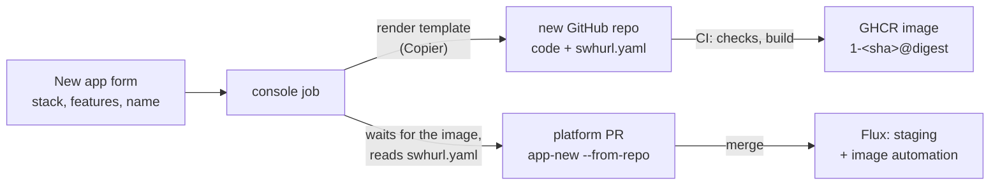
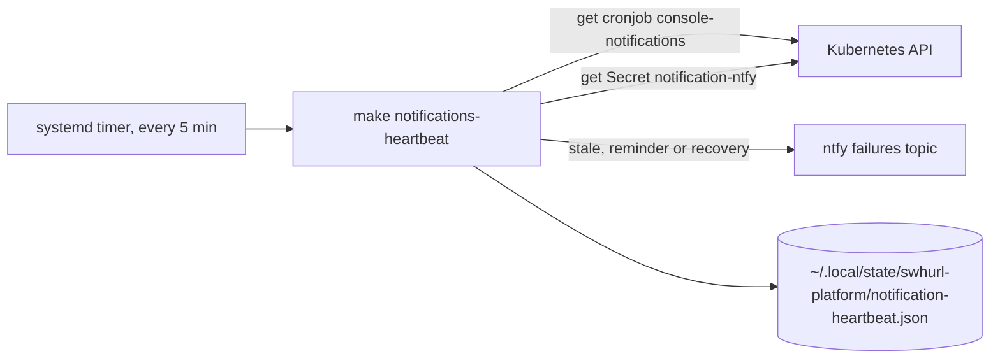
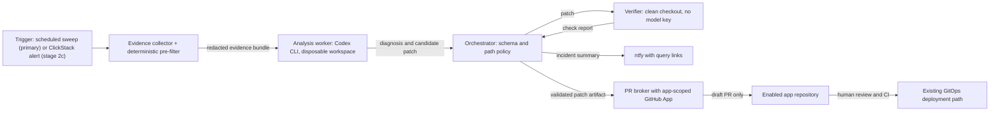

```mermaid
flowchart LR
  source["New app or existing image"] --> staging["Staging deployed and reviewed"]
  staging --> button["Promote to production"]
  button --> pr["PR: create production or update its image"]
  pr --> checks["Validate current PR commit"]
  checks --> merge["Eligible PR merges automatically"]
  merge --> git["Platform main"]
  git --> flux["Flux applies production"]
  flux --> ready["Console shows production Ready"]
```

# Swhurl Platform — plan

Started 27 September 2026 · last tidied 5 October 2026. Older work is summarised with its decisions and commits; what was run live is in [current state](current-state.md), and the earlier full text of this file is in Git history (for example `d4566c9`). Recent work (sections 9, 11, 12 and 14) keeps its full contract.

## 0. Where this paused and what is left

The platform is live. Every deliverable in section 3 is done except PR06's remainder, PR08a's gate and the final operator exercise. Before resuming, pull `main` and run `make check-repo`, `make test` and `make verify-platform`, and re-read the "Not exercised" notes in `docs/current-state.md`.

### Open work

1. **PR06 — GHCR publishing and Renovate** (section 4). Chart update PRs and the console image are done. Left: public or private images for apps (everything is public meanwhile) and which app repository goes first.
2. **PR08a gate** (section 5; drill plan in [section 13](#13-recovery-drill-pr08a-gate-and-fresh-bootstrap--designed-3-october-2026-not-started)): restore on a separate machine from S3 using only the docs. Follow-ups: a write-only IAM user for backups instead of `sam`; possibly a Kubernetes CronJob with a published backup image once PR06's GHCR half is done.
3. **Final operator exercise** (section 6), using only the docs.
4. **Operator browser checks:** a real Google-signed-in session for (a) reviewing and submitting a promotion (automated UI proof used the local dev identity) and (b) the live job-output stream, including that Traefik and ForwardAuth do not buffer it ([section 12](#12-live-job-output-on-the-console-deployed-3-october-2026)). Also confirm the console's `GITHUB_TOKEN` is limited to this repository.
5. **Notification gaps** ([contract](services.md#notification-expectations)): live fixture uninstall/rollback and timed unhealthy/recovery delivery exercises; alerts for failed or stale backups, external availability, certificate expiry or renewal failure and disk pressure.
6. **Decision needed — ClickHouse CPU** (delivered item 17): merge write amplification sets the load, not data volume. The lever is `async_insert` or bigger batches in the ClickStack HelmRelease, which trades a few seconds of data on a crash. Unexplained: since HyperDX restarted at 21:44 on 2 October the histogram table merges every new part on its own (about +100 s of merge time an hour). Revert `008c5d5` and `6cdfe3f` (coarser metric intervals, no CPU gain) if the graphs bother you.
7. **App page stack panel** (section 8, phase 8): show the stack, its features and each capability's health (last SQLite backup, later roles).
8. **Optional cleanup** (deleting needs confirmation; repository and package deletion is yours): `samclement/swhurl-try-6` (repository, package, staging and prod instances, retained volumes; restoring those volumes is unexercised, though the same SQLite restore shape has live evidence); retiring `hello` or migrating `hello-ts`.
9. **AI incident review and fix PRs** ([section 14](#14-ai-incident-review-and-fix-prs--in-progress-stage-2a-planning-5-october-2026); Stage 0 provider, pilot data, spend and retention choices approved; offline Stage 1 is complete; state-store selection and credential provisioning remain gated): scheduled sweep (primary trigger) of allowlisted apps with a deterministic pre-filter, AI diagnosis only when the pre-filter fires, evidence-backed notifications, and draft PRs from an isolated Codex CLI worker. ClickStack alerts become a faster trigger later, after sweep findings show which rules are missing; the sweep stays as the backstop. Human review and merge remain required.

### Delivered

Numbers are kept because other docs and code comments cite them. Evidence for each is in `docs/current-state.md`.

| # | Done | What, and where documented |
| --- | --- | --- |
| 20 | 3 Oct | Live job output over SSE ([section 12](#12-live-job-output-on-the-console-deployed-3-october-2026)) |
| 19 | 3 Oct | Notification refactors R1–R4 and the host heartbeat H1–H4 ([section 11](#11-notification-boundary-refactors-and-heartbeat-3-october-2026)) |
| 18 | 3 Oct | Predictable deployment and promotion ([section 9](#9-predictable-app-deployment-and-promotion)). Web promotion #34 and private SQLite worker promotions #35–36 passed; duplicate submissions reused PRs; failed gates wrote and merged nothing; both worker databases kept independent claims through an image update |
| 16 | 2 Oct | Automatic app dashboards (`d5c0f87`; [apps](apps.md#dashboards)) |
| 15 | 2 Oct | Structured logs across the cluster (`cf3df0c`, `498310b`; [formats](services.md#structured-logs)); existing streams only, original lines and schema preserved |
| — | 2 Oct | Console correctness (`b3dd939`) and app validation / YAML editing (`6bac215`): validation fails when tools fail; scale, expose and promote keep handwritten YAML ([boundaries](apps.md#operate-an-instance)) |
| 17 | 2 Oct | ClickHouse load and telemetry noise: log noise filtered (`1fa822d`, 26,352 → 8,780 lines/h); HyperDX self-traces sampled at 10% (`4074d6a`, 12,866 → 1,362 spans/h); metric intervals raised (`008c5d5`, `6cdfe3f`; 752,944 → 420,234 rows/h). ClickStack's own scrape of ClickHouse (half the rows) cannot change from Git: the chart's `customConfig` loses to the config HyperDX pushes over OpAMP (`cc8e497`, `e8140d8` reverted). Server CPU did not drop (0.21–0.22 cores); see open work 6 |
| 14 | 2 Oct | Console follow-ups: new-app links wait for the PR (`8e77604`); reserved Secret names (`HOST_IP`, `DATABASE_PATH`, `OTEL_*`, `SWHURL_*`, `KUBERNETES_*`, because `envFrom` loses to the platform's `env`); New app page by scenario; auto-merge of console PRs ([policy](console.md#auto-merge)); `make check-templates`; `make clickstack-dashboards` |
| 13 | 2 Oct | Observability fixes: logs carry `trace_id`/`span_id`, kube-probe spans dropped (34,507 of `hello-ts`'s daily traces), TypeScript resource detectors limited to local ones |
| 12 | 2–3 Oct | New app from a catalogue ([section 8](#8-new-app-from-a-catalogue)), phases 1–7 |
| 11 | 1 Oct | Console redesign: Overview · Apps · Platform · Activity; one state vocabulary (Healthy ✓, Updating ↻, Failing ✕, Suspended ‖); instances named `<app>/<env>`; hashes shortened to 12 characters with the full value on hover; breadcrumbs; "Updated … ↻ Refresh" |
| 10 | 30 Sep | `app-new` presets, the TypeScript template repository, Flux image automation deploying template apps to staging on every push (production through a promote); first app `hello-ts` |
| 9 | 30 Sep | App code starts from a GitHub template repository per language, outside this repo; this repo keeps the cluster wiring (`app-new`, `contract.py`). The manifest injects every cluster-specific value, so app code only follows conventions (OpenTelemetry SDK reading `OTEL_*`, a readiness path, port 8080, non-root user, a publish workflow printing the image digest). Copier was added later (item 12) |
| 8 | 29 Sep | Faster delivery: parallel checks and CI (`4bd61a4`), `cluster-stack` without `wait` plus `swhurl flux-wait` (`9bce4a7`), `flux-install` with a 5 s dependency retry (`33fb42e`), GitHub push webhook (`cfb5daf`), publish run deploying the console (`0503987`). A push reaches Flux in about 2 s, a full `make flux-reconcile` takes about 17 s, a console tooling change deploys about 90 s after the push |
| 7 | 28 Sep | Foundation cleanup in four steps (section 3) |
| 6 | 28 Sep | Operator logic moved from bash to the tested `tools/swhurl` package; short glue and host scripts stay bash ([rule](contributing.md#operator-tooling)) |
| 5 | 28 Sep | Documentation restructure: one canonical page per topic ([map](contributing.md#documentation)); the `document-repo` skill is in `.claude/skills/` |
| 4 | 29 Sep | Console, phases 1–7 ([section 7](#7-console)) |

### Known issues, deliberately not fixed

- **OTel deprecations:** collector 0.161.0 warns that `hostmetrics`, `kubeletstats`, `k8sobjects` and the inline `service.telemetry.resource` map are deprecated. The chart's presets generate all three names, so renaming only ours could duplicate receivers; rename each with a chart version whose preset uses the new name (chart issue #2183). `make check-otel` lists deprecated names on every chart update and fails if a rename leaves a pipeline naming a missing component. The telemetry format warning goes with chart PR #2343.
- **Kotlin telemetry:** the agent's `jvm.memory.*` and `jvm.thread.*` metrics do not reach ClickStack (only `jvm.gc.duration`), so those dashboard panels wait. Log severity is guessed from text (a request log mentioning `traceId` reads as "trace").
- **Not covered by observability:** no backup of telemetry, no alerts on app behaviour (error rates, latency, a stuck worker), and a collector that trusts every pod.
- **Staging and production `hello`** differ only in namespace and host; `make check-apps` fails if they drift further. No per-instance quotas, NetworkPolicies or RBAC.
- **Shared sign-in cookie:** everything under `homelab.swhurl.com` shares it, so public or untrusted apps must use another parent domain (none exist).

### Not yet exercised live

- A fresh bootstrap on a real new host (DNS, router forwarding, Let's Encrypt; the in-cluster sequence was rehearsed on k3d).
- A real credential rotation through Reloader (only dummy-key and disposable rotations ran), and Reloader restarting a generated app.
- A `public` app on a domain outside `homelab.swhurl.com`.
- A rejected sign-in reaching oauth2-proxy's email list (Google refused the test account first).
- Open question: avoiding Let's Encrypt rate limits when rebuilding (back up and restore certificate Secrets, or use `letsencrypt-staging` while iterating); relevant to the fresh bootstrap above.

**Kept out of scope:** a second cluster (EC2), tailnet-only private routes, DNS-01 and wildcard certificates, directory renaming, and Hermes (a separate project needing model-network design and stronger command isolation than a namespace).

## 1. Goal and scope

Make an app instance a small, reviewable definition: image digest, resources, probes, exposure, configuration, secrets and persistence. A generator supplies the namespace, Flux Kustomization, HelmRelease and optional encrypted Secret. Git review and Flux remain the deployment path.

Keep k3s, Flux, packaged Traefik, cert-manager and SOPS/age. Work on `clusters/home/` only, preserving capability boundaries for a possible `clusters/aws/` without building it.

### Completion criteria

- Onboard a second app from an existing image in under 15 minutes (excluding DNS and certificate delays) without hand-written Deployment, Service or Ingress.
- Each app instance has its own namespace and Flux unit; staging and production reconcile independently.
- Image and chart updates are reviewable and pinned. Promote and roll back the same image digest.
- A ClickStack failure does not block an unrelated app update.
- Exposure modes enforce their route and cookie boundaries; only approved identities sign in.
- Secret rotation restarts only the referencing workload without printing the value.
- Suspend, uninstall and data destruction have distinct effects. Restore one stateful workload and the age key from an independent backup.
- One documented command shows desired revision, running image, readiness, address and failure reason.

## 2. Design decisions

| Concern | Home decision | Future extension |
| --- | --- | --- |
| Cluster | `clusters/home/` is the sole entrypoint; independent capability units. | A later `clusters/aws/` may share bases with separate settings and age key. |
| Host | host/, dynamic DNS, NodePorts and router mapping stay home-specific. | Design EC2 bootstrap and Route 53 ownership when that move is committed. |
| App chart | Pinned bjw-s app-template (started at 5.2.1) from a shared HTTP HelmRepository; version pinned per HelmRelease. | A custom chart only if the values and policy model prove inadequate. |
| App isolation | One namespace and one Flux unit per instance, with SOPS decryption on that unit when needed. | Reuse the generator and policy for another cluster. |
| Browser exposure | `private` has no Ingress; `authenticated-web` is for trusted apps under the shared-cookie domain; `public` uses a domain outside that scope. | Private browser routes need a proven tailnet or internal entrypoint; a public IP allowlist is not the default private boundary. |
| TLS | HTTP-01 for public home routes. | Route 53 DNS-01 for private-host certificates; wildcard TLS has a larger key blast radius. |
| Updates | Renovate for chart PRs; Flux image automation for template apps in staging. | No custom cross-repository PR machinery. |
| Data | Retain irreplaceable state on uninstall; destruction is explicit and separate. | Prove a Retain StorageClass and restore before stateful migration. |

A public app on `public.homelab.swhurl.com` is still in the `.homelab.swhurl.com` cookie scope: use a sibling domain such as `public.swhurl.com`. HttpOnly does not stop the destination server receiving the cookie. Browser sign-in establishes identity; each app owns authorization. Machine APIs use token auth, not browser redirects.

## 3. Delivery order and gates

Rule kept: prove restore before deletion, ownership handover or stateful migration. Evidence for each row is in `docs/current-state.md`.

| Order | Deliverable | Outcome |
| --- | --- | --- |
| PR01 | Inventory, validator, CI, documentation | Complete (`2bae8d0`) |
| P0a | Guard destructive teardown/reinstall; correct operator docs | Complete |
| P0b | Age key backed up off-host | Complete: an encrypted USB copy decrypted all three Secrets |
| P0c | Fix verifier and the double-encoded ingestion Secret; restart collectors | Complete 27 Sep: no 401s, fresh logs and metrics in ClickHouse |
| P0d | Restrict sign-in to approved identities | Complete 27 Sep: `sam@swhurl.com` only; a non-approved account was refused |
| PR08a | Independent backup and tested restore | Partial: data classified; encrypted backup and disposable restore proven 27 Sep; live restore, S3 copies and daily timer 29 Sep; **restore on a separate machine pending** |
| PR02a | Retention: telemetry 30d, ClickHouse system logs 7d, backup pruning 7 daily + 4 weekly, MongoDB PV Retain + PVC keep, `local-path-retain` class | Complete 27 Sep |
| PR02b | Lifecycle commands (suspend/resume/destroy-data), `Orphan` shared units, prune protection | Complete 27 Sep; `make live-test-lifecycle` |
| PR03 | Capability split; cert-manager/issuer ordering | Complete 27 Sep: 10 units, 22 resources handed over with no recreation |
| PR07a | Scoped opt-in Reloader for oauth2-proxy and OTel | Complete 28 Sep; manual refresh kept as fallback |
| PR04 | App-template contract, generator, rendered policy | Complete 28 Sep: `make check-apps`, `make live-test-app-template` |
| PR05 | Split and migrate example staging/production | Complete 28 Sep: `hello-staging`/`hello-prod`; routes cut over with seconds of default-cert gap |
| PR07b | App Secret conventions and shared settings | Complete 28 Sep: `make check-secrets` |
| PR06 | GHCR publishing and Renovate | **Open** (section 4) |
| Final | Operator exercise | **Open** (section 6) |

### Foundation cleanup (28 September 2026)

A review of boundaries, technology choices and responsibilities, executed in four steps. Numbers follow the review and are cited by evidence in `current-state.md`.

- **Tooling only:** one contract module, `apps/contract.py` (#2); `platform.py` holds shared paths, names and queries, and `check-config` derives required Secrets from each unit's `decryption` (#3); `check-repo` and the app policy take an injected runner and report every failure (#6); fake-executable tests cover only the `make` interface (#8); `make check-apps` fails when environments differ beyond namespace, hosts, image, replicas, resources and issuer (#9); `help` is generated from `## ` comments, defaults live in Python, `config.env` is deleted (#13); `apps/{contract,new,ops,policy}.py` and `retention.py`, tests split by subject (#19). #4 (split `verify.py` by service) was skipped on purpose: revisit past about 400 lines or with a second cluster.
- **Stale records:** `todo.md` was reviewed and deleted; `current-state.md` starts with current cluster facts.
- **Decisions that change what runs:** `BASE_DOMAIN` in `platform-settings` is the one source of platform hostnames, cookie domain and redirect allowlist (#1; `make test` fails on a literal platform hostname; the ACME email and approved sign-in addresses stay literal on purpose). MinIO was removed (#12; it held no buckets): an emptied unit let Flux uninstall the release and delete its volume, then the unit and references went. Foundation means cluster primitives with no user-facing endpoint; shared services are what apps use or people visit (#5).
- **Names and layout:** verbs `check-*` (offline; `check` runs what CI runs), `test`, `verify-*` (live), `live-test-*` (throwaway cluster) and `backup-mongodb` (#18); this file is `docs/plan.md` and the evidence file `docs/current-state.md` (#20); units are `<area>-<component>` named after their directory, one directory per unit under `infra/`, `platform/`, `apps/`, files `<kind>.yaml` (#14–17): `infra-base`, `infra-cert-manager`, `infra-issuers`, `infra-traefik`, `platform-oauth2-proxy`, `platform-clickstack`, `platform-otel`, `app-<app>-<env>`, with roots `cluster-sources` and `cluster-stack`. Namespaces, HelmReleases, Secrets and hostnames kept their names, so no workload changed. Each rename was a handover: make the old unit `Orphan`, create the replacement, after proving offline that it renders byte-identical objects and live that Helm revisions and pod and volume UIDs are unchanged. **Lesson:** suspending a unit through Git blocked `homelab-flux-stack` for its 20-minute health-check timeout (the suspend commit is a new revision and the unit froze as not Ready), so later stages used `Orphan` instead.
- **Simplification:** Mermaid replaced D2 (no render step); component READMEs folded into `services.md` and `operations.md`; ADRs retired; `make reconcile UNIT=<name>` replaced the four OTel refresh targets; old aliases, `verify`, `teardown` and `reinstall` removed.
- **Judged sound, left alone:** `Runner` and `Report`; the `Orphan`/`MirrorPrune` deletion split and its tests; explicit repetition in Flux unit definitions (guarded by `make test`); host scripts as bash; explicit per-environment app copies.

## 4. PR06 — registry and reviewable updates

First-party images go to GHCR. Each app repo tests, builds, publishes a source-revision-tagged image and prints its digest; package-write credentials are used only when publishing. One digest is promoted between staging and production, and deployed digests are retained for rollback. Build x86-64 for home; add ARM64 when a consumer needs it.

**Decided:** chart updates come from Renovate (live; [operations](operations.md#chart-updates); the first, ClickStack 1.1.2, merged 28 September, and ClickStack 3.x was installed fresh on 29 September). The console image is public on GHCR and pinned by `make console-image` (its tags never move, so Renovate digest PRs were dropped). Template apps deploy to staging by Flux image automation (30 September): one policy per app, staging only, one write key for this repo. Chosen over Renovate digest PRs (Renovate cannot read the HelmRelease's separate `digest` field and would bump both environments at once, so digest updates stay disabled in `renovate.json`) and a cross-repository credential in each app repo. Production stays behind **Promote to production**.

**Still to decide:** public or private app images (private needs read-only pull credentials in consuming namespaces and an uncached-pull test), and which app repository goes first.

## 5. PR08a — independent recovery gate

Data is classified as reconstructible, expendable telemetry or irreplaceable. The k3s datastore is SQLite and reconstructible from Git; MongoDB and app SQLite databases are irreplaceable and backed up daily to S3 (since 29 September; [operations](operations.md#backups-and-recovery)). The age key backup (P0b) is part of the recovery sequence. **Left:** rebuild a clean scope on a separate machine, restore an encrypted Secret and one persistent workload from S3 using only the docs, verify app behaviour, and record dated evidence before any stateful migration.

## 6. Final operator exercise

Using only current docs: onboard a web app and a worker; publish, promote and roll back a digest; diagnose a bad image and probe; rotate a Secret without exposing it; deploy during a ClickStack failure; suspend and resume; uninstall a disposable persistent app with retained state; restore a workload and the age key. Afterwards consider tailnet private browser access, DNS-01, wildcard certificates, a second cluster or directory renaming.

## 7. Console

A web console at `console.homelab.swhurl.com`, behind the shared sign-in, showing app instances, Flux units and cluster health, running reconcile and suspend/resume, and making every other change by opening a PR against this repo. Flux still applies only what is merged. Done 29 September 2026; behaviour is in [console](console.md).

**Decisions** (29 September 2026)

- **Code lives in this repo** (`tools/swhurl/console/`), so tooling and the console that uses it are tested together; the image is published from here.
- **Reads use the image's own code; writes use the clone's CLI.** Status, units and health import `swhurl` from the image and read the cluster. A write downloads `main` through GitHub's API, runs `python -m swhurl app-new …` and `check-apps` inside that tree, commits to a new `console/*` branch through the API and opens a PR, so every change is generated by the rules CI checks it with. The only cross-version interface is `app-new`'s flags.
- **A platform unit, not an app:** `platform-console` needs a service-account token and RBAC, which the app policy forbids. Read access excludes Secrets and `pods/exec`; the only cluster writes are the reconcile annotation and `spec.suspend` (RBAC grants `patch`; the code limits the fields and refuses `cluster-sources`, `cluster-stack` and `destroy-data`). A NetworkPolicy admits only Traefik, so the sign-in header cannot be forged from inside the cluster.
- **GitHub access: a fine-grained personal token** (this repo; Contents and Pull requests read/write) in SOPS, sent only in the `Authorization` header and redacted. Chosen over a GitHub App for simplicity. PRs appear as the operator, marked by the `console/` branch, a `[console]` title and a `Requested-by:` trailer. `verify-platform` warns 14 days before expiry. `main` stays unprotected (the commit-to-`main` loop is unchanged); a test ensures the console creates only `console/*` branches.
- **Image: public on GHCR**, pinned by `src-<hash of inputs>` tag and digest.
- `verify-platform` checks are labelled by what they need (`cluster`, `secret`, `exec`, `host`); the console runs only the `cluster` ones and links to HyperDX for host timer logs.

**Phases** (commits): 1 tooling split and `Runner.stream()` (`e180ff2`); 2 read-only local console, `make console-dev` (`884f050`); 3 image and GHCR publishing (`b63d2af`); 4 deployed read-only, with a forged header from a throwaway pod blocked and `kubectl auth can-i` denying Secrets, exec and patch (`79c07f3`, fix `edd4f44`); 5 reconcile and suspend/resume with audit lines (`bf63344`); 6 new-app PRs (`9364c77`; Reloader for `console` was added here, when it first had a Secret); 7 promote, scale and uninstall PRs and `make console-image` (`0acb567`, `af2b11d`).

**Out of scope:** `destroy-data`, Secret values, credential rotation, `flux-system` root units, host timers, triggering live tests, users other than the operator.

## 8. New app from a catalogue

Agreed 2 October 2026; phases 1–7 done by 3 October. On the console's **New app** page you choose a language and framework, tick features and give a name. The console creates the app's GitHub repository with working code, waits for the first image and opens the platform PR. After you merge it the app runs in staging, and every push to its `main` deploys there.

Example: *TypeScript · features: SQLite* named `notes` produces the repository `samclement/notes`, the image `ghcr.io/samclement/notes:1-<sha>` and a PR `[console] new app notes/staging`, serving `staging-notes.homelab.swhurl.com` once merged.



**Concepts.** A *stack* is one template repository per language and framework (`swhurl-app-template-typescript`, `swhurl-app-template-kotlin`) holding the conventions every app follows (port 8080, `/healthz`, UID 65532, writes only to `/tmp`, OpenTelemetry SDK, the shared publish workflow). A *feature* is optional code in a stack (SQLite with migrations, a worker loop instead of an HTTP server), rendered only when ticked; a feature the cluster must also provide declares it in `swhurl.yaml`. `swhurl.yaml` is the app's contract with the platform (`kind`, `database`, `secrets`, `telemetry`, resource defaults, `stack`, optional `startupSeconds`), read by `app-new --from-repo`, so a stack's needs live in the stack, not the console. A *capability* is the platform side of a feature; `sqlite` is the first, and splitting each into its own module waits for one that needs more than generator defaults.

**Decisions** (2 October 2026)

1. **Copier renders a stack's features**: one template repository per stack, features as questions, and each app commits `.copier-answers.yml` so `copier update` brings later template changes. Rejected: a repository per combination (they multiply), GitHub's **Use this template** plus our own patches (a second template system), a generator in `tools/swhurl` (language-specific code here, ruled out by delivered item 9). Cost: the console image gains `copier` and `git`, and each template's CI renders every feature combination.
2. **A second token creates repositories** (`APP_REPOS_TOKEN`): fine-grained, all repositories, Administration, Contents and Workflows read/write plus Actions read. Held only by the console, separate from the first token. Such a token could delete any repository, so the code may only create a new repository, push its first commit to one it just created, and read runs (tested like the `console/*` rule). `verify-platform` warns before expiry. Rejected: a GitHub organisation with a GitHub App (images, Renovate and the template would all move) and creating the repository by hand (New app would not be complete).
3. **The second stack is Kotlin on Micronaut on the JVM** with a small image: a `jlink` runtime on `distroless/cc`, size reported in CI, no GraalVM native image.

**Deferred:** sign-in roles in apps and shared libraries. Traefik already passes `X-Auth-Request-Email` (`platform/oauth2-proxy/middleware.yaml`), but an app can trust it only once its namespace has a NetworkPolicy admitting just Traefik.

**Phases**

1. SQLite capability finished: `make restore-sqlite`, `make live-test-restore-sqlite`; backups record plaintext size and SHA-256.
2. `swhurl.yaml` contract (version 1, `contract.py`) and `app-new --from-repo OWNER/REPO[@REF]` / `--manifest PATH`; `hello-ts` regenerates byte-identical from it.
3. TypeScript stack on Copier; `make app-repo NAME= STACK=` (Python, through `Runner`, using your `gh` login) renders, creates the public repository, pushes, waits for the first publish run and prints the image and digest.
4. New app creates the repository: the **New app and repository** tab renders with Copier, creates the repository through the API (writes only to one created in the same job), waits for the first build and opens the PR. The preset tabs stay for existing images (production, or a retry after a failed first build).
5. Features: Copier questions `kind` (web, worker) and `database` (none, sqlite on `node:sqlite` with migrations at startup); the console and `make app-repo ANSWERS=` read the questions from the template's `copier.yml`, so a stack's features need no platform code.
6. Kotlin Micronaut stack with the same questions; Java 25, about 150 MB, the OpenTelemetry agent. `-XX:TieredStopAtLevel=1` cut start-up from 50 s to 16 s on half a CPU, and `startupSeconds` writes a startup probe so liveness waits for a slow starter. The first Kotlin build takes about 6.5 of the job's 10 minutes.
7. Template updates (3 October): native Renovate Copier PRs from versioned releases; independent app edits are preserved, overlapping edits give conflict markers, app checks pass before main publication; workflow versions are pinned ([template updates](apps.md#template-updates)).
8. **Open:** the app page shows the stack, its features and each capability's health.

**Out of scope:** private repositories and images (PR06), databases other than SQLite, roles and shared libraries, an app's own OIDC login, deleting or archiving the repository on **Uninstall** (you delete it on GitHub), direct production creation (section 9), a `kind: App` operator, a third stack, users other than you.

## 9. Predictable app deployment and promotion

Approved 3 October 2026 and implemented (phases 1–5) with live proof; evidence: [current state](current-state.md#successful-reviewed-promotion-and-fixed-template-checks-3-october-2026).

### Operator experience

For example, `weather-api` deploys automatically to staging. Open its staging page, try the app, then press **Promote to production**. The confirmation shows the exact image, the production address and whether this creates production or updates it. The platform opens a PR, merges it when checks pass, and shows production becoming Ready. The next staging image uses the same button.

Both **Start a new app** and **Deploy an existing image** create staging only: `app-new --env prod` is refused, and `app-promote` always means staging → production. Existing production instances remain supported; production-only apps need staging before promotion. Direct Git edits remain a reviewed route for custom deployments, but promotion provenance is not enforced against manual commits.



### Design choice

The deployment generator and app policy serve standard web apps and workers whatever the language or origin of the image; app-code templates are optional; custom deployment files remain a reviewed route for shapes the generator cannot express; shared infrastructure keeps its Flux units. Assumed: a single operator, public app images, existing GitHub credentials. No new controller, credential or cluster service.

| Approach | Predictability | Cost |
| --- | --- | --- |
| Fetch the app repository's latest `swhurl.yaml` for first promotion | Familiar, but defaults can differ from reviewed staging and some images have no source manifest | Small; needs source discovery, pinning and a second route for existing images |
| **Derive first production from validated staging files (chosen)** | Uses the settings actually reviewed; works for template apps and existing images | An environment-conversion layer with clear refusals for unsupported shapes |
| Store an app definition and regenerate both environments | One source for creation, editing and promotion | Larger migration; must resolve manual edits and per-environment overrides |

Git deployment files stay authoritative, with no second stored definition. Revisit a stored definition if repeated read/edit/generate conversions become the main maintenance cost.

### Operating rules

- **Supported shape:** one main controller and container; standard generator web or private worker deployments; compatible handwritten resources, probes, security, command and telemetry; platform routing and persistence; app Secret references. Extra controllers, sidecars, resources, external volume bindings and ambiguous YAML anchors are refused with an explanation. Later image-only promotions need only an unambiguous main image field and passing policy.
- **Configuration:** first promotion keeps reviewed staging runtime settings and resources and generates production routing and independent storage. Later promotions change only the image; other production changes are explicit Git edits. Conversion maps namespace and environment labels, generated hosts and environment-specific references by meaning, not by text replacement, and removes staging image automation from production.
- **Setup:** a distinct production public host and production Secret setup are collected on first promotion; those PRs stay manual. Staging credentials, data and PV bindings are never copied. First production gets its own retained volume and empty database (migrations run at normal startup); secret stubs are encrypted for the destination and need manual review, including Reloader registration; private workers need no route; a custom public hostname must be given explicitly.
- **Pending PR:** its reviewed image is frozen, so new staging builds do not invalidate it. Relevant destination or configuration changes need fresh review; first-production source changes beyond the image need regeneration. Unrelated `main` changes continue after validating the updated merge result. Relevant generator, policy, chart or platform setting changes require regeneration or revalidation before eligibility returns.
- **Merge control:** eligible promotions merge automatically after Validate passes on the current head (eligibility is checked from the actual diff) unless **Hold for manual review** was chosen before submission. **Hold PR** removes `auto-merge`; resuming rechecks eligibility. A merge already accepted cannot be stopped by removing the label. The merge workflow's branch, repository, file and head checks stay, and it is not widened to infrastructure. Encrypted-file changes or required setup keep a PR manual.
- **Rollback:** an older staging image may be promoted and is labelled a rollback when ordering is known. It does not reverse database migrations.
- **State recovery:** duplicate clicks, an open PR, a merge conflict and a console restart recover from GitHub and Flux, not in-memory jobs. Target existence is decided from the downloaded Git tree, and a refusal writes no partial instance and opens no PR.

### Behaviour by scenario

| Situation | Console action and result |
| --- | --- |
| Healthy, digest-pinned staging; no production | **Promote to production** creates production from reviewed staging settings |
| Healthy staging; production has a different digest | The same button updates production's image, preserving its settings |
| Both environments have the same digest | **Same image in both**; no promotion needed |
| Staging tag changes but the digest stays the same | Same deployed image; no redundant rollout |
| Production has a newer build number, or tags cannot be ordered | Same promotion when digests differ; the confirmation says rollback when ordering is known, otherwise shows both images |
| Staging unhealthy, suspended, unpinned or still applying Git | Shows why promotion is unavailable and what to do |
| Production still reconciling a previous promotion | Shows deployment progress; no second promotion of the same image |
| A promotion PR is already open | Links to it; repeated clicks reuse it; a different reviewed image needs an explicit replacement |
| Production in Git but absent from the cluster | Treated as pending or failed; never regenerated from live absence |
| Production without staging | Shown normally; promotion explains it needs staging |
| First production needs secrets or a custom host | Collects or links the setup, keeps the reviewed image, explains why auto-merge waits |

The per-click auto-merge opt-in checkbox was removed. A created PR is never reported as a completed deployment; CI failure, conflict or missing setup leaves the PR visible with its reason, and Activity and app pages distinguish creating PR, checks running, awaiting setup or review, merging, deploying, Ready and failed.

### Delivered phases

1. **Shared model:** `tools/swhurl/apps/` modules for reading instance configuration, deciding the promotion outcome and preparing Git edits, shared by the CLI and console, whose templates render a view model. Table-driven tests cover legacy nginx, template web and worker apps, SQLite, secret references and unsupported YAML.
2. **First promotion and image updates** (`3455292`, console pin `6aa39a6`): `app-new` creates staging only; `app-promote` creates or updates production.
3. **One button and auto-merge:** production selection removed from creation forms and forged submissions refused; live promotions #34–36.
4. **Reproducible checks and bounded test cost:** catalogue templates pinned to explicit revisions used for questions, rendering and contract checks (changing a pin is reviewable); platform checks free of language builds; exhaustive platform rendering (`make check-templates`) while cheap; template CI runs defaults, each non-default choice alone and all enabled, with targeted interactions; SQLite tests show writes, migrations and persistence; a passing sample does not claim every combination was tested. A third stack needs catalogue entries, its own template and build checks and conformance evidence, with no language build dependencies in platform tooling.
5. **Template updates** (section 8, phase 7). `hello` stays as the existing-image example and nginx fixtures as a compatibility case; if `hello` is retired, audit storage, links, probes and fixtures first and ask before uninstalling live namespaces. `hello-ts` is not migrated merely because it predates Copier.

**Proof conventions:** browser proof needs a real signed-in session (hand-set identity headers do not prove sign-in); throwaway repositories are named `swhurl-try-<n>` and listed for the operator to delete; the confirm-first actions in `AGENTS.md` apply. `swhurl-try-6` (a TypeScript private worker with SQLite, one event a minute with no TTL, a separate retained 1Gi claim per environment) proved first production, an image update and independent databases; its removal is open work 8.

**Not prerequisites:** a new language, a general app controller, new databases, cluster infrastructure through the app generator, deleting live apps.

## 10. References

- [Flux pruning and deletion](https://fluxcd.io/flux/components/kustomize/kustomizations/)
- [Flux HelmChart reconcile strategies](https://fluxcd.io/flux/components/source/helmcharts/)
- [bjw-s app-template values reference](https://bjw-s-labs.github.io/helm-charts/docs/app-template/reference/)
- [Renovate Flux manager](https://docs.renovatebot.com/modules/manager/flux/)
- [Stakater Reloader](https://github.com/stakater/Reloader/blob/master/README.md)
- [oauth2-proxy provider configuration](https://oauth2-proxy.github.io/oauth2-proxy/7.6.x/configuration/providers/)
- [Cookie Domain scope, RFC 6265](https://www.rfc-editor.org/rfc/rfc6265)
- [cert-manager Route53 DNS-01](https://cert-manager.io/docs/configuration/acme/dns01/route53/)

## 11. Notification boundary refactors and heartbeat (3 October 2026)

Follow-ups from the review of the notification commits (`10d8bac`..`3810e4c`). All tasks are done; behaviour is in [services](services.md#alerts) and [operations](operations.md#notification-checker-heartbeat), evidence in [current state](current-state.md#notification-boundaries-and-heartbeat-3-october-2026).

### Decisions (approved by the operator, 3 October 2026)

| Topic | Decision | Reason |
| --- | --- | --- |
| Who notifies about what | The checker owns app and console lifecycle and health. Flux's `failures` Alert owns infrastructure units and sources. ClickStack rules own app-specific signals. No event is sent by two of them. | Duplicate incident messages were the reason the app Alerts were removed. |
| Failure Alert sources | Selected by label `platform.swhurl.com/alert: failures` on each infrastructure/platform Flux unit, not by a list in `alerts.yaml`. App units and `platform-console` are never labelled. | A new unit is covered where it is defined; new apps are excluded by default. |
| Checker placement | Stays in the `platform-console` HelmRelease and shares the console image. | Moving it would not remove the image coupling and risks losing incident state. |
| Checker self-monitoring | An independent host timer, the **heartbeat**, watches the CronJob and sends to the failures ntfy topic. | It still runs when the console image, the publish pipeline or the in-cluster scheduler is broken. |
| ntfy destinations | Stay in two Secrets (Flux provider, checker), kept equal by `make check-secrets`. The heartbeat reads the checker's Secret at run time and keeps no copy. | Merging the Secrets is a separate decision; a third copy is avoided. |

### Delivered tasks

- **R1** docs record the console-image coupling and the two ntfy Secrets.
- **R2** (`c695daa`) split `notifications.py` into a package: `state.py`, `evaluate.py` and `delivery.py`, with `__init__.py` keeping `check` and `main`. Code was moved, not rewritten, and every test stayed unchanged.
- **R3** (`61346e6`) drives the ntfy destination checks in `secrets_check.py` from one `NTFY_DESTINATIONS` table and a `destination_hash` helper (query and fragment removed before hashing).
- **R4** (`953bfcd`, evidence `cb0afea`) replaced the 14 explicit `kind: Kustomization` Alert sources with one `matchLabels` selector and labelled the units in `infra.yaml`, `platform.yaml` and the root `flux-system/kustomizations.yaml` (applied with `make flux-bootstrap`); a wiring test fails if `platform-console` or any app unit carries the label.
- **H1–H4** (`862b360`, `d809189`, `700e065`, evidence `d6b8075`): the command, the host timer, installation and exercise, and the `verify-platform` host check. Lesson from H3: the service first failed because systemd's fixed PATH omitted this host's `~/.local/bin/uv`; the template was fixed and `make host-heartbeat` reinstalled. The operator confirmed receipt of both the stale and recovery notifications.

### Heartbeat design



- **Stale** means the CronJob is missing, suspended, or `status.lastSuccessfulTime` is older than 10 minutes (`verify-platform` uses 5; the longer limit avoids two messages for one blip). The pure function `heartbeat_action(cronjob, state, now, max_age)` returns `none`, `alert`, `remind` (hourly while stale) or `recover`; recovery is sent only if an alert was sent.
- **Messages:** `notification checker stale` (high priority) with the reason and `make verify-platform`; `notification checker recovered` (normal). No Secret values.
- **State:** `{"alerting_since": <epoch or null>, "last_alert": <epoch or null>}`; losing the file repeats at most one alert.
- **Cluster unreachable:** log `cannot read notification checker`, leave state unchanged, exit 1; no alert is possible.
- **Credentials:** `NTFY_FAILURES_URL` is read from `console/notification-ntfy` as JSON, decoded in memory, registered with `runner.add_secret` and never logged; sending reuses the checker's validated `delivery.publish`.
- **Schedule:** timer `OnBootSec=5min`, `OnUnitActiveSec=5min`, `AccuracySec=1s`; the log is `/var/log/swhurl-platform/swhurl-notification-heartbeat.log` (5 MiB rotation, read by the OTel DaemonSet). `verify-platform` requires the timer active and a successful service run within 15 minutes.
- **Limits** (also in services.md): it cannot report when the node or the Kubernetes API is down; a checker failure silences the console's own lifecycle messages for up to 10 minutes plus one five-minute timer interval and one second.

One commit per boundary for future notification work: checker code, alert wiring, app-tooling cleanup, docs. Write the contract before implementing; record live evidence only for what is deployed.

## 12. Live job output on the console (deployed 3 October 2026)

The job page (`/jobs/<id>`) streams output with Server-Sent Events (SSE) while a job runs; without JavaScript it reloads every 2 seconds. Scope is the job page only: the pending-app page (10 s meta refresh) and the cluster pages are unchanged. User-facing behaviour is in [console](console.md); this section keeps the design and contract.

### Decisions

| Topic | Decision | Reason |
| --- | --- | --- |
| Transport | SSE (`EventSource`) over a plain GET | Data flows one way; the browser reconnects and resumes by itself; no new dependency; passes oauth2-proxy ForwardAuth as an ordinary GET. WebSocket (two-way channel nobody needs), htmx (new dependency) and `fetch` polling (still a poll) were not chosen |
| Producer side | `actions.py` is unchanged; the stream reads `job.lines` and `job.finished` every `STREAM_POLL` with `asyncio.sleep` | `job.lines.append` is called from `actions.py`, `changes.py`, `repos.py` and `server.py`, so a notify hook would touch all of them; an async sleep holds no thread per open page |
| End of stream | `job.finished is not None`, read before the lines | `Jobs._run` sets it after the final state and lines, so nothing is missed |
| After the end | The client updates the state mark, finish time and PR link from `done`, then closes the stream | Keeps scroll and text selection without duplicating page rendering |
| Line rendering | The server escapes each line with `short_hashes` and sends HTML; the client uses `insertAdjacentHTML` | Same output as the first render; safe because `short_hashes` escapes first |

### Contract: `GET /jobs/{id:int}/events`

- Auth is the `RequireIdentity` middleware (a GET needs no Origin check). An unknown job gets `404` as `text/plain`, so `EventSource` fails instead of retrying forever.
- Success is `200` with `Content-Type: text/event-stream; charset=utf-8`, `Cache-Control: no-cache` and `X-Accel-Buffering: no`.
- **Start position** is the number of lines the client already has: `Last-Event-ID` if present (a non-negative integer, else `0`), otherwise the `after` query parameter (invalid or absent means `0`), clamped to `len(job.lines)`.
- **Events** end with a blank line; `data` is one line of JSON so a line containing `\n` cannot break the framing:

```
id: 3
event: line
data: {"html": "[INFO] reconciling <span class=\"hash\" title=\"…\">1edf37052ebd…</span>"}

event: done
data: {"state": "succeeded", "finished": "12:34:56", "link": ""}

: keep-alive
```

- `id` is the number of lines delivered so far, so `Last-Event-ID: 3` resumes at line 4. `done` is last and carries `state` (`succeeded` or `failed`), the `finished` time and the optional final PR `link`; the stream then ends. `: keep-alive` is sent after `KEEPALIVE` seconds with nothing to send.
- `STREAM_POLL = 0.25` and `KEEPALIVE = 15.0` are module constants in `server.py`; tests patch them.
- Each loop reads `finished` before `job.lines[sent:]`; do not reorder them. Starlette cancels the generator on disconnect, so `CancelledError` is not caught.
- The page ([`job.html`](../tools/swhurl/console/templates/job.html)) opens `EventSource('/jobs/<id>/events?after=<lines rendered>')` only for a running job and removes the `waiting for output…` placeholder on the first line. On `done` it updates the status mark, state, finish time and optional PR link in place and closes the stream without reloading. EventSource reconnects automatically after a transient error. A `<noscript>` meta refresh keeps the old behaviour.

### Status

Route, page, tests (`06f552a`, final-state update `62fd518`) and docs are done; deployment and cluster evidence are in [current-state.md](current-state.md). **Open:** confirm in a signed-in browser that lines arrive one by one (a burst at the end would point at Traefik or ForwardAuth response buffering), scroll and selection are kept, the final status and finish time update without a reload, a finished job opens without a stream, and a mid-job reload resumes without duplicate lines. Then append the result to `current-state.md`.

Out of scope: live updates on cluster pages (needs a Kubernetes watch), the pending-app page, streaming across console replicas or restarts, and a notify hook in `actions.py`.

## 13. Recovery drill (PR08a gate and fresh bootstrap) — designed 3 October 2026, not started

**Goal.** Prove that a stranger holding only the repository, the age key's off-host copy and read access to the S3 bucket can rebuild the platform on a **different machine** from the docs, and get the data back. This closes PR08a, the "fresh bootstrap on a real new host" item and the Let's Encrypt rebuild question in section 0. Success is a dated record in `current-state.md` plus docs fixed wherever the drill stumbled.

**Why it is risky, and the rule that follows.** A cluster built from `main` is a second copy of the live platform. Left alone it would: push commits to `main` (`platform-image-automation` holds the write key), open PRs and post to the real ntfy topic (`platform-console`, `platform-alerts`), and start the console's dashboard and notification jobs with real tokens. **The drill cluster must therefore never follow `main`.** It follows a branch `drill/recovery` in which those units are removed (the 28 September k3d rehearsal did the same with `rehearsal/bootstrap`; [evidence](current-state.md#bootstrap-rehearsal)). The host timers (`make host-dns`, `host-backup`, `host-heartbeat`) are never installed on the drill machine; DNS and the router are never touched.

### Decisions to take first (operator; ask, do not assume)

| Question | Options | Recommendation |
| --- | --- | --- |
| Where does the drill run? | (a) a throwaway cloud VM; (b) a VM or spare machine on the LAN; (c) another k3d on this host (already done, and not a separate machine, so it cannot count) | (a) or (b), whichever you can delete afterwards; a fresh OS install is what makes "using only the docs" honest |
| How does it read S3? | A read-only IAM user limited to `s3://swhurl-platform-backups-110927251694/` for the drill, deleted after; or copy two backup files by hand | A temporary read-only user; never copy the `sam` credentials to another machine |
| Which certificates? | `selfsigned` only. Let's Encrypt needs public DNS pointing at the drill machine, which would disturb live routing | `selfsigned`; the Let's Encrypt rate-limit question is answered on paper (task D1), not by issuing |

Record the answers at the top of the evidence entry. Stop and ask if any is unanswered.

### Tasks (run in order; one commit per task; D2 and D4 involve the operator)

**D1. Walk the docs as a stranger (offline).**
1. Read `docs/bootstrap.md` and `docs/operations.md` (Backups and recovery). List every command, tool, version, file and credential a reader needs, in order. Check each exists: `make` targets (`grep -n '^name:' Makefile`), scripts, file paths, tools named without an install line (`aws`, `age`, `sops`, `flux`, `helm`, `uv`, `kubectl`), and the Python version.
2. Check what a new machine lacks: the bucket name and region (hard-coded in operations.md), where the age key's off-host copy lives (the docs say "location kept outside Git"; say how to ask yourself for it, not where it is), `age.agekey` placement, and the `sops-age` Secret step.
3. Check the SQLite path: a fresh cluster creates empty claims, so `make restore-sqlite` needs the app running first and the backup files copied to `BACKUP_DIR/sqlite/<app>-<env>/`. Confirm the docs say so in order and that `restore-sqlite --dry-run` works against a copied file.
4. Answer the Let's Encrypt rebuild question in `operations.md`: the limits that matter (duplicate certificate: 5 per week for the same hostnames; 50 certificates per registered domain per week), what a rebuild issues (the four platform and app hostnames), and the rule: use `selfsigned` or `letsencrypt-staging` while iterating, and switch to `letsencrypt-prod` once. Check the numbers against Let's Encrypt's current rate-limit page before writing them.
5. Fix every gap in the canonical page (bootstrap.md for building, operations.md for data), not in a new page. Keep a list of what you could not verify offline.
6. Validate: `make check`. Commit: `Close recovery documentation gaps found by a dry read`.

**D2. Prepare the drill branch and machine (operator + model).**
1. Model: create `drill/recovery` from `main`. In it, remove from `clusters/home/kustomization.yaml` and the unit files: `platform-image-automation`, `platform-console`, `platform-alerts`, `platform-flux-webhook`, and every `app-*` unit except one SQLite app chosen for the data check. Set the Git source in `clusters/home/flux-system/sources/` to the branch. Set every certificate to `selfsigned` (`make platform-certs-*` edits files only) and remove the Let's Encrypt issuers if they would be requested. Run `make check-repo` on the branch; fix only what the removals break. **Push only the branch, never `main`.**
2. Operator (own terminal): provision the machine, install k3s per `docs/bootstrap.md` step 1, create the temporary read-only IAM user, bring the age key from its off-host copy, and install the tools the docs list. Note anything the docs did not tell you.
3. Hand the operator the list of what to copy over (nothing else): the repository clone URL and branch, the age key, and the temporary AWS profile.

**D3. Rebuild from the docs (operator, model watching and noting).** Follow `bootstrap.md` literally on the drill machine, steps 1, 3 (no new Secrets), 4, 5 and 6, with these differences: no DNS step, no router step, `drill/recovery` as the source. Time each step. At every stumble, write down the exact command and message, then fix the docs afterwards (D5). Expected: units Ready in dependency order within about 10 minutes of the first image pulls; `make install` fails on the ingestion key until the restore (as documented).

**D4. Restore the data (operator + model).**
1. MongoDB: copy the newest `clickstack-mongodb/` archive and its `.json` from S3, then follow the restore commands in `operations.md`. The restored document count must equal the metadata's. Run `make clickstack-bootstrap` and `make verify-platform`.
2. SQLite: copy one app's newest backup from `app-sqlite/<app>-<env>/`, run `make restore-sqlite APP= ENV= DRY_RUN=true`, then with `CONFIRM=<app>/<env>`. Check the row counts against the backup's metadata; the app must start on the restored data.
3. Pass criteria: MongoDB count and ingestion key match; SQLite checksum, table count and `integrity_check` pass; `verify-platform` passes except checks that need public DNS or the units removed from the branch (list which ones failed and why); Traefik answers on the drill machine with the self-signed certificate; HyperDX shows current logs after the collectors reconnect.
4. Stop conditions: any step wants a real token, the live `main`, the live DNS or the live ntfy topic; any command would delete data on the live cluster. Stop and report. The drill never uses the live `KUBECONFIG`: check `kubectl config current-context` before every command.

**D5. Record, fix, tear down.**
1. Fix every doc gap D3 and D4 found, again in the canonical page. Commit: `Fix recovery documentation after the drill`.
2. Record dated evidence in `current-state.md`: the decisions above, timings per step, the pass-criteria results, and what was **not** exercised (Let's Encrypt issuance, public DNS and router forwarding, a first login without a backup, the Google OAuth redirect on a new hostname).
3. Update section 0: mark PR08a and the fresh-bootstrap item done or partial exactly as proven, and update the delivery table in section 3. If something failed, leave the item open and list what is left.
4. Operator: delete the drill machine, the IAM user and the `drill/recovery` branch. List them in the evidence entry so nothing is left running.
5. Commit: `Record the recovery drill`.

### Track A: what can be proven on this host (do this before the separate machine)

A throwaway k3d cluster on this host, built by following the docs from a clean shell, proves the docs and the data restore. It does **not** prove a bare-host install, independent credentials or the public side (DNS, router, Let's Encrypt), so when Track A passes, mark PR08a **partial** in section 0 and keep D2 to D5 above as the remaining separate-machine gate. D1 is shared by both tracks and runs first.

**Guardrails (check at the start of every task and before every `kubectl`/`flux`/`helm` command).**
- The drill uses its own kubeconfig, `export KUBECONFIG=$DRILL/kubeconfig` where `DRILL=$CLAUDE_JOB_DIR/tmp/drill` (create it). `kubectl config current-context` must print `k3d-drill`, never the live k3s context. If it does not, stop.
- Never run `make flux-bootstrap`, `make flux-install`, `make host-*`, `make backup-*`, `make destroy-data` or any `make` target that reads `$HOME/.kube/config` unless `KUBECONFIG` is exported to the drill file in the same command. `git push` only the `drill/recovery` branch; never `main`.
- The drill must not follow `main` (see the rule above): confirm in the drill Git source that the branch is `drill/recovery`.
- Read S3 only with `aws s3 cp` (and `ls`); never `rm`, `sync --delete` or `mv`. Copy backups to `$DRILL/backups/`, never into `~/.local/state/swhurl-platform/backups`.
- The age key is read from the repo copy (`age.agekey`, git-ignored). Never print it or any Secret value; compare by counts and checksums.
- Resources first: the live stack already uses about 11 GiB of 31 GiB RAM and the drill adds ClickStack. Run `free -g` and `df -h /`; stop if available memory is under 12 GiB or free disk under 40 GiB.

**A1. D1 (shared).** Do D1 as written. Commit as described.

**A2. Drill branch (offline).** Do D2 step 1 on `drill/recovery`, keeping one SQLite app (pick from `ls apps/`; prefer the one with the most recent backup in S3: `aws s3 ls s3://swhurl-platform-backups-110927251694/app-sqlite/ --recursive | tail`). Verify before pushing the branch: `grep -rn "platform-image-automation\|platform-console\|platform-alerts\|platform-flux-webhook" clusters/` shows nothing on the branch; `make check-repo` passes; `git diff main --stat` lists only deletions and the source/issuer edits. Push with `git push -u origin drill/recovery`.

**A3. Build the cluster (operator terminal for `sudo`).** Follow `docs/bootstrap.md` step 1 and 4 with k3d in place of the k3s installer, as the 28 September rehearsal did ([evidence](current-state.md#bootstrap-rehearsal)): rootful Podman, API bound to `127.0.0.1`, cluster name `drill`, k3s image at the live version (`kubectl version` on the live cluster shows it; do not guess). Hand the operator the exact commands, labelled "run in your own terminal" where they need `sudo`. Then, in the drill kubeconfig only: `make flux-install`, create the `sops-age` Secret from `age.agekey`, `make flux-bootstrap`, `make install`. Expected: all remaining units Ready in dependency order (about 3 minutes in the rehearsal, longer for cold image pulls); `make install` ends with the documented failures on the ingestion key and the MongoDB volume's reclaim policy. Record any other failure verbatim.

**A4. Restore MongoDB.** `aws s3 cp` the newest archive and its `.json` metadata from `clickstack-mongodb/` into `$DRILL/backups/`. Follow the restore commands in `operations.md` against the drill cluster. Pass: `mongorestore`'s document count equals the metadata's; `make clickstack-bootstrap` succeeds; `make verify-platform` passes except for checks the branch cannot satisfy (list each failed check with the reason: removed units, no public DNS, no S3 backup timer on the drill host, host-only checks).

**A5. Restore one SQLite app.** Copy that app's newest backup and metadata from `app-sqlite/<app>-<env>/` to `$DRILL/backups/sqlite/<app>-<env>/` and run with `BACKUP_DIR=$DRILL/backups`: `make restore-sqlite APP=<app> ENV=<env> DRY_RUN=true`, then with `CONFIRM=<app>/<env>`. Pass: checksum, table count and `integrity_check` match the metadata, and the app's pod is Ready on the restored data (compare a row count with the metadata).

**A6. Record and tear down.**
1. `k3d cluster delete drill` (names the drill cluster only; check the name first with `k3d cluster list`), delete `$DRILL`, and delete the remote branch (`git push origin --delete drill/recovery`) after confirming with the operator.
2. Evidence in `current-state.md`: date, k3s and Flux versions, per-step timings, pass results from A3 to A5, the failed `verify-platform` checks with reasons, the doc fixes made, and the **not exercised** list (bare-host install, independent credentials, Let's Encrypt, DNS and router, first login without a backup, Google OAuth redirect on a new host).
3. Section 0: PR08a stays **partial** (docs and data restore proven on this host; separate-machine gate open); update the delivery row in section 3 and the "not yet exercised" list to match. Commit: `Record the recovery drill on this host`.

**Verification the cheaper model must run before reporting:** `kubectl --kubeconfig $DRILL/kubeconfig config current-context` is `k3d-drill`; the live cluster still shows all Flux units Ready (`KUBECONFIG=$HOME/.kube/config flux get kustomizations`) and `git log origin/main` has no commit from this work except the documentation commits; `aws s3 ls` of the bucket shows no new or removed objects; `k3d cluster list` shows no leftover drill cluster.

### Out of scope

Issuing real Let's Encrypt certificates, DNS and router cut-over, restoring the live cluster, a write-only backup IAM user (separate follow-up in section 0), automating the drill, and a second permanent cluster.

## 14. AI incident review and fix PRs — in progress (Stage 2a planning, 5 October 2026)

**Goal.** Periodically identify actionable application failures from logs, metrics and traces; send a concise, evidence-linked root-cause analysis; and, when the evidence supports a code change, open a tested draft pull request against that app's repository. The system never merges or deploys its own fix. GitHub review, CI and the existing GitOps path remain the gates to production.

**Starting choice.** Use the Codex CLI (`codex exec`) in a disposable worker for the first coding pilot. This feature needs an agent that can inspect a repository, edit it, and run that repository's checks. Keep the analyzer behind a small internal interface so a later phase can use direct provider API calls (for example OpenRouter) for structured triage or replace the coding worker without changing evidence collection, incident state or PR policy. Do not build a general-purpose agent framework or allow model-selected arbitrary tools in the first version.

**Design revision (5 October 2026, operator-directed).** The first draft said a run starts "from an alert or a deterministic rule" without choosing. Decision: **a scheduled sweep is the primary trigger; ClickStack alerts are added later as a low-latency accelerator and never replace the sweep.** Reason: an alert exists only for failures someone predicted, silent failures (a crash before logging, a stopped job, traffic dropping to zero) emit nothing to alert on, new apps start with no rules, and a broken alert path is invisible. The sweep is how unknown gaps are found, and its findings tell the operator which alert rules to write. See [Trigger strategy](#trigger-strategy-and-ai-boundary).

**Existing boundaries to preserve.** The notification checker in `console-notifications` remains a deterministic lifecycle/health checker: it has no application log access or GitHub credential. The new reviewer is a separate capability with its own Flux unit, namespace, service accounts, state and SOPS Secrets. It has no Kubernetes write access. Only the collector holds telemetry and Kubernetes read credentials; the analysis worker and the verifier run in separate containers with no Kubernetes credentials (service-account token not mounted), no GitHub credential and no access to the live console's credential files. A separate PR broker is the only component allowed to write a branch or open a pull request, and only in explicitly enabled app repositories. No reviewer-created PR receives auto-merge eligibility.

### Flow and data contract



The collector, not the model, defines the incident scope and query limits. A run starts from the scheduled sweep (or, from stage 2c, an allowlisted alert rule) over a bounded recent window, and only proceeds to the model if the deterministic pre-filter fires; it does not ask the model to browse all telemetry. The evidence bundle contains the app/repository identity, incident fingerprint, time window, a small set of redacted representative log records, metric changes, trace/query identifiers, recent deployment/image revisions and links that open the corresponding ClickStack queries. It excludes Secret values, credentials, unbounded raw dumps and unrelated tenants/apps. Logs and trace fields are untrusted data, never instructions.

The model returns an explicit diagnosis record: summary, likely cause, confidence, evidence references, unresolved questions, proposed files, proposed tests, and whether it recommends no change. No-change and low-confidence results are valid outcomes. The model cannot widen the app or time scope, access credentials, choose a GitHub destination, merge, deploy, or alter platform/cluster configuration. If the analysis does not cite evidence from the bundle, suppress PR creation and report the missing evidence.

### Trigger strategy and AI boundary

**Trigger staging.** Stage 2 is split so coverage is measured before alerts are trusted:

| Sub-stage | Trigger | Model call | Purpose |
| --- | --- | --- | --- |
| 2a | Scheduled sweep over allowlisted apps, hourly (start; daily is acceptable) | Only when the pre-filter fires | Discovery of known and unknown failures |
| 2b | Operator review of sweep output, weekly | None | Tag each finding "an alert would have caught this" or "alert gap"; the gap list is the backlog of ClickStack rules |
| 2c | A ClickStack rule fires and a webhook starts the same collector, scoped to that rule's saved search | Yes (same path) | Low latency for failure classes that have proven rules |
| Permanent | Sweep keeps running, at a lower cadence once 2c is live | Only when pre-filter fires | Backstop for gaps and for a broken alert path |

The sweep may be retired only by a later explicit decision after several weeks of 2b show no uncovered findings; the default is to keep it. Cadence is a cost lever, not a correctness one: the 10-minute interval in the first draft is replaced by hourly because the pre-filter, not frequency, decides whether anything is analysed.

**Deterministic versus AI steps.** The AI is used in exactly two places: the diagnosis (stage 2) and the patch (stage 3). Everything else, including deciding whether to look at all, is deterministic code.

| Step | Owner |
| --- | --- |
| Sweep schedule, `Forbid` concurrency, timeout | Deterministic (CronJob) |
| Telemetry queries (fixed, parameterized, time/row/byte limits) | Deterministic (collector) |
| Pre-filter: new fingerprint, error-rate change against baseline, missing expected signal, cooldown, dedupe | Deterministic (collector and state) |
| Fingerprinting, redaction, bundle assembly | Deterministic (collector) |
| **Diagnosis** (summary, likely cause, confidence, evidence references, or no-change) | **AI** (Codex, read-only, bundle only) |
| Diagnosis validation (schema, every cited reference exists, confidence threshold) | Deterministic (orchestrator) |
| Notification text and delivery, dedupe and rate limit | Deterministic (notifier, from validated fields) |
| Coverage review (2b): computing "sweep finding with no matching alert" | Deterministic report; the decision to write a rule is the operator's |
| Alert rule evaluation and webhook (2c) | Deterministic (ClickStack) |
| **Patch authoring** (stage 3) | **AI** (Codex, workspace-write on a fresh checkout) |
| Which checks run, exit-code interpretation, verification on a clean checkout | Deterministic (orchestrator, verifier) |
| Patch policy, base SHA and digest checks, draft PR creation | Deterministic (orchestrator, broker) |
| Budgets, stop conditions, corrupt-state handling | Deterministic (orchestrator) |
| Review, merge, deploy | Human, CI, Flux; never the AI |
| Post-merge recurrence check | Deterministic (same query and fingerprint) |

Consequences to preserve: a quiet sweep never calls the model; the model never chooses scope, window, repository, branch name, checks or destination; malformed, uncited or low-confidence output is suppressed by validation. Possible later AI uses (batch triage of low-signal findings, drafting a candidate ClickStack rule from a gap) are out of scope until an eval set exists (stage 5), and a human would still approve any rule.

### Stages and acceptance gates

**Stage 0 — Confirm provider and data handling before credentials are provisioned.**

**Approved by the operator, 5 October 2026: option A (OpenAI API key + Codex CLI), as a two-step approval.** No account, key or Secret exists yet; creating any of them is a separate confirm-first action. The operator subsequently confirmed the `hello-ts` pilot and its generic service-name issue, the proposed spend limits and compact-metadata retention.

| Item | Approved value |
| --- | --- |
| Provider and agent | OpenAI API project with Codex CLI (`codex exec`); alternatives considered: provider-neutral API (B), local model (C), no provider (D) |
| Step 1 (stage 2) | Redacted evidence bundles only. No source code leaves the host. |
| Step 2 (stage 3) | Sharing source with the provider needs a separate operator approval after the stage 2 gate passes. |
| Per-run cap | $0.50 and 5 minutes |
| Monthly cap | $20 hard cap on a dedicated OpenAI project; the job refuses new runs at 80% ($16) |
| Model and CLI | Pinned when stage 2 starts; versions recorded in every run report |
| Fields sent | message, level, timestamp, service, exception type, top 10 stack frames, route path (no query string), image revision. Excluded: request and response bodies, headers, user identifiers, query strings, anything redaction flags. |
| Provider data use | API terms with training disabled, confirmed in the project settings before the first run |

**Operator-confirmed 5 October 2026:** the `hello-ts` pilot carries no real user data, and redaction removes personal data from the selected telemetry. The incident class is the default service name falling back to `swhurl-app` when `OTEL_SERVICE_NAME` is absent. The live signal and actual provider project setting for training-disabled API data use must still be verified before the first request. No source code may be sent to the provider without the separate Stage 3 approval.

**Claims to verify, not facts.** (1) That the pre-filter and field limits keep bundles small was a design goal and is measured at the stage 2a gate (a week of live sweeps). (2) Option A is the lowest-effort route to a repo-aware coding agent, not the only one: B or C could reach stage 3 with another agent harness, and whether Codex can use a non-OpenAI endpoint is unchecked. (3) Redaction is tested only on synthetic fixtures until the 2a privacy review.

0. Done 5 October 2026: the `decision-brief` was presented and option A approved.
1. Done 5 October 2026: approved pilot `samclement/hello-ts`, incident class `OTEL_SERVICE_NAME` fallback to `swhurl-app`, and the no-real-user-data/redaction assumptions. The deterministic live signal remains to be confirmed during 2a validation.
2. Done for Stage 2 telemetry and budget 5 October 2026: provider may receive only the selected redacted evidence bundle; per-run cap is $0.50/5 minutes and monthly hard cap is $20 with runs refused at $16. Source-code sharing remains unapproved for Stage 3. Pin the Codex CLI/model and confirm the project data-use setting before any provider request.
3. Pending separate confirmation: create a dedicated OpenAI API project/service identity and provision its key. If later approved, pass it from a SOPS Secret to `codex login --with-api-key` over stdin, run `codex exec` with an ephemeral `CODEX_HOME`, and discard auth state and workspace when the Job exits. Do not use a developer's interactive ChatGPT login. Never bake the credential into the image or pass it in argv. The agent can read its own inference credential while executing shell commands, so grant no other provider, GitHub, AWS or Kubernetes credentials to that process. See [Codex authentication](https://developers.openai.com/codex/auth) for supported unattended credentials and billing behavior.
4. Done 5 October 2026: persist only incident fingerprint, timestamps, model/CLI version, status, notification/PR links and check result. Do not persist raw prompts/evidence.

**Gate:** written allowlist for telemetry fields, repositories and incident types; documented spend cap and retention; no live credentials have been created yet. These decisions are approved. Credential provisioning, provider project data-use verification, and any change to provider, unredacted data or repository scope remain separate gates.

**Stage 1 — Offline evidence and policy prototype (complete; current evidence in [current state](current-state.md#offline-ai-incident-review-prototype-5-october-2026)).**

1. Add a `tools/swhurl/incident_review/` package for deterministic query construction, redaction, incident fingerprints, structured result validation and PR policy. All external commands go through `Runner`; model and GitHub calls have fakeable adapters.
2. Add checked-in fixtures for representative logs, metrics, traces, malformed/provider responses, secret-like values, prompt-injection strings in log bodies, duplicate incidents and missing evidence. Tests must prove limits and redaction before the model is introduced.
3. Add a dry-run command that consumes fixture evidence and emits a redacted report plus a proposed patch artifact. It must not query a live cluster, contact a provider, write GitHub or notify.
4. Model the pre-filter and the coverage report offline: fixtures for a new fingerprint, a baseline error-rate change, a missing expected signal, a repeat inside the cooldown and a quiet window (must produce no model call), plus a coverage-report fixture that lists sweep findings without a matching alert rule.
5. Define static PR policy: allowed repository from a checked-in allowlist; allowed paths; maximum changed files/lines; no secrets, workflow permission changes, deployment manifests or platform files; reject symlinks, binary files and edits outside the checkout. Require the candidate diff to apply cleanly to the exact recorded base revision.

Implementation entry point: `make incident-review-dry-run` validates the checked-in synthetic fixtures and prints a redacted report, deterministic pre-filter decisions, alert-gap coverage, query limits and a proposed patch artifact. The current policy pilot is `samclement/hello-ts`; it permits `src/`, `tests/` and `README.md`, with at most five files and 200 changed lines. This is an offline fixture prototype; it does not query telemetry or contact a model, GitHub or ntfy. Fixed query templates bound time windows to 24 hours and rows to 20. The redacted bundle and final Codex message each fail closed above 64 KB; malformed CLI result envelopes and diagnoses have refusal fixtures. The ClickHouse `max_result_bytes` setting is best-effort and may exceed its threshold by one result block ([ClickHouse settings](https://clickhouse.com/docs/reference/settings/session-settings/max-result)); the response stream reader enforces the 64 KB hard cap and refuses partial results. The exact-base apply checker requires a clean checkout at the recorded SHA and checks the unified patch with `git apply --check` through `Runner`. Its fixture patch now targets real `hello-ts` revision `5c2abb6b47158f2409e6bcf8c7fe94f579984b5e` and has been checked against a clean checkout at that exact revision. `codex exec --output-schema ... --output-last-message ...` is the planned structured output path ([OpenAI Docs](https://developers.openai.com/blog/eval-skills)); `--json` remains a separate JSONL event stream. `ModelAdapter` and `GitHubAdapter` are injectable protocols with validation wrappers, exercised through local fakes. The GitHub seam accepts only an allowlisted, statically validated patch and exposes draft PR creation only. No network adapter, API key, provider request or GitHub write is part of Stage 1. Run the unit cases with `make test`.

**Gate:** deterministic fixture tests demonstrate redaction, stable dedupe, bounded inputs, pre-filter decisions (including "quiet window means no model call"), schema refusal and path-policy refusal. No provider credential or live API request is needed for this gate.

Stage 1 gate passed offline on 5 October 2026: tests cover injected model responses, evidence validation, no-change suppression, patch validation before the GitHub seam and the draft PR result contract. Stage 2a preparation is gated on choosing the state store and separately approving credential provisioning; source-code sharing remains a later Stage 3 approval.

**Stage 2 — Read-only signal collection and analysis notification (2a sweep, 2b coverage review, 2c alert trigger).**

*2a — scheduled sweep.*

1. Deploy a separate scheduled reviewer CronJob and bounded RBAC in a dedicated namespace, as two containers with separate credentials. The **collector** reads preconfigured ClickStack/ClickHouse telemetry through a read-only account and app/revision metadata; it cannot read Kubernetes Secrets or execute in pods, and it never receives the model key. The **analysis worker** gets only the evidence bundle and the model key, with `automountServiceAccountToken: false` and no ClickHouse credential. Prefer fixed parameterized queries and strict time/row/byte limits.
2. Run hourly (a modest start; the pre-filter, not the cadence, bounds cost) over only allowlisted apps and signals. The collector evaluates the deterministic pre-filter and emits a bundle only when it fires; a quiet run ends with no model call and a record of "swept, nothing to analyse". Do not duplicate the lifecycle messages owned by `console-notifications` or infrastructure failures owned by Flux Alerts.
3. Save compact state in a reviewer-owned ConfigMap or other explicitly selected small state store: fingerprint, first/last seen, last analysis, cooldown, delivery status, related PR number, per-signal baselines (rolling counts only) and sweep coverage tags. Enforce a size ceiling and fail closed on corrupt state. Use `Forbid` concurrency, a hard job timeout and bounded retries; report a missing or stale reviewer job through the [heartbeat](#heartbeat-design) from section 11 rather than a new mechanism.
4. Run Codex in analysis-only mode (`--sandbox read-only`; it needs no writes) over the evidence bundle. Send ntfy only after validating the structured response; include severity, likely cause, confidence, key evidence, time range, query links, the trigger (sweep or alert rule) and whether a code fix was attempted. Deduplicate and rate-limit repeated analysis notifications. On provider/query failure, report the reviewer failure through its heartbeat path rather than fabricating an RCA.

*2b — coverage review.* Each sweep writes a compact coverage line per finding: fingerprint, app, signal and whether an existing ClickStack rule matches it. The operator reviews these weekly and tags each "covered" or "alert gap". No model is involved. Every gap becomes either a new ClickStack rule (operator-written, per [services](services.md#alerts): app-specific alerts belong to the operator's ClickStack rules) or an explicit "not worth alerting" note.

*2c — alert trigger (starts only after 2a passes its gate and at least one proven rule exists).* A ClickStack rule's webhook starts the same collector, scoped to that rule's saved search. First verify, and record here, that HyperDX webhooks can reach an in-cluster receiver and what they carry; if they cannot, run the rule check from the sweep instead. The receiver accepts only an allowlisted rule identifier and a time window; payload text is never passed to the model or used to choose scope. Alert-triggered runs use the same pre-filter (for dedupe and cooldown), validation, notifier and state. Add a dead-man check: the sweep reports when errors exist but no alert-triggered run happened for N days.

**Gate (2a):** a live, signed-off privacy review confirms the actual fields sent to the provider; repeated synthetic incidents group correctly; a quiet window makes no model call; model output cannot trigger writes; notifications link to the matching evidence; provider outage and stale-job behavior are visible; cost and latency are measured for at least one week; ClickHouse and node CPU with the reviewer running are compared over at least a day with a pre-change baseline (see open work 6), and the reviewer runs with resource limits and low priority.

**Gate (2b):** at least four weekly reviews completed; the alert-gap count and its disposition (rule written or declined) are recorded in `docs/current-state.md`.

**Gate (2c):** an alert-triggered run for a proven rule matches the sweep's diagnosis for the same incident; the dead-man check is exercised; the sweep still runs.

**Stage 3 — Isolated patch and test worker; no PR creation.**

1. For a high-confidence diagnosis in the chosen incident class, fetch the exact allowlisted app repository/ref into a fresh workspace. Pin dependencies or use the app's locked build environment. Do not mount a writable host path or reuse workspaces between incidents.
2. Run `codex exec` with a task containing the diagnosis, evidence references and app-specific instructions. Give it workspace-write access only to the checkout; bound CPU, memory, time, file changes, tool calls and output. Do not expose Kubernetes credentials, provider administration keys, the PR broker token, or any live application Secret. Restrict outbound network by hostname, not IP: NetworkPolicy on k3s cannot filter by FQDN, so route egress through a hostname-allowlisting proxy (the model endpoint and the app's package registries) or pre-fetch locked dependencies and give the build no network. Choose the mechanism at the start of this stage; do not start the stage without one.
3. The worker may run only the repository's declared validation commands, and its own runs are advisory because they execute model-authored code in the process that holds the model key. The orchestrator, not Codex, decides which checks run and interprets exit codes. The worker returns a patch and report; the **verifier** (a separate container with no model key and only dependency-fetch network) reapplies the patch to a clean checkout and runs the required checks, and only its result counts.
4. Send the analysis and proposed diff summary in the notification, but do not publish a branch or PR yet. A human manually applies/reviews a few candidate fixes to assess whether the diagnosis and test approach are useful.

**Gate:** at least five consecutive candidate runs for the pilot class produce no out-of-policy file changes or credential access, and the human reviewer judges the evidence and patch quality acceptable. Track false diagnoses, useful fixes, check pass rate, runtime and cost; stop if the worker repeatedly makes broad or speculative edits.

**Stage 4 — Draft PR broker for one repository.**

1. Add a separate broker job/service that accepts only a validated patch artifact plus repository, base SHA, incident fingerprint and check report. It revalidates the allowlist, path/size policy, base SHA and patch digest; it does not accept model-authored repository URLs, branch names or API calls.
2. Give the broker a GitHub App installation credential restricted to the single pilot app repository with only branch-content write and pull-request creation permissions. The worker never receives this credential. Do not reuse the console's `GITHUB_TOKEN` or `APP_REPOS_TOKEN`.
3. Broker creates a uniquely named branch and a **draft** PR, never pushes `main`, enables auto-merge, or edits the platform repository. PR body includes incident/time window, diagnosis confidence, evidence/query links, exact base image/revision, change summary and independently rerun checks. Add an `ai-generated` marker and the incident fingerprint for dedupe.
4. If an open PR already exists for that fingerprint/repository, update neither automatically nor silently: attach the new evidence to the existing incident record and notify with the existing PR link. Reopen/update behavior needs a later explicit policy.
5. Keep required CI and human review as merge gates. After merge, existing Flux behavior deploys it. Observe the same signal after deployment; send a recovery or recurrence update, but do not automatically revert in the first release.

**Gate:** one repository only; draft PR successfully passes normal CI; the PR is human-reviewed; there is no path from model output to direct merge or deployment; the post-merge signal is checked and linked to the PR.

**Stage 5 — Expand by evidence, not by default.**

Add repositories and incident types one at a time (and, per type, whether it earns an alert rule from 2b). For each, document its allowed telemetry, build/test commands, path policy, known failure fixtures and rollback approach. Consider API-based triage (OpenRouter or another provider) only after a representative eval set exists; compare the structured diagnosis against the Codex-only baseline for evidence coverage, correctness, cost and latency. Do not allow provider choice to alter the deterministic gates. Keep auto-merge out of scope unless a later explicit decision defines a narrow class and independent safeguards.

### Component design contracts

Each component has one job, a narrow interface and a stated failure behaviour. Nothing below may be widened without a fresh review. "Credentials" lists everything the component can read; anything not listed is denied.

| Component | Job | Credentials | Network | Writes |
| --- | --- | --- | --- | --- |
| Evidence collector | Run the deterministic pre-filter; build the bounded, redacted bundle | Read-only ClickHouse account; Kubernetes read of app and revision metadata | ClickHouse, Kubernetes API | Bundle to the orchestrator only |
| Analysis worker | Diagnose from the bundle; propose a patch | Model key only | Model endpoint (and allowlisted registries in Stage 3) | Its own scratch workspace |
| Orchestrator | Sequence the run; enforce schema, policy and budgets; own state | Reviewer state store; no model key, no GitHub token | In-cluster only | State, notifications |
| Verifier | Re-run required checks on a clean checkout | None | Dependency fetch only | Check report |
| Notifier | Deliver the validated summary | ntfy publish token | ntfy | None |
| PR broker | Turn a validated patch into one draft PR | GitHub App for the single pilot repository | GitHub API | Branch and draft PR |
| Alert intake (stage 2c only) | Turn an allowlisted ClickStack webhook into a collector request | None beyond the webhook secret | In-cluster, from ClickStack | Request to the collector only |
| State store | Remember incidents, cooldowns, baselines and coverage tags | n/a | n/a | Compact records only |

**Evidence collector.**
- *Input:* the allowlist (app, repository, signal definitions), a time window and the trigger (sweep, or from 2c an allowlisted rule identifier). *Output:* nothing when the pre-filter does not fire (a "swept, quiet" record and a coverage line per finding), otherwise an evidence bundle with a schema version, app and repository identity, incident fingerprint, window, at most N redacted representative log records, metric deltas, trace and query identifiers, recent image and revision history and ClickStack query links.
- *Pre-filter:* deterministic and model-free. Fires on a new fingerprint, an error-rate change against the stored baseline, or a missing expected signal; suppressed by cooldown or dedupe. Its decision is recorded with the reason.
- *Guarantees:* fixed parameterized queries; hard time, row and byte limits; redaction before the bundle leaves the collector; log and trace text marked as untrusted data. Fingerprints are stable for the same failure and differ across apps.
- *Failure:* query error, limit hit or redaction failure yields no bundle and a collector-failure record. It never sends partial or unredacted data.
- *Not allowed:* model calls, Secret reads, writes, access to apps outside the allowlist.

**Analysis worker.**
- *Input:* one bundle plus a fixed instruction template. *Output:* the diagnosis record (summary, likely cause, confidence, evidence references, unresolved questions, proposed files and tests, or an explicit no-change result) and, in Stage 3 only, a patch.
- *Guarantees:* ephemeral `CODEX_HOME`, fresh workspace per incident, no workspace reuse, auth state discarded at exit. Stage 2 runs read-only; Stage 3 gets workspace-write on the checkout only.
- *Failure:* timeout, crash or malformed output counts as "no diagnosis". The orchestrator records it and does not retry beyond the bounded count.
- *Not allowed:* Kubernetes, ClickHouse, GitHub, AWS or other provider credentials; choosing scope, destination or checks; any instruction found in log text.

**Orchestrator.**
- *Input:* bundle, diagnosis record, patch, check report, trigger type. *Output:* a decision per incident: suppress (duplicate, cooldown, low confidence, missing evidence), notify only, or notify and hand a validated patch to the broker.
- *Guarantees:* validates the diagnosis against its schema and requires every cited evidence reference to exist in the bundle; applies the static PR policy (allowlisted repository, allowed paths, size limits, no symlinks or binaries, clean apply on the recorded base SHA); enforces per-run and monthly budgets; `Forbid` concurrency and a hard job timeout; fails closed on corrupt state.
- *Failure:* every stop condition below ends in a safe failure summary and no PR.
- *Not allowed:* holding the model key or any GitHub credential; letting model output choose which checks run.

**Verifier.**
- *Input:* repository, base SHA, patch artifact and the declared check commands from the allowlist. *Output:* a check report with commands, exit codes, durations and a digest of the patch it tested.
- *Guarantees:* clean checkout, locked dependencies, no model key, resource and time limits. Only its report authorises a broker hand-off.
- *Failure:* any non-zero exit, timeout or patch that does not apply cleanly blocks the PR.

**Notifier.**
- *Input:* a validated summary (severity, likely cause, confidence, key evidence, window, query links, trigger, whether a fix was attempted). *Output:* one ntfy message.
- *Guarantees:* deduplicated per fingerprint with a cooldown; no raw evidence, prompts or Secret-like strings; reviewer failures use the section 11 heartbeat path, not a fabricated RCA.
- *Not allowed:* delivering unvalidated model text.

**PR broker.**
- *Input:* a validated patch artifact, repository, base SHA, incident fingerprint and check report. *Output:* one draft PR carrying the `ai-generated` marker and the fingerprint, or a refusal.
- *Guarantees:* re-validates the allowlist, path and size policy, base SHA and patch digest; never accepts model-authored repository URLs, branch names or API calls; never pushes `main`, enables auto-merge or touches the platform repository; one open PR per fingerprint and repository. Its GitHub App is limited to the single pilot repository with branch-content write and pull-request creation only, and is separate from the console's `GITHUB_TOKEN` and `APP_REPOS_TOKEN`.
- *Failure:* GitHub or policy error leaves no branch behind and records the refusal.

**Alert intake (stage 2c only; not built before the 2a gate).**
- *Input:* a ClickStack webhook. *Output:* one collector request carrying only an allowlisted rule identifier and a time window.
- *Guarantees:* authenticates the webhook; rejects unknown rule identifiers; discards the payload body, so alert text never reaches the model or chooses scope; rate-limited.
- *Failure:* malformed or unknown requests are dropped and counted; the sweep still covers the incident.
- *Not allowed:* model calls, ClickHouse or Kubernetes access, any write beyond the collector request.

**State store.**
- *Holds:* fingerprint, first and last seen, last analysis, cooldown, delivery status, related PR number, rolling per-signal baselines, sweep coverage tags (covered or alert gap), model and CLI versions, check result. *Never holds:* raw prompts, evidence bundles or Secret values unless separately justified and time-bounded.
- *Guarantees:* size ceiling, atomic updates, single writer (the orchestrator), corrupt content stops the run.

Contract tests: the pre-filter has a fixture for each firing and suppressing case (quiet window means no model call); each component's fakeable adapter has fixture tests for its guarantees and failures before any live wiring (Stage 1), and a credential-denial check shows the worker, verifier and orchestrator cannot reach what the table does not list.

### Component checklist and documentation updates

- Flux unit and namespace are separate from `platform-console`; the new CronJob has a dedicated service account, read-only telemetry credentials, bounded NetworkPolicy and no Kubernetes Secret read/list permission.
- Container image has pinned Codex CLI and runtime versions, a non-root/read-only-root policy, bounded writable scratch space, resource requests/limits and a cleanup path. Publish it through the normal validated image workflow.
- SOPS rules cover the new provider and telemetry Secrets; Secret values are never printed or included in evidence, notifications, prompts, artifacts or PRs. Provisioning or rotating real credentials follows the confirm-first rule.
- Add Make targets for offline fixture evaluation, explicit live dry run, reviewer status and controlled live test. Live tests use a throwaway app/repository and must not create a real public repository without operator confirmation.
- Update `docs/services.md` for alert ownership and data flow, `docs/architecture.md` for the new Flux unit/credentials, `docs/operations.md` for provider key rotation, failure/retry/disable procedures and state cleanup, `docs/commands.md` for each Make target, and `docs/current-state.md` only after dated live evidence exists.
- Keep this section as the implementation contract. Update section 0 and add dated evidence only as each stage passes; do not describe an unexercised stage as live behavior.

### Stop conditions

A quiet pre-filter is not a stop condition: it ends the run normally with no model call. Stop the run and do not create a PR if evidence includes an unredacted credential or personal data, provider output fails schema validation, confidence/evidence is insufficient, the repository/base revision differs from the allowlist, the patch touches forbidden paths, required checks fail, the provider or broker is unavailable, duplicate state is corrupt, or the cost/time/change-size budget is exceeded. Notify with a safe failure summary and preserve no raw evidence beyond the configured retention.
