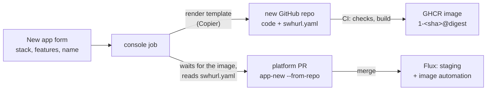
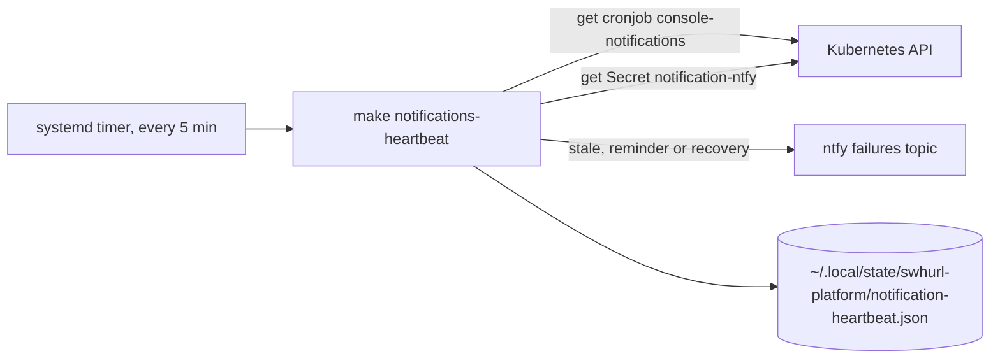

# Swhurl Platform — implementation plan

27 September 2026 · Home cluster implementation plan · **paused 28 September 2026**

## 0. Where this paused and what is left

**Standard notifications (3 October 2026):** [contract and behavior](services.md#notification-expectations), live evidence in [current state](current-state.md#standard-notification-implementation-3-october-2026). A Kubernetes checker covers staging, production and console; Flux's failures Alert covers infrastructure. Open: live fixture uninstall/rollback and timed unhealthy/recovery delivery exercises; the structural refactors and independent heartbeat in [section 11](#11-notification-boundary-refactors-and-heartbeat-3-october-2026); failed/stale backups, external availability, certificate expiry/renewal failure and disk pressure alerts.

19. **Notification boundary refactors and heartbeat** (3 October 2026): contract and design decided; R1 done, R2–R4 and H1–H4 not started. Step-by-step tasks in [section 11](#11-notification-boundary-refactors-and-heartbeat-3-october-2026), in order; R4 and H3 need the user.

18. **Predictable app deployment and promotion — implemented and exercised 3 October 2026:** [section 9](#9-predictable-app-deployment-and-promotion), with [live evidence](current-state.md#successful-reviewed-promotion-and-fixed-template-checks-3-october-2026). Staging-only creation, first-production conversion, frozen reviewed images, automatic merge, manual hold/resume, pinned template revisions and reviewed Copier updates are deployed. Web promotion #34 and private SQLite worker promotions #35–36 passed; duplicate submissions reused PRs; failed gates wrote/merged nothing; both worker databases kept their independent claims and rows through the image update. **Operator check still open:** real Google signed-in browser review/submission (automated UI proof used the explicit local dev identity). **Optional cleanup:** `samclement/swhurl-try-6` repository and package, staging/prod instances and retained volumes; deletion needs confirmation, and repository/package deletion belongs to the operator. Restoring these particular proof volumes is unexercised; the same SQLite restore shape has prior live evidence. `hello` retirement and `hello-ts` migration remain optional.

16. **Automatic app dashboards** (2 October 2026): done (`d5c0f87`): scheduled discovery of Flux-managed app environments, dashboard creation and first-promotion updates, isolated ServiceAccount, bounded jobs and freshness verification ([dashboards](apps.md#dashboards), [live evidence](current-state.md#automatic-app-dashboards-2-october-2026)).

15. **Structured logs across the cluster** (agreed 2 October 2026): done (`cf3df0c`, `498310b`): node-agent JSON/text normalization, event normalization, supported native JSON settings, console JSON logging, actual-collector fixtures and `make verify-logs`. Active services verified; quiet/fallback cases and browser-check limitations recorded in [live evidence](current-state.md#structured-logs-across-the-cluster-2-october-2026). Existing streams only; preserve original lines, schema and historical records ([formats](services.md#structured-logs)).

**Console correctness** done 2 October 2026 (`b3dd939`, image pin `4119157`): review findings 1–3 fixed; [console behaviour](console.md#use-it), [promotion](apps.md#promote-to-production), and [live evidence and remaining browser checks](current-state.md#console-correctness-2-october-2026).

**App validation and YAML editing** done 2 October 2026 (`6bac215`, image pin `42eebe5`): review finding 4 and finding 5 option 2. Requested validation fails when tools or rendering fail; scale/expose/promote accept handwritten YAML and retain comments and unrelated settings. [Editing boundaries and trade-offs](apps.md#operate-an-instance), [live evidence](current-state.md#app-validation-and-yaml-editing-2-october-2026).

Work paused on 28 September 2026 after PR07b. Everything in the delivery table (section 3) is done except **PR06**, the remainder of **PR08a**, and the **final operator exercise**. Live evidence for each step is in `docs/current-state.md`. Before resuming: pull `main`, run `make check-repo`, `make test`, `make verify-platform` and `flux get kustomizations` (14 units, all Ready), and re-read that file's "Not exercised" notes.

**Remaining plan work**

1. **PR06 — GHCR publishing and Renovate** (section 4). The first app repository is live (`samclement/hello-ts`, public images, from the template; item 10). Chart update PRs are live ([operations](operations.md#chart-updates)); the first, ClickStack 1.1.2, was merged and verified on 28 September 2026. ClickStack 3.x was installed fresh rather than upgraded on 29 September 2026 ([current state](current-state.md)). The GHCR half starts with the console image (section 7, phase 3), published **public** from this repo; still to decide: which app repository goes first, and public or private for app images (private needs pull credentials per namespace). Image digest updates stay disabled in `renovate.json` until then: Renovate reads the `hello` image's `tag` but not its separate `digest` field, and would bump both environments at once. **Decided 30 September 2026 (item 10): Flux image automation deploys template apps to staging.** Earlier options considered: The console's route (its publish run commits the pin with its own `GITHUB_TOKEN`) cannot push across repositories; the options are Renovate digest PRs (section 4's plan: reviewable, no app repo writes here; needs the separate `digest` field handled), Flux image automation (one policy per app, updating staging only, one write key for this repo; the console could move to it too) or a cross-repo credential in each app repo. Production stays behind **Promote to prod**.
2. **PR08a remainder** (section 5): off-host copies (S3) and a daily timer are live since 29 September 2026 ([operations](operations.md#backups-and-recovery)). The k3s datastore is SQLite and reconstructible from Git. Left: the gate: restore on a separate machine from S3 using only the docs. Follow-ups: a write-only IAM user for backups instead of `sam`, and then possibly a Kubernetes CronJob with a published backup image (after PR06's GHCR half).
3. **Final operator exercise** (section 6), using only the docs.
4. ~~**Console**~~ done 29 September 2026 (section 7): a signed-in web console for apps and Flux units; changes go through PRs. Decided 29 September 2026. Phases 1 (`e180ff2`), 2 (`884f050`, `make console-dev`) 3 (`b63d2af`, public image on GHCR) and 4 (`79c07f3`, deployed read-only at `console.<BASE_DOMAIN>`; signed-in browser check passed after `edd4f44`) 5 (`bf63344`, reconcile/suspend/resume with audit lines; buttons checked by the operator), 6 (`9364c77`, new-app PRs; PR #8 merged, deployed and removed) and 7 (`0acb567` promote/scale/uninstall PRs, each merged and applied live; `af2b11d` `make console-image`) done 29 September 2026. Open: the operator confirms the token is limited to this repository. Reloader for `console` moves to phase 6, when it first has a Secret.
10. ~~**Simpler New app and automatic staging deploys**~~ done 30 September 2026: `app-new` presets and the console's preset form, the template repository `samclement/swhurl-app-template-typescript`, and Flux image automation that deploys template apps to staging on every push (production through a promote). First app: `hello-ts` ([current state](current-state.md#presets-template-and-automatic-staging-deploys-30-september-2026)).
9. **App scaffold** (decided 30 September 2026): new app *code* starts from a GitHub template repository per language, outside this repo; this repo keeps the cluster wiring (`make app-new` and [`contract.py`](../tools/swhurl/apps/contract.py), for example `--otlp`), so it gains no language dependencies and platform deploys stay fast. The manifest injects every cluster-specific value, so app code only follows conventions (OpenTelemetry SDK reading `OTEL_*`, a readiness path, port 8080, a non-root user, a publish workflow that prints the image digest). Next: turn `samclement/swhurl-platform-typescript-app-example` into that template, then build PR06's first app from it. Revisit with Copier (`copier update`) if existing apps should receive template changes.
8. ~~**Faster delivery**~~ done 29 September 2026: parallel checks and a faster CI (`4bd61a4`), `cluster-stack` without `wait` plus `swhurl flux-wait` (`9bce4a7`), `make flux-install` with a 5s dependency retry (`33fb42e`), the GitHub push webhook (`cfb5daf`) and the publish run deploying the console (`0503987`). A push reaches Flux in about 2s; a full `make flux-reconcile` takes about 17s; a console tooling change runs about 90s after the push ([current state](current-state.md)).
11. ~~**Console redesign**~~ done 1 October 2026 (review the same day; one commit per step, each checked live):
    1. ~~Structure~~ done 1 October 2026: navigation Overview · Apps · Platform · Activity with **+ New app**; Overview; Platform merging units and checks with a page per unit for its actions; Activity with open console PRs.
    2. ~~Apps~~ done 1 October 2026: one row per app with Staging and Prod columns and Promote; the app page with a verdict, main actions, a staging/prod switch, Details collapsed, Scale and Who can reach it as disclosures, Uninstall apart; app instances named `<app>/<env>` on every page.
    3. ~~Language and states~~ done 1 October 2026: one vocabulary (Healthy ✓, Updating ↻, Failing ✕, Suspended ‖) on every page; a dependency wait after a push is Updating, not a problem; purpose lines on every page; empty states and a more helpful error page.
    4. ~~Polish~~ done 1 October 2026: commit SHAs and digests shortened to 12 characters with the full value on hover; breadcrumbs on every page below the top level; "Updated 19:46 · ↻ Refresh" in the header.
12. **New app from a catalogue** (proposed 1 October 2026, widened 2 October 2026 to include creating the app's GitHub repository): plan in [section 8](#8-new-app-from-a-catalogue). Done so far: the `sqlite` capability (`--database sqlite`, 1 October 2026) and its nightly backups (`make backup-sqlite`, 2 October 2026). Decided 2 October 2026: Copier, a second token, Kotlin on Micronaut (JVM). Phases 1 (SQLite restore), 2 (`swhurl.yaml`, `app-new --from-repo`), 3 (Copier template, `make app-repo`), 4 (the console's New app creates the repository) and 5 (worker and SQLite features) and 6 (Kotlin stack) done 2 October 2026. Phase 7 completed 3 October 2026: native Renovate Copier PRs, app-edit preservation, explicit conflicts and checks before publication ([template updates](apps.md#template-updates)).
13. ~~**Observability fixes**~~ done 2 October 2026 (agreed the same day, before section 8 phase 7; [current state](current-state.md#observability-fixes-2-october-2026)). A review found ten compromises in how telemetry works (logs read from stdout, auto-instrumentation, one shared node collector, best effort, alerts on deploy failures only). Fixing the three cheapest with the most value:
    1. **Link logs to traces:** the node collector reads each JSON log line's `trace_id` and `span_id` (top level, or under `mdc` as logback writes them) into the record, so ClickStack's `TraceId` column fills and a trace opens its logs. Today it is empty for every app.
    2. **Drop health-check traces:** spans from Kubernetes probes (user agent `kube-probe/…`) are dropped in the node collector; they were all 34,507 of `hello-ts`'s traces in a day. The Kotlin template's health check stops querying the database, so no child span is left without its parent.
    3. **Silence the cloud check in TypeScript apps:** the template (and `hello-ts`) limit the SDK's resource detectors to the local ones, removing the `MetadataLookupWarning` logged at every start.

    Left as known: log severity guessed from text (a `hello-ts` request log is labelled "trace" because it mentions `traceId`), attribute names that change with OpenTelemetry updates, the Java agent's start-up cost and missing `jvm.memory.*`/`jvm.thread.*` metrics, no backup of telemetry, no alerts from app behaviour (error rates, latency, a stuck worker), and a collector that trusts every pod.
14. **Console follow-ups** (agreed 2 October 2026, from the operator's notes), in this order:
    1. ~~**New app links**~~ done 2 October 2026 (`8e77604`): after a new-app job, its links led to "No such app instance" until the PR was merged and applied. The app page now says it is waiting for the pull request instead.
    2. ~~**Secret names**~~ done 2 October 2026: app Secret keys reach the container through `envFrom`, where the platform's own `env` silently wins. `contract.py`, `app-new`, `swhurl.yaml` and the form refuse `HOST_IP`, `DATABASE_PATH` and names starting `OTEL_`, `SWHURL_` (future platform variables) or `KUBERNETES_`; the app page lists "Provided by the platform" apart from "Your secrets" ([apps](apps.md#secrets)).
    3. ~~**New app page by scenario**~~ done 2 October 2026: first choose "Start a new app" (generate the repository) or "Deploy an existing image" (the platform conventions, the repository's `swhurl.yaml`, newly on the form, or Custom), each saying what it produces ([console](console.md#use-it)).
    4. ~~**Auto-merge console PRs**~~ done 2 October 2026 ([console](console.md#auto-merge)): the console labels a new staging app without a Secret and Promote when ticked ([current policy](console.md#auto-merge)); a workflow merges a labelled `console/*` PR once Validate passes. Chosen over GitHub's own auto-merge, which needs a required check that would also block the direct pushes to `main` (the operator's, the console publish run's and Flux image automation's).
    5. ~~**Test strategy review**~~ done 2 October 2026 ([apps](apps.md#stacks-and-features)): `make check-templates` renders every template combination's `swhurl.yaml` through `app-new` and the app policy (in CI, about 20 s); template CI keeps a build cache per combination (they overwrote one shared cache, so the Kotlin Gradle layer rebuilt every run) and moves from every combination to defaults, each choice alone and all together once a third question lands.
    6. ~~**ClickStack dashboards per app**~~ done 2 October 2026 ([apps](apps.md#dashboards)): `make clickstack-dashboards` keeps a dashboard per app (web or worker, from its HelmRelease) in step with `dashboards.py` through HyperDX's API. Chosen over a step in the console's New app job (could follow) and a CronJob. Kotlin apps' JVM memory and thread panels wait for those metrics to reach ClickStack.
17. **ClickHouse load and telemetry noise** (agreed and done 2 October 2026; evidence in [current state](current-state.md#clickhouse-load-baseline-2-october-2026)). `top` spikes were ClickHouse's normal background merging. Steps 1 to 3 cut what is stored and logged but **did not lower server CPU** (0.21 to 0.22 cores average), so what is left is a decision:
    1. ~~**Log noise**~~ done (`1fa822d`): `filter/platform-noise` drops ClickStack's Keeper and operator lines below INFO and MongoDB's connection lifecycle; `[ALERT-TASK]` lines parse as info instead of `fatal`. Lines per hour 26,352 to 8,780.
    2. ~~**HyperDX self-traces**~~ done (`4074d6a`): sampled at 10%; spans per hour 12,866 to 1,362, trace merges to about zero.
    3. ~~**Metrics intervals**~~ done (`008c5d5` hostmetrics 30 s and kubeletstats 60 s, `6cdfe3f` k8s_cluster 60 s): metric rows per hour 752,944 to 420,234. The largest source, ClickStack's own scrape of ClickHouse's metrics (about half of the rows), cannot be changed from Git: the chart's `customConfig` loses to the remote configuration HyperDX pushes over OpAMP (tried and reverted, `cc8e497` and `e8140d8`).
    **Open:** (a) CPU is set by merge write amplification, not volume: tiny inserts are merged into the day's big part (about 100,000 rows rewritten per merge of a 100-row part in the histogram table), and the cost rises and falls in a 3 to 4 hour cycle (TTL merges), so a single window can read 3x apart. The lever is ClickHouse `async_insert` or bigger batches (settable in the ClickStack HelmRelease; trades a few seconds of data on a crash): needs your decision. (b) Since HyperDX restarted at 21:44 the histogram table merges every new part on its own (60 to 300 merges an hour for the same 300 parts), about +100 s of merge time an hour; cause not found. (c) Step 3 makes CPU and memory graphs coarser for no CPU gain, only fewer stored rows: revert `008c5d5` and `6cdfe3f` if you notice.
5. ~~Documentation restructure~~ done 28 September 2026: task-based pages in `docs/` with one canonical page per topic (map in `docs/contributing.md#documentation`), `AGENTS.md` trimmed. The `document-repo` skill used for it is committed at [`.claude/skills/document-repo/SKILL.md`](../.claude/skills/document-repo/SKILL.md).

6. ~~Operator tooling in the right language~~ done 28 September 2026: move logic (parsing, safety decisions, Secret handling, polling, live-test assertions) from bash into a tested Python package; keep short glue, streaming host scripts and systemd units as linted bash. The `make` interface does not change. The rule for choosing is in [contributing](contributing.md#operator-tooling); the finished sub-plan was removed and is in Git history (`97faeeb:Swhurl-platform-tooling-plan.md`).

7. ~~Cleanup~~ done 28 September 2026 (steps 1 to 4): the repository review below, recorded 28 September 2026. Item numbers follow the review.

**Cleanup plan**

A review of boundaries, technology choices, bloat and responsibilities, made during tooling phase 3 and checked against the code after the tooling work finished. Work top to bottom: tooling-only items first, because tests cover them and nothing deployed changes; then the decisions that change what runs; then all renames and moves together in one planned Flux migration.

Done since the review: #7 (the runner no longer checks for a test-only attribute) and #10 (the phase 3 bash scripts are deleted).

*Step 1: tooling only* — **done** 28 September 2026 (commits `6f406b6`, `ebfa7a6` and the env-drift commit; `db8b68d` alone left `main` broken for one CI run):

- #2 one contract module, [`tools/swhurl/apps/contract.py`](../tools/swhurl/apps/contract.py); `app-new` checks its own output against the policy.
- #3 [`tools/swhurl/platform.py`](../tools/swhurl/platform.py) holds shared paths, names and queries; `check-config` derives required Secrets from each unit's `decryption`.
- #6 `check-repo` and the app policy take an injected runner; `check-repo` reports every failure before exiting.
- #8 fake-executable tests cover only the `make` interface.
- #9 `make check-apps` fails when an app's environments differ beyond namespace, hosts, image tag/digest, replicas, resources and issuer (`env-drift`; exceptions need a reason).
- #13 `help` generated from `## ` comments; `SKIP_VERIFY=1`; defaults in Python; `DYNAMIC_DNS_RECORDS` in `host/dns.env`; `config.env` deleted.
- #19 `swhurl/apps/{contract,new,ops,policy}.py`, `retention.py`; tests split by subject; no `sys.path` edits in tests.
- #4 (checks by service) deliberately skipped: `verify.py` is one readable file at the current size. Revisit if it passes about 400 lines or a second cluster needs different checks.

*Step 2: stale records* — **done** 28 September 2026:

- #11 the local `todo.md` was reviewed: its open items are done, superseded (Go by the Python tooling; "all options in one configuration" by #1) or moved below (certificate reuse when rebuilding); the file was then deleted. The `document-repo` skill is committed.
- `docs/current-state.md` now starts with the current cluster facts, folds the first inventory into the P0 evidence, and drops the obsolete finding classification; the PR05 section records the signed-in check over HTTPS.
- This plan keeps only live material: section 0, goal, design decisions, the delivery summary, and the open PR06, PR08a and final-exercise sections. Completed PR sections, the 27 September baseline and the tooling sub-plan are in Git history at `97faeeb`.

*Step 3: decisions that change what runs* — **done** 28 September 2026:

- #1 **done** 28 September 2026 (option A): `BASE_DOMAIN` in `platform-settings` is the one source of platform hostnames, the cookie domain and the redirect allowlist; `OAUTH_HOST` is gone and `swhurl` reads the same value for the app policy. `make test` fails on a literal platform hostname. The ACME account email and approved sign-in addresses stay literal on purpose. What `CERT_ISSUER` switches is in `docs/services.md#settings`.
- #12 **done** 28 September 2026: MinIO is removed (it held no buckets). Commit `62f0e7c` emptied its unit so Flux uninstalled the release and deleted its volume; the next commit removed the unit, the `minio` HelmRepository, the `storage` namespace and the remaining references.
- #5 **done** with #12: `docs/architecture.md` defines foundation as cluster primitives with no user-facing endpoint and shared services as services apps use or people visit. Nothing needed to move.

*Step 4: names and layout* — **done** 28 September 2026. Stages, each validated, pushed and verified live:

1. **Done:** #18 verbs: `check-*` offline (`check` runs everything CI runs), `test` for unit tests, `verify-*` live, `live-test-*` throwaway cluster tests, `backup-mongodb`; Python command names match. #20: this plan is `docs/plan.md`, the evidence file `docs/current-state.md`, and the PyYAML pin is the `check` dependency group in `pyproject.toml`.
2. **Done:** canary `homelab-reloader` became `platform-reloader` at `platform/reloader` (`9d9c7bb` suspend, `81b6ccf` cutover). Suspending it through Git blocked `homelab-flux-stack` for its 20-minute health-check timeout: the suspend commit is a new revision, the unit was suspended while still waiting on a dependency for it, and its status froze as not Ready. The next stage made the old units `Orphan` instead.
3. **Done:** the other non-root units (`44ddd85` made the two app units `Orphan`; the cutover commit followed), with #16 (one directory per unit under `infra/`, `platform/`, `apps/`; no `base/` levels) and #17 (`<kind>.yaml`, `-<name>` only to tell two of a kind apart): `infra-base`, `infra-cert-manager`, `infra-issuers`, `infra-traefik`, `platform-oauth2-proxy`, `platform-clickstack`, `platform-otel`, `app-<app>-<env>`.
4. **Done:** the roots `homelab-flux-sources` and `homelab-flux-stack` became `cluster-sources` and `cluster-stack` (new units applied with `make flux-bootstrap`, then the old `Orphan` roots deleted).

#14, #15: a unit is named `<area>-<component>` after its directory; namespaces, HelmReleases, Secrets and hostnames keep their names, so no workload changes. Each rename is a handover: suspend the old unit, then replace it (all units are `Orphan`), after proving offline that the new unit renders byte-identical objects, and live that Helm revisions and pod and volume UIDs are unchanged.

*Follow-up simplification* — **done** 28 September 2026: Mermaid diagrams replaced D2 (no render step), the component READMEs were folded into `docs/services.md` and `docs/operations.md`, the ADRs retired; `make reconcile UNIT=<name>` replaced the four OTel refresh targets, and the old-name aliases, `verify`, `teardown` and `reinstall` were removed.

*Leave alone* (judged sound by the review): `Runner` and `Report`; the `Orphan`/`MirrorPrune` deletion split and its tests; the explicit repetition in Flux unit definitions (guarded by `make test`); keeping the host scripts as bash; explicit per-environment app copies, once #9 exists.

**Known issues, deliberately not fixed yet**

- OTel collector 0.161.0 warns that the `hostmetrics`, `kubeletstats` and `k8sobjects` component names and the inline `service.telemetry.resource` map are deprecated. `platform/otel/helmrelease-daemonset.yaml` uses `kubeletstats` (its receiver settings and pipeline) and the chart's presets generate all three names, so renaming only ours could duplicate receivers. Rename each together with a chart version whose preset uses the new name (chart issue #2183, one preset at a time); `make check-otel` (in CI) lists the deprecated names on every chart update and fails if a rename leaves a pipeline naming a missing component. Our values already use the names the chart otherwise rewrites (`k8s_attributes`, `otlp_http`, `file_log`), so dropping those rewrites (chart PR #2429 for `k8sattributes`) cannot break them. The telemetry format warning goes when chart PR #2343 ships.
- Staging and production `hello` differ only in namespace and host (same digest, issuer and sign-in). `make check-apps` now fails if they drift further. No per-instance quotas, NetworkPolicies or RBAC.
- Everything under `homelab.swhurl.com` shares the sign-in cookie. Public or untrusted apps must use another parent domain; none exist yet.

**Not yet exercised live** (each is correct by construction or test, but unproven on the cluster)

- A fresh bootstrap on a real new host: DNS, router forwarding and Let's Encrypt (the in-cluster sequence was rehearsed on k3d; see `docs/current-state.md`).
- A real credential rotation through Reloader (only dummy-key and disposable rotations were tested), and Reloader restarting a generated app.
- A `public` app instance on a domain outside `homelab.swhurl.com`.
- A rejected sign-in reaching oauth2-proxy's email list (the test account was refused by Google first).

**Open question from the old todo list:** how to avoid Let's Encrypt rate limits when rebuilding the cluster (for example backing up and restoring certificate Secrets, or using `letsencrypt-staging` while iterating). Relevant to the fresh-bootstrap test above.

**Extension points kept out of scope:** a second cluster (EC2), tailnet-only private routes, DNS-01 and wildcard certificates, directory renaming, and Hermes.

## 1. Goal and scope

Make an app instance a small, reviewable definition: image digest, resources, probes, exposure, configuration, secrets, and persistence. A generator supplies the namespace, Flux Kustomization, HelmRelease, and optional encrypted Secret. Git review and Flux remain the deployment path.

Keep k3s, Flux, packaged Traefik, cert-manager, and SOPS/age. Fix current safety, identity, and telemetry faults first; then separate reconciliation, prove recovery, and build the app workflow. Work on `clusters/home/` only. Preserve clean capability boundaries for a possible future `clusters/aws/`, but do not build the EC2 cluster or move host automation now. Hermes and Mac model access are a separate follow-on project.

### Completion criteria

- Onboard a second app from an existing image in under 15 minutes, excluding DNS and certificate delays, without hand-written Deployment, Service, or Ingress.
- Each app instance has its own namespace and Flux unit; staging and production reconcile independently.
- Image and chart updates are reviewable and pinned. Promote and roll back the same image digest.
- A ClickStack failure does not block an unrelated app update.
- Exposure modes enforce their route and cookie boundaries; only approved identities can sign in.
- Secret rotation restarts only the referencing workload without printing the value.
- Suspend, uninstall, and data destruction have distinct effects. Restore one stateful workload and the age key from an independent backup.
- One documented command shows desired revision, running image, readiness, address, and failure reason.

## 2. Design decisions

| Concern | Home decision | Future extension |
| --- | --- | --- |
| Cluster | Keep `clusters/home/` the sole entrypoint; choose independent capability units. | A later `clusters/aws/` may select shared bases and use separate settings and age key. |
| Host | Keep host/, dynamic DNS, NodePorts, and router mapping home-specific. | Design EC2 bootstrap and Route53 ownership when that move is committed. |
| App chart | Use pinned bjw-s app-template, initially version 5.2.1 after rendering fixtures. Share an HTTP HelmRepository; pin version per HelmRelease. | Write a custom chart only if the values and policy model prove inadequate. |
| App isolation | One namespace and one Flux unit per instance, with SOPS decryption on that unit when needed. | Reuse the generator/policy for another cluster later. |
| Browser exposure | private has no Ingress; authenticated-web is for trusted apps under the shared-cookie domain; public uses a domain outside that scope. | Private browser routes need a proven tailnet or internal entrypoint. A public IP allowlist is not the default private boundary. |
| TLS | Keep working HTTP-01 for public home routes. | Consider Route53 DNS-01 for private-host certificates. Wildcard TLS is optional and has a larger key blast radius. |
| Updates | Pilot Renovate for chart and digest PRs; retain manual digest PRs. | Avoid custom cross-repository PR machinery unless needed. |
| Data | Retain irreplaceable state on uninstall; explicit separate destruction. | Prove a Retain StorageClass and restore before stateful migration. |

A public app on public.homelab.swhurl.com is still in the .homelab.swhurl.com cookie scope. Use a sibling domain such as public.swhurl.com or a separate host-only proxy. HttpOnly does not stop the destination server receiving the cookie. Browser sign-in establishes identity; each app owns authorization. Machine APIs use token auth, not browser redirects.

How far hostnames and the cookie domain should be configurable is cleanup item #1 in section 0.

## 3. Delivery order and gates

Prove restore before deletion, ownership handover, or stateful migration. Evidence for each completed row is in `docs/current-state.md`.

| Order | Deliverable | Live gate |
| --- | --- | --- |
| PR01 | Inventory, validator, CI, documentation | Complete at 2bae8d0 |
| P0a | Guard destructive teardown/reinstall and correct operator docs | Complete in Git |
| P0b | Back up age key off-host and test recovery | Complete: encrypted USB copy decrypted all three Secrets |
| P0c | Fix verifier and double-encoded ingestion Secret; restart and verify collectors | Complete: live on 27 Sep 2026 after collector restart; no 401s, fresh logs/metrics in ClickHouse, verifier passes |
| P0d | Restrict sign-in to approved identities; test accepted/rejected accounts | Complete: live (`sam@swhurl.com` only); approved sign-in verified and non-approved account refused by operator test, 27 Sep 2026 |
| PR08a | Independent backup and tested restore of one stateful workload | Partial: data classified; encrypted backup and disposable restore proven 27 Sep 2026; live restore, S3 copies and daily timer 29 Sep 2026; restore on a separate machine pending |
| PR02a | Retention defaults: telemetry 30d, ClickHouse system logs 7d, backup pruning 7 daily + 4 weekly, MongoDB PV Retain + PVC keep, `local-path-retain` class | Complete 27 Sep 2026; backups stay manual until an off-host destination is chosen |
| PR02b | Lifecycle commands (suspend/resume/destroy-data), `Orphan` shared units, prune protection | Complete 27 Sep 2026; proven by `make live-test-lifecycle` |
| PR03 | Capability split and cert-manager/issuer ordering | Complete 27 Sep 2026: 10 units, 22 resources handed over with no recreation |
| PR07a | Narrow Secret rollout controller pilot | Complete 28 Sep 2026: scoped opt-in Reloader for oauth2-proxy and OTel; manual refresh kept as fallback |
| PR04 | App-template contract, generator, rendered policy | Complete 28 Sep 2026: generator, `make check-apps`, fixtures proven live by `make live-test-app-template` |
| PR05 | Split and migrate example staging/production; operator commands | Complete 28 Sep 2026: `hello-staging`/`hello-prod` on app-template; routes cut over with seconds of default-cert gap |
| PR06 | GHCR publishing and Renovate pilot | PR04, app repository access |
| PR07b | App Secret conventions and shared settings | Complete 28 Sep 2026: conventions documented, `make check-secrets`, `BASE_DOMAIN` removed, duplicate refresh target retired |
| Final | Operator exercise and documentation | All core deliverables |

## 4. PR06 — registry and reviewable updates

Use GHCR for first-party images. Each app repo tests, builds, publishes a source-revision-tagged image, and captures its digest. Use package-write credentials only in publishing. Private packages need read-only pull credentials in consuming namespaces; test an uncached pull. Promote one digest between staging and production.

Pilot Renovate for app-template versions and GHCR image digests. Configure Flux manager file patterns for this repo's clusters/ and apps/ paths; the default does not cover them. Verify source resolution and that each digest PR touches the intended instance; keep chart bumps separate. Configure private registry auth if needed. Hosted Renovate still needs its own GitHub integration/token, but avoids custom cross-repo app-to-platform PR code. Manual digest PRs remain supported. CI renders updates; merge triggers Flux.

Build x86-64 for home; add ARM64 when a consumer needs it. Revisit before any Graviton move. Retain deployed digests for rollback.

## 5. PR08a — independent recovery gate

Classify data as reconstructible, expendable telemetry, or irreplaceable. Inspect datastore, local-path placement, reclaim, and existing host backups. Choose off-host destination and application-consistent method for each irreplaceable service. Record recovery point/time targets, retention, capacity, and required credentials.

The age key is backed up (P0b); integrate it into the full recovery sequence. Rebuild a clean test scope, restore an encrypted Secret and one persistent workload, and verify app behavior. Record dated evidence before stateful migration.

## 6. Final operator exercise

Using only current docs: onboard web and worker; publish/deploy, promote, and roll back a digest; diagnose bad image and probe; rotate a Secret without exposing it; deploy during ClickStack failure; suspend/resume; uninstall a disposable persistent app with retained state; restore workload and age key. 
After the core exercise, consider tailnet private browser access, DNS-01, wildcard certs, a second cluster, or directory renaming. Hermes remains a separate project requiring model-network design and stronger command-execution isolation than a namespace alone.

## 7. Console

A web console at `console.homelab.swhurl.com`, behind the shared sign-in, that shows app instances, Flux units and cluster health, runs reconcile and suspend/resume, and makes every other change by opening a PR against this repo. Flux still applies only what is merged.

**Decisions** (29 September 2026)

- **Code lives in this repo** (`tools/swhurl/console/`), so tooling changes and the console that uses them are tested together. The image is published from here.
- **Reads use the image's own code; writes use the clone's CLI.** Status, units and health import `swhurl` from the image and read the cluster (units come from the cluster, not Git). A write downloads `main` through GitHub's API, runs `python -m swhurl app-new …` and `check-apps` inside that tree, commits the changed files to a new `console/*` branch through the API and opens a PR, so every change is generated by the rules CI checks it with. The only cross-version interface is `app-new`'s flags.
- **A platform unit, not an app:** `platform-console` needs a service-account token and RBAC, which the app policy forbids. Read access excludes Secrets and `pods/exec`; the only cluster writes are the reconcile annotation and `spec.suspend` (RBAC grants `patch`; the code limits the fields and refuses `cluster-sources`, `cluster-stack` and `destroy-data`). A NetworkPolicy admits only Traefik, so the sign-in header cannot be forged from inside the cluster.
- **GitHub access: a fine-grained personal token** (this repo; Contents and Pull requests read/write), stored in SOPS, sent only in the API's `Authorization` header and redacted. Chosen over a GitHub App for simplicity; the security impact is low for a homelab. PRs appear as the operator, marked by the `console/` branch, a `[console]` title and a `Requested-by:` trailer. `verify-platform` warns 14 days before the token expires. `main` stays unprotected (the commit-to-`main` loop is unchanged); a test ensures the console creates only `console/*` branches.
- **Image: public on GHCR**, pinned by its `src-<hash of inputs>` tag and digest with `make console-image`. Renovate digest updates were dropped (29 September 2026): the image's tags never move, so Renovate would never propose one.
- `verify-platform` checks are labelled by what they need (`cluster`, `secret`, `exec`, `host`); the console runs only the `cluster` ones and links to HyperDX for host timer logs.

**Phases** (each ends in `make check`; phases 4 to 7 also reconcile, verify live and record evidence in `docs/current-state.md`)

1. **Tooling, offline:** `app status` split into gathering (`gather_status`) and printing; `verify-platform` checks labelled by need, selectable in code; `Runner.stream()` (line by line, redacted, stops the command when closed); `Report` keeps structured entries. CLI output unchanged.
2. **Read-only console, local:** apps, unit graph, cluster checks and `/healthz`; `make console-dev` on `127.0.0.1` with a fixed identity (refused on any other address).
3. **Image and GHCR publishing:** Dockerfile with pinned Python, `kubectl`, `flux`, `helm`, `sops` and `git`, labelled with the source commit; a publish workflow tagging by commit SHA.
4. **Deploy read-only:** `console` namespace in `infra-base`, `platform/console/` (read-only RBAC, NetworkPolicy, HelmRelease), the `platform-console` unit (after `infra-base` and `platform-oauth2-proxy`), Reloader namespace, `verify-platform` checks that the console is Ready and not built from older tooling than `main`. Live: redirect, signed-out 302, signed-in pages, forged header from a throwaway pod blocked, `kubectl auth can-i` denies Secrets, exec and patch.
5. **Flux operations:** patch RBAC; reconcile and suspend/resume as background jobs with streamed progress and one audit log line each (reaching ClickStack). Live: on `hello-staging`.
6. **Changes through Git:** the token Secret (operator creates the token), clone, commit, push and PR; the new-app wizard. Live: a throwaway app PR through CI, merged only after asking, then an uninstall PR.
7. **Promote, scale, uninstall PRs** (`make app-promote`, `app-scale`, `app-remove`, also offered by the console) and `make console-image` in place of Renovate digest updates.

**Out of scope:** `destroy-data`, Secret values, credential rotation, `flux-system` root units, host timers, triggering live tests, users other than the operator.

## 8. New app from a catalogue

Agreed 2 October 2026. Replaces the five sub-steps of item 12 in section 0.

**Goal.** On the console's **New app** page you choose a language and framework, tick the features you want and give a name. The console then creates the app's GitHub repository with working code, waits for the first image and opens the platform pull request. Once you merge it, the app runs in staging, and every push to its `main` deploys it there. Production stays behind **Promote to prod**.

Example: *TypeScript · features: SQLite* with the name `notes` produces the repository `samclement/notes`, the image `ghcr.io/samclement/notes:1-<sha>` and a PR `[console] new app notes/staging`, which serves `staging-notes.homelab.swhurl.com` once merged.



**How it fits together.**

- **A stack** is one template repository per language and framework, for example `swhurl-app-template-typescript` (exists) or a Micronaut one. It holds the conventions every app already follows (port 8080, `/healthz`, UID 65532, writes only to `/tmp`, the OpenTelemetry SDK, the shared publish workflow).
- **A feature** is optional code inside a stack: SQLite access with migrations, or a worker loop instead of an HTTP server, the shared libraries. The template renders it only when it is ticked. A feature that the cluster also has to provide (a volume, a Secret, a route) declares that in `swhurl.yaml`.
- **`swhurl.yaml`** is written into the app repository by the template. It is the app's contract with the platform: `kind`, `database`, `secrets`, `telemetry`, resource defaults and `stack`. `app-new --from-repo` reads it, so a stack's needs (a JVM wants more than 128Mi) live in the stack, not in the console.
- **A capability** is the platform side of a feature, as item 12 proposed: one module here owns its manifests, policy rules, backup hook, live test and docs. `sqlite` is the first one and is done.

**Decisions** (2 October 2026):

1. **Copier renders a stack's features.** There is one template repository per stack, with features as Copier questions, and each app commits `.copier-answers.yml` so that `copier update` can bring later template changes to existing apps (the open point from item 9). Rejected:
   - one template repository per combination: the number of repositories multiplies;
   - **Use this template** followed by our own feature patches: a second template system to maintain;
   - a generator in `tools/swhurl`: language-specific code in this repo, which item 9 ruled out.

   Cost: the console image gains `copier` and `git`, and every template's CI renders each feature combination and runs its checks.
2. **A second token creates repositories.** It is fine-grained and covers all repositories: Administration, Contents and Workflows read/write, plus Actions read so the console can follow the first run. It is held only by the console, separate from today's token, which stays limited to this repository. Such a token could delete any repository, so the console's code may only create a new repository, push its first commit to a repository it just created, and read runs (tested, like the `console/*` branch rule). `verify-platform` warns before it expires, as it does for the first token. Rejected:
   - a GitHub organisation with a GitHub App: images, Renovate and the template would all move;
   - creating the repository by hand: New app would not be complete.
3. **The second stack is Kotlin on Micronaut, running on the JVM, with a small image:** a `jlink` runtime holding only the modules the app needs, on a distroless base, with the image size reported in CI. No GraalVM native image.

**Deferred:** sign-in roles in apps (authn/authz) and the shared libraries feature. Traefik already passes `X-Auth-Request-Email` to signed-in apps (`platform/oauth2-proxy/middleware.yaml`), but an app can trust it only once its namespace has a NetworkPolicy admitting just Traefik.

**Phases.** Each phase ends in `make check`. Phases that change the cluster or GitHub also reconcile, verify live and record evidence in `docs/current-state.md`. Throwaway repositories are deleted only after asking.

1. ~~**Finish the SQLite capability**~~ done 2 October 2026: `make restore-sqlite`, proven by `make live-test-restore-sqlite` ([current state](current-state.md#app-sqlite-restore-2-october-2026)); backups now record the plaintext size and SHA-256.
2. ~~**The `swhurl.yaml` contract**~~ done 2 October 2026 ([apps](apps.md#swhurlyaml)): the schema in `contract.py` (version 1; each of today's options is a field, and the presets are the template's `swhurl.yaml`), `app-new --from-repo OWNER/REPO[@REF]` and `--manifest PATH`; the template and `hello-ts` carry the file, and `hello-ts` regenerates byte-identical from it. Splitting each capability into its own module waits for a capability that needs more than generator defaults.
3. ~~**The TypeScript stack on Copier, with no features yet**~~ done 2 October 2026 ([apps](apps.md#start-a-new-app)). Convert the template to Copier. Its CI renders the template and runs the rendered app's checks, build and smoke test. Add `make app-repo NAME= STACK=` (Python, through `Runner`, using your own `gh` login): it renders the template, creates the public repository, pushes it, waits for the first publish run and prints the image with its digest, ready for `app-new --from-repo`. Live: a throwaway app from `make app-repo` reaches staging.
4. ~~**New app creates the repository**~~ done 2 October 2026 ([console](console.md#github-tokens)): the tab **New app and repository** (the default) runs one job: render with Copier (now in the console image, with `git`), create the repository and its first commit through the API with `APP_REPOS_TOKEN` (writes only to a repository created in the same job), wait for the first build, open the platform PR with `app-new --from-repo`. The preset tabs stay for images that already exist (production, or a retry after a failed first build).
5. ~~**Features in the TypeScript stack**~~ done 2 October 2026 ([apps](apps.md#start-a-new-app)): Copier questions `kind` (web, worker) and `database` (none, sqlite on `node:sqlite` with migrations at startup); the template's CI renders every combination and `app.yml`'s smoke test reads `swhurl.yaml`; the console and `make app-repo ANSWERS=` read the questions from the template's `copier.yml`, so a stack's features need no platform code. The preset tabs stay for images that already exist.
6. ~~**The Kotlin Micronaut stack**~~ done 2 October 2026 ([apps](apps.md#start-a-new-app)): `samclement/swhurl-app-template-kotlin` with the same questions; Java 25 in a `jlink` runtime on `distroless/cc` with the OpenTelemetry agent (about 150 MB); `-XX:TieredStopAtLevel=1` (the agent made start-up 50 s on half a CPU, 16 s with the flag); a new optional `startupSeconds` in `swhurl.yaml` (`app-new --startup-seconds`) writes a startup probe so liveness waits for a slow starter. Follow-ups found live: the agent's `jvm.memory.*` and `jvm.thread.*` metrics do not reach ClickStack (only `jvm.gc.duration`); the log pipeline does not set `TraceId` from a JSON log's trace id for any app; the first Kotlin build takes about 6.5 of the job's 10 minutes.
7. ~~**Template updates**~~ done 3 October 2026: native Renovate Copier updates from versioned releases; PRs preserve independent app edits, overlapping edits produce conflict markers, and app checks pass before main publication. Workflow versions are pinned and bumped through reviewed updates; no scheduled updater or new credential is needed. See [template updates](apps.md#template-updates).
8. **The app page shows the stack, its features and each capability's health**: for example the last SQLite backup, or "roles: 3 users".

**Operator actions:** create the second token before phase 4 (decision 2); in phases 3, 4 and 6, approve deletion of each throwaway repository; check the New app form signed in, in phase 4.

**In scope:**
- creating the app repository;
- stacks: TypeScript and Kotlin on Micronaut;
- features: worker and SQLite;
- `swhurl.yaml` and `app-new --from-repo`;
- template CI across feature combinations;
- updates to existing apps from their template;
- the SQLite restore.

**Out of scope** (pull back in if wanted):
- private repositories and images (PR06 decides public or private; everything stays public until then);
- databases other than SQLite;
- sign-in roles in apps and shared libraries (deferred, above); apps running their own OIDC login;
- deleting or archiving the repository on **Uninstall** (the platform side only; you delete the repository on GitHub);
- direct production creation (section 9 replaces it with first promotion from staging);
- a `kind: App` operator;
- more than two stacks;
- users other than you.

## 9. Predictable app deployment and promotion

3 October 2026 · Approved implementation outline; no app migration or live removal authorised by this plan.

### Operator experience

For example, `weather-api` deploys automatically to staging. Open its staging page, try the app, then press **Promote to production**. The confirmation shows the exact image, the production address and whether this creates production or updates it. The platform opens a PR, merges it when checks pass, and shows production becoming Ready. The next staging image uses the same button.

Both **Start a new app** and **Deploy an existing image** create staging only. `app-new --env prod` is refused; `app-promote` always means staging → production. Existing production instances remain supported without migration. Production-only apps need staging before promotion. Direct Git edits remain a reviewed escape route for custom deployments; this change does not enforce promotion provenance against every manual commit.

```mermaid
flowchart LR
  source["New app or existing image"] --> staging["Staging deployed and reviewed"]
  staging --> button["Promote to production"]
  button --> pr["PR: create production or update its image"]
  pr --> checks["Validate current PR commit"]
  checks --> merge["Eligible PR merges automatically"]
  merge --> git["Platform main"]
  git --> flux["Flux applies production"]
  flux --> ready["Console shows production Ready"]
```



### Design choice and boundaries

**Decision:** use the deployment generator and app policy for standard web apps and workers, regardless of the language or origin of their image. Keep app-code templates optional. Existing custom deployment files remain a reviewed route for workload shapes the generator cannot express; shared infrastructure retains its existing Flux units.

**Checked assumptions:** `app-new` already supports existing images ([apps](apps.md#add-an-existing-image)); staging HelmRelease values contain the effective deployment settings; `app-promote` currently requires a target; console actions use Git PRs; the [merge workflow](../.github/workflows/auto-merge.yml) already validates the PR head and excludes encrypted files. **Assumed:** this remains a single-operator platform with public app images and existing GitHub credentials. No new controller, credential or cluster service is needed.

| Approach | Predictability and consistency | Implementation cost |
| --- | --- | --- |
| Fetch the app repository's latest `swhurl.yaml` for first promotion | Familiar generation path, but defaults can differ from reviewed staging and some images have no source manifest | Small initially; needs source discovery, version pinning and another route for existing images |
| Derive first production from validated staging files | Uses the settings actually reviewed; works for template apps and existing images | Explicit environment conversion and supported-shape checks |
| Store an app definition and regenerate both environments from it | Can give creation, editing and promotion one source of configuration | Larger migration; must resolve ownership of manual edits and environment overrides |

**Approved:** derive first production from validated staging files through a shared internal model. Keep Git deployment files authoritative; do not add a second stored definition in this change. The cost is a bounded conversion layer, with clear refusals for unsupported shapes. Revisit a stored definition if repeated read/edit/generate conversions become the dominant maintenance cost.

### Approved operating rules

- **Supported shape:** first production supports one main controller/container, standard generator web or private worker deployments, compatible handwritten resources, probes, security, command and telemetry, platform routing, platform-managed persistence and app Secret references. Refuse extra controllers/sidecars/resources, external volume bindings and ambiguous YAML anchors with a precise explanation. Later image-only promotions require an unambiguous main image field and passing policy, without converting the rest of the deployment.
- **Configuration:** first promotion preserves reviewed staging runtime settings and resources, generating production routing and independent storage. Later promotions change only the image; production configuration changes remain explicit Git edits.
- **Setup:** collect a distinct production public host and production Secret setup on first promotion. Those PRs stay manual. Do not copy staging credentials, data or PV bindings.
- **Pending PR:** freeze its reviewed image. New staging builds do not invalidate it. Relevant destination/configuration changes require fresh review; first-production source configuration changes beyond the image require regeneration. Unrelated `main` changes continue after validation of the updated merge result. Relevant generator, policy, chart or platform setting changes require regeneration or revalidation before eligibility returns.
- **Merge control:** eligible promotions merge automatically unless **Hold for manual review** is selected before submission. **Hold PR** removes `auto-merge`; resuming explicitly rechecks eligibility and validation. A merge already accepted cannot be stopped by removing the label.
- **Rollback:** an older staging image may be promoted, identified as a rollback when ordering is known. Image rollback does not reverse database migrations.

### Behaviour by scenario

| Situation | Console action and result |
| --- | --- |
| Healthy, digest-pinned staging; no production | **Promote to production** creates the production instance from reviewed staging settings |
| Healthy staging; production has a different digest | The same button updates production's image, preserving its settings |
| Both environments have the same digest | Show **Same image in both**; no image promotion needed |
| Staging tag changes but the digest stays the same | Treat it as the same deployed image; do not encourage a redundant rollout |
| Production has a newer build number, or tags cannot be ordered | Offer the same promotion when digests differ; confirmation identifies a rollback when ordering is known, otherwise simply shows the two images |
| Staging is unhealthy, suspended, unpinned or still applying Git | Show the reason promotion is unavailable and the action needed to review it again |
| Production is still reconciling a previous promotion | Show its deployment progress; do not open another promotion for the same reviewed image |
| A promotion PR is already open | Link to it; repeated clicks reuse it. A different reviewed image requires an explicit replacement rather than silently changing the existing PR |
| Production exists in Git but is absent from the cluster | Treat this as deployment pending or failed; never generate another production instance based only on live absence |
| Production exists without staging | Show production normally; explain that promotion requires a staging instance |
| First production needs secrets or a custom public host | Collect or link to the required setup, retain the reviewed image and explain why auto-merge is unavailable until setup is complete |

Auto-merge is the default for eligible promotions; remove the existing per-click opt-in checkbox. Keep a clear PR link and **Hold for manual review** before submission, plus **Hold PR** and explicit resumption afterwards. CI failure, merge conflict or missing setup leaves the PR visible with its reason. A successfully created PR is not reported as a completed production deployment.

### Implementation phases

Each phase ends with [the repository's required validation](contributing.md#validation). Behaviour changes also commit and push, wait for the published console where applicable, reconcile, verify the affected apps and platform, and record dated evidence in [current state](current-state.md). Update section 0 after each phase. Update the canonical [app](apps.md), [console](console.md), [command](commands.md) and [architecture](architecture.md) pages with the behaviour they own, rather than duplicating instructions here.

1. **Shared promotion model and scenario tests — implemented 3 October 2026.** Add focused operator modules under `tools/swhurl/apps/` for reading supported instance configuration, deciding the promotion outcome and preparing Git edits. Separate source readiness, Git target existence, image comparison and PR/deployment progress. The CLI and console use the same decisions; templates render a view model rather than embedding decision rules. Keep external commands behind `Runner` and exercise failure paths with `FakeRunner`.

   **Acceptance:** table-driven cases cover the scenarios above, including legacy nginx, template web/worker apps, SQLite, secret references and unsupported custom YAML. Decide target existence from the downloaded Git tree, not a cached UI row. A refusal writes no partial production instance and opens no PR.

2. **First promotion and later image updates — implemented 3 October 2026; first-production live proof remains with phase 3.** Make `app-new` create staging only (refuse production before writing); make `app-promote` staging → production only, creating a missing target or updating an existing one. Reuse generation helpers for namespace, Flux unit, registration and policy; do not duplicate their definitions. Convert namespace and environment labels, generated authenticated hosts and environment-specific references by meaning, not global text replacement. Keep resources, probes, security settings, command and telemetry from reviewed staging. Remove staging image automation resources and markers from production. Preserve existing production configuration on later promotions; document supported YAML boundaries.

   First production gets its own retained volume and empty database. Its database migrations run through normal application startup. No data, PV binding or staging credential value is copied. Production secret stubs are encrypted for the destination using the established generation path; they require setup and manual review, including any Reloader registration. Private workers require no route. A custom public hostname needs an explicit production hostname; do not infer one or reuse staging's host.

   **Acceptance:** first promotion generates a complete policy-compliant instance; later promotion changes only the image pin and preserves manual comments/settings. Compare the reviewed image and effective source configuration with the fresh Git tree before generating first production. Staging movement before PR creation requires a refresh; after creation the PR keeps the reviewed digest. Secret values never appear in output. Existing production data and credentials retain their current ownership.

3. **One button and automatic merging — deployed and exercised 3 October 2026; real signed-in browser proof remains an operator check.** Remove production selection from all creation forms and refuse forged production submissions. Use the promotion model on Apps and the staging page. Show an action for staging-only apps as well as apps with different environment digests. Apps opens the review/confirmation for the exact staging deployment. Include first-production changes, destination address and any setup requirement. Keep health and stale-review checks when submitting and when the job starts.

   Update PR eligibility and the merge workflow together. Eligible first-production PRs and image-only updates merge by default after Validate passes on the current head. First-production PRs changing encrypted files or requiring setup remain manual. Retain the workflow's branch, repository, file and head checks; do not widen it to infrastructure or unrelated edits. Check eligibility from the actual diff. Handle a duplicate click, an open PR, a merge conflict and a console restart by recovering state from GitHub and Flux, not only in-memory jobs. Implement and test the approved pending-PR rules above, including unrelated automated commits to `main`, the merged validation result and relevant configuration changes.

   **Acceptance:** real browser checks show the same promotion path for a new staging-only app and a newer staging image. The Activity/app pages distinguish creating PR, checks running, awaiting setup/review, merging, deploying, Ready and failed. Verify HTTP/HTTPS and signed-in/signed-out entry points. Prove a failed command or check cannot merge or deploy.

4. **Reproducible checks and bounded test cost — implemented and validated 3 October 2026.** Pin catalogue templates to explicit revisions and use those revisions consistently for questions, rendering and contract checks; deliberate updates test the proposed pin. Keep platform checks free of language builds. Test resource/host/replica values in generator and policy tests rather than multiplying language build matrices.

   Keep exhaustive platform rendering while cheap and measure its duration as choices grow. For expensive template builds, retain defaults, every non-default choice alone and the supported all-enabled case, plus targeted interactions that share behaviour. Reject unsupported combinations explicitly. SQLite tests must demonstrate writes, migrations and persistence, not just process startup. Add shared conformance assertions for the image contract where they reduce duplication; each stack still runs its own build and necessary runtime checks. Use broader scheduled coverage only when the measured cost justifies it. A passing sampled matrix does not claim every combination was tested.

   **Acceptance:** template checks use fixed revisions; changing a pin is reviewable. Document representative cold/warm timings, which combinations run on PRs and which run elsewhere. A third stack requires catalogue entries, its template/build checks and conformance evidence, without language build dependencies in platform tooling.

5. **Template updates — implemented and exercised 3 October 2026; app cleanup remains optional.** Continue [catalogue phase 7](#8-new-app-from-a-catalogue): try template-update PRs on an app with user edits and prove that conflicts are visible and updates run app checks before publishing. Keep platform-owned features such as routing, volume provisioning and backup wiring in the platform; language-specific database and SDK behaviour stays in templates/apps.

   Keep `hello` until the consistent promotion workflow is proven. It is already a useful existing-image example; removing it is not needed to make promotion consistent. If retirement is preferred, audit its live storage, links, probes and fixture dependencies; prepare replacements for references and tests, then request confirmation before uninstalling its live namespaces or deleting data. Fixtures may retain nginx as an independent compatibility case. Do not migrate or remove `hello-ts` merely because it predates Copier.

   **Acceptance:** an update PR preserves app edits or identifies a real conflict. Optional retirement leaves no broken links or verification dependencies, follows GitOps removal, and records live evidence after approval.

### Live proof and operator handoff

Exercise first production, then publish a newer staging image and exercise later promotion. Cover one web app, one worker and SQLite persistence, using existing app images/fixtures where possible. Prove an unchanged digest is a no-op, stale review refuses, duplicate clicks reuse the PR, CI failure stays unmerged, and secret setup prevents auto-merge. Browser proof must use a real signed-in session; hand-set identity headers do not establish that sign-in works.

If a template repository must be created for proof, name it `swhurl-try-<n>` and list the repository and package for the operator to delete afterwards. Obtain confirmation before deleting live namespaces/data or performing other confirm-first actions from `AGENTS.md`. Any interactive login or `sudo` command is labelled **run in your own terminal**; noninteractive operator commands are labelled **run with `!`**. The final handoff gives the production URL and a short **Test it yourself** sequence.

**Delivery priority:** phases 1–3 deliver the requested promotion experience; phases 4–5 address growth and ongoing maintenance. A new language, a general app controller, new databases, cluster infrastructure through the app generator and deleting live apps are not prerequisites for promotion.

## 10. References

- [Flux pruning and deletion](https://fluxcd.io/flux/components/kustomize/kustomizations/)
- [Flux HelmChart reconcile strategies](https://fluxcd.io/flux/components/source/helmcharts/)
- [bjw-s app-template values reference](https://bjw-s-labs.github.io/helm-charts/docs/app-template/reference/)
- [Renovate Flux manager](https://docs.renovatebot.com/modules/manager/flux/)
- [Stakater Reloader](https://github.com/stakater/Reloader/blob/master/README.md)
- [oauth2-proxy provider configuration](https://oauth2-proxy.github.io/oauth2-proxy/7.6.x/configuration/providers/)
- [Cookie Domain scope, RFC 6265](https://www.rfc-editor.org/rfc/rfc6265)
- [cert-manager Route53 DNS-01](https://cert-manager.io/docs/configuration/acme/dns01/route53/)

### Disposable promotion proof checklist (3 October 2026)

`swhurl-try-6` is a TypeScript private worker with SQLite, used to prove first production, an image update and independent databases. **Covered:** each environment has a separate retained 1Gi claim (one event per minute, no TTL; keep only for proof), generated health/policy checks, pinned image/chart, existing OTel collection, normal nightly SQLite backup discovery, canonical app documentation and terminal test steps. **Not applicable:** no login, Secret or Reloader registration; no new platform service or major upgrade. **Covered:** failed commands/checks stop publication/merge through the existing tested operator and Container workflow. **Deferred:** restore of these particular proof volumes and their removal; SQLite restore is already exercised on the same generated shape, and deleting live data/namespaces requires operator confirmation. Repository and package deletion remain operator actions. These proof leftovers are tracked in section 0.

## 11. Notification boundary refactors and heartbeat (3 October 2026)

Follow-ups from the review of the notification commits (`10d8bac`..`3810e4c`). Decisions first, then tasks a cheaper model can execute.

### Decisions (approved by the operator, 3 October 2026)

| Topic | Decision | Reason |
| --- | --- | --- |
| Who notifies about what | The checker owns app and console lifecycle and health. Flux's `failures` Alert owns infrastructure units and sources. ClickStack rules own app-specific signals. No event is sent by two of them. | Duplicate incident messages were the reason the app Alerts were removed. |
| Failure Alert sources | Selected by label `platform.swhurl.com/alert: failures` on each infrastructure/platform Flux unit (not by a list in `alerts.yaml`). App units and `platform-console` are never labelled. | A new unit is covered where it is defined; new apps are excluded by default. |
| Checker placement | Stays in the `platform-console` HelmRelease and shares the console image. Not moved to its own unit. | Moving it would not remove the image coupling and risks losing incident state. |
| Checker self-monitoring | An independent host timer, the **heartbeat**, watches the CronJob and sends to the failures ntfy topic. | It still runs when the console image, the publish pipeline or the in-cluster scheduler is broken. |
| ntfy destinations | Stay in two Secrets (Flux provider, checker), kept equal by `make check-secrets`. The heartbeat reads the checker's Secret at run time and keeps no copy. | Merging the Secrets is a separate decision; a third copy is avoided. |

Known limits to keep documented: the heartbeat cannot report when the node or the Kubernetes API is down (it logs the error and retries); the checker's failure also silences the console's own lifecycle messages until the heartbeat fires (up to 10 minutes plus one timer interval).

### Heartbeat design



- **Stale** means the CronJob is missing, suspended, or `status.lastSuccessfulTime` is older than 10 minutes (the `verify-platform` check uses 5; the longer limit avoids two messages for one blip). Pure function `heartbeat_action(cronjob, state, now, max_age)` returns `none`, `alert`, `remind` (hourly while stale) or `recover`; recovery is sent only if an alert was sent.
- **Messages:** `notification checker stale` (priority high) with the reason and `make verify-platform`; `notification checker recovered` (normal). No Secret values anywhere.
- **State:** `{"alerting_since": <epoch or null>, "last_alert": <epoch or null>}`. Losing the file repeats at most one alert.
- **Cluster unreachable:** log `cannot read notification checker`, leave state unchanged, exit 1. No alert is possible.
- **Credentials:** `kubectl -n console get secret notification-ntfy -o jsonpath='{.data.NTFY_FAILURES_URL}'`, base64-decoded in memory, registered with `runner.add_secret`, never logged. Reuse the checker's validated `publish` in `swhurl.notifications.delivery`.
- **New-component checklist:** retention: a few-byte flag file and a log rotated at 5 MiB by the unit; credentials: none new; logs: `/var/log/swhurl-platform/swhurl-notification-heartbeat.log` is read by the OTel DaemonSet glob; health: new `verify-platform` host check; backups: not needed; restarts: not applicable (fresh process per run); failure behaviour: tested with `FakeRunner`, unit exits non-zero on failure; upgrades: no image or chart; docs: [services.md](services.md#alerts), [commands.md](commands.md), [operations.md](operations.md).

### Rules for every task

Run tasks **in order, one commit each**; do not combine. Each task ends with:

```bash
make check && for f in host/*.sh tests/fixtures/*.sh; do bash -n "$f"; done
```

plus `DRY_RUN=true` variants from `.github/workflows/validate.yml` when `Makefile` or `host/` changed. Stage files by name (no `git add -A`), commit with the given message plus the standard co-author line, push, confirm CI is green. If what you see does not match a step's expected result, stop and report; do not improvise. Changes under `tools/` trigger a publish run and a bot commit: `git pull --rebase` before the next push.

### R1. Docs: state and coupling — done 3 October 2026

Section 0 now describes state; [services.md](services.md#notification-expectations) records the console-image coupling and the two ntfy Secrets.

### R2. Split `tools/swhurl/notifications.py` into a package (offline)

Goal: separate state, evaluation and delivery. Behaviour and every test stay unchanged.

1. Baseline: `PYTHONPATH=tools uv run --frozen python -m unittest tests.test_notifications 2>&1 | tail -4` must pass; note the test count.
2. `git mv tools/swhurl/notifications.py tools/swhurl/notifications/__init__.py`, then create these files by **moving** code, not rewriting it:
   - `state.py`: `STATE_NAME`, `STATE_NAMESPACE`, `MAX_STATE_BYTES`, `empty_state`, `read_state`, `save_state`.
   - `evaluate.py`: `APP_PATH`, `GRACE`, `CONSOLE_GRACE`, `RECOVERY`, `REMINDER`, `HISTORY`, `SUCCESS`, `FAILURES`, `timestamp`, `snapshot`, `object_key`, `targets`, `enqueue`, `link`, `incident`, `health`, `evaluate`.
   - `delivery.py`: `NotificationError`, `publish`, `deliver`.
   - `__init__.py`: keeps `check` and `main` and imports, by explicit name (no `import *`), every name `tests/test_notifications.py` uses through `n.`. Keep `import httpx` there: the test patches `n.httpx.post`.
3. If `state.py` or `evaluate.py` raise `NotificationError`, import it from `delivery.py`; if that makes an import cycle, move it to `errors.py` and import from there everywhere.
4. `tools/swhurl/__main__.py` names `'swhurl.notifications'`, `'main'`: leave it.
5. Expect: `tests/test_notifications.py` needs no edit and passes with the baseline test count. If a test needs editing, stop.
6. `make notifications-check` (read-only, needs `export KUBECONFIG=$HOME/.kube/config`) logs `Notification check completed` and exits 0.
7. Commit: `Split notification checker into state, evaluation and delivery modules`.

### R3. Drive ntfy destination checks from one table (offline)

1. In `tools/swhurl/secrets_check.py`, next to `NOTIFICATION_SECRET`, add:
   ```python
   NTFY_DESTINATIONS = {  # channel: (provider Secret file, provider key, checker key)
       'failures': ('platform/alerts/secret-failures.sops.yaml', 'address', 'NTFY_FAILURES_URL'),
       'deploys': ('platform/alerts/secret-deploys.sops.yaml', 'address', 'NTFY_DEPLOYS_URL'),
   }
   ```
2. Use it in `notification_destination_problem` and in the loop in `main()` in place of the hard-coded strings. Move the `urlsplit`/`urlunsplit`/sha256 lines into `destination_hash(raw: bytes) -> str` (query and fragment removed before hashing).
3. Output lines and hashing stay identical; `tests/test_secrets_check.py` passes unchanged.
4. `make check-secrets` (needs the age key; prints no values) ends with `[OK] ntfy destinations match`.
5. Commit: `Drive ntfy destination checks from one table`.

### R4. Select failure Alert sources by label (live; get operator confirmation before changing anything under `flux-system`)

1. Confirm `eventSources[].matchLabels` exists in `notification.toolkit.fluxcd.io/v1beta3` for `FLUX_VERSION` in `tools/swhurl/flux.py` (<https://fluxcd.io/flux/components/notification/alerts/>). If not, stop and report; the fallback is to keep the explicit list.
2. Add `labels: {platform.swhurl.com/alert: failures}` under `metadata:` of every unit in `clusters/home/infra.yaml`, `clusters/home/platform.yaml` (**not** `platform-console`) and `clusters/home/flux-system/kustomizations.yaml`.
3. In `platform/alerts/alerts.yaml` replace the 14 `kind: Kustomization` entries with one entry with `name: '*'` and `matchLabels: {platform.swhurl.com/alert: failures}`; keep the other source kinds; update the header comment to say selection is by label.
4. Update `tests/test_notifications.py::test_source_alert_does_not_duplicate_app_console_or_pin_notifications`: the Alert has exactly that selector; every unit in the three files above except `platform-console` carries the label; `platform-console` and all `clusters/home/app-*.yaml` units do not.
5. Replace the "explicit unit list" wording (`grep -rn "explicit unit list" docs`) in [services.md](services.md#notification-expectations).
6. After the operator confirms before step 2, commit and push. The root units in `flux-system/kustomizations.yaml` are not reconciled by Flux: run `make flux-bootstrap`, then `make flux-reconcile`.
7. `make verify-platform` passes; `kubectl -n flux-system get alert failures -o jsonpath='{.spec.eventSources}'` shows the label selector. Record dated evidence in [current-state.md](current-state.md).
8. Commit: `Select failure alert sources by label`.

### H1. Heartbeat command (offline; after R2)

1. Create `tools/swhurl/notifications/heartbeat.py` with the pure function from the design above (no I/O) and `main(argv=None, runner=None)` with `--dry-run` (reads and decides, sends and saves nothing) and `--max-age` (default `10m`). Call `kubectl` only through `Runner`; read the Secret as described and send with `delivery.publish`.
2. Register `'notifications-heartbeat': ('swhurl.notifications.heartbeat', 'main', 'Alert if the notification checker is stale (host timer)')` in `tools/swhurl/__main__.py`.
3. Add `tests/test_notification_heartbeat.py` using `FakeRunner`: fresh → `none`; missing, suspended and older than 10 minutes → `alert`; still stale 30 minutes later → `none`, after 60 minutes → `remind`; fresh after alert → `recover`; fresh without prior alert → `none`; unreadable cluster leaves state unchanged and exits 1; no Secret value appears in output or errors (assert on a sentinel URL).
4. Add Makefile target `notifications-heartbeat` (`## Live: alert if the notification checker is stale (--dry-run previews)`), mirroring `notifications-check`; add a row to [commands.md](commands.md).
5. Check: `make check`; `make notifications-heartbeat ARGS=--dry-run` prints `fresh`/`would notify` and exits 0 (adapt the target to pass `ARGS` like `notifications-check` passes `--dry-run`).
6. Commit: `Add notification checker heartbeat command`.

### H2. Heartbeat host timer files (offline; needs H1)

1. Add `host/templates/systemd/notification-heartbeat.service.tmpl` and `.timer.tmpl`, copying `backup-mongodb.*.tmpl`: first line `# Managed template for the notification checker heartbeat (make host-heartbeat)`; `ExecStart=/usr/bin/make notifications-heartbeat`; log `/var/log/swhurl-platform/swhurl-notification-heartbeat.log` with the same 5 MiB rotation line (keep the `$$` and `%%` escapes); timer `OnBootSec=5min`, `OnUnitActiveSec=5min`.
2. In `host/install-timer.sh` add the name `heartbeat` (usage text, the argument `case`, and the `UNIT=swhurl-notification-heartbeat TEMPLATE=notification-heartbeat WHAT="make notifications-heartbeat, every 5 minutes"` line).
3. Add Makefile targets `host-heartbeat` and `host-heartbeat-delete` after the backup ones, same shape. Add them to [commands.md](commands.md) (marked † like the others).
4. `bash -n host/install-timer.sh`; `make host-heartbeat DRY_RUN=true` prints the plan and `Dry run: nothing changed.`. Add the same dry run to `.github/workflows/validate.yml` where `host-backup` is dry-run, and grep `tests/` for `host-backup` to extend any test that enumerates host targets.
5. Commit: `Add host timer for the notification heartbeat`.

### H3. Install and exercise the heartbeat (live; the operator runs `sudo`)

1. Push H1 and H2. **Hand the operator** `make host-heartbeat` to run in their own terminal (needs `sudo`; `!` has no terminal), then verify `systemctl status swhurl-notification-heartbeat.timer` is active.
2. Run `make notifications-heartbeat ARGS=--dry-run`: expect fresh and no send.
3. Exercise the alert without touching Flux-owned resources: `uv run python -m swhurl notifications-heartbeat --max-age 1s` posts one `stale` notice to the failures topic (confirm with the operator first, it is a real push). Wait for a successful checker Job, then run the normal command; it should post one `recovered`.
4. Record dated evidence in [current-state.md](current-state.md), including that the failure messages arrived (the operator confirms on the phone).
5. Commit: `Record notification heartbeat live evidence`.

### H4. Heartbeat health check and docs (offline)

1. Read `check_backups` in `tools/swhurl/verify.py` first. Add `check_notification_heartbeat` in the same style with scope `{'host'}`: the timer is active and the service's last run succeeded within 15 minutes (`systemctl show`); register it in `CHECKS`; add tests like the backup check's.
2. Document the heartbeat in [services.md](services.md#alerts) (what it watches, the two limits above, where the flag file and log are) and [operations.md](operations.md) (install, status, remove, where the log is). Remove "independent monitoring of the notification checker" from the open follow-ups in section 0 and in services.md.
3. Commit: `Verify and document the notification heartbeat`.

### Commit discipline for future notification work

One commit per boundary: checker code, alert wiring, app-tooling cleanup, docs. Write the contract and design before implementing it; record live evidence only for what is deployed.
