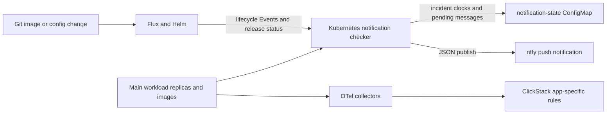

# Services

The shared services every app can rely on. Each is its own Flux unit ([architecture](architecture.md#flux-units)); operating them is covered in [operations](operations.md).

| Service | Flux unit · path | Namespace | Host | Chart |
| --- | --- | --- | --- | --- |
| Namespaces, storage classes | `infra-base` · [`infra/base`](../infra/base) | — | — | — |
| cert-manager | `infra-cert-manager` · [`infra/cert-manager`](../infra/cert-manager) | `cert-manager` | — | cert-manager |
| ClusterIssuers | `infra-issuers` · [`infra/issuers`](../infra/issuers) | — | — | plain manifests |
| Traefik settings | `infra-traefik` · [`infra/traefik`](../infra/traefik) | `kube-system` | — | k3s packaged (chart 38, Traefik 3.6) |
| Sign-in (oauth2-proxy) | `platform-oauth2-proxy` · [`platform/oauth2-proxy`](../platform/oauth2-proxy) | `ingress` | `oauth.` | oauth2-proxy |
| ClickStack operators | `platform-clickstack-operators` · [`platform/clickstack-operators`](../platform/clickstack-operators) | `observability` | — | clickstack-operators (MongoDB and ClickHouse operators and CRDs) |
| ClickStack | `platform-clickstack` · [`platform/clickstack`](../platform/clickstack) | `observability` | `clickstack.` | clickstack |
| OTel collectors | `platform-otel` · [`platform/otel`](../platform/otel) | `logging` | — | opentelemetry-collector |
| Reloader | `platform-reloader` · [`platform/reloader`](../platform/reloader) | `platform-system` | — | reloader |
| [Console](console.md) | `platform-console` · [`platform/console`](../platform/console) | `console` | `console.` | app-template, image from this repo |
| [Image automation](apps.md#deploy-a-new-image) | `platform-image-automation` · [`platform/image-automation`](../platform/image-automation) | `flux-system` | — | Flux image controllers (from `make flux-install`) |
| [Alerts](#alerts) | `platform-alerts` · [`platform/alerts`](../platform/alerts) | `flux-system` | — | Flux notification Providers and Alerts, to ntfy.sh |
| [Push webhook](#push-webhook) | `platform-flux-webhook` · [`platform/flux-webhook`](../platform/flux-webhook) | `flux-system` | `flux-webhook.` | plain manifests (Flux `Receiver`) |

Hosts are under `BASE_DOMAIN` (`homelab.swhurl.com`). Chart versions are pinned in each HelmRelease and updated by Renovate ([chart updates](operations.md#chart-updates)).

## Settings

| Setting | Where | Used by |
| --- | --- | --- |
| `CERT_ISSUER` | [`platform-settings`](../clusters/home/flux-system/sources/configmap-platform-settings.yaml) | Platform ingresses (sign-in, ClickStack) via Flux substitution; change with `make platform-certs-*` |
| `BASE_DOMAIN` | same | Parent of every platform host (`oauth.`, `clickstack.`) and of the sign-in cookie and redirect allowlist; `swhurl` reads it for the app policy's cookie-domain rule. `make test` fails if a platform manifest writes the domain literally |
| `DYNAMIC_DNS_RECORDS` | [`host/dns.env`](../host/dns.env) | Host DNS updater only, never the cluster |

`CERT_ISSUER` switches only the platform's own certificates (sign-in, ClickStack); each app names its issuer in its own HelmRelease. App hosts are written literally by `make app-new`. Two things stay literal on purpose: the Let's Encrypt account email (`ops@homelab.swhurl.com`, a mailbox rather than a host) and the approved sign-in addresses. A unit substitutes settings only if its manifests use them (the OTel unit also substitutes, to unescape `$${...}`); `make test` checks both directions.

Changing `BASE_DOMAIN` moves every platform host and the cookie: it needs DNS records, new certificates, a new Google redirect URI, re-generated app hosts, and everyone signs in again.

## Sign-in

oauth2-proxy signs users in with Google (OIDC) and serves the Traefik middleware `ingress-oauth-auth-shared@kubernetescrd`. Any Ingress that references it requires sign-in; apps get it with `--exposure authenticated-web`.

- **Who may sign in:** only the addresses in `authenticatedEmailsFile.restricted_access` in [`platform/oauth2-proxy/helmrelease.yaml`](../platform/oauth2-proxy/helmrelease.yaml) (currently `sam@swhurl.com`). The chart's default "any domain" is overridden with `email_domains = []`; `make test` fails if either returns. Add an address there and push.
- **Cookie scope:** the session cookie covers `.homelab.swhurl.com`, so every host under it receives it. Put public or untrusted apps on a different parent domain.
- **HTTPS only:** cookies are `Secure`, so sign-in fails with 403 over plain HTTP. Traefik redirects all HTTP to HTTPS.
- **Secret** `ingress/oauth2-proxy-shared-secret`: `client-id`, `client-secret` (from the Google OAuth client, which must allow `https://oauth.<BASE_DOMAIN>/oauth2/callback`) and `cookie-secret` (random, for example `openssl rand -base64 32`). Reloader restarts oauth2-proxy when it changes.
- **How ForwardAuth works:** oauth2-proxy runs with `upstream=static://202`, and the middleware ([`middleware.yaml`](../platform/oauth2-proxy/middleware.yaml)) calls its root `/` rather than `/oauth2/auth`, so an unauthenticated browser gets a redirect it can follow. The callback is `https://oauth.<BASE_DOMAIN>/oauth2/callback`. The return URL after sign-in comes from `X-Forwarded-*` headers: Traefik's entrypoints drop client-supplied ones, and oauth2-proxy accepts them only from the k3s pod CIDR `10.42.0.0/16` (`trusted-proxy-ip`), where Traefik runs; any pod can still set them, since pods are not a trust boundary here ([limits](apps.md#limits)). If the pod CIDR changes, sign-in returns users to the wrong URL. Sign-in uses PKCE (`S256`).
- ClickStack uses its own login, not this middleware.

## ClickStack and OTel

ClickStack stores logs, metrics and traces: the HyperDX app (UI and API), ClickStack's own OTel collector, MongoDB (team, users, sources) and ClickHouse (telemetry). MongoDB and ClickHouse are run by operators that `platform-clickstack-operators` installs first (MongoDB Community operator; ClickHouse operator with a Keeper). Two OTel collectors in `logging`, a per-node DaemonSet and a cluster Deployment, send node and cluster telemetry to ClickStack's collector (`clickstack-otel-collector.observability:4318`). The DaemonSet also accepts OTLP logs, metrics and traces from apps on the node IP (host networking, ports 4317 and 4318) and forwards them with the same key; apps send no key of their own ([apps](apps.md#telemetry)). It normalizes logs ([formats](#structured-logs)), attaches their trace context, and drops the spans of Kubernetes probe requests (`filter/kube-probes`, user agent `kube-probe/…`). The cluster Deployment's OTLP Service is the chart default and forwards nothing that apps send.

### Structured logs

For example, `{"level":30,"msg":"request completed","req":{"method":"GET"},"status":200}` becomes body `request completed`, severity INFO, and searchable `LogAttributes.req.method` and `LogAttributes.status`. The node collector parses after container framing and partial-line reassembly; ClickStack receives normalized OTLP, without a second platform parser at ingestion. Existing rows keep their original format.

| Source | Handling |
| --- | --- |
| Apps, Flux, MongoDB, MongoDB operator, cert-manager, Traefik, Reloader, console, OTel collectors; any JSON object | `msg`/`message` becomes the body; other fields become attributes. HyperDX's `[API]`, `[APP]` and `[ALERT-TASK]` JSON prefixes are accepted. |
| ClickHouse and Keeper | Timestamp, thread/query IDs, level, logger and message from their text prefix. |
| ClickHouse operator and platform collectors | Tab-separated logger output and its trailing JSON fields. |
| metrics-server and older cert-manager logs | Kubernetes klog prefix (level, caller, PID, message and quoted key/value fields). |
| nginx and oauth2-proxy | Request fields (method, path, status, client, user agent, sizes); separate parsers for application/error lines. |
| CoreDNS | Bracketed level and message. |
| local-path provisioner; older Traefik and Reloader logs | Quoted logfmt fields. |
| Older console logs | Uvicorn access/application lines and audit prefixes. |
| Host timers | Existing filename-to-service mapping and `[OK]`/`[WARN]`/`[BAD]`/`[ERROR]` prefixes. |
| Kubernetes events | Message or note becomes body, Warning becomes WARN and Normal becomes INFO; event metadata uses `k8s.event.*` attributes. |
| Helpers, shell output, MongoDB agent, unmatched or malformed lines | Body passes unchanged; `log.parser=plain` explicitly identifies the fallback. No severity is guessed from words in the message. |

`LogAttributes.log.parser` identifies the matched format. Explicit string levels, Pino numeric levels and MongoDB's `s` field become OTel severity. Valid trace/span IDs at the top level or under `mdc` populate the record so a trace opens its logs. Existing OTLP severity, timestamps, attributes, resource identity and trace context take precedence. Source timestamps fill missing record timestamps; container timestamps remain authoritative.

cert-manager's three components, Traefik's existing log streams, Reloader, the platform collectors and console emit native JSON. cert-manager's klog JSON uses `v` for informational records and `err` for error records; the source-specific mapping handles these without guessing from message text. Console access logs include method, path and status; its action audit records include identity, action, unit, state, job ID and link ([console](console.md#how-it-is-protected)). Verbosity and access-log enablement stay at their existing settings.

HyperDX also sends already structured native OTLP logs directly to ClickStack, alongside its stdout stream. Those retain their SDK attributes and trace context; `verify-logs` identifies scope `node-logger` as `native-otlp`, without claiming they passed through a node parser. Missing SDK severity remains unspecified. Native map-valued OTLP bodies passing through the node collector remain structured maps.

Nested objects flatten to dotted attribute names, arrays remain JSON strings, and objects below four map levels remain JSON strings. The collector's `ottl.functions.enableLambda` gate enables the bounded array-preserving mapping; `make check-otel` uses that same gate and runs synthetic fixtures through the actual deployed collector version, including CRI partial lines and Docker framing. This catches changed parser behaviour during collector upgrades.

When the body changes, `LogAttributes.log.record.original` retains the complete original line (additional storage, under the same retention). A JSON object without a message retains its JSON body and still exposes its fields. Malformed input never drops the record. Parsers are scoped to the source workload for non-JSON formats.

**Deliberately not collected.** ClickStack's own pods are the noisiest log source, nearly all of it health-probe and connection chatter nobody reads. The node collector's `filter/platform-noise` drops, after parsing: Keeper and ClickHouse operator lines below INFO (the Keeper logs every kube-probe at trace level, the operator each reconcile step at debug) and MongoDB's connection lifecycle (`Connection accepted`, `Connection ended`, `client metadata`, `Authentication succeeded`). Warnings and errors from those pods, a line whose severity could not be parsed, and every other pod's lines are kept. The pods' own container logs are untouched, so `kubectl -n observability logs <pod>` still shows everything; to look at the dropped lines in ClickStack, remove the filter from the logs pipeline in [`helmrelease-daemonset.yaml`](../platform/otel/helmrelease-daemonset.yaml). The fixtures in `tests/fixtures/logs.json` (`dropped: true` cases) prove each drop and each keep through the real collector (`make check-otel`).

**Volume.** HyperDX's own traces are sampled at 10% (`OTEL_TRACES_SAMPLER_ARG` in `hyperdx.config`). Host metrics are scraped every 30 s, kubelet metrics and cluster state every 60 s (`collection_interval` in the two OTel HelmReleases). ClickStack's scrape of ClickHouse's own metrics (about half of all metric rows) stays at 30 s: the chart's `global.otelCollector.customConfig` is merged below the remote configuration HyperDX pushes over OpAMP, which defines that receiver, so it has no effect there. These cut stored rows, not ClickHouse's CPU, which is dominated by merging many tiny inserts ([current state](current-state.md#steps-2-and-3-and-the-final-comparison)).

In ClickStack's Logs source, try `LogAttributes.log.parser:json`, or `ResourceAttributes.k8s.namespace.name:hello-ts-prod AND LogAttributes.method:GET`; open a result to see fields, its original line and any linked trace. `make verify-logs` reports fresh format/severity/trace coverage for every running container without printing bodies or attribute values; quiet containers are reported separately. It also includes events and host timers that logged within the selected window (`MINUTES=`, default 15). The systemd/k3s journal is not collected.

**Sign-in.** `https://clickstack.<BASE_DOMAIN>` sits behind Google sign-in, then HyperDX's own login. HyperDX has no setting for its first account: `make clickstack-bootstrap` registers `CLICKSTACK_ADMIN_EMAIL` with `CLICKSTACK_ADMIN_PASSWORD` while no team exists, and HyperDX closes registration once one does (`make verify-platform` checks that it is closed). Read the password with `sops -d --extract '["stringData"]["CLICKSTACK_ADMIN_PASSWORD"]' platform/clickstack/secret.sops.yaml`. Invite further users from the UI.

**Keys and passwords** live in [`platform/clickstack/secret.sops.yaml`](../platform/clickstack/secret.sops.yaml) (`observability/clickstack-runtime-inputs`, `stringData`):

| Value | Used by | Purpose |
| --- | --- | --- |
| `CLICKSTACK_INGESTION_KEY` | The team's `apiKey` in MongoDB (written by `make clickstack-bootstrap`); the app's own logs (`hyperdx.secrets.HYPERDX_API_KEY`); a copy in `logging/clickstack-ingestion-key` ([file](../platform/otel/secret.sops.yaml)) that the collectors send | The only key ClickStack's collector accepts. `make check-secrets` fails if the two SOPS copies differ; `make verify-platform` fails if the live copy differs from the team key. |
| `CLICKSTACK_ADMIN_EMAIL`, `CLICKSTACK_ADMIN_PASSWORD` | `make clickstack-bootstrap` | The first HyperDX account |
| `MONGODB_PASSWORD`, `CLICKHOUSE_PASSWORD`, `CLICKHOUSE_APP_PASSWORD` | The chart's `hyperdx.secrets.*`, through `valuesFrom` | Internal logins, replacing the chart's public defaults. A render test fails if any chart secret is not taken from SOPS. |

Personal API keys in the HyperDX UI belong to users (for HyperDX's external API; `make clickstack-dashboards` uses the admin's, [apps](apps.md#dashboards)) and have nothing to do with ingestion. Don't rotate the ingestion key in the UI: that moves the team away from Git and the collectors get HTTP 401. Rotate it in SOPS ([operations](operations.md#secrets)).

**Known limitation:** the chart writes `MONGO_URI`, including the MongoDB password, into the `clickstack-config` ConfigMap, and the ClickHouse passwords into the `ClickHouseCluster` resource. Anyone who can read ConfigMaps or those resources in `observability` can read them.

**Retention and storage:** telemetry expires after 30 days (`HYPERDX_OTEL_EXPORTER_TABLES_TTL`), ClickHouse's own system logs after 7 days (set by the chart in `clickhouse.cluster.spec.settings.extraConfig`; our values add vertical merges for `metric_log`, whose horizontal merges exceed the memory limit. HyperDX's ClickHouse page charts read `metric_log`, so keep it); `make verify-platform` checks both. MongoDB's data volume uses `local-path-retain`, so it outlives its claim; ClickHouse and Keeper use `local-path`. Helm uninstall leaves the operators' claims in place; delete them with `make destroy-data`.

**Chart quirks:** `hyperdx.frontendUrl` is ignored; the URL is `hyperdx.config.FRONTEND_URL`. ClickStack's collector image ignores the subchart's `config`; customise it with `global.otelCollector.customConfig`.

The DaemonSet also reads the host timers' output, `/var/log/swhurl-platform/<unit>.log` through its read-only `/hostfs` mount: backups arrive as service `swhurl-backup-mongodb` and dynamic DNS as `aws-dns-updater`, with `[ERROR]`/`[BAD]` lines at severity Error and `[WARN]` at Warn, which a HyperDX alert can match. Only lines written while the collector runs are read (`start_at: end`). Each unit rotates its own file before a run once it passes 5 MiB (to `<unit>.log.1`, replacing the previous one), so each keeps at most about 10 MiB; ClickStack holds the searchable 30 days. systemd itself rotates only the journal, and logrotate is not installed.

The collectors' `authorization` header reads `${env:CLICKSTACK_INGESTION_KEY}` as written: `platform-otel` does no Flux substitution, so nothing needs escaping.

## Reloader

Restarts a workload when a Secret it names changes, so rotations need no manual restart. It is opt-in (`secret.reloader.stakater.com/reload: "<secret>"` on the Deployment or DaemonSet) and scoped: it watches only the namespaces listed in [`platform/reloader/helmrelease.yaml`](../platform/reloader/helmrelease.yaml) (`ingress`, `logging`, `console`), with a Role in each and no cluster-wide Secret access. `make app-new --secret-keys` adds the app's namespace and `make app-remove` takes it out; for anything else, add the namespace before opting a workload in. ConfigMaps are ignored. Current opt-ins: oauth2-proxy (`oauth2-proxy-shared-secret`), both OTel collectors (`clickstack-ingestion-key`) and the console (`console-github`). Reloader restarts by patching a pod-template annotation; a later Helm upgrade may drop it and roll the pods once more, which is harmless.

## Alerts

### Notification expectations

Every managed app environment (staging and production), the console and the authorised app-template fixtures use the same lifecycle/health contract. For example, `hello-ts/staging deployed` means Helm completed the install/upgrade with its readiness checks; pushing the image pin to Git does not notify. Application error rates, latency, business events and other app-specific alerts belong to the operator's ClickStack rules.

| Event | Send when | Message and priority |
| --- | --- | --- |
| Deployed | Helm emits `InstallSucceeded` or `UpgradeSucceeded` | `<app>/<env> deployed`; chart revision and requested image when the current release condition matches the event; normal |
| Rolled back | Helm emits `RollbackSucceeded` after a failed upgrade | `<app>/<env> rolled back`; high because the requested upgrade failed. A healthy remediated rollback can subsequently recover the availability incident; this does not claim the requested image deployed |
| Uninstalled | Helm emits `UninstallSucceeded`, or a previously observed managed release disappears after its unit is removed | `<app>/<env> uninstalled`; normal. The latter uses Helm's uninstall finalizer as completion evidence when namespace deletion has already removed the Events. Retained storage is named as retained; uninstall never means data was deleted |
| Deployment/removal failed | Helm emits `InstallFailed`, `UpgradeFailed`, `RollbackFailed` or `UninstallFailed`; or the app/console unit emits `ReconciliationFailed`, `BuildFailed`, `ValidationFailed`, `ArtifactFailed` or `PruneFailed` | `<app>/<env> deployment failed` or `uninstall failed`, reason and console link; high. Retry events for the same action are grouped |
| Unhealthy too long | Desired main workloads remain below their desired Ready replicas continuously for 5 minutes; console allowance 10 minutes | `<app>/<env> unhealthy`, counts and pod waiting reasons; high. The allowance includes startup/rollout time, rather than being added after it |
| Deployment stalled | The release is not current/Ready, its requested digest is not running or its Flux unit remains blocked beyond the same allowance, even when the old workload is healthy | `<app>/<env> deployment stalled`; high. Unrelated repository revisions do not restart the clock |
| Recovered | An alerted health/deployment incident clears for 2 continuous minutes | `<app>/<env> recovered`; normal. No recovery for an incident that was never notified. Missing/unreadable health evidence cannot establish recovery |

The console's title is `console`. A successful Git revert or promotion of an older digest is a Helm upgrade and receives a deployment notification; the distinct rollback title covers Helm's explicit rollback action. Routine no-op reconciliation, Helm tests, image pin pushes and pod restarts are silent. Desired scale-to-zero stops health tracking without a recovery message. Suspension suppresses stalled-deployment alerts but still checks the desired running workload's health. An action-failure/rollback message starts one incident and postpones related health reminders for an hour. Other continuing health incidents also remind hourly; recovery and recurrence start a new incident.

### Current notification behavior

**Checker:** [`notifications` package](../tools/swhurl/notifications/__init__.py) reads Kubernetes once a minute as `console/notification-check`, through the bounded `console-notifications` CronJob in the [console HelmRelease](../platform/console/helmrelease.yaml). It discovers instances from app Flux paths (`./apps/<app>/<env>`, plus authorised app-template fixtures), not a manually maintained app list. It reads release events, desired/current release status, main-workload replicas and running images. It never reads application Secrets, pod logs or GitHub credentials and cannot modify workloads. Its dedicated [RBAC](../platform/console/notification-rbac.yaml) permits list-only discovery and get/patch of one ConfigMap.

**State and delivery:** `console/notification-state` keeps incident clocks and a durable pending-message list across image updates and console restarts. Flux owns the ConfigMap metadata; the checker owns `data.state.json`, which is absent from its Git manifest. The ConfigMap uses Flux’s `ssa: Merge` policy and the checker patches with its own field manager so reconciliation preserves that field. Delivered-event deduplication and retired app identities expire after two hours; action-failure history retains the latest 16 signatures per instance. The state has a 700 KB ceiling and refuses overflow/corruption rather than discarding history. No database or backup is needed for this transient operational history; losing the ConfigMap creates a fresh baseline and loses existing clocks/pending messages. On its first run it does not replay historical events. Kubernetes Event retention still limits historical lifecycle coverage after an extended checker outage; workload health is checked from current state even without Events. Apps created and removed entirely between successful discovery passes can be missed.

Pending messages are checkpointed before posting and removed only after ntfy accepts them. Failed posts stop the job and retry on the next minute, with no secret URL or response body in the error. Delivery is **at least once**: a crash after acceptance but before the checkpoint can repeat a message. Acceptance proves ntfy received the post, not that a phone displayed it. Incident messages can be delayed while delivery is unavailable. The 50-second job timeout, `Forbid` concurrency, zero in-job retries and one successful/failed Job retained bound the checker workload; JSON logs reach ClickStack through the existing node collector. The image shares the console's pinned tag/digest and publication workflow. The existing ntfy destinations are copied into [the checker's SOPS Secret](../platform/console/notification-secret.sops.yaml); every new Job reads the current values, and `make check-secrets` compares destinations by hashes. Topic rotation needs updating both the provider and checker copies ([Secrets](operations.md#secrets)).

**Infrastructure/source failures:** the [shared Flux failure Alert](../platform/alerts/alerts.yaml) still sends high-priority errors for infrastructure units, Git/Helm repositories, image repositories/policies and image automation. Infrastructure Kustomizations opt in with the `platform.swhurl.com/alert: failures` label; apps and `platform-console` stay out and are handled by the checker. A wiring test enforces that boundary. The expected image-policy messages `no tags in database` and `referenced ImageRepository does not exist` are excluded. These native Flux notifications have the controller's default [five-minute duplicate limit](https://fluxcd.io/flux/components/notification/events/#rate-limiting), separate from checker incident grouping.

**Coupling and heartbeat:** the checker runs from the console image and release, so a broken or unpublished console image stops its app/console messages. The host's `swhurl-notification-heartbeat.timer` checks the CronJob every five minutes; it alerts if the Job is missing or suspended, or has no success in the last 10 minutes, reminds hourly, and reports recovery after a successful Job. The host's `make verify-platform` check reports an inactive timer or a service run that did not succeed within 15 minutes. The heartbeat still depends on the host, Kubernetes API, the checker's existing `notification-ntfy` Secret and ntfy. If Kubernetes or the host is unreachable, it cannot send an alert; a checker failure can silence its own lifecycle notifications for up to 15 minutes plus one second. The ntfy destinations exist in two Secrets, [`platform/alerts/secret-*.sops.yaml`](../platform/alerts) and the checker's, kept equal by `make check-secrets`.

**Verify:** `make notifications-check` reads and evaluates without sending or saving; `make verify-platform` and the console's Platform checks fail if the checker is suspended, missing or has no successful job within five minutes. A successful pass establishes that the snapshot and outbox processing finished; it does not prove subscriber delivery. A snapshot read failure retains app clocks, cancels recovery stability and sends a monitor failure after five minutes if state storage and ntfy are still reachable. If the state cannot be read/written, the scheduler never runs, or the whole cluster is down, the checker cannot reliably notify about itself; verification shows it stale. The existing [console deployment checks](console.md#deploy-a-new-console) establish the running version.

**Remaining boundaries:** HTTP errors and failed console actions, expired tokens, dashboard-job failure, Validate/Publish workflow failure, stale backups, disk pressure, certificates and external availability need their own rules/checks. `/healthz` only answers `ok`; workload readiness does not exercise GitHub, sign-in or all application functions. External availability needs a monitor outside this cluster. App-specific ClickStack rules belong to the operator; remaining platform work is in [plan section 0](plan.md#0-where-this-paused-and-what-is-left).

- **Subscribe** (once per phone or browser): install the ntfy app, then subscribe to the topic. The topic name is the credential (anyone who knows it can read and post), so it is only in SOPS; show the topic name in your own terminal with `SOPS_AGE_KEY_FILE=./age.agekey sops decrypt --extract '["stringData"]["address"]' platform/alerts/secret-failures.sops.yaml | sed 's|https://ntfy.sh/||; s|?.*||'` (from the repository root; the key file is not in Git).
- **Native Flux provider:** it posts event JSON through a generic provider and ntfy renders it with the template in the address. The checker uses [ntfy's JSON publish API](https://docs.ntfy.sh/publish/#publish-as-json) directly so lifecycle titles differ by action and identify the environment. Tapping opens the relevant app page, Activity for uninstall, or Platform for console/monitor failures.

## Incident reviewer

The reviewer is removed from the platform configuration. Its prior collect-only run and the rollback evidence are recorded in [current state](current-state.md). The empty `incident-review` namespace is retained separately.

## Push webhook

GitHub calls `https://flux-webhook.<BASE_DOMAIN>/hook/<path>` on every push to this repository; the Flux `Receiver` then fetches `main` at once, instead of within the `GitRepository`'s 1-minute interval. Pushes to other branches, such as the console's `console/*` PR branches, are ignored (`resourceFilter`).

- **Token:** a random shared secret (`openssl rand -hex 32`) in [`platform/flux-webhook/secret.sops.yaml`](../platform/flux-webhook/secret.sops.yaml) and, with the same value, as the webhook's secret in the repository settings on GitHub. GitHub signs each request with it; the receiver rejects anything else. It is not a GitHub credential. Rotate it: [operations](operations.md#secrets).
- **Route:** the only platform Ingress without sign-in (GitHub cannot sign in); it serves only `/hook/` and only Flux's `webhook-receiver` Service (`make check` enforces both). A NetworkPolicy admits Traefik to cert-manager's HTTP-01 solver in `flux-system`, which Flux's own policy would block.
- **GitHub side:** Settings → Webhooks → `flux-webhook.<BASE_DOMAIN>`, content type `application/json`, events: push. Recent Deliveries shows each call and its response.
- If GitHub cannot reach it, nothing breaks: Flux still polls every minute.

## Certificates, ingress and storage

- **Issuers:** `selfsigned`, `letsencrypt-staging` and `letsencrypt-prod` (HTTP-01 through Traefik), plain manifests with no settings substituted. `infra-issuers` waits for cert-manager, so a fresh bootstrap cannot race its CRDs.
- **Traefik:** k3s owns the Traefik install; this repo owns only its `HelmChartConfig`: NodePorts `31514` (HTTP) and `30313` (HTTPS), and a permanent HTTP→HTTPS redirect set with `ports.web.redirections.entryPoint` (chart 38 silently ignores the older `redirectTo`; `make verify-platform` checks the redirect). Let's Encrypt follows the redirect, so HTTP-01 still works.
- **Storage classes:** `local-path` (k3s default, `Delete`: deleting a claim deletes its data) and `local-path-retain` (`Retain`: the volume and its directory under `/var/lib/rancher/k3s/storage` survive). Use `local-path-retain` for anything irreplaceable; the app generator does.
